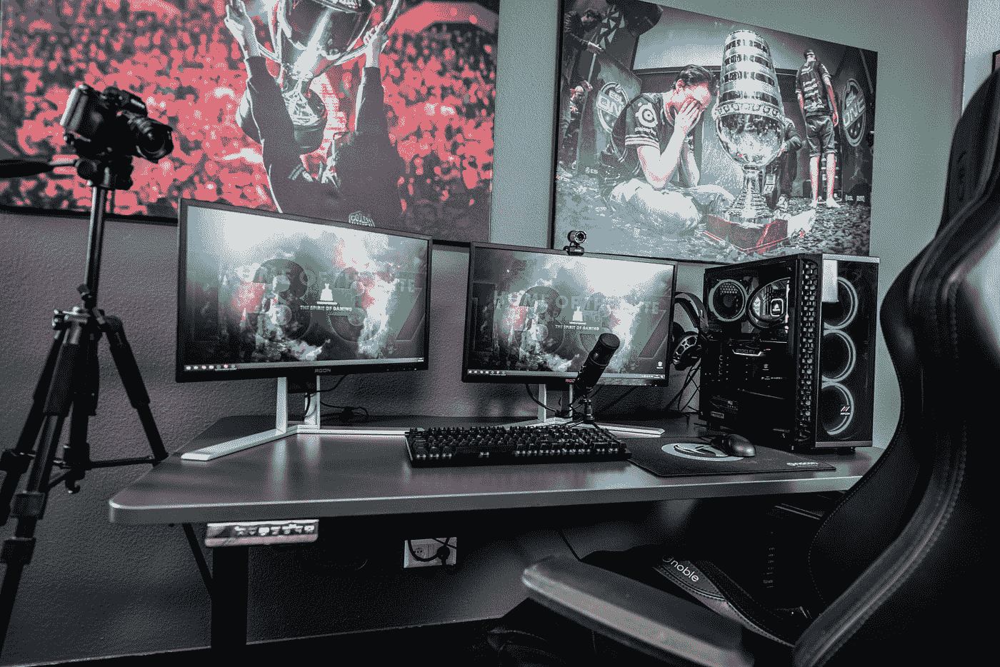
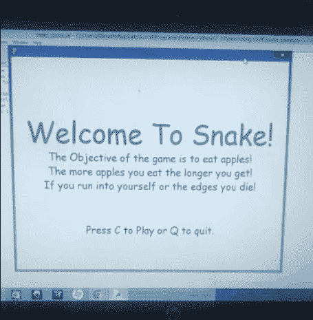
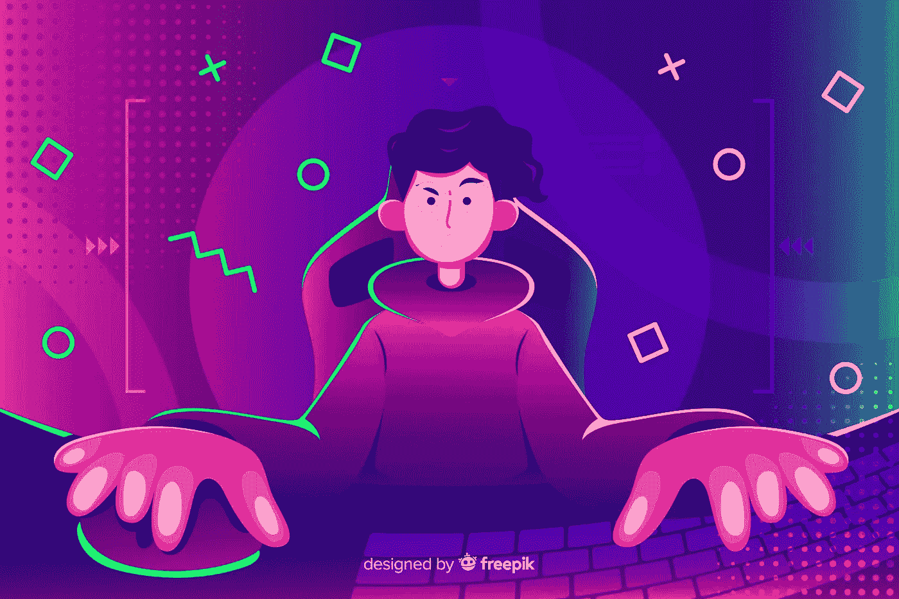

# 你应该用 Python 和 AI 开发游戏的 5 个理由！

> 原文：<https://towardsdatascience.com/5-reasons-why-you-should-develop-a-game-with-python-and-ai-9f5f276e7637?source=collection_archive---------11----------------------->

## 学习创建游戏对提高 Python 编程和机器学习项目的效率大有裨益的 5 个原因！

照片由[艾拉·唐](https://unsplash.com/@elladon?utm_source=medium&utm_medium=referral)在 [Unsplash](https://unsplash.com?utm_source=medium&utm_medium=referral) 拍摄

> “成功不是最终的，失败不是致命的:重要的是继续下去的勇气”——《使命召唤:现代战争》

游戏是我从小就热衷的事情。当你意识到你可以将你的爱好融入到你热爱的工作中，这就是人工智能，在这种情况下，这种感觉是壮观的，令人感动的。

虽然游戏一直是我最感兴趣的东西，但我一直处于观望状态，对编程不太确定。直到几年前，我才对编程和人工智能更感兴趣。

这两项技术在过去的几年里取得了长足的进步和发展。他们在创造娱乐历史方面的迅速崛起令人印象深刻。虽然游戏中的人工智能以其自己的方式是相当可观和宏伟的，但本文的重点仍然是你应该考虑用 Python 和人工智能开发游戏的五个原因。

我坚信，所有旨在提高编程技能的开发者，或者即使你刚刚入门，都应该投身于从零开始构建一个游戏。即使是简单的架构，你也会在这段旅程中收获很多必备的技能。

人工智能进步的最重要因素之一，尤其是在深度学习领域，是由于技术的进步，即图形处理单元(GPU)。

虽然 CPU 一次只能执行少量操作，但 GPU 可以一次执行数千次这样的操作。仅举一个假设的例子，在一个质量不错的 GPU 的帮助下，一个需要在 CPU 上训练 2-3 个小时的任务可能在大约 10 分钟内完成。

幸运的是，这些 GPU 也可以用来有效地玩现代游戏。要了解更多关于图形处理单元(GPU)的信息，我强烈建议通过下面提供的链接查看下面这篇关于“你真的需要一个用于深度学习的 GPU 吗”的文章。它涵盖了这个主题的大部分重要细节。

</do-you-really-need-a-gpu-for-deep-learning-d37c05023226>  

有了这个基本的理解之后，让我们来缩小为什么你应该专注于用 Python 和人工智能开发一个或多个游戏来提高你的编程技能和整体生产力的五个原因。

## 1.学习构建图形用户界面(GUI)

我的第一个项目的作者过时的 GIF

差不多是四年前，我开始迷上人工智能，开始学习 Python 编程。当我从事一些较小的项目时，我开始开发的第一个主要项目是一个简单的贪吃蛇游戏项目。

使用 Python 开发游戏项目最重要的优势之一是，无论您是使用 Pygame、Turtle 还是任何其他库模块，您都可以学习如何构建一个图形窗口，在这里您可以操作整个程序。

你开发的图形用户界面(GUI)将控制你程序的大部分。您需要的所有功能都在此窗口中执行。一旦您能够创建这些交互式图形，您也可以为自己准备更高级的编程。

您开发的 GUI 界面也可以方便地用于各种未来的机器学习或深度学习项目，在这些项目中，您可以使用以多种可能的方式实现的交互性，使您的设计、风格和外观更加实用。

虽然 Python 编程可能不是最适合游戏开发的语言，但创建这种结构背后的主要思想是有效地提高您的编程技能，并学习在您的程序和项目中实现人工智能。

## 2.有趣的经历

[菠萝供应公司](https://unsplash.com/@pineapple?utm_source=medium&utm_medium=referral)在 [Unsplash](https://unsplash.com?utm_source=medium&utm_medium=referral) 上的照片

用 Python 开发一个简单的游戏是我选择从头开始构建的第一个主要项目。总的来说，这是一次非常有趣的经历，但更重要的因素是我在整个项目过程中获得的曝光率和知识。

你倾向于通读大量库模块的各种文档和其他与你的任务相关的有用信息。你还可以浏览视频和其他网站，这将有助于你获得全面的曝光率，并最终获得特定项目的最佳体验。

一旦你能够熟练地处理编程任务的众多元素和方面，你就会开始变得更加舒适，体验更加有趣。如果你喜欢做这个项目，它会提高你正在取得的成果。

如果你能够达到想要的结果，甚至是和你期望的结果非常接近，那么总体的体验会非常令人满意。你花了很多时间去理解和探索，并且享受完成你的第一个真正的项目的感觉。

你越喜欢参与游戏开发的众多项目和项目创意，你的技能就会提高得越快，作为一名开发人员，你就会成长得越快。我们将在文章的下一部分详细讨论这个特定的主题。

## 3.提高你的整体技能上限

照片由 [Unsplash](https://unsplash.com?utm_source=medium&utm_medium=referral) 上的 [Clément Hélardot](https://unsplash.com/@clemhlrdt?utm_source=medium&utm_medium=referral) 拍摄

我想重申的是，做你热爱的事情会提高你正在努力实现的任务的效率和效果。当你致力于开发一款游戏，并且乐在其中时，你的技能上限会有一个巨大的提升。

当开发一个复杂的项目时，你在与任务相关的独特方面工作。你做了很多研究，这种热情会帮助你实现目标。在研究的时候，你最终是在收集大量的信息，你在用你的头脑协调你试图建立的模型的工作程序。

研究是编程和数据科学不可或缺的一部分。在处理各种代码块和定义完成项目特定方面所需的众多函数时，您将会对该语言产生强烈的理解。

您还将学习 Python 编码、编程或 AI 的另一个重要方面，即调试。开发你的第一个游戏的旅程，尤其是如果你是一个初学者，可能不会是最顺利的，因为在这个过程中你可能会遇到许多障碍和错误。

如果你有一个有趣的经历，你也将获得更大的机会来解决你在项目进展阶段犯的这些错误。一个数据科学家和程序员最重要的能力是保持冷静，并在完成项目时找到解决错误的方法。

因此，这是一个公平的结论，当你在这样一个创新的项目中工作时，你会很开心，不断地研究这个主题，并找出你在项目完成过程中遇到的错误，你的技能上限最终会达到新的高峰。

## 4.培养对项目编程有用的互动能力

[摄明锐丹](https://unsplash.com/@octadan?utm_source=medium&utm_medium=referral)在 [Unsplash](https://unsplash.com?utm_source=medium&utm_medium=referral)

使用 Python 和人工智能开发游戏项目的主要目的是在使用编程语言进行交流的同时，增强您的整体能力和交互性。您将学习面向对象编程的不同模式，并将您的技能发展到下一个水平。

最好的部分是，即使你决定不参与未来的游戏项目，你在完成项目的过程中获得的总体知识将让你完成初学者程序员正在寻找的所有主要要求，特别是在 Python 和 AI 的真实世界应用方面。

这些游戏项目通常是端到端的项目。因此，它们还涵盖了构建一个完整项目的需求，在这个项目中，您不仅要从事编程的编码和研究方面的工作，还要学习部署的艺术。这个特别的特性对于你计划从事并取得成功的未来机器学习项目将会非常有用。

在我看来，在解决游戏项目的过程中，你所开发的最优质的技能是规划的重要特征。你从一开始就制定了一个完整的工作计划和游戏项目的样子。这个规划特性允许你在旅途中解释和修改你的代码。要了解数据科学家的其他基本素质，请通过下面提供的链接查看我以前的一篇文章。

</top-5-qualities-of-successful-data-scientists-c3cfa0f8f0ca>  

最本质的原因可以在文章的下一部分找到，在那里我们讨论了借助人工智能开发游戏的意义，特别是在深度学习和深度强化学习领域。

## 5.用深度学习或强化学习开发游戏

弗洛里安·奥利佛在 [Unsplash](https://unsplash.com?utm_source=medium&utm_medium=referral) 上拍摄的照片

人工智能在游戏中的作用至关重要，不能低估。所有现代游戏都受到人工智能领域巨大改进和进步的支持，尤其是当涉及到电子游戏中的敌人人工智能或不可玩角色(NPC)时。

虽然我们已经在游戏行业取得了长足的进步，但我们仍然有一些技术进步，可以确保未来几年更系统的进步和发展。然而，文章这一部分的主要焦点是如何在游戏项目中利用人工智能和深度学习来实现最佳结果。

深度学习和深度强化学习在人工智能的改进中发挥着至关重要的作用，以实现极其复杂的任务，如轻松地玩游戏，并在多次迭代训练后到达预期的终点线。

人工智能学习如何玩游戏的第一个例子可以追溯到大约 50 年前的 1959 年，当时 Arthur Samuel 开发了计算机跳棋的第一个开创性工作。

经过无数次反复的训练，它能够在人类的水平上表演，在获得更多经验后，它能够在游戏的大多数方面远远超过他们。话虽如此，让我们考虑几个例子来更好地理解这一点。

人工智能和强化学习的一个例子是 flappy bird 游戏。为该特征构建的人工智能神经网络失败了若干代。然而，经过数百万代的训练，它获得了更好的理解，并以超过人类的水平执行。

游戏行业发展的其他例子可以归功于国际象棋引擎中的神经网络，这些神经网络表现强劲，并帮助大师们准备新的创新路线。

# 结论:

图片来自 [Freepik](https://www.freepik.com/free-vector/young-person-playing-with-computer_5083891.htm#page=1&query=games&position=9)

> "失败并不意味着游戏结束，它意味着用经验再试一次."

学习编程和提高你的人工智能技能的最好方法之一是做你喜欢做的项目。如果你从事一个游戏项目的建设，从你获得的经验和在从头开始创建游戏的过程中开发新技能，有很多好处。

我强烈推荐那些对开发令人敬畏的项目感兴趣的人尝试从零开始构建一个游戏。它不仅为您提供了关于 Python 编程和用于开发目的的模块的知识，还帮助您获得了取得更大成就的信心。

这篇文章的主要内容是确保你从你喜欢做的事情中最大限度地练习你的技能。如果你不喜欢开发游戏，那么你可以尝试许多其他的酷项目。然而，如果你是一个用 Python 和 AI 尝试一个游戏项目的爱好者，你将会发展出很多必要的技能。因此，强烈建议您这样做。

如果你对这篇文章中提到的各点有任何疑问，请在下面的评论中告诉我。我会尽快给你回复。

看看我的其他一些文章，你可能会喜欢读！

</can-your-ai-have-emotions-7efc35721e12>  </working-with-object-storage-and-jupyter-notebooks-96915cba815a>  </how-to-read-and-understand-python-code-faster-180ba1ba9445>  </5-reasons-why-you-should-code-daily-as-a-data-scientist-fa7fc6dc92c4>  </answering-10-most-commonly-asked-questions-about-artificial-intelligence-f847e63b5837>  

谢谢你们坚持到最后。我希望你们喜欢阅读这篇文章。我希望你们都有美好的一天！