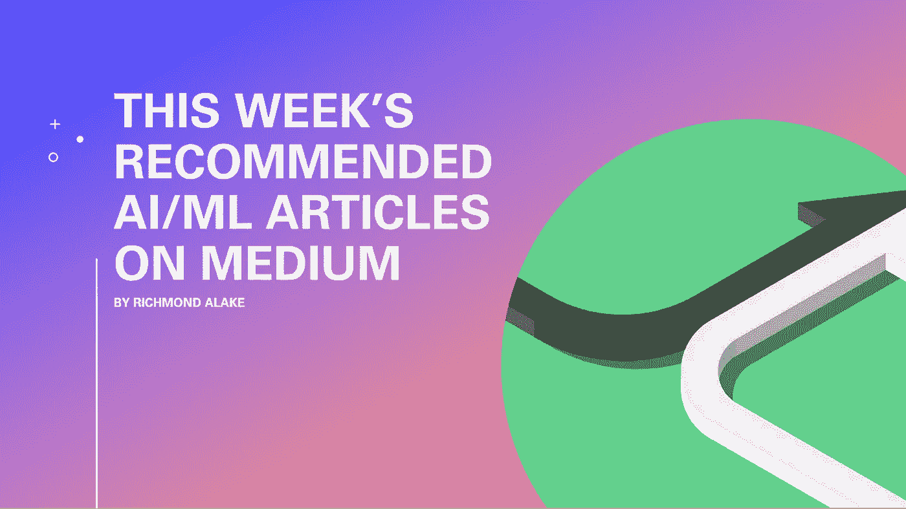

# 为数据科学家推荐的 5 篇文章(2 月 8 日)

> 原文：<https://towardsdatascience.com/5-recommended-articles-for-data-scientists-feb-8-660d03953ab2?source=collection_archive---------51----------------------->

## 每周数据科学、机器学习和 AI 推荐文章

作者图片

# 介绍

与数据科学领域以及更广泛的机器学习领域相关的大量主题和学科，允许媒体上的技术作者在文章中涵盖有趣的主题。

以下是五篇不应错过的专注于数据科学的文章。本文涵盖的主题从网络安全到数据科学项目管理。

***注意:请随意使用评论区来分享你本周遇到的任何值得分享的 ML 和 DS 文章。***

*快乐阅读。*

# 在数据科学中，要么专门化，要么死亡

这篇文章的中心观点是专业化对于数据科学领域的发展至关重要。

亚当更喜欢专业化的道路，而不是一般化；在本文中，Adam 的观点是，拥有广泛的数据科学知识而没有核心领域的专业知识可能不利于从业者在学习方面的进步。

在我看来，亚当是对的，机器学习或 DS 职业生涯的典型轨迹最终会缩小到某个领域的专业。也就是说，对于入门级的角色，一般的数据科学知识可能同样重要。

仔细阅读这篇文章，并在评论区分享你的想法和观点。答案没有对错之分。

 [## 在数据科学中，要么专门化，要么死亡

### 数据科学通才是指在该领域了解不多的人。

towardsdatascience.com](/in-data-science-its-specialize-or-die-7ede67a58676) 

# 人工智能如何从遗传学中学习

Adam Dhalla 的文章介绍了与遗传搜索算法相关的概念、思想和技术。

在进入本文的技术部分之前，Adam 先介绍了 DNA 组成、结构和形成的世界。亚当提出了遗传学和基于算法的问题解决方法之间的联系。

从这篇文章中可以获得丰富的知识。Adam 将生物学、算法和代码结合到一篇详细的文章中，简单易懂地介绍了一个有点复杂的主题。

 [## 人工智能如何从遗传学中学习

### 用遗传搜索算法，模拟我们的基因的人工智能算法来编码 8 皇后难题的解决方案…

adamdhalla.medium.com](https://adamdhalla.medium.com/how-ai-can-learn-from-genetics-b24f31adf494) 

# 我是如何通过识别尼舒·贾恩的一个愚蠢模式而意外入侵一个政府应用程序的

作为数据科学家，我们最终习惯于在系统中获取模式，无论是在计算、机械还是生物系统中。Nishu 的模式识别能力导致了对政府移动应用程序中实施的薄弱安全措施的利用。

Nishu 的文章详细介绍了检测到该模式的方法，以及利用的安全漏洞。像一个守法的好公民一样，Nishu 向相关部门报告了应用程序缺陷。

这篇文章非常值得一读，因为它传达了应用程序安全性中模式检测和匹配的应用。Nishu 甚至包括了他编写的代码，用来攻击文章中提到的政府创建的应用程序。

 [## 我是如何通过识别一个愚蠢的模式意外地入侵了一个政府应用程序

### 有些东西就是要被黑的…

medium.com](https://medium.com/towards-artificial-intelligence/how-i-accidentally-hacked-a-government-app-by-recognizing-a-silly-pattern-4bb5cd293022) 

# 三个数据科学家原型[雅各布·摩尔](https://medium.com/u/58a07ece941f?source=post_page-----660d03953ab2--------------------------------)

Jacob 撰写的这篇观点鲜明的文章提出了数据科学家可以分为的三个类别，或者至少具有与这些类别相关的特征和特性。

无论您是否同意 Jacob 提出的类别，本文中对每个原型的介绍都提供了大量信息。这些信息包括每个类别的利弊，这反过来又可以为职业决策提供见解

阅读这篇文章，找到你属于哪种数据科学原型，谁知道呢，你可能会感到惊讶。

 [## 三个数据科学家原型

### 你在哪里？？

towardsdatascience.com](/the-three-data-scientist-archetypes-148b304be539) 

# 成功数据科学项目的 7 个步骤 [Amit Bharadwa](https://medium.com/u/ac5c08c6e0d8?source=post_page-----660d03953ab2--------------------------------)

Amit 介绍了数据科学项目中涉及的标准步骤和流程，以及决定 DS 项目成功结果的有用的通用技巧。

Amit 的文章包括每个步骤的描述、提示和数据科学家在开展项目时会听到的常用技术术语的简要定义。

 [## 成功数据科学项目的 7 个步骤

### 从头开始完成数据科学项目的初学者指南

towardsdatascience.com](/7-steps-to-a-successful-data-science-project-b452a9b57149) 

## 希望你已经在上面的每篇文章中找到了有用的信息(*或者至少是娱乐*)。

下周见！

# 要联系我或找到更多类似本文的内容，请执行以下操作:

1.  订阅我的 [**邮箱列表**](https://richmond-alake.ck.page/c8e63294ee) 获取每周简讯
2.  跟我上 [**中**](https://richmondalake.medium.com/)
3.  在[**LinkedIn**](https://www.linkedin.com/in/richmondalake/)**和** [**Twitter**](https://twitter.com/richmondalake) 上连接并联系我