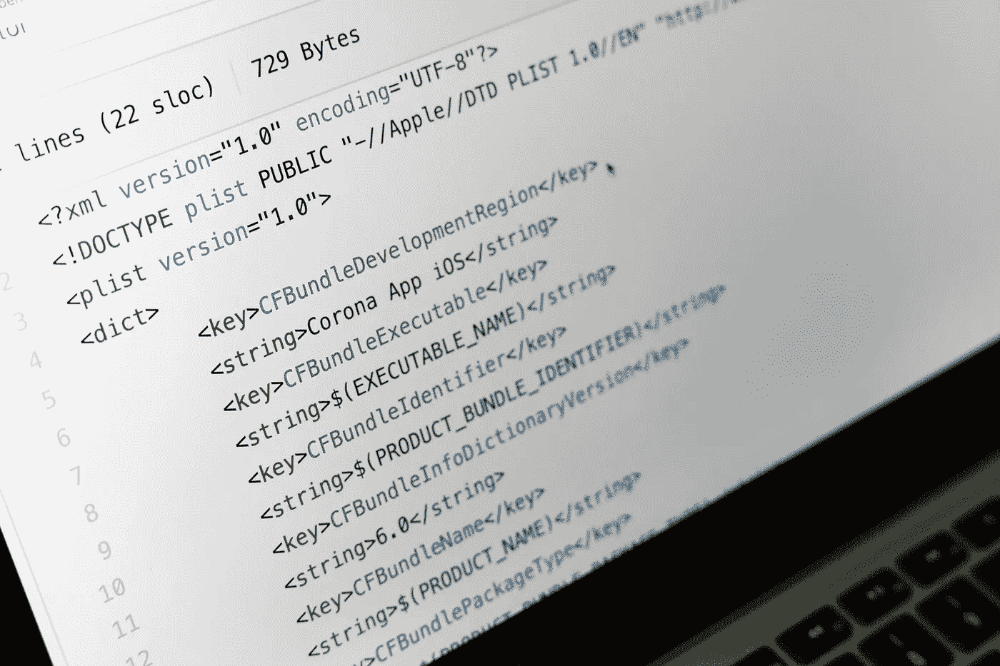

# 帮助您学习和掌握 Git 和版本控制的 5 个资源

> 原文：<https://towardsdatascience.com/5-resources-to-help-you-learn-and-master-git-and-version-control-c9824caaca28?source=collection_archive---------19----------------------->

## 有了这些资源，版本控制就不那么麻烦了。

照片由来自 [Pexels](https://www.pexels.com/photo/black-flat-screen-computer-monitor-4584830/?utm_content=attributionCopyText&utm_medium=referral&utm_source=pexels) 的 [Markus Winkler](https://www.pexels.com/@markus-winkler-1430818?utm_content=attributionCopyText&utm_medium=referral&utm_source=pexels) 拍摄

如果你是一名技术人员、程序员、数据科学家或者 web 或应用程序开发人员，那么你应该知道你需要掌握的基本技能之一是版本控制，或者特别是 Git。当然，有不同种类的版本控制系统，但是 Git 可能是最广为人知和使用最多的一个。

[Git](https://www.atlassian.com/git/tutorials/what-is-git) 是 DVCS(分布式版本控制系统)的一个例子。在分布式版本控制系统中，你的软件的历史并不是存储和保存在一个单独的设备上；相反，它是分布在不同机器和不同用户上的。例如，使用 Git，每个开发团队成员都处理代码的一个副本，该副本包含自代码最初创建以来发生的所有变更的历史。

从性能、安全性和灵活性的角度来看，Git 的设计优于其他版本控制系统。如果你像我一样，那么在你的技术之旅中，你试图学习 Git，并试图通过实践来掌握它。如果你像我一样，那么也许你一直在努力掌握 Git，有时会感到沮丧。

</5-ways-you-can-contribute-to-open-source-that-doesnt-involve-writing-code-18112748bf12>  

当然，并不是每个人都纠结于理解和掌握 Git，但实际上很多人都是这样。这种斗争的原因往往是当我们学习使用相同的方法论。也就是“记住基础知识，随着时间的推移你会做得更好。”尽管这是学习任何东西的有效方法，但有时这不是学习的最佳方式。

因此，当我想要构建坚实的 Git 知识时，我查阅了许多资源来寻找那些使理解 Git 的内部机制变得简单明了的资源。在本文中，我将与您分享其中的一些资源。

# №1:像饭桶一样思考

让我们从我最喜欢的一个学习 Git 的网站开始，[像(a) Git](http://think-like-a-git.net/) 一样思考。关于这个网站，我最喜欢的部分是他们的标志，或者说座右铭，“Git 不应该这么难学。”作为每个程序员都需要知道的技能，我再同意不过了。

Git 是基于图论的不同概念构建的，图论是一个处理图形的数学领域。想想看(a) Git 用了整整一章来讨论图论以及节点和边是如何运作的，所以 Git 在后面更有意义。在讨论了图论之后，网站用例子解释了 Git 的基础知识和每个概念的一些用法。

# №2: GitHub 文档

学习 Git 的一个很好的资源是 GitHub 文档。GitHub 团队经历了很多麻烦，让学习和掌握 GitHub 对每个人来说都是可管理的。他们的努力通常会有回报。如果你想从源头上学习 GitHub，没有比 GitHub docs 更好的了。

g itHub 文档解决了您关于 Git 和 GitHub 使用的所有问题，从本地安装 Git 和 GitHub 到创建存储库，再到创建分支、合并分支、拉请求，以及在本地和 GitHub 服务器上同步代码库。这些文档通过 GitHub 的快照，使用可视化的方法来提供这些主题。

</5-simple-steps-to-package-and-publish-your-python-code-to-pypi-d9f5c43f9d4>  

# №3: Git 塔

如果你是 Git 和编程的初学者，并且更喜欢用书作为学习方法，那么这个资源就是为你准备的。 [Git Tower](https://www.git-tower.com/learn/git/ebook/) 是一本免费的在线可视化书籍，面向 Git 初学者，以简单、直接的方式教你不同的 Git 和版本控制基础知识。

Git Tower 是 Git 和版本控制相关的一切的可视化解释。从什么是版本控制的绝对开始，到我们为什么需要从它开始，然后深入到什么是 Git，它的基础，以及与其相关的更高级的主题。Git Tower 提供教程、视频和备忘单来帮助您成为一名专业的 Git 用户。

# №4:可视化 Git 参考

到目前为止，我们浏览了详细讨论和解释 Git 和版本控制的资源，从什么是版本控制开始，到关于 GitHub 的更精确的主题。但是，假设你现在需要使用 GitHub，并且你想要一些简单的、切中要害的东西，并且可以在几分钟内完成，那么[可视化 Git 参考](https://marklodato.github.io/visual-git-guide/index-en.html)就是为你准备的。

Visual git Reference 是一个单页网站，直观地解释了 git 的基本概念。它解决了 Git 最常见的用法，比如提交、签出、合并、获得版本之间的差异，以及以一种您可以立即使用的简单方式重新设置基础。

</6-best-python-ides-and-text-editors-for-data-science-applications-6986c4522e61> [## 数据科学应用的 6 个最佳 Python IDEs 和文本编辑器

towardsdatascience.com](/6-best-python-ides-and-text-editors-for-data-science-applications-6986c4522e61) 

# №5:学习 Git 分支

正如我们前面提到的，Git 和 GitHub 是基于图论构建的，图论是一种可视化的数学表示。GitHub 的基本工作机制之一是分支、创建、合并和处理它们。[学习 Git 分支](https://learngitbranching.js.org/)是学习和掌握 Git 分支的一个很好的可视化、交互式资源。

这个资源可能是我和我的学生受益最大的资源；这样，它教授了分支，并且可视化地处理它们使得概念本身易于掌握和使用。此外，网站级别以一种逻辑的方式前进，对于绝对的初学者和专业人士来说都很容易理解。

# 外卖食品

对于任何加入技术领域的人来说，版本控制是一个更具挑战性的概念。作为一名计算机科学教师，Git 是我的大多数学生努力奋斗并被这个领域淹没的地方。为了让我的学生和我自己更容易，我寻找不同的资源来用各种方法解释 Git，纯文本资源、可视化资源和交互式资源。

我们都是不同的；我们有不同的学习和吸收信息的方式；有些人更喜欢看书，认为这是学习的最好方式。其他人更喜欢看视频或动画，因为他们更好地理解视觉呈现的东西。有些人通过尝试学习，有些人通过倾听学习，等等。

</5-data-science-open-source-projects-you-to-contribute-to-boost-your-resume-d757697fb1e3>  

我浏览了数百种材料和资源，无论是在我试图学习 Git 的时候，还是在我试图找到解释 Git 并将其传授给其他人的最佳方法的时候。在本文中，我与您分享了一些学习和掌握 Git 的材料和资源，Git 解决了广泛的交付方法。有的是纯文字教程，有的是直观讲解，有的是边做边教。

所以，如果你是技术领域的新手，或者对 Git 知识还不太了解的人，可以尝试一下本文中的一些资源；也许其中一个会帮助你强化知识，更好的理解 Git 和版本控制。