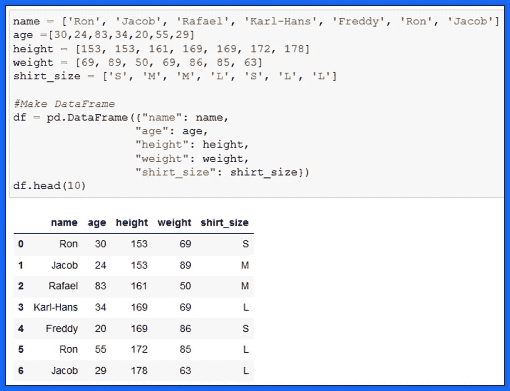
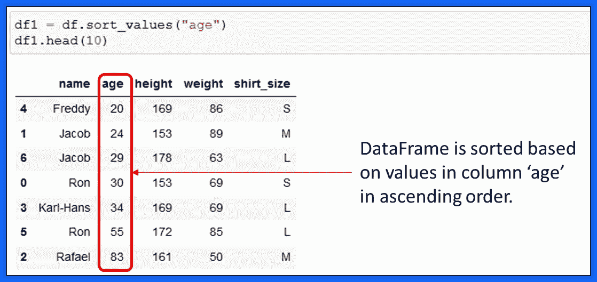
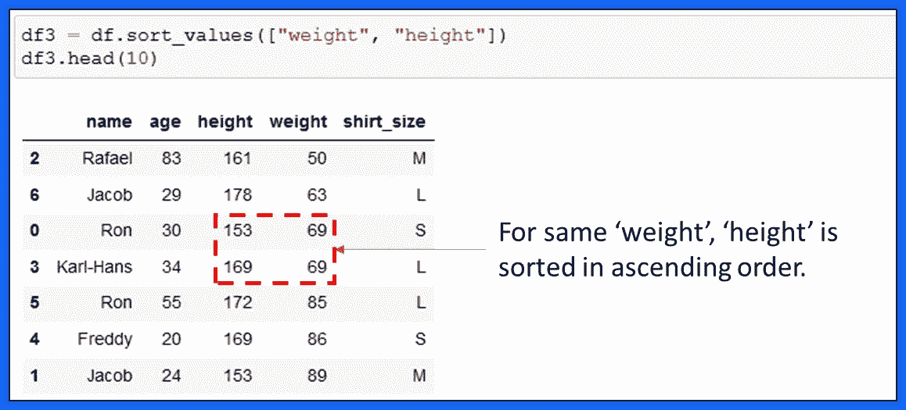
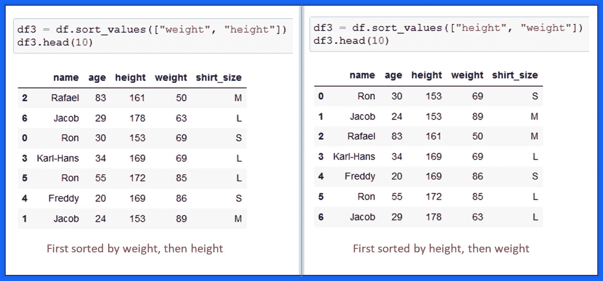
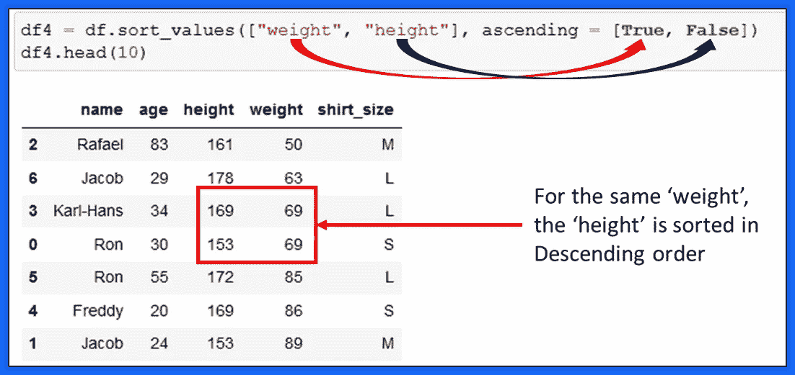
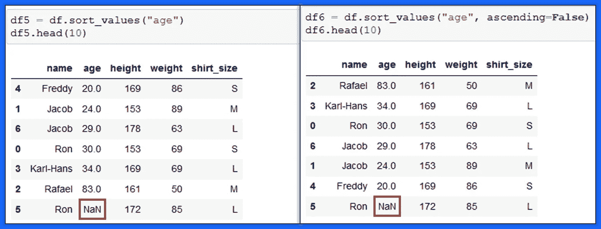
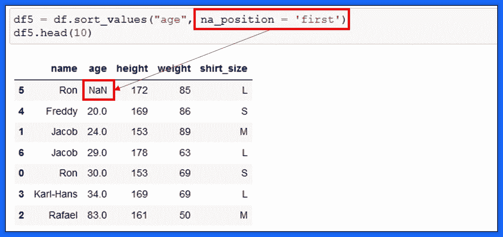
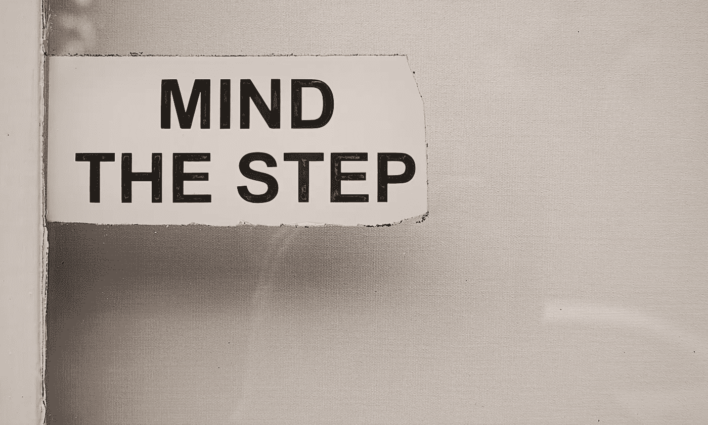
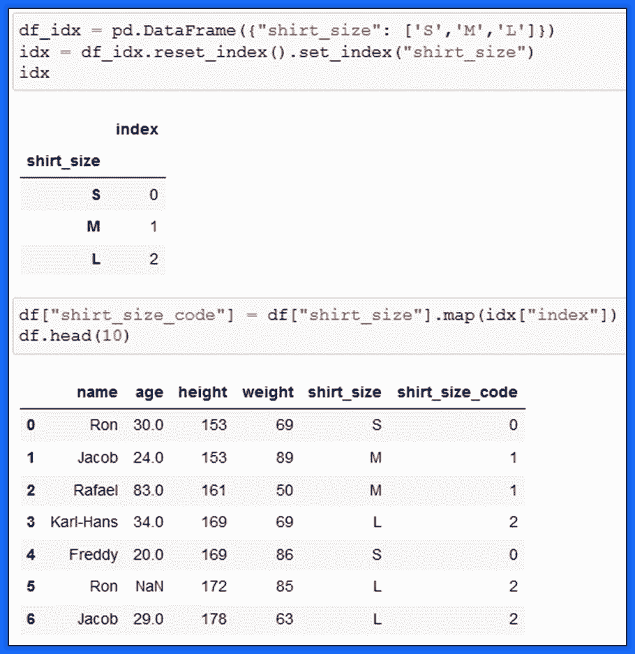

# 对熊猫的数据帧进行排序需要知道的 5 个秘密

> 原文：<https://towardsdatascience.com/5-secrets-you-need-to-know-about-sorting-pandas-dataframe-bd67dde0b56d?source=collection_archive---------23----------------------->

## 编程；编排

## 通过一列、多列和类别轻松排序 Pandas 中的数据帧


安德烈·泰森在 [Unsplash](https://unsplash.com?utm_source=medium&utm_medium=referral) 上拍摄的照片

掌握如何在 5 分钟内对熊猫的数据帧进行排序！！

数据帧排序— *将数据帧按有意义的顺序排列的过程，以便您可以更有效地分析它*💡

一个内置的方法`sort_values()`对于以特定的顺序排序 Pandas 中的数据帧非常有用，例如升序或降序！

使用`sort_values()`排序本身非常简单，但是，在实践中，您可能会遇到缺少值、自定义标签(例如 H、L、M 代表高、低和中)的问题。

以下是在 5 分钟内掌握熊猫数据帧排序的 5 种方法！💡

让我们跳进来吧！！

完整的笔记本📚带着所有这些招数在文末！

首先，让我们创建一个如下所示的数据帧，



熊猫数据框|作者图片

# 基于一列对 Pandas 中的数据帧进行排序

这是最简单的`sort_values()`方法。你需要做的就是

> 熊猫。data frame . sort _ values(column _ name)

并且基于 *column_name 中的值对整个数据帧进行排序。*

让我们根据列龄对上面的数据帧进行排序。



如何根据一列|作者图片对熊猫数据帧进行排序

默认排序顺序是升序！🚩

为了将`df`按年龄列中值的降序(从大到小)排列，您将在`sort_values()`中提供附加参数。

举个例子，


如何按作者降序排列熊猫数据帧|图片

你需要做的就是将参数`ascending` **设为假**！

# 基于多列对 Pandas 中的数据帧进行排序

> 将列列表传递给 sort_values()！！

让我们根据列*重量*和*高度*中的值对`df`进行排序。



根据多列对熊猫数据框进行排序|按作者排序图片

数据帧首先按列*重量*排序，然后按*高度*排序。

> 秩序很重要！

看，当你使用不同的列顺序时，结果是多么的不同！



按多列排序熊猫数据框|按作者排序图片

此外，您还可以按不同的顺序对多列进行排序。

# 基于不同顺序的多个列对 Pandas 中的数据帧进行排序

通常，您需要按不同的顺序按多个列对数据帧进行排序。

> 记住 sort_values()参数“升序”

例如:按照*栏重量*的升序和*栏高度*的降序对`df` 进行排序。



如何在 Python 中按多列排序熊猫数据帧|按作者排序图片

DataFrame `df`首先按照列权重的升序排序。保持不变，`df`再次按照列高的降序排序。

# 在排序中处理缺失值

处理缺失值或`NaN`无法与其他值进行比较，因此默认情况下，`sort_values()`在排序后将`NaN`放在数据帧的末尾。

例如，修改现有的 DataFrame 以包含`NaN`及其在 age 列上的排序。

```
df.loc[5,'age'] = np.nan
```



按作者处理 sort_values() | Image 中的 NaN

不管排序的顺序如何，`NaN`总是放在最后🚩数据帧的。

这可以使用`sort_values()`中的参数`na_position` 进行更改。



将 NaN 值放在 Pandas data frame sort _ values()| Image by Author

在 geeksforgeeks.org[的这本有趣的读物中，你可以找到上面提到的对熊猫的数据帧进行分类的技巧的所有使用案例](https://www.geeksforgeeks.org/how-to-sort-pandas-dataframe/)

# 使用“Inplace ”,但是要小心！

到目前为止，您可能已经注意到，每次我们需要将排序后的数据帧分配给一个新的数据帧时，现有的数据帧都不会更新。

为了避免这种情况，您可以将`inplace`参数设置为`True`！



照片由[杰森·登特](https://unsplash.com/@jdent?utm_source=unsplash&utm_medium=referral&utm_content=creditCopyText)在 [Unsplash](https://unsplash.com/s/photos/careful?utm_source=unsplash&utm_medium=referral&utm_content=creditCopyText) 上拍摄

`inplace = True`就地修改数据，这意味着它不返回任何内容&数据帧得到更新。🚩

> 但是，这是单行道！您无法撤消此更改！

# 自定义排序:使用分类值对 Pandas 中的数据帧进行排序

有时，您可能会遇到值 **S，M，L** ，如我们的数据帧的 *shirt_size* 列中所示。

处理 S < M < L 比较的最简单方法是给 S、M 和 L 中的每一个分配一个数字。🚩

看这里怎么做→



如何在熊猫数据框|作者图片中进行自定义排序

此*衬衫 _ 尺寸 _ 代码*列可用于根据*衬衫 _ 尺寸*列对数据帧进行排序。

`sort_values()`中其他不常用的参数是`kind`和`axis`。关于它的更多信息可以在这里<https://pandas.pydata.org/docs/reference/api/pandas.DataFrame.sort_values.html>*。📌*

*结论，*

*在本文中，我解释了在 Python 中掌握`sort_values()`到在 Pandas 中对数据帧进行*排序的所有选项。你可以尝试这些，也让我知道你用哪些其他方法来加速你的 EDA！**

*现在你可以通过 [***在这里报名***](https://medium.com/@17.rsuraj/membership) 成为媒介会员，阅读我和其他作家发表的所有故事。当你这样做，我会得到你的费用的一小部分，没有任何额外的费用给你。欢迎加入我的电子邮件列表，了解我写作的最新进展。*

*我最近发现了这个非常有用的分类熊猫数据帧的指南。这可能也会让你感兴趣。*

*</a-hands-on-guide-to-sorting-dataframes-in-pandas-384996ca6bb8>  

📚完整的 [**笔记本**](https://github.com/17rsuraj/data-curious/blob/master/TowardsDataScience/5%20Ways_Master%20Pandas%20DataFrame.ipynb) 就在这里。* 

*感谢您的阅读和投入您的时间！！*