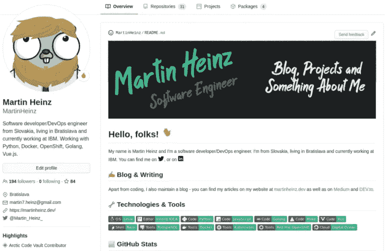
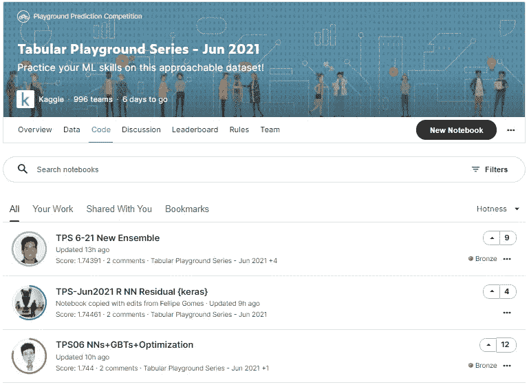
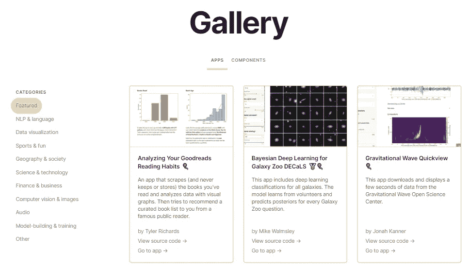
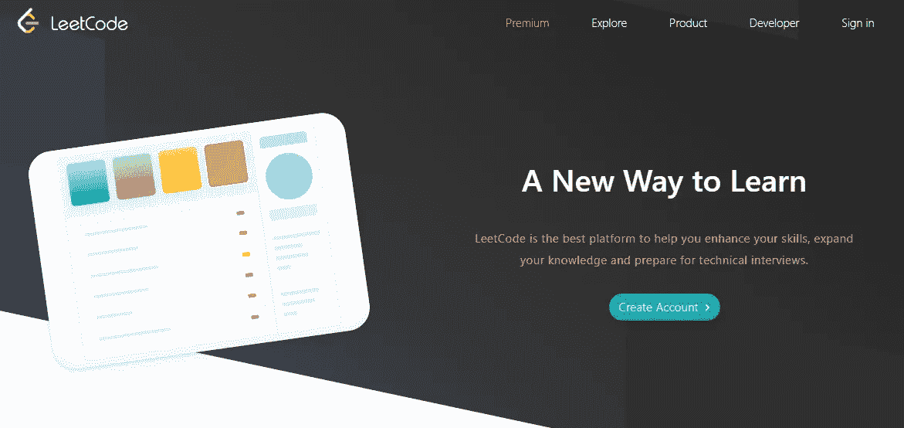

# 训练机器学习模型时要做的 5 件超级高效的事情

> 原文：<https://towardsdatascience.com/5-short-but-super-productive-things-to-do-during-model-training-b02e2d7f0d06?source=collection_archive---------24----------------------->

## 极其漫长的等待变成了生产力会议

#2.代码蠕虫

**照片由** [**凯利**](https://unsplash.com/@kellysikkema?utm_source=unsplash&utm_medium=referral&utm_content=creditCopyText) **上** [**像素**](https://unsplash.com/s/photos/sticky-notes?utm_source=unsplash&utm_medium=referral&utm_content=creditCopyText)

机器学习是一个迭代的过程。最痛苦的是，每一次迭代都非常漫长。无论你是在训练一个神经网络，调整超参数，还是进行无数次的实验，都需要时间。考虑到数据集不会变得更小，你的机器学习未来将涉及大量盯着笔记本电池的小角落。

那么，如何最好地度过这段时间而不是等待呢？在这篇文章中，我将回答这个问题。具体来说，我将向您展示 5 项活动，这些活动将提升您的技术技能，让您在专业上成长为一名数据科学家。这些活动简短而有趣，每一个都是为了适应一个普通模型运行的持续时间而选择的。

[https://ibexorigin.medium.com/membership](https://ibexorigin.medium.com/membership)

获得由强大的 AI-Alpha 信号选择和总结的最佳和最新的 ML 和 AI 论文:

<https://alphasignal.ai/?referrer=Bex>  

## 开始之前…

在开始任何模型训练、超参数调整或实验之前，做好准备非常重要。在您点击 run 之前，您应该确保您执行的每个单元格和代码块都将提供您期望的结果。否则，你会浪费时间。

在深入研究之前，有许多考虑因素，这篇关于机器学习掌握的[博客](https://machinelearningmastery.com/machine-learning-model-running/)告诉你如何最好地设计每个实验，以及如何明智地做出决定。

此外，如果您正在 Jupyter 笔记本中训练模型，启用单元格通知可能是个好主意。当你在做我们将在本文中讨论的活动时，它们会特别有用。您肯定不想因为在执行过程中被卡住而错过执行结束。这里有一篇由[帕鲁尔·潘迪](https://medium.com/u/7053de462a28?source=post_page-----b02e2d7f0d06--------------------------------)撰写的[优秀文章](/enabling-notifications-in-your-jupyter-notebooks-for-cell-completion-68d82b02bbc6)，展示了如何在经典 Jupyter 和 Jupyter 实验室中启用这一功能。现在，让我们开始吧！

## 1️⃣.专业的

数据科学最容易被忽视的方面是建立关系网和发展强大的职业身份。在我看来，一个全面发展的数据科学家必须具备以下四点作为其职业形象的一部分:

*   职业 LinkedIn 页面
*   定期更新简历
*   脱颖而出的 GitHub 页面
*   强大的投资组合

这些对于让你在人群中脱颖而出并有效地向他人展示你的技能至关重要。成功地提升和磨练你的职业形象需要时间，老实说，这可能会很无聊。原因是撰写 LinkedIn 个人资料摘要或开发投资组合网站有点超出了许多数据科学家的舒适区，这是可以理解的。

每当你在 ML 实验中陷入等待时，你可以从小事做起，一步一步来。开始上传一个职业形象到你的 LinkedIn 个人资料中，并创建一个与你的个性相符的 LinkedIn 横幅。逐句写出你的 LinkedIn 总结，一周内把它变成对自己最好的描述。以展示可量化的成就和进步的方式更新你的经历部分。如果你对 LinkedIn 感到不舒服(像我一样)，看看[这个关于建立卓越的 LinkedIn 档案的视频](https://www.youtube.com/watch?v=BcfGWi8Qywk&t=410s)。

下次你在培训 XGBoost 回归器时，花点时间更新你的简历。我确信你一直在做一些很酷的项目，是时候把它们作为一个很好的总结了。这对于没有太多经验的新手来说尤其重要。有很多制作简历的好方法，但我是用 Terence Kuo 的模板制作的，他用这个模板去面试 FAANG 公司。

在模型运行期间，访问你的 GitHub 帐户(是时候了，因为你已经…几个月没有访问它了……).可悲的是，这是许多数据科学家的情况，尤其是初学者。我们不写太多的产品代码，也不做软件工程，所以我们的 GitHub 档案就闲置在那里，我们的贡献图看起来不像死海那样无色。然而，[由](/build-a-stunning-readme-for-your-github-profile-9b80434fe5d7)[马丁·海因茨](https://medium.com/u/4cbd6b36e62a?source=post_page-----b02e2d7f0d06--------------------------------)撰写的这篇很棒的文章展示了如何将你的 GitHub 主页转变成一份完整的作品集或简历。

马丁·海因茨的 GitHub 简介截图

你也可以更进一步，建立并托管你自己的作品集网站。拥有一个展示你的技能和项目的优秀作品集是任何写代码的人的普遍要求。你可以看看这个由 khu yen Tran[撰写的教程](https://medium.com/u/84a02493194a?source=post_page-----b02e2d7f0d06--------------------------------)，它教你如何建立一个简约的作品集网站。最棒的是，在代码运行时，您可以在短时间内处理它。

## 2️⃣.代码蠕虫

不读书就成不了大作家。这同样适用于编码——要熟练掌握它，你需要让自己接触别人写的代码。

到处都是简单易学的库，我们可能会产生一种错觉，以为自己擅长编码。但是如果不与他人比较，我们就无法真正了解自己到底有多糟糕。

在盯着笔记本标签的同时，开始阅读别人的作品。有很多平台和网站可以找到高质量的代码。我最喜欢的是阅读 Kaggle 内核，尤其是那些提交给每月表格操场竞赛的。由于比赛仅持续一个月，笔记本电脑往往会对当今数据科学中可行和不可行的内容进行最新概述。

作者截图

叉开笔记本，摆弄它们。你可能不会经常找到重大突破，但可以肯定的是，你会学到一些方便的技巧或新功能，让你的生活变得更轻松。

还有 Streamlit 的[官方图库](https://streamlit.io/gallery)。那里贴的项目都是精挑细选的，和很多行业相关的 ML 和深度学习方面的高质量作品。您可以了解更多关于生产级 ML 和部署最佳实践的知识。

作者截图

就硬编码而言，我们都到了根本没有改进的地步。阅读他人的代码可以向我们展示与我们喜爱的包和框架的标准 API 进行交互的新颖方式。通过养成在项目工作时阅读代码的习惯，成为一名代码虫。

## 3️⃣.捐助者

不，这一节不是让你为开源包和框架做贡献而感到内疚。对于许多数据科学家和 ML 工程师，以及我自己来说，我知道在 GitHub 上提交 pull 请求和参与问题讨论是绝对可怕的。我不会向你鼓吹数据科学在多大程度上归功于开源社区，比如 Scikit-learn、Numpy、Pandas 等等。

这项活动是关于通过帮助他人来建立声誉和增长技能。你可以从小处着手，而不是像在 GitHub 上解决你最喜欢的包的问题那样高瞻远瞩。通过回答问答网站上的问题来刺激你的大脑，学习新的东西。

过滤 [StackOverflow](https://stackoverflow.com/) 上的问题，找出你最感兴趣的话题，开始写下你自己版本的答案。问题被回答了多少次并不重要，重要的是你把你的想法写了下来。写一些你知道的事情可以巩固你的知识，或者显示出你对那个话题有多*不知道*。回答一个问题只需要几分钟，你可以在训练 CNN 的时候随便涂鸦，一天做好几个问题。

还有，不要把自己仅仅局限于此。如果你有一堆 ML 理论和统计学知识，可以去查一下[交叉验证](https://stats.stackexchange.com/)。如果你是一名经验丰富的职业人士，并且能够在职业上帮助他人，那么就去主宰 Quora 空间吧。

无论你选择什么平台，都要让你的名字出现在那里。帮助并让别人了解你自己的品牌和想法。这能确保你在人群中脱颖而出，让你的简历更加精彩。

(顺便说一句，过去我告诉自己的最愚蠢的事情之一，我相信许多人仍然这样认为，就是没有什么好问题需要回答了。这简直太荒谬了，因为仅在 StackOverflow 上，每 14 秒就有一个新问题被提出来……)

## 4️⃣.准备

我们所有人都有很多东西要学。核心数学主题、监督学习算法、深度学习的深度世界——所有这些都让我们在试图获得该领域工作时非常忙碌。一旦我们开始找工作，我们意识到我们也需要为面试做准备。这意味着许多人熬夜学习算法，用 Python 和 SQL 解决实践问题，所有这些都是困难而有趣的事情。它们足以将大部分来之不易的数据科学知识赶出我们的大脑，因为我们太专注于找工作了。

但是，你不需要在找工作之前就开始这个过程。不要浪费时间，你可以登录 [LeetCode](https://leetcode.com/) 开始破解一个问题，就像你的机器在训练你的模型一样。这可以确保你在学习核心数据科学主题的同时，不会让你的大脑生锈，不会让你的解决问题的肌肉弯曲。

LeetCode 上的一些问题可能很难，所以你可能要花不止一节课来解决一个问题。一个有用的技巧是使用纸笔(老派)来勾画解决方案，而不是漫无目的地写代码。

每当你工作繁重时，养成这种习惯可以让你更早地为找工作做好准备。

## 5️⃣.从冰上拿东西

我确信我们都面临这个问题——你读到一篇文章或看到一条关于某个伟大的图书馆或主题的推文，然后对自己说:“我得看看这个！”。你把这个页面加入书签，然后惊奇地发现，在你最终访问它之前，它会在那里呆上几个月(或者永远不会)。

嗯，你可以马上改掉这个坏习惯。下次您进行超参数调优时，去看看您最近引入的新库。你在训练新模特吗？太好了，去看深度学习上保存的 YouTube 播放列表。

这是一种非常有效的方式来做你已经搁置了很长时间的事情。比如我就是这样了解到 Plotly 的，这几天我会认真看看，但是我知道我又会失望了(为什么？我将在以后的文章中谈到这一点)。我还计划看看 Kaggle 上现在非常流行的 3 个新库——CatBoost、LightGBM 和 Optuna。我还在 Twitter 上获得了一些关于深度学习的书签主题。

有一点是肯定的——我永远不会在我的常规时间表内做这些事情。我订阅了很棒的 MOOCs，并且要写这些文章。就我个人而言，我能赶上我的愿望清单的唯一方法是当我在等待事情完成的时候。

## 摘要

模型训练和超参数调优应该不会无聊。你可以通过简单的活动将漫长的等待变成高效的会议。我们今天讨论的这些可以帮助你提高你的技术技能和发展你的职业身份。数据科学世界竞争激烈，你应该利用一切机会投资自己。感谢您的阅读！

## 您可能也会感兴趣…

*   [19 个你不知道存在的 Sklearn 功能| P(保证)= 0.75](/19-sklearn-features-you-didnt-know-existed-p-guarantee-0-75-79a5e9704dad?source=your_stories_page-------------------------------------)
*   [6 Sklearn 默默告诉你是菜鸟的错误](/6-sklearn-mistakes-that-silently-tell-you-are-a-rookie-84fa55f2b9dd?source=your_stories_page-------------------------------------)
*   [如何使用混淆矩阵进行面向问题的模型调优](/how-to-tune-models-like-a-puppet-master-based-on-confusion-matrix-fd488f9b5e65?source=your_stories_page-------------------------------------)