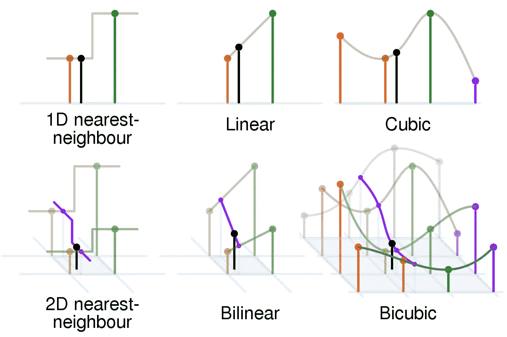

# 加速 MATLAB 代码的 5 个简单技巧

> 原文：<https://towardsdatascience.com/5-simple-hacks-to-speed-up-your-matlab-code-f160103b13bf?source=collection_archive---------11----------------------->

## 万一你“感觉需要速度”

“德国空军的台风 EF2000 欧洲战斗机起飞”。图像由猎鹰摄影和作者修改。来源 [Flickr](https://www.flickr.com/photos/falcon_33/49714158076/) 。这张图片是在[知识共享](https://en.wikipedia.org/wiki/en:Creative_Commons) [署名-共享 2.0 通用](https://creativecommons.org/licenses/by-sa/2.0/deed.en)许可下授权的。

我还记得当初加入航天行业，开始用 Matlab 编程时那种奇妙的感觉。在几秒钟内编写一个函数感觉太容易了，而用 FORTRAN 77 编写这个函数至少要花我两倍的时间。是的，你没看错，那种老派的编程语言。信不信由你，FORTRAN 现在仍然是许多 90 年代航空航天项目遗留工具的支柱。

随着时间的推移，这些遗留工具被抛弃，取而代之的是用现代编程语言编码的新工具集，这不是因为这些遗留工具毫无用处，而是因为对于新一代工程师来说，它们看起来像是僵硬的黑匣子。

在这些情况下，Matlab 可能是一个不错的选择，它有简单的语法、快速的学习曲线、上百个工具箱、令人难以置信的文档以及非常活跃的程序员社区。所以，这似乎是一个非常好的候选人，对不对？嗯，一如既往，这取决于对这些工具的具体要求，有时**速度**是必须的。

尽管 Matlab 对于原型和交互式分析非常有用，但在某些应用中，它似乎太慢了。

因此，如果你“[觉得需要速度](https://www.youtube.com/watch?v=ZwNWviK5z0Q&ab_channel=navyfighters)”**，这里有五个建议来提高你的 MATLAB 代码的性能**，让你感觉自己像一个“绝地程序员”。

# **1。用 jsystem** 进行系统调用

如果你的 MATLAB 代码大量调用系统函数，那么性能下降可能会很明显，因为 Matlab 的 ***系统*** 函数会带来很大的开销。使用由基于 Java 的 [avivrosenberg](https://github.com/avivrosenberg) 创建的更快的 [***jsystem***](https://github.com/avivrosenberg/matlab-jsystem) 函数可以绕过这一开销。

这对于 ***系统*** 功能来说是一个简单的插件，因为它具有相同的语法，并且还可以让您更加灵活地选择特定的 shell 来运行命令。

# **2。循环矩阵**

计算机内存使用单维数组存储数据。默认情况下，Matlab 使用以列为主的数组布局存储这些元素。这意味着什么？简而言之，在列主顺序模式中，每一列的元素在内存中是连续的。相反，在以行为主的数组布局中(C、C++或 Python)，内存中的连续元素对应于每一行的元素。

为了提高代码速度，以正确的顺序访问数组元素以最小化不连续元素之间的巨大跳跃是很重要的。

MATLAB 的黄金法则是**总是将较快循环的索引分配给矩阵维数的最左边部分，将最慢的分配给最右边部分**。这个规则也适用于张量。

例如，在下面的矩阵元素赋值中，当使用列优先顺序时，我们获得了接近 **x6** 的加速。这是一个很好的简单的技巧，可以添加到您的日常编程规则中。

# **3。1D 线性插补**

无论您是为进行科学计算、股票市场分析还是统计而编写脚本，在某些时候您都需要利用插值函数来获取数据未涵盖的中间点的信息。

线性插值和双线性插值的比较一些 1 维和 2 维插值。黑色和红色/黄色/绿色/蓝色点分别对应于插值点和相邻样本。它们离地面的高度与它们的价值相对应”。图片来源:[维基百科](https://commons.wikimedia.org/wiki/File:Comparison_of_1D_and_2D_interpolation.svg)。

对于一维线性插补的具体情况，Matlab 有 ***interp1*** 函数。但是再一次的， ***interp1*** 在线性插值的很多应用中被证明是慢的。

使用 *histc* 函数定位 x 断点向量中最近个体的索引，可以提高***interp 1*的性能。这个巧妙的技巧已经应用在由[何塞·m·米埃尔](https://es.mathworks.com/matlabcentral/profile/authors/2425039)创建的[***interp1qr***](https://es.mathworks.com/matlabcentral/fileexchange/43325-quicker-1d-linear-interpolation-interp1qr)*函数的核心中，实现了令人难以置信的 **x11 性能提升**，如以下脚本所示。***

# ***4。不要使用逻辑临时数组***

*很多时候，在处理大型稀疏数组时，我需要检查任何非零元素，如下例所示:*

*对于 Matlab 来说，计算这个操作似乎并不需要很多时间，但是如果你有一个大的数组，并且这个零测试在你的代码中重复多次，计算时间可能会开始增加。*

*当在一个数组中寻找任何非零元素时，你可能希望一旦找到第一个非零元素，Matlab 会立即停止搜索，对吗？但是当你使用像 **a(:)~=0** 这样的逻辑临时数组时，这并不是“立即”的。*

*当在这个表达式中使用逻辑临时数组时，Matlab 首先将数值转换为逻辑数组，这会产生很大的开销。*

*为了克服这种开销，我们可以利用数值可以作为逻辑值的事实。**所以提示是在与零比较时不要使用临时逻辑数组。***

*在下一个例子中，您可以看到如何使用这个技巧来优化前面的简单代码，以获得令人难以置信的速度。*

# ***5。利用数学理论加速卷积***

*Matlab 在函数***【conv】***、 ***conv2、*** 和 ***convn*** 中卷积的实现依赖于移动窗口方法，使用自动多线程来提高性能(仅当 Matlab 尚未用标志“-singleCompThread”初始化时，有关如何使用此标志的更多信息请参见[此处](https://es.mathworks.com/help/matlab/ref/maxnumcompthreads.html))。*

*尽管如此，如果我们应用原来的**卷积定理，即***【conv】****(a，b)=****IFFT****(****FFT****(a，N)，我们可以加快卷积的计算速度。*****FFT****(b，N))* ，最初由 Bruno Luong 提出的一个想法[。](http://www.mathworks.com/matlabcentral/fileexchange/24504-fft-based-convolution)***

***在以下示例中，我们需要记住对数据进行零填充，以获得可比较的结果:***

***在这个例子中，相对于***【conv】***函数，我们获得了令人难以置信的 **x1100** 加速。这真是一个很大的进步！***

# *****加速代码的附加参考*****

1.  ***[未备案的 Matlab](http://undocumentedmatlab.com/articles/tag/performance/)***
2.  ***[Matlab 官方页面](https://es.mathworks.com/help/matlab/matlab_prog/techniques-for-improving-performance.html#:~:text=Consider%20the%20following%20tips%20on,not%20use%20clear%20all%20programmatically.&text=Changing%20the%20MATLAB%20path%20during%20run%20time%20results%20in%20code%20recompilation.)***
3.  ***[盖伊在 Simulink 上](https://blogs.mathworks.com/simulink/2010/10/28/tips-for-simulation-performance/)***

***[***Rodney rodríguez Robles***](https://medium.com/@rodney.rodriguezrobles)*是一名航空航天工程师、自行车手、博客作者和尖端技术倡导者，在他小时候唯一梦想的航空航天行业中生活。他谈到了编码、航空史、火箭科学，以及所有让你一天比一天轻松的技术。****

***请在以下社交网络上查看我，我很乐意收到您的来信！——[*LinkedIn*](https://www.linkedin.com/in/rodney-rodr%C3%ADguez-robles-2b401942/?lipi=urn%3Ali%3Apage%3Ad_flagship3_feed%3B84I3BjHWSgakHTkLlBxykg%3D%3D)*，*[*Twitter*](https://twitter.com/RodneyRodrgue16)*。****