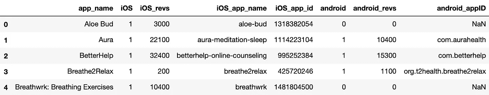
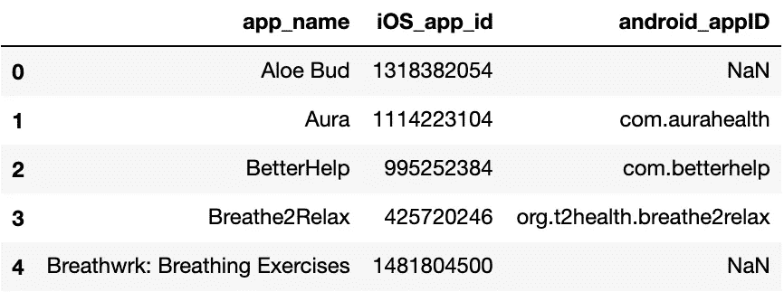
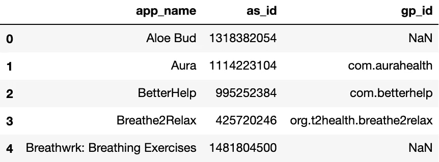
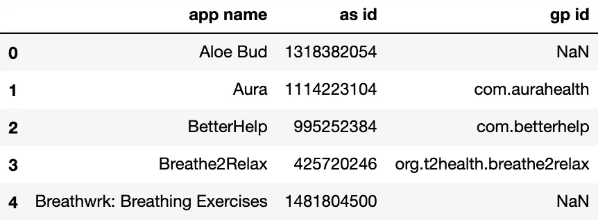
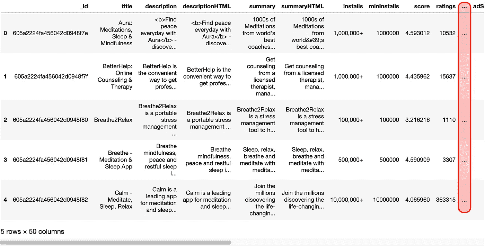
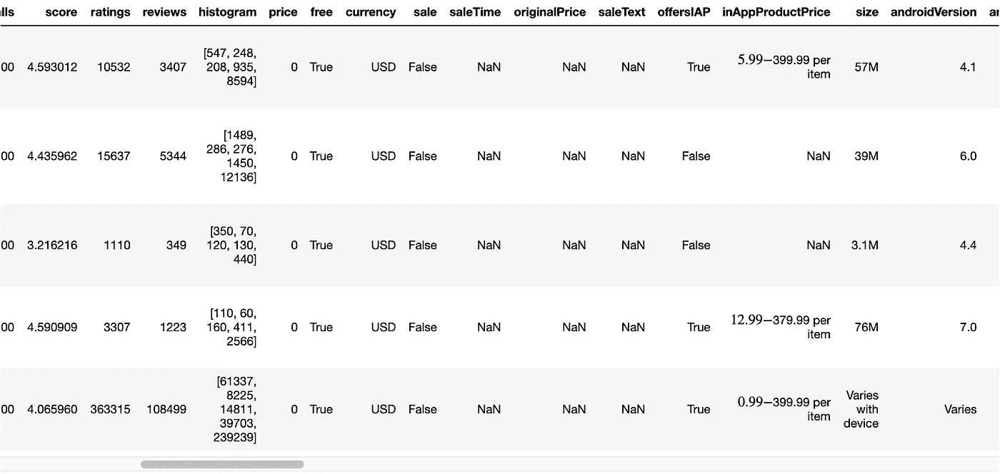
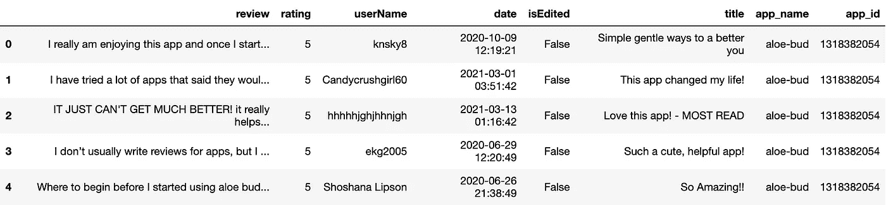
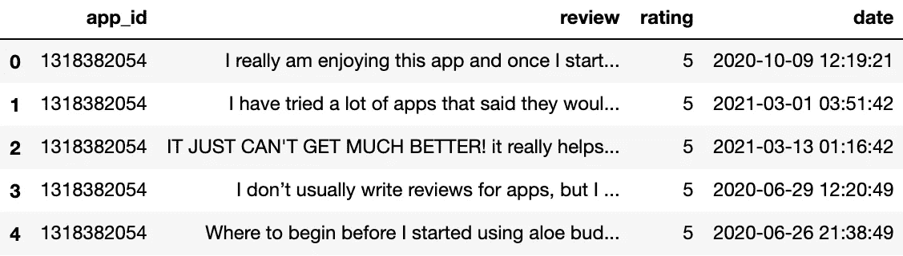
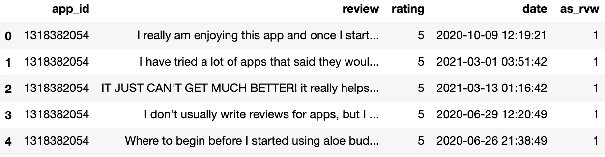
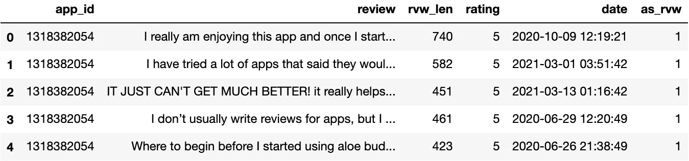

# 查看和组织熊猫数据框的 5 个简单技巧

> 原文：<https://towardsdatascience.com/5-simple-tips-for-viewing-and-organizing-pandas-dataframes-97f5cd09d51b?source=collection_archive---------32----------------------->

## 实际上只有 5 件事我希望能早点知道

我喜欢在熊猫图书馆工作。随着我越来越多地使用它，我越来越欣赏它。

在这篇文章中，我将讲述 5 件多少有些随意的事情，当你查看和组织你的熊猫数据框时，它们会让你的生活变得更简单。没有什么真正突破性的东西，但有 5 件简单的事情，当我知道它们存在时，我很感激。


照片由[吴颖](https://unsplash.com/@wuyyyying?utm_source=unsplash&utm_medium=referral&utm_content=creditCopyText)在 [Unsplash](https://unsplash.com/s/photos/panda?utm_source=unsplash&utm_medium=referral&utm_content=creditCopyText) 上拍摄

我最近在连接来自 3 个不同文件的数据时使用了所有这 5 种方法，所以我将提供这个一般过程的具体代码示例。

# 1.`usecols`参数

有时，对于任何给定的任务，数据文件中的列数都比您感兴趣的要多。您可以读取整个文件:



作者提供的数据帧截图

或者您可以通过使用`usecols`参数简单地读取您真正感兴趣的列:



作者提供的数据帧截图

如果你知道你想要什么，并且你不打算使用它的剩余部分，为什么要把东西加载到内存中？

# 2.快速重命名列

我不太喜欢我们在上面读到的数据帧中的最后两个列名。我不想键入这些，也不想记录大写和小写。我宁愿用小写字母写较短的列名。由于它们都是一个应用程序的标识符，我更希望它们有相似的格式。类似于应用商店 ID 的`as_id`和 Google Play ID 的`gp_id`。

我可以使用`rename()`方法，输入一个字典，将原始列名映射到我想要的列名。

但是根据具体的上下文，我通常更喜欢做以下事情:



作者提供的数据帧截图

这两种方法都将产生上述具有所需列名的数据帧。但是将列名直接设置为一个列表，而不使用映射器，这还是令人满意的。

但是，当直接将列名设置为名称列表时，您需要记住两点:

1.  **您必须为每一列提供一个名称。**
2.  **顺序问题。**

如果你不小心，你很容易把这里的事情弄糟。使用`rename()`方法，你不必担心那么多。

然而，`df.columns =`方法在某些情况下特别有用。假设您将数据文件读入一个 Pandas 数据帧，您的列名如下所示:



作者提供的数据帧截图

在这些地方工作会很烦人。但是您可以使用下面的代码快速修复该问题，该代码将所有列名中的所有空格替换为下划线:

```
app_df.columns = [col.replace(' ', '_') for col in app_df.columns]
```

或者说你在你的文件中阅读，列名全部是大写字母(或者奇怪和不一致的大写字母)并且很难阅读。您可以使用以下命令将所有列名全部更改为小写:

```
app_df.columns = [col.lower() for col in app_df.columns]
```

有了这样的列表理解，您不必担心显式地为每一列提供名称，或者确保列名的顺序正确。当您使用`columns`属性遍历原始列名时，这将自动发生。

# 3.更改要显示的最大列数

我是一个极度视觉化的思考者，我喜欢能够看到我正在处理的东西。我在工作时不断地检查数据帧，我经常希望能够一次看到所有可用的列。默认情况下，Pandas 只显示 20 列。

下面我们看到总共有 50 列的数据帧的前 10 列。中间的 30 列是隐藏的(用红色突出显示的省略号表示)，如果我们向右滚动，就会看到最后 10 列。



作者提供的数据帧截图

如果我想知道所有列的名称，我可以简单地打印出`df.columns`，但是那样我也不能看到每一列中的数据类型。因此，我将使用`pd.options.display.max_columns = 50`一次性显示所有 50 列。

下面我们看到最初默认隐藏的 30 列中的第一部分:



作者提供的数据帧截图

您也可以通过调整`pd.options.display.max_rows`来调整数据帧显示的最大行数。

# 4.用双括号对列进行切片和重新排序

你有没有遇到过这样的情况，当你处理一个数据帧时，你知道以后你只能处理列的子集？也许您更希望按照对您更有意义的特定顺序排列这些列的子集？

假设您有下面的数据帧，并且您只想要按顺序排列的`app_id`、`review`、`rating`和`date`列。



作者提供的数据帧截图

您可以使用双括号和所需列的列表从原始数据帧创建切片:



作者提供的数据帧截图

# 5.insert()方法

假设我们想要添加一个列来标识我们在上面制作的切片中的评论来自于 App Store。当我们将它与来自 Google Play 的评论连接起来时，这将非常有用，因为我们将知道每个评论来自哪里。为我们的应用商店切片这样做非常简单:



作者提供的数据帧截图

我们创建了一个充满 1 的列，以表明是的，这些评论来自 App Store，而不是 Google Play。以这种方式创建新列总是将它们附加到数据帧的末尾。对于我们刚刚创建的这个指标变量来说，这一切都很好，但我喜欢将相关的东西放在一起。接下来我想创建一个变量，让我知道每个评论字符串有多长。我真的希望这个新列位于`review`和`rating`列之间。

这可以通过`insert()`方法来实现，该方法有三个参数:

1.  新列的所需索引
2.  新列的名称
3.  用来填充新列的值

在我们的例子中，索引需要为 2，因为我希望新列紧接在第二列之后出现(和正常情况一样，索引从 0 开始)。我们将新列命名为`rvw_len`。最后，我们将一个 lambda 函数映射到第三个参数。在这里，我们指定要用每行对应的`review`字符串的长度来填充新列。



作者提供的数据帧截图

成功！我们的新专栏`rvw_len`被插在其他所有内容的中间，放在一个对我来说有实际意义的地方。

# 概括一下

1.  如果您只想从一个文件中读入一组特定的列，那么使用`usecols`参数和您实际需要的列名列表。
2.  如果您想重命名所有列，请设置`df.columns = [list of desired column names]`。
3.  想要看到比熊猫默认显示更多的列(或行)吗？用`pd.options.display.max_columns =`(或`.max_rows`)调整显示选项。
4.  想要一部分特定的列并以特定的顺序获取这些列吗？在数据框架上使用双括号，将所需列的列表放在里面。
5.  如果您想在特定的索引处插入一个新列，而不是把它作为最后一列，请使用`insert()`方法。

我希望你能发现这些信息，并能把你学到的东西应用到你自己的工作中。感谢阅读！