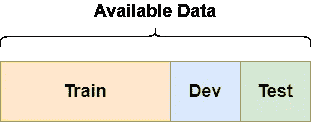
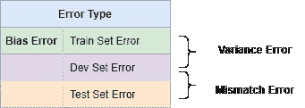
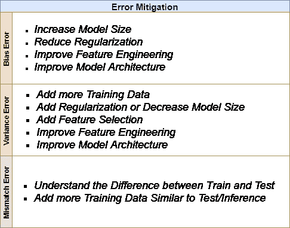
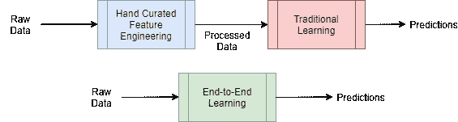
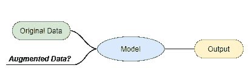

# 增强机器学习实践的 5 个简单技巧

> 原文：<https://towardsdatascience.com/5-simple-tips-to-supercharge-your-machine-learning-practice-fb40e850e491?source=collection_archive---------36----------------------->

## 争取高质量的数据科学工作

自从我上高中后，我就有一种奇怪的执念，想把我所学的所有东西的关键概念都压缩在一页纸上。回过头来看，这可能是我懒惰的思维方式，以最少的工作量通过考试…但有趣的是，抽象努力也有助于更深层次地学习这些概念，并更长时间地记住它们。如今，当我教授机器学习时，我试图在两条平行的轨道上教授它:a)主要概念和 b)方法和理论细节，并确保我的学生可以通过相同概念的镜头来看待每一种新方法。最近我有机会读了吴恩达的《机器学习的渴望》，这似乎是他的版本，抽象了一些实用的 ML 概念，而没有进入任何公式或实现细节。虽然他们可以看到如此简单和明显，但作为一名 ML 工程师，我可以证明，忽视这些简单的技巧是 ML 研究在生产中失败的最常见原因之一，记住它们是区分优秀数据科学工作和平庸数据科学工作的关键。在这里，我想用一页纸总结一下我从安德鲁的书里学到的东西，分成 5 个重要的小贴士，所以不要再废话，让我们开始吧:

1- *你如何分割你的可用数据…非常重要！*

图一。数据分割

E 即使你不是数据科学家，你也可能已经知道，为了衡量你的算法的泛化能力，你应该将你的可用数据分成训练集、开发(验证)集和测试集，你不应该将测试集用于任何模型优化/调整。听起来很明显，我见过很多从业者使用他们的测试集来手动优化超参数，然后报告与泛化性能相同的测试集上的最佳结果…你猜对了…这是作弊！当部署后模型性能下降时，他们仍然会感到惊讶。您应该确保不要将测试集用于任何类型的优化，包括手动超参数优化，这就是您的开发/验证集的用途。

还要注意从您的训练集到开发或测试集的任何数据泄漏。数据泄漏的一个愚蠢的原因可能是数据中存在重复的实例，这在训练集和测试集中都会出现。如果您通过连接来编译最终数据集，请特别小心。

在经典 ML 中，当数据集很小时，我们通常使用 60%-20%-20%进行训练-开发-测试分割，无论是在保留还是交叉验证设置中。吴恩达认为，如果数据集很大，你可以使用小得多的数据集进行开发和测试。然而，您的开发集应该足够大，以检测模型性能中有意义的变化，例如，在您的开发集中有 100 个示例，只允许您检测模型误差的 1%或更大的变化。

您的测试集应该具有与您的模型在部署时将遇到的实际群体相似的分布，并且应该足够大，以使您对您的模型性能估计有信心。

最后但同样重要的是，确保利用分层抽样，这可以通过使用 scikit-learn 或其他库中的内置函数轻松完成。假设您的可用数据是总体的无偏样本，分层抽样确保您在培训/开发/测试分割中分布无偏性。

因此，概括地说，为了拆分您的数据:a)确保您的数据拆分是完全隔离的，b)您的测试(和开发)集具有与您的目标人群相似的分布，c)使用训练集来优化模型参数，使用开发集来优化超参数，使用测试集来测量最终模型性能。

2 - *估计每个偏倚、方差和数据失配误差* *分量，以便有效地调试你的模型*

***泛化误差=偏倚+方差+数据不匹配***

Y 你可能已经听说过前两个组成部分:偏差误差是分类器缺乏学习生成数据的基础函数的能力，例如，当试图学习多项式函数生成的关系时，线性回归模型会有很高的偏差误差。方差误差类似于统计学中的采样误差，是由有限的样本大小引起的，当分类器对特定的训练样本学习得太好，结果失去了对看不见的数据的推广能力时，就会发生方差误差。这些误差中的每一个都有精确的统计定义，但粗略地说，偏差误差是在训练集上得到的误差，方差误差是从训练集到开发(验证)集的误差增量。

图二。三个误差源

第三个错误或数据不匹配错误来自于测试/推理数据的分布不同于训练和验证的事实。例如，您使用从互联网收集的数据来训练猫品种分类器，并使用它来部署猫分类器移动应用程序，您用于在部署之前验证您的模型的互联网猫图像和您在部署中看到的实际移动应用程序图像之间的分类性能差异是数据不匹配误差，即从开发集到您的推断/测试数据的误差增加。数据不匹配在不同的上下文中也有不同的名称，例如协变量偏移或模型漂移；虽然在定义这些术语时存在细微的差别，但总体思想是相同的，如果您的测试集和目标任务具有相似的分布，则您的测试集误差可以在实际的模型部署之前为您提供数据不匹配误差的准确估计。

3- *根据错误来源*缩小调试选项的范围

图 3。按误差源划分的误差缓解策略

如果你的训练数据(偏差)误差很大，你可以尝试增加你的模型大小。对于神经网络，它可以转化为增加层或神经元的数量。如果开发集误差和训练集误差之间的差异很大(方差误差)，可以尝试向训练集添加更多数据。为了有效地做到这一点，您可以使用错误分析来了解特征空间的哪些区域导致了最多的失败，并相应地确定数据收集的目标。虽然收集更多数据是减少方差误差的最佳策略，因为它不会影响偏差误差，但这并不总是可能的。减少方差误差的下一个最佳方法是正则化(例如，在神经网络中添加辍学或提前停止)。类似地，维度减少或特征选择可以导致更小的模型，这反过来减少了方差误差。请记住，正则化和降维也会导致偏差误差的增加。

基于从误差分析中获得的洞察力添加更多相关变量或特征可以改善偏差和方差误差。同样的事情也适用于改进模型的架构。

4- *决定是否将手工设计的功能/组件插入您的 ML 系统的关键因素是可用数据的数量*

图 4。传统与端到端学习

拥有更多手工设计的特征或组件通常允许一个人工智能系统用更少的数据进行学习。领域知识补充了我们的算法从数据中获取的知识。当我们没有太多数据时，这种手工设计的知识就变得更加重要。另一方面，如果没有数据短缺，则可以应用端到端设计，从而绕过手动特征工程的需要。

5- *是否在培训中使用补充/扩充数据取决于您的模型容量*

图 5。扩充/补充数据

补充数据是与你的目标任务一致但不完全来自同一分布的任何数据。假设对于卡特彼勒分类器移动应用程序，您有 10k 个用户上传的图像和 20k 个从互联网下载的图像。在这里，20k 互联网图像将是您的补充数据，如果您的模型很小，包括这些可能会占用您的模型的容量，并限制用户上传图像的可学性。然而，如果模型足够大，它可以学习两种分布，并利用两个集合之间的共性来巩固学习和更好地概括(这是元学习背后的主要思想)。虽然吴恩达的书中没有提到这一点，但我假设同样的推理适用于包括任何可以产生类似文本、图像或表格数据的数据增强技术(例如，对抗性数据增强)。如果你的分类器容量很小，那么包括那些增强的数据不能创造奇迹，但是当我们使用高容量深度学习时，它可以充当正则化器。

***参考文献***

机器学习向往由 http://www.mlyearning.org/()吴恩达著