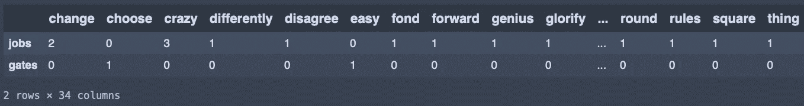

# 用 Python 标记文本的 5 种简单方法

> 原文：<https://towardsdatascience.com/5-simple-ways-to-tokenize-text-in-python-92c6804edfc4?source=collection_archive---------2----------------------->

## 标记文本、大型语料库和不同语言的句子。


照片由[劳伦提乌·约尔达切](https://unsplash.com/@jordachelr?utm_source=medium&utm_medium=referral)在 [Unsplash](https://unsplash.com?utm_source=medium&utm_medium=referral) 上拍摄

标记化是数据科学家在处理文本数据时遇到的常见任务。它包括将整个文本分割成小单元，也称为标记。大多数自然语言处理(NLP)项目都将标记化作为第一步，因为它是开发良好模型的基础，有助于更好地理解我们拥有的文本。

尽管 Python 中的标记化可以像编写`.split()`一样简单，但这种方法在某些项目中可能不是最有效的。这就是为什么，在这篇文章中，我将展示 5 种方法来帮助你标记小文本、大语料库甚至用英语以外的语言写的文本。

```
**Table of Contents** 1\. [Simple tokenization with .split](#31ad)
2\. [Tokenization with NLTK](#33a2)
3\. [Convert a corpus to a vector of token counts with Count Vectorizer (sklearn)](#f5d2)
4\. [Tokenize text in different languages with spaCy](#d7d1)
5\. [Tokenization with Gensim](#dfd5)
```

*注意:标记化是数据科学家在清理和准备数据时要做的许多工作之一。在下面的文章中，我写了一个指南来帮助你完成这些繁琐的任务。两篇文章的代码在我的*[*Github*](https://github.com/ifrankandrade/data_preprocessing.git)*上都有。*

[](/a-straightforward-guide-to-cleaning-and-preparing-data-in-python-8c82f209ae33) [## 用 Python 清理和准备数据的简单指南

### 如何识别和处理脏数据？

towardsdatascience.com](/a-straightforward-guide-to-cleaning-and-preparing-data-in-python-8c82f209ae33) 

# 1.简单的标记化。使分离

正如我们之前提到的，这是在 Python 中执行标记化的最简单的方法。如果您键入`.split()`，文本将在每个空格处分开。

在这个例子和接下来的例子中，我们将使用史蒂夫·乔布斯在苹果广告“思考不同”中讲述的一段文字。

```
text = “””Here’s to the crazy ones, the misfits, the rebels, the troublemakers, the round pegs in the square holes. The ones who see things differently — they’re not fond of rules. You can quote them, disagree with them, glorify or vilify them, but the only thing you can’t do is ignore them because they change things. They push the human race forward, and while some may see them as the crazy ones, we see genius, because the ones who are crazy enough to think
that they can change the world, are the ones who do.”””text.split()
```

如果我们编写上面的代码，我们将获得下面的输出。

```
['Here’s', 'to', 'the', 'crazy', 'ones,', 'the', 'misfits,', 'the', 'rebels,', 'the', 'troublemakers,', 'the', 'round', 'pegs', 'in', 'the', 'square', 'holes.', 'The', 'ones', 'who', 'see', 'things', 'differently', '—', 'they’re', 'not', 'fond', 'of', 'rules.', 'You', 'can', 'quote', 'them,', 'disagree', 'with', 'them,', 'glorify', 'or', 'vilify', 'them,', 'but', 'the', 'only', 'thing', 'you', 'can’t', 'do', 'is', 'ignore', 'them', 'because', 'they', 'change', 'things.', 'They', 'push', 'the', 'human', 'race', 'forward,', 'and', 'while', 'some', 'may', 'see', 'them', 'as', 'the', 'crazy', 'ones,', 'we', 'see', 'genius,', 'because', 'the', 'ones', 'who', 'are', 'crazy', 'enough', 'to', 'think', 'that', 'they', 'can', 'change', 'the', 'world,', 'are', 'the', 'ones', 'who', 'do.']
```

正如您在上面看到的，split()方法没有将标点符号视为单独的标记。这可能会改变您的项目结果。

[](https://medium.com/geekculture/4-free-and-paid-web-scraping-courses-every-data-scientist-should-take-956562ac68dc) [## 每个数据科学家都应该参加的 4 门免费和付费网络搜集课程

### 获得这一每个数据科学家都应该具备的必备技能。

medium.com](https://medium.com/geekculture/4-free-and-paid-web-scraping-courses-every-data-scientist-should-take-956562ac68dc) 

# 2.用 NLTK 进行标记化

NLTK 代表自然语言工具包。这是一套用 Python 编写的英语统计自然语言处理的库和程序。

NLTK 包含一个名为`tokenize`的模块，它带有一个`word_tokenize()`方法，可以帮助我们将文本分割成标记。安装 NLTK 后，编写以下代码来标记文本。

```
from nltk.tokenize import word_tokenize
word_tokenize(text)
```

在这种情况下，默认输出与上面显示的`.split`方法略有不同。

```
['Here', '’', 's', 'to', 'the', 'crazy', 'ones', ',', 'the', 'misfits', ',', 'the', 'rebels', ',', 'the', 'troublemakers', ',', 
...]
```

在这种情况下，“*here ' s”*中的撇号(')和“*ones”*中的逗号(，)被视为标记。

# 3.使用计数矢量器(sklearn)将语料库转换为令牌计数矢量

在处理大型语料库时，前面的方法变得不太有用，因为您需要以不同的方式表示标记。计数矢量器将帮助我们将一组文本文档转换成一个令牌计数矢量。最后，我们将得到文本数据的向量表示。

对于这个例子，我将在前面的文本中添加一段比尔·盖茨的语录来构建一个数据框架，作为语料库的一个例子。

```
import pandas as pd
texts = [
"""Here’s to the crazy ones, the misfits, the rebels, the troublemakers, the round pegs in the square holes. The ones who see things differently — they’re not fond of rules. You can quote them, disagree with them, glorify or vilify them, but the only thing you can’t do is ignore them because they change things. They push the human race forward, and while some may see them as the crazy ones, we see genius, because the ones who are crazy enough to think that they can change the world, are the ones who do.""" ,

'I choose a lazy person to do a hard job. Because a lazy person will find an easy way to do it.'
]df = pd.DataFrame({'author': ['jobs', 'gates'], 'text':texts})
```

现在，我们将使用`Count Vectorizer`将`df` 数据帧中的这些文本转换成一个令牌计数向量。

如果您运行这段代码，您将得到一个框架，它计算一个单词在两个文本中被提及次数。



作者图片

当数据帧包含大型语料库时，这变得非常有用，因为它提供了具有被编码为整数值的单词的矩阵，这些整数值被用作机器学习算法中的输入。

计数矢量器可以有不同的参数，比如我们上面定义的`stop_words` 。但是，请记住，`Count Vectorizer`使用的默认 regexp 选择包含 2 个或更多字母数字字符的**标记**(标点完全被忽略，总是被视为标记分隔符)

# 4.用 spaCy 标记不同语言的文本

当需要对用英语以外的语言编写的文本进行标记时，可以使用 spaCy。这是一个高级自然语言处理库，用 Python 和 Cython 编写，支持超过 65 种语言的标记化。

让我们将同样的史蒂夫·乔布斯文本标记出来，但现在翻译成西班牙语。

在这种情况下，我们从`spacy.lang.es` 导入了`Spanish` ，但是如果你使用的是英文文本，只需导入`English from spacy.lang.en` 在这里查看可用语言列表[。](https://spacy.io/usage/models)

如果您运行这段代码，您将得到以下输出。

```
['Por', 'los', 'locos', '.', 'Los', 'marginados', '.', 'Los', 'rebeldes', '.', 'Los', 'problematicos', '.', '\n', 'Los', 'inadaptados', '.', 'Los', 'que', 'ven', 'las', 'cosas', 'de', 'una', 'manera', 'distinta', '.', 'A', 'los', 'que', 'no', 'les', 'gustan', '\n', 'las', 'reglas', '.', 'Y', 'a', 'los', 'que', 'no', 'respetan', 'el', '“', 'status', 'quo', '”', '.', 'Puedes', 'citarlos', ',', 'discrepar', 'de', 'ellos', ',', '\n', 'ensalzarlos', 'o', 'vilipendiarlos', '.', 'Pero', 'lo', 'que', 'no', 'puedes', 'hacer', 'es', 'ignorarlos', '…', 'Porque', 'ellos', '\n', 'cambian', 'las', 'cosas', ',', 'empujan', 'hacia', 'adelante', 'la', 'raza', 'humana', 'y', ',', 'aunque', 'algunos', 'puedan', '\n', 'considerarlos', 'locos', ',', 'nosotros', 'vemos', 'en', 'ellos', 'a', 'genios', '.', 'Porque', 'las', 'personas', 'que', 'están', '\n', 'lo', 'bastante', 'locas', 'como', 'para', 'creer', 'que', 'pueden', 'cambiar', 'el', 'mundo', ',', 'son', 'las', 'que', 'lo', 'logran', '.']
```

如您所见，spaCy 将标点符号视为单独的标记(甚至包括了新行`\n` )。

如果你对西班牙语有所了解，你可能会注意到标记化与英语相似，所以你可能会想，“*为什么每种语言都需要一个标记化器？*

**虽然对于像西班牙语和英语这样的语言，标记化就像用空格分隔一样简单，但是对于像汉语和日语这样的非浪漫语言，正字法可能没有空格来分隔“单词”或“标记”在这种情况下，像 spaCy 这样的库将会派上用场。** [在这里](https://stackoverflow.com/questions/17314506/why-do-i-need-a-tokenizer-for-each-language)你可以查看更多关于不同语言中标记化的重要性。

# 5.用 Gensim 进行标记化

Gensim 是一个用于无监督主题建模和自然语言处理的库，还包含一个标记器。一旦安装了 Gensim，标记文本就像编写下面的代码一样简单。

```
from gensim.utils import tokenize
list(tokenize(text))
```

这段代码的输出如下。

```
['Here', 's', 'to', 'the', 'crazy', 'ones', 'the', 'misfits', 'the', 'rebels', 'the', 'troublemakers', 'the', 'round', 'pegs', 'in', 'the', 'square', 'holes', 'The', 'ones', 'who', 'see', 'things', 'differently', 'they', 're', 'not', 'fond', 'of', 'rules', 'You', 'can', 'quote', 'them', 'disagree', 'with', 'them', 'glorify', 'or', 'vilify', 'them', 'but', 'the', 'only', 'thing', 'you', 'can', 't', 'do', 'is', 'ignore', 'them', 'because', 'they', 'change', 'things', 'They', 'push', 'the', 'human', 'race', 'forward', 'and', 'while', 'some', 'may', 'see', 'them', 'as', 'the', 'crazy', 'ones', 'we', 'see', 'genius', 'because', 'the', 'ones', 'who', 'are', 'crazy', 'enough', 'to', 'think', 'that', 'they', 'can', 'change', 'the', 'world', 'are', 'the', 'ones', 'who', 'do']
```

如您所见，Gensim 每次遇到标点符号时都会分裂，例如`Here`、`s`、`can, t`

# 摘要

令牌化带来了不同的挑战，但现在您知道了 5 种不同的应对方法。`.split` 方法是一个简单的标记器，它用空格分隔文本。NLTK 和 Gensim 做类似的工作，但是使用不同的标点规则。其他很好的选择是 spaCy，它提供了一个多语言标记器和 sklearn，帮助标记一个大型语料库。

[**与 3k 以上的人一起加入我的电子邮件列表，获取我在所有教程中使用的 Python for Data Science 备忘单(免费 PDF)**](https://frankandrade.ck.page/bd063ff2d3)

如果你喜欢阅读这样的故事，并想支持我成为一名作家，可以考虑报名成为一名媒体成员。每月 5 美元，你可以无限制地阅读媒体上的故事。如果你使用[我的链接](https://frank-andrade.medium.com/membership)注册，我会赚一小笔佣金，不需要你额外付费。

[](https://frank-andrade.medium.com/membership) [## 阅读弗兰克·安德拉德(以及媒体上成千上万的其他作家)的每一个故事

### 作为一个媒体会员，你的会员费的一部分会给你阅读的作家，你可以完全接触到每一个故事…

frank-andrade.medium.com](https://frank-andrade.medium.com/membership)