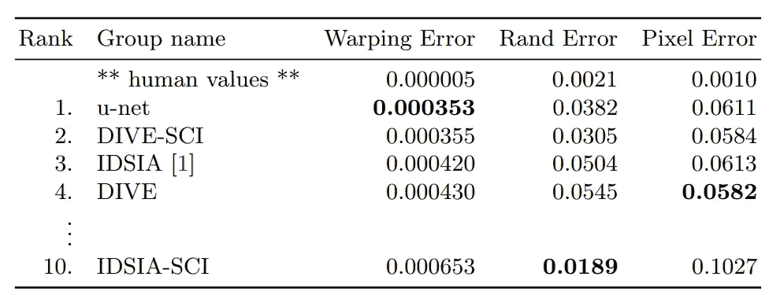

# 有效重构研究论文的 5 个步骤

> 原文：<https://towardsdatascience.com/5-steps-to-effectively-reconstruct-research-papers-1adbb4fda664?source=collection_archive---------18----------------------->

## 如何重新构建你自己的研究论文变体并开发众多项目


安妮·斯普拉特在 [Unsplash](https://unsplash.com?utm_source=medium&utm_medium=referral) 上的照片

学习人工智能和数据科学有几种方法。大多数复杂的概念都包含在网站、博客、文章和其他资源中。然而，任何特定主题的大部分细节通常都包含在一篇研究论文中的方法论的结构良好的理论实现中。

当掌握与机器学习和深度学习相关的新概念时，理解任何概念的最突出方式是有效地阅读、理解、解释和实现特定概念主题的特定研究论文。大多数复杂的深度学习研究，如生成对抗网络(GANs)、变分自动编码器(VAEs)、神经网络和其他类似的有趣主题，都需要专注和专注，以根据需要进行适应和重新创建。

对于大多数初学者来说，从零开始实现研究论文的一个不幸的方面是，他们不能从零开始重建它，并以最简洁的方式开发模型或项目。有时没有足够的关于架构构建的细节，或者它们不可解释，或者许多其他原因。

在本文中，我们将客观地找出以最有效的方式重建和复制高水平、先进的研究论文所需的最佳方法。让我们开始寻找成功解决这一任务的最佳步骤，以实现可能的最佳结果。

# 1.了解背景:

破解任何复杂研究论文代码的第一步是理解概念解释。解码摘要和分解他们的创新研究的介绍的大部分元素为你提供了一条更窄的路径来关注具体的改进主题，因为大多数研究都是在以前的工作基础上改进的。

一旦你对摘要有了一个简要的概念，我建议浏览并快速阅读整篇研究论文。这样做将有助于你衡量对预期的理解，也有助于你决定对你的特定方法来说最好的深度学习框架可能是什么。选择你觉得最适合用来解决特定问题的深度学习库。

你可以在 TensorFlow 或 PyTorch 的两个推荐的深度学习库中选择一个来开始编码部分。下面是一些库的起始代码，以便为下面的内容导入。

```
import tensorflow as tf
from tensorflow.keras import datasets, layers, models
import matplotlib.pyplot as plt
```

或者

```
**import** torch
**import** torchvision
**import** torchvision.transforms **as** transforms
```

我们将在接下来的章节中使用一些张量流编码。

# 2.发现以前的作品:


马文·迈耶在 [Unsplash](https://unsplash.com?utm_source=medium&utm_medium=referral) 上的照片

任何新发表的研究论文最好的部分是它包含的大量参考资料和其他参考链接。大多数研究论文在某种程度上利用以前开发的概念来解释自己的新思想。大多数情况下，大多数研究论文都有一个完整的部分专门介绍他们从中汲取灵感的来源以及他们在当前工作中使用的不同类型的预先存在的概念。

从提供的外部参考来看，研究这些已经存在的方法是一个很棒的想法。你可能已经对现有的想法有了线索，或者对之前发现的话题有了更多的了解。因此，你不仅学习和适应当前的研究，而且你也习惯了许多以前的工作，这对你计划发现的未来项目会派上用场。

一个有用的例子是，当您试图完成一个复杂的神经网络架构时，可能会有几个先前的工作包含在新创建的模型中。当前的研究论文可能会使用以前建立的模型(如 VGG-16 或 RESNET-50)、现有损失(如均方损失)、独特的激活函数(如参数 ReLU)或优化器的迁移学习元素。利用这些要素，你可以对如何成功完成研究论文的重构有一个简要的想法。

# 3.适应模型架构:

下一步是开始熟悉研究报告中指定的架构构建。更有可能的是，大多数研究论文将有一个特定的架构构建，他们正在寻找解释任务，以实现最佳结果。该架构可能是从以前的代码中派生出来的，完全是从零开始构建的，或者是这两种方法的混合。下面是 TensorFlow 中构建的一个示例架构。

```
model = models.Sequential()
model.add(layers.Conv2D(32, (3, 3), activation='relu', input_shape=(32, 32, 3)))
model.add(layers.MaxPooling2D((2, 2)))
model.add(layers.Conv2D(64, (3, 3), activation='relu'))
model.add(layers.MaxPooling2D((2, 2)))
model.add(layers.Conv2D(64, (3, 3), activation='relu'))
```

下面的体系结构代表了一个完全卷积神经网络类型的体系结构。最好习惯这样的构建，因为它们将在大多数研究工作中使用。学习一些最好的参数，如激活函数、损失函数、优化器和其他变量，插入到这些模型构建中，因为它们中的大多数都有某种相似性。

# 4.试着在所学知识的帮助下实施:

一旦你适应了模型架构，看看样本例子或者研究论文试图解决的特定项目。借助所获得的知识，尝试实现您自己的建筑构建变体，并有效地再现通过研究论文完成的结果。



[图像来源](https://arxiv.org/pdf/1505.04597.pdf)

尝试使用其他建模技术(如迁移学习模型)的构造来检查结果并相应地验证它们。通过这种方式，你可以了解当前研究论文的真实性，并获得完成特定任务的其他训练方法的知识。因此，最好实现三个模型，即一个版本的研究，你自己的第二个变体，以及其他现有的解决问题的方法。

# 5.参考论文的外部链接或其他重构:

即使在仔细阅读了几遍研究论文，并认为自己已经理解了解决特定问题所需的大部分基本概念之后，仍然很有可能无法按照预期再现结果。这种经历很常见，因为即使是该领域的专业专家有时也很难极其精确地获得特定研究论文的复杂细节。

在这种时候，最好获得一些外部帮助。如果有博客、文章或视频非常详细地介绍了特定的主题，强烈建议开发人员查看这些示例参考来完成特定的任务。像有代码的论文这样的网站是一个很好的选择，可以为研究论文的重建提供一些编程参考。对于类似的网站，我强烈建议查看我以前关于十大最佳免费资源的文章，通过下面提供的链接了解更多关于数据科学和机器学习的信息。

[](/10-best-free-websites-to-learn-more-about-data-science-and-machine-learning-f2c6d7387b8d) [## 了解数据科学和机器学习更多信息的 10 个最佳免费网站！

### 分析 10 个最好的免费网站，以获得更多关于机器学习和数据科学的知识

towardsdatascience.com](/10-best-free-websites-to-learn-more-about-data-science-and-machine-learning-f2c6d7387b8d) 

# 结论:


照片由[UX](https://unsplash.com/@uxindo?utm_source=medium&utm_medium=referral)在 [Unsplash](https://unsplash.com?utm_source=medium&utm_medium=referral) 上拍摄

分析研究论文是深度学习最关键的方面之一。研究论文包含大量有用的信息，对新兴数据科学家的成长具有重要意义。随着这些科学研究论文的有效重建，大多数理论和实践概念变得清晰和翔实，因为你能够有效地掌握与特定主题或领域相关的大多数知识。

本文中讨论的许多要点应该能够帮助大多数读者至少在大多数研究论文中获得一个基线解决方案。有了对抽象概念的正确的直觉理解，你就可以选择你想要的解决问题的最佳框架。阅读并理解特定主题的一些最佳作品，并相应地实现所需的架构。

如果你想在我的文章发表后第一时间得到通知，请点击下面的[链接](https://bharath-k1297.medium.com/membership)订阅邮件推荐。如果你希望支持其他作者和我，请订阅下面的链接。

[](https://bharath-k1297.medium.com/membership) [## 通过我的推荐链接加入媒体

### 作为一个媒体会员，你的会员费的一部分会给你阅读的作家，你可以完全接触到每一个故事…

bharath-k1297.medium.com](https://bharath-k1297.medium.com/membership) 

看看我的其他一些文章，你可能会喜欢读！

[](/generating-qr-codes-with-python-in-less-than-10-lines-f6e398df6c8b) [## 用 Python 生成二维码，不到 10 行

### 构建一个简单的 Python 项目，用 QR 码加密您的信息

towardsdatascience.com](/generating-qr-codes-with-python-in-less-than-10-lines-f6e398df6c8b) [](/how-to-write-code-effectively-in-python-105dc5f2d293) [## 如何有效地用 Python 写代码

### 分析使用 Python 编写代码时应该遵循的最佳实践

towardsdatascience.com](/how-to-write-code-effectively-in-python-105dc5f2d293) [](/5-best-python-projects-with-codes-that-you-can-complete-within-an-hour-fb112e15ef44) [## 5 个最好的 Python 项目，代码可以在一小时内完成！

### 用完整的代码构建五个很酷的 Python 项目，开发人员可以在一个小时内构建这些项目，并添加到您的…

towardsdatascience.com](/5-best-python-projects-with-codes-that-you-can-complete-within-an-hour-fb112e15ef44) 

谢谢你们坚持到最后。我希望你们都喜欢这篇文章。祝大家有美好的一天！