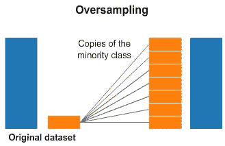
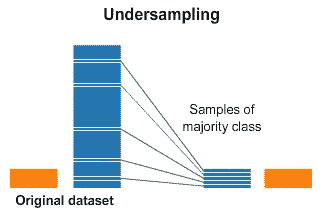

# 机器学习中处理不平衡数据的 5 种技巧

> 原文：<https://towardsdatascience.com/5-techniques-to-work-with-imbalanced-data-in-machine-learning-80836d45d30c?source=collection_archive---------10----------------------->

## 处理不平衡数据集的基本指南


图片来自 [Pixabay](https://pixabay.com/?utm_source=link-attribution&amp;utm_medium=referral&amp;utm_campaign=image&amp;utm_content=2178566) 的[像素](https://pixabay.com/users/pexels-2286921/?utm_source=link-attribution&amp;utm_medium=referral&amp;utm_campaign=image&amp;utm_content=2178566)

对于分类任务，可能会遇到目标类标签在各个类之间分布不均匀的情况。这种情况被称为不平衡的目标类。对不平衡数据集进行建模是数据科学家面临的一个主要挑战，因为由于数据中存在不平衡，模型会偏向多数类预测。

因此，在模型训练之前，处理数据集中的不平衡是至关重要的。在处理不平衡数据时，需要记住各种事情。在本文中，我们将讨论各种处理类不平衡的技术，以训练一个健壮的和非常适合的机器学习模型。

```
***Checklist:***
**1) Upsampling Minority Class
2) Downsampling Majority Class
3) Generate Synthetic Data
4) Combine Upsampling & Downsampling Techniques 
5) Balanced Class Weight**
```

在讨论上述 5 种技术之前，让我们集中精力为不平衡的数据集任务选择正确的指标。选择一个不正确的度量标准，如准确性，看起来表现不错，但实际上偏向于多数类标签。性能指标的替代选择可以是:

*   AUC-ROC 评分
*   精确度、召回率和 F1 分数
*   TP、FP、FN、TN 可视化的混淆矩阵

在为您的案例研究选择了正确的指标之后，您可以使用各种技术来处理数据集中的不平衡。

# 1.)上采样少数类:

上采样或过采样是指创建人工或复制数据点或少数类样本以平衡类标签的技术。有多种过采样技术可用于创建人工数据点。



([来源](https://www.kaggle.com/rafjaa/resampling-strategies-for-imbalanced-datasets))，过采样插图

> 阅读下面提到的文章，更好地理解 7 种过采样技术:

</7-over-sampling-techniques-to-handle-imbalanced-data-ec51c8db349f>  

# 2.)下采样多数类:

下采样或欠采样指的是移除或减少大部分类别样本以平衡类别标签。imblearn 包中实现了各种欠采样技术，包括:

*   随机欠采样
*   Tomek 链接
*   近似采样
*   ENN(编辑最近的邻居)

还有很多。



([来源](https://www.kaggle.com/rafjaa/resampling-strategies-for-imbalanced-datasets))，欠采样插图

> 按照 imblearn 文档获取上述每种技术的实现:

<https://imbalanced-learn.org/stable/references/under_sampling.html>  

# 3.)**生成合成数据:**

不推荐使用欠采样技术，因为它会移除大多数类数据点。生成少数样本的合成数据点是一种过采样技术。其思想是在少数类样本的邻近区域或邻域中生成少数类样本的合成数据点。

SMOTE(合成少数过采样技术)是一种流行的合成数据生成过采样技术，它利用**k-最近邻**算法来创建合成数据。

SMOTE 有多种变体，包括:

*   SMOTENC:连续和分类特征的 SMOTE 变量。
*   SMOTE:只有分类特征的数据的 SMOTE 变量。
*   边界 SMOTE:将使用边界样本生成新的合成样本。
*   SVMSMOTE:使用 SVM 算法来检测样本，以用于生成新的合成样本。
*   KMeansSMOTE:在使用 SMOTE 进行过采样之前，使用 k 均值聚类进行过采样。
*   自适应合成(ADASYN):类似于 SMOTE，但它根据要过采样的类的局部分布的估计生成不同数量的样本。

> 按照 [Imblearn 文档](https://imbalanced-learn.org/stable/references/generated/imblearn.over_sampling.SMOTE.html)执行上述 SMOTE 技术:

# 4.)结合过采样和欠采样技术:

不推荐使用欠采样技术，因为它会移除大多数类数据点。过采样技术通常被认为比欠采样技术更好。其思想是将欠采样和过采样技术结合起来，以创建适合模型训练的稳健平衡数据集。

其思想是首先使用过采样技术来创建重复和人工数据点，并使用欠采样技术来去除噪声或不必要的生成数据点。

Imblearn 库实现了组合过采样和欠采样技术，例如:

*   **Smote-Tomek** : Smote(过采样器)结合 TomekLinks(欠采样器)。
*   **Smote-ENN** : Smote(过采样器)结合 ENN(欠采样器)。

> 按照 [Imblearn 文档](https://imbalanced-learn.org/stable/combine.html)执行 Smote-Tomek 和 Smote-ENN 技术。

# 5.)平衡级重量:

欠采样技术移除了导致数据丢失的多数类数据点，而上采样创建了少数类的人工数据点。在机器学习的训练过程中，可以使用`**class_weight**` 参数来处理数据集中的不平衡。

Scikit-learn 为所有机器学习算法提供了`**class_weight**`参数。

*   **类别权重—平衡**:类别权重与输入数据中的类别频率成反比。

```
*Computation Formula:*
**n_samples / (n_classes * np.bincount(y))**
```

*   **{class_label: weight}** :假设，目标类标签为 0 和 1。将输入作为 **class_weight={0:2，1:1}** 传递意味着类 0 的权重为 2，类 1 的权重为 1。

# 结论:

在训练稳健模型时，数据中类别不平衡的存在可能是一个主要挑战。上述技术可用于在训练机器学习模型之前处理类别不平衡。

还可以采用成本敏感学习或惩罚增加多数类分类成本的算法。此外，决策树和随机森林应该优先于其他机器学习算法，因为它们往往在不平衡的数据上表现良好。

# 参考资料:

[1.] Imblearn 文档:[https://imbalanced-learn.org/stable/index.html](https://imbalanced-learn.org/stable/index.html)

*喜欢这篇文章吗？成为* [*中等会员*](https://satyam-kumar.medium.com/membership) *继续无限制学习。如果你使用下面的链接，我会收到你的一小部分会员费，不需要你额外付费。*

<https://satyam-kumar.medium.com/membership>  

> 感谢您的阅读