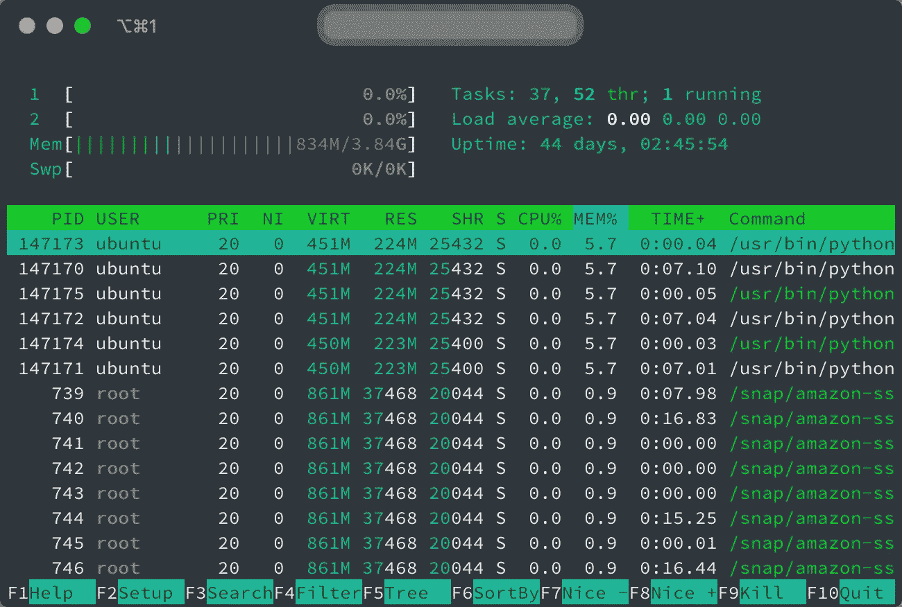
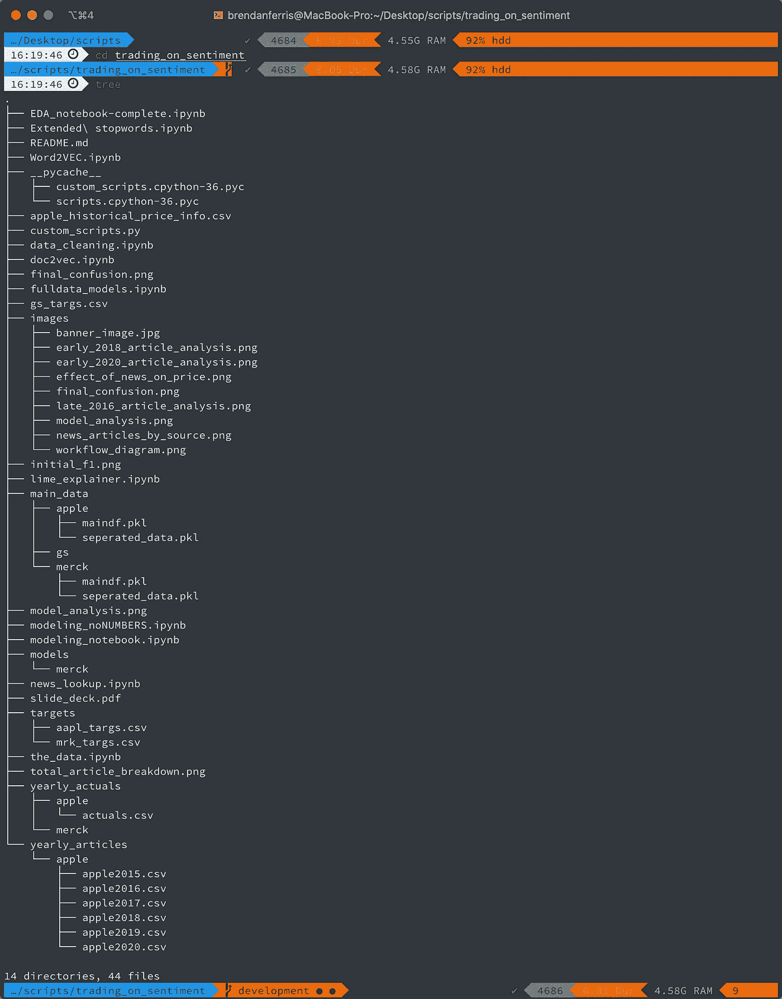
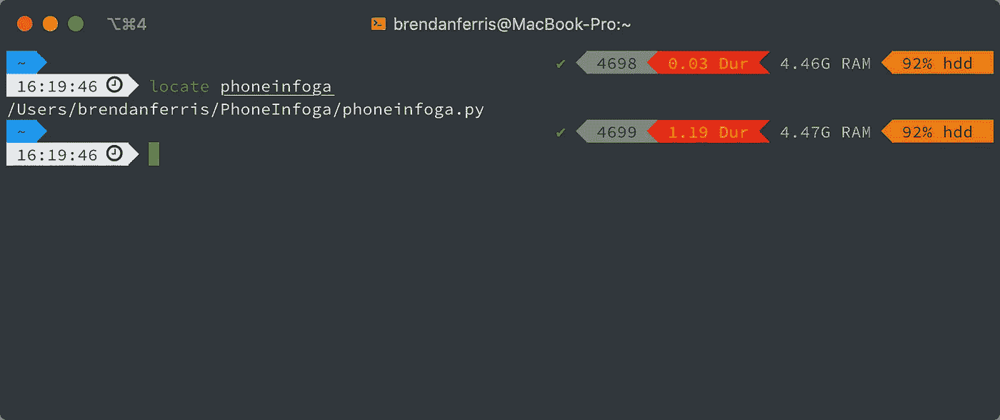
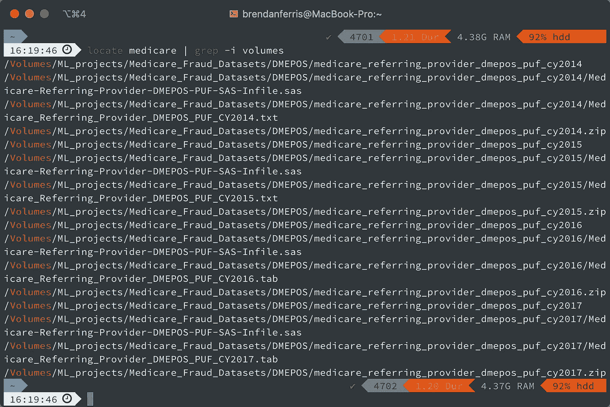

# 5 个终端命令，让您的生活变得更加轻松。

> 原文：<https://towardsdatascience.com/5-terminal-commands-that-make-your-life-a-little-easier-1370a5536ffd?source=collection_archive---------21----------------------->


[杰弗逊·桑托斯](https://unsplash.com/@jefflssantos?utm_source=medium&utm_medium=referral)在 [Unsplash](https://unsplash.com?utm_source=medium&utm_medium=referral) 上拍摄的照片

当我第一次在我的电脑上使用命令行时，它看起来令人困惑，而且技术含量低。这让我回到了少年时代，在老式的 POS 系统中输入代码，或者在过时的公司内部网中查看库存。虽然这些技术看起来过时了，但它们很实用。随着我对终端越来越熟悉，我很快意识到它不仅仅是功能性的，它暴露了许多小程序，你可以用它们来与计算机交互，解决问题，甚至以复杂的方式链接在一起。以下是我发现自己最常用的一些程序的分类。

## [htop](https://htop.dev/downloads.html)

Unix 机器附带了内置的命令行程序`top`，它允许您查看系统上当前运行的进程的实时分解。这是 1984 年发行的经典节目。2004 年， [Hisham Muhammad](https://hisham.hm/about) 发布了`htop`(`h`指的是他的首字母缩写)与`top`相似，但有更好的用户界面和一些附加功能。使用`htop`,你可以水平和垂直滚动，以不同的格式查看进程(例如，一个树形视图),用户界面有一个彩色输出，这看起来微不足道，但对可读性有很大帮助。唯一的缺点是`htop`没有预装在您的机器上，需要使用以下命令下载:

```
apt-get install -y htop
```

或者在 Mac 上使用 brew

```
brew install htop
```



htop 用户界面

## [树](http://mama.indstate.edu/users/ice/tree/)

`tree`命令预装在 Linux 上，是我在为项目存储库编写文档时经常使用的一个方便的工具。它从运行命令的文件夹开始递归地遍历文件系统。因此，如果您在 base ~ filesystem 文件夹中键入`tree`，那么该命令将遍历整个文件路径，显示文件夹和文件名。此命令需要安装在 Mac 上:

```
brew install tree 
```

以下是在小文件夹中运行时的输出示例:



mac 上的树命令输出

## [wikit](https://github.com/KorySchneider/wikit)

我花在打开浏览器窗口、浏览维基百科和执行搜索上的时间是巨大的。但是有时候，我真的只想读一小段摘要介绍。`Wikit`是一个用于 linux 的命令行工具，它返回维基百科文章的介绍性段落。每当我使用 linux 时，我都喜欢快速查阅资料。

## [定位](https://osxdaily.com/2011/11/02/enable-and-use-the-locate-command-in-the-mac-os-x-terminal/)

顾名思义，`locate`在文件系统中搜索一个搜索项，并返回结果的完整路径。我发现自己经常使用它，因为它比点击文件夹寻找东西要快得多，如果它返回多个输出，你可以通过管道把它输入到`grep`来改进搜索。



假设我想找到所有带有“medicare”字样的文件，并且我知道它们必须在特定的文件夹中(或者在我的情况下，在可移动卷上)。我可以使用下面的语法来过滤`locate`返回的结果:

```
locate medicare | grep -i volumes------locate [file search term]| grep -i [folder]
```



## [咖啡因](https://ss64.com/osx/caffeinate.html)

列表中最有用的命令之一，`caffeinate`让你的电脑保持清醒。市场上有许多 GUI 程序实现了同样的目标，但是有了 caffeinate，你可以做一些事情，比如在特定进程运行时让你的计算机保持清醒，然后停止阻止你的计算机睡眠。以下命令使我的计算机保持 100 秒的清醒状态。


这个命令在 Mac 和 Linux 计算机上都可用，并且对于模型训练或 web 抓取之类的事情特别有用，在这些事情中，您可能有一个通宵运行的过程。

希望您已经了解了一些新的命令，现在您可以在日常工作中部署这些命令。欢迎在下面用你最喜欢的命令行程序发表评论！

快乐编码:)

查看我的[网站](https://brendanferris.com)！