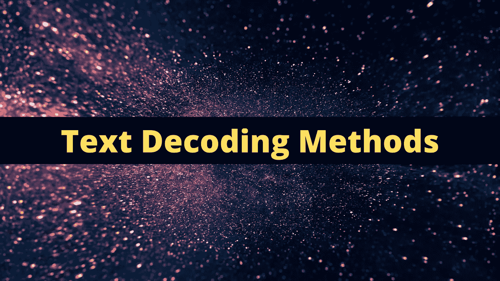
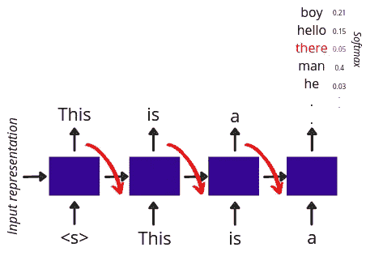
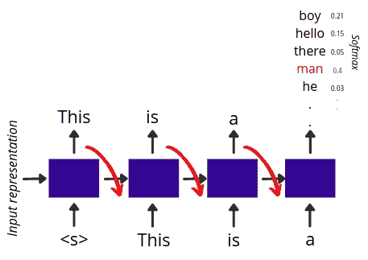
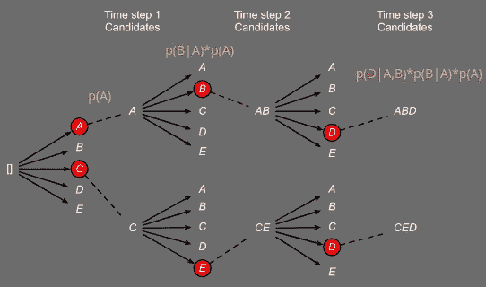
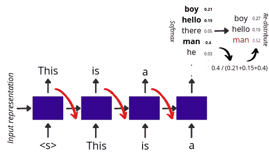
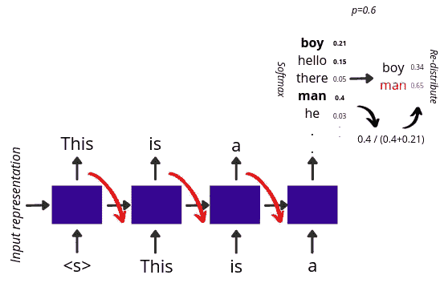

# 每个“NLP 爱好者”都必须知道的 5 种文本解码技术

> 原文：<https://towardsdatascience.com/5-text-decoding-techniques-that-every-nlp-enthusiast-must-know-6908e72f8df9?source=collection_archive---------9----------------------->

## 可视化自然语言处理中流行的文本解码方法

来自[源](https://unsplash.com/photos/W8KTS-mhFUE)的修改图像

自动文本生成系统的最终目标是**生成和人类书写文本一样好的文本**。在 NLP 中，生成任务背后的核心思想是关于生成特定于特定上下文和约束的文本，其中一些是文本摘要、语言翻译、语音到文本等。一旦模型在这些任务中的任何一个上被训练，离散单元的**质量以及最终模型生成的序列取决于人们采用的解码策略**。这些技术各有利弊。

在这篇博客中，我们将介绍一些流行的文本采样技术，如随机采样、贪婪采样、波束搜索、top-k 采样和 top-p 采样。

随机抽样技术|作者图片

在**随机抽样中，**想法非常简单，在生成过程中的每个时间步 *(t)* ，我们根据在整个词汇表的每一步生成的条件概率分布抽样一个**随机单词。这种技术可以被认为是我们将在这个博客中讨论的所有技术中最不稳定的一种。下图*显示了同一—* 的图示**

序列到序列设置中的随机解码|作者图片

贪婪解码技术|作者图片

在**贪婪解码**中，在生成过程中的每一个时间步 *(t)* ，我们选择具有最高条件概率的**字。因为采样不允许任何随机性，所以在模型权重冻结后，该方法默认为**确定性的**。当目的是生成一个短序列时，它工作得相当好。然而，当生成更长的序列时，这种方法会陷入循环，最终生成冗余的序列。**

*下图显示了同一产品的图示视图—*

序列到序列设置中的贪婪解码|作者图片

波束搜索技术|作者图片

在**波束搜索中，**的想法是在生成文本的同时对一个**高似然序列**进行采样。为此，我们定义了所谓的波束大小(B ),它基于在生成阶段的上一步中选择的单元，在每个时间步长(t)对 Top-B 单元进行采样。这样，如果我们要生成一个 5 个单词的序列，那么我们将得到 3⁵序列，我们从中选择并返回一个具有最大可能性的序列作为我们的最终序列。同样根据[的这项研究](https://www.youtube.com/watch?v=dCORspO2yVY)，作者发现当生成的序列很短并且不是开放式的时，波束搜索工作得很好。

下面的*图像显示了同一—* 的图示视图

光束搜索技术|来自[源](https://d2l.ai/chapter_recurrent-modern/beam-search.html)的修改图像

*图示为光束搜索的工作方式。*假设 ABD 和 CED 是模型生成的可能性值最高的两个序列。最后，返回具有较高值的值。

Top-k 采样技术|图片由作者提供

在 **top-K 采样**中，在生成过程中的每一个时间步长 *(t)* ，我们首先根据该时间步长生成的条件概率分布对 **top-k 最可能的单词**进行采样。我们**只在那些前 k 个单词中重新分配概率质量**，并最终基于条件概率从该集合中选择一个**随机单词。这里，随机性是基于 k 的选择而引入的，它有助于在每一代中试验和输出不同但相关的序列。另外，**对于 k=1，这种技术的表现类似于贪婪解码**。**

*下图显示了同一产品的图示视图—*

序列到序列设置中的 Top-k 解码|图片由作者提供

*图示为 k=3 时 top-k 的工作情况。根据概率，“男孩”、“你好”和“男人”这三个词排在我们的前三名。随后我们在那个集合中重新分配那些概率，并最终做出我们的选择。*

细胞核取样技术|作者图片

在 **top-p sampling 中，又称核采样，在生成过程中的每个时间步 *(t)* 中的**，我们生成一个累计概率超过概率质量 P 的**小词子集。然后在这个集合中重新分配概率**，最后，我们基于概率**从那个集合中选择一个**随机词。top-p 采样允许我们结合 top-p 字的动态大小窗口的概念，不像 top-k 为每一步固定 k 的大小。****

**下图*显示了同一—* 的图示视图**

****

**序列到序列设置中的 Top-p 解码|图片由作者提供**

***图示为 p=0.6 时 top-p 的工作情况。*单词‘男孩’和‘男人’的概率和超过阈值概率质量 0.6。我们选择这两个词，用重新分配的概率创建一个后续集，并最终做出选择。**

# **结论**

**在上面讨论的所有解码技术中，没有一个工作得最好的硬性规则。这完全取决于您的特定用例**，您是希望有可能的和可预测的单词序列，还是希望模型在生成时勇敢而有创造性**。一般来说，对于像故事生成、诗歌生成等用例*(生成有趣句子的可能性是无穷无尽的)*你可能想要尝试 Top-p 或 Top-k，对于像翻译这样的用例*(对于如何将给定的句子翻译成目标语言没有太大的变化)*你可能想要尝试 Beam search。你也可以摆弄 softmax 的**温度值，通过将温度值设置为接近 0，并在此之后应用上述技术，使分布更加偏斜，在某种意义上也更有把握。****

*****对 NLP 感兴趣？然后你可能会想看看我的***[***YouTube 频道***](https://www.youtube.com/channel/UCoz8NrwgL7U9535VNc0mRPA/) ***在那里我解释了 NLP 论文和概念:*****

**我希望你喜欢读这篇文章。如果你愿意支持我这个作家，可以考虑报名[成为](https://prakhar-mishra.medium.com/membership)中的一员。每月只需 5 美元，你就可以无限制地使用 Medium。谢谢！**

**这里有一些你可能会感兴趣的帖子**

**</8-types-of-sampling-techniques-b21adcdd2124>  <https://medium.com/mlearning-ai/10-popular-keyword-extraction-algorithms-in-natural-language-processing-8975ada5750c>  </5-outlier-detection-methods-that-every-data-enthusiast-must-know-f917bf439210> **