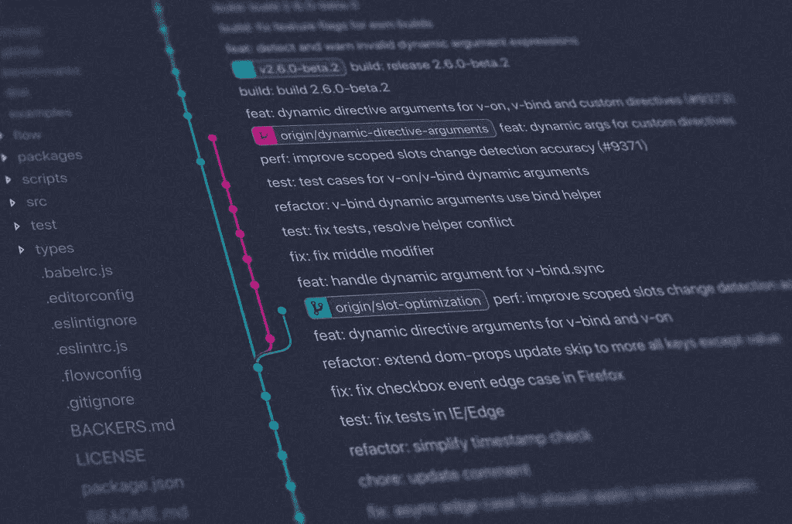

# 成为数据科学家之前我希望知道的 5 件关键事情

> 原文：<https://towardsdatascience.com/5-things-i-wish-i-knew-before-becoming-a-data-scientist-607021520be5?source=collection_archive---------11----------------------->

## 在我的数据科学职业生涯中，我后悔没有早点做的事情。

科林·哈迪在 [Unsplash](https://unsplash.com?utm_source=medium&utm_medium=referral) 上的照片

# 介绍

在我的数据科学生涯中，有很多事情我后悔没有早点做。特别是，有些事情如果我早点开始做，会对我的工作产生重大影响。

因此，为了帮助其他人避免同样的错误，下面是我后悔在成为数据科学家之前不知道的 5 件事。

*除了阅读这篇文章，你还可以看看我在 YouTube 上关于这个话题的视频。*

# 早点学会编码

沙哈达特·拉赫曼摄

在今天的数字世界中，学习编码是最有价值的技能之一。如果你想从事科技行业，这一点尤为重要。

对于数据科学家来说，不会编码就很难创造价值。能够编码让你将理论和模型付诸实践。一个不能创造价值的数据科学家——至少从商业角度来看——不是一个非常好的数据科学家。

如果你像我一样，后来才更认真地对待编程，那么即使是学习基础知识也会感到力不从心。坏习惯会随着时间的推移而发展，主要是因为从一开始就不知道如何正确编码。

现在，我不是说数据科学家需要像软件开发人员一样编码。根据我的经验，数据科学在编码技能要求方面有相当大的余地。当然，学习足够的代码来完成数据科学基础知识是可能的，例如在笔记本上进行探索性的数据分析。尽管如此，我认为能够理解并实现更高级的编码实践是非常有价值的。

最近，我一直在读 Alfredo Deza 和 Noah Gift 的《实用手册》。MLOps 的兴起证明了我们需要将软件开发实践与机器学习结合起来。很明显，企业需要能够将数据科学家创建的模型自动化、测试和部署到生产中。

即使我永远也不会写出令人惊叹的代码投入生产，能够阅读和理解更复杂的代码仍然很棒。如果我早些时候正确地学会了编码，那么总的来说，它会给我一个更好的基础。

如果你感兴趣，你可以看看这个视频,我在视频中谈到我将如何为数据科学重新学习 Python。

# 学会喜欢统计学

克里斯·利维拉尼摄

我很肯定大多数人会同意统计学是一门有用的学科。然而，对统计学有真正兴趣和热情的人呢？从我的经验来看，肯定没有这么多。

从高层次来说，统计就是做出明智的决策。这是一个让我们远离偏见的工具，我们经常成为偏见的受害者。如果数据科学家要推动业务关键决策，这一点极其重要。

在学术界学习和“应用”统计学给了我一个负面的印象。直到我开始学习并使用它来理解机器学习算法，我才渐渐喜欢上它。

只要你详细描述了你的所有步骤，在课程作业中做出稍微错误的结论并没有那么糟糕，因为学术界的通常目标是最大化分数。然而，由于潜在的财务影响，与传统学术界相比(除非你是一名学术研究人员),在商业环境中进行的统计似乎更有“分量”。

例如，如果我把更多的精力放在学习像时间序列分析这样的常用方法上，我会更容易重新掌握。相反，我现在不得不在没有教授帮助的情况下从头开始努力学习。

在数据科学中，你要么喜欢统计学，要么学会喜欢统计学。没有真正的解决办法。

# 不要过度模仿机器学习

阿瑟尼·托古列夫摄

近年来，人们非常容易陷入过度宣传机器学习的陷阱。我以前没有意识到这一点，媒体和营销是主要原因。

最终，如果你把它分解，机器学习只是以智能算法的方式应用于机器的统计数据。

例如，我看到有人将线性回归称为“机器学习技术”——而实际上，线性回归是建模最基本、最常用的统计工具。人们需要在某个地方划清界限，将基本统计学重新贴上“机器学习”的标签变得越来越普遍。

在我看来，机器学习有两个方面:一是工程方面，它更专注于将模型部署到生产中，并使用更多的软件开发实践；然后是建模方面，数据科学家确保模型按预期工作，并回答业务问题。

除非你的目标是成为一名机器学习工程师，否则你很可能会从事建模方面的工作。因此，熟悉统计是必须的，过度使用机器学习可能会让你不小心跳过作为数据科学家所需的基础知识。

# 技术细节的价值

照片由 Dmitry Demidko 拍摄

作为一个喜欢讨论项目技术细节的人，我花了一段时间才意识到大多数人根本不在乎。

我有一种很好的感觉，这是由于多年在学术界度过的时光。为了在学校取得成功，你需要展示你的作品，这样你就可以得到分数以获得更高的分数。

不幸的是，现实世界中的大多数人，尤其是那些有影响力的人，更关心结果而不是技术细节。数据科学家的角色本质上是通过将数据翻译成通俗易懂的语言来帮助利益相关者做出最佳决策。

但这并不是说技术细节不重要。相反，优先考虑的应该总是价值第一，其次才是技术细节。

我喜欢把这比作销售产品。营销人员首先关注价值，展示购买和使用他们的产品后，你的生活会发生怎样的变化。一旦你迷上了，你可以以后再研究细节。没有人会在展示他们的产品所能提供的价值之前展示细节。

# 带文档的版本控制

Yancy Min 摄

我从未对我的项目进行版本控制，直到我意识到跟踪大型项目中的变更是多么令人困惑。

我认识的大多数人都没有对他们的项目进行版本控制。唯一这样做的人已经熟悉了软件开发实践。

和我的大多数朋友一样，当年我使用 GitHub 上传我完成的项目，向雇主“展示”它们。只有一个“初始提交”，没有正确的自述文件。

我当时不知道的是，大多数雇主并不关心一个没有用文档进行适当版本控制的项目。

雇主希望看到随着项目的发展，你知道如何正确使用 Git。这是因为当与其他团队成员一起处理一个项目时，经常会用到版本控制。此外，它通常用于项目的持续开发和集成

他们还希望看到你知道如何通过文档向公众传达你的项目。这确保了每个人——无论是否在你的团队中——都知道如何使用这个项目。

如果我从一开始就对我的早期项目进行了适当的版本控制，我将有更多的工作要展示，而不仅仅是已经完成的项目的“初始提交”上传。即使没有人注意到它们，知道如果你破坏了一些东西，你可以很容易地将一个更改回滚到一个旧的版本，这仍然是有好处的。

# 结论

希望我的经历能给你一些方向，让你知道应该关注什么。还有很多遗憾我没有在这里列出来，但就像生活一样，如果我们当时没有开始，我们唯一能做的就是现在开始。

如果你喜欢这篇文章，你可以在 Medium 上关注我(我正试图发布更多)，或者你可以在 YouTube 上查看我的其他视频。如果你想通过电子邮件了解我在做什么，你可以考虑注册我的[简讯](https://leonlok.co.uk/newsletter/)！

*原载于 2021 年 12 月 12 日*[*【https://leonlok.co.uk】*](https://leonlok.co.uk/blog/5-things-i-wish-i-knew-before-becoming-a-data-scientist/)*。*