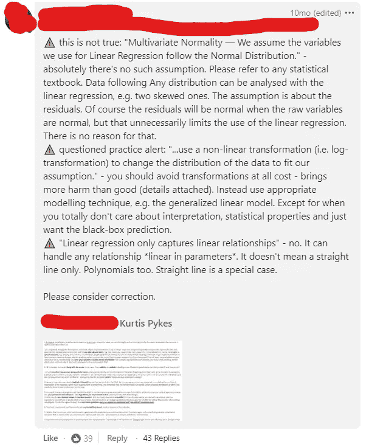

# 如果我必须重新学习机器学习，我会告诉自己的 5 件事

> 原文：<https://towardsdatascience.com/5-things-id-tell-myself-if-i-had-to-learn-machine-learning-all-over-again-3feeb31a9b55?source=collection_archive---------17----------------------->

## 从我的经历中吸取的教训

照片由[娜塔莎·霍尔](https://unsplash.com/@ideanaire?utm_source=medium&utm_medium=referral)在 [Unsplash](https://unsplash.com?utm_source=medium&utm_medium=referral) 拍摄

我离我在机器学习领域的职业目标还很远，但我对自己的进步感到非常自豪。从足球到邮件室，现在是机器学习——太棒了！

昨天(周六)，我有机会与一些刚刚开始数据科学和机器学习职业生涯的了不起的人分享我的旅程，这真的迫使我思考。以我现在仅有的一点知识，我会对自己说些什么呢？退一步说，这是一个重要的问题，也是一个对初学者非常有价值的问题。

没有进一步的 adoo…

## #1 学习基础知识——不要害怕犯错

我永远不会忘记我分享一篇文章的那一天，这篇文章详细介绍了从零开始的线性回归。虽然我现在已经对文章做了必要的修改，但起初，我在文章中对线性回归做了一些非常错误的假设，LinkedIn 上的统计警察(其中一些人现在已经成为了我的好朋友)很快就盯上了我。

回应我关于线性回归的文章；**作者图片**

你可以想象，这对我是毁灭性的。不是因为我犯了错误，而是因为我在**线性回归上犯了错误。在图片中的人发表评论后，他的订阅源中的一大群人开始评论、诋毁博客，并说一些可能被认为是令人沮丧的话。**

尽管如此，我还是联系了那个留下修改意见的人，感谢他对我的帮助，但令我惊讶的是，他非常抱歉，并不断试图让我放心，他不是有意以任何方式或形式叫我出去。

这是我第一次因为我在机器学习方面所做的工作而受到批评，但那次遭遇改变了我对两个关键问题的看法，这两个问题改变了我学习和工作的方式；

1.  是的，有一些混蛋想要打倒你，但是一般来说，当你犯错误时纠正你的人只是因为他们想让你变得更好。
2.  总是使用可靠的来源做适当的研究。我记得我写文章的那一天，我只是想把它完成，我用我能找到的任何东西来帮助我的研究。它非常缓慢，这在我的写作中表现出来。

我在观念上的小小转变帮助我更大胆地做我正在做的事情。我不再害怕犯错，因为我知道，如果我做了，1)我不会死，2)会有人检查我，并把我引上正确的道路。然而，这并没有让我变得懒惰，因为我仍然高度重视分享可靠和有价值的内容。

## #2 从零开始构建事物

直到 2020 年我被裁员，我才开始重新发明轮子——那是我第一次做实习生将近一年的时间。有了所有令人惊叹的机器学习框架，比如 Scikit-Learn，让所有的机器学习看起来像一个黑盒真的很容易，我已经这样做了很长时间——我所做的只是调用`fit`和`predict`。

由于我能够使用包来实现机器学习算法，我有一种错误的理解感——当我不得不写线性回归文章时，这一点明显暴露出来。另一个让我表现出无能的场景是，当我的非技术部门经理看着我正在做的一些工作，问我“决策树是如何决定价值分割的？”

我完全被难住了。

你知道这句话“如果你不能向一个 5 岁的孩子解释，你就不明白”。嗯，我无法向一个 30 岁的人解释，所以这里有一些大问题。

尽管如此，我开始使用必要的算法，但我发现当我从头开始编写算法时，我的理解成倍增长。

<https://github.com/kurtispykes/ml-from-scratch>  

## #3 让好奇心引领

最初，我习惯于让我对工作的绝望主导。我是如此渴望得到一份工作，以至于我会说“我应该做什么项目才能得到一份工作？”—听起来熟悉吗？想要在这个领域找到一份工作绝对没有问题，但是当它影响了你的判断时，就不是你的好奇心在引导你了。是绝望。

> 我相信我们内心深处都有一个指南针，它会告诉我们，如果我们追随自己的好奇心，应该走哪条路。只有当我们开始通过逻辑上试图确定最佳路线来干扰路径时，我们的判断才会变得模糊。

被好奇心所引导意味着你会跟随你内心的想法去做。对我来说，从前这意味着学习深度学习的基础知识，然后是学习一些关于自然语言处理的东西，现在是关于将机器学习模型投入生产——当然，你不会在一夜之间成为专家，这需要你付出大量的努力。

</the-most-important-data-science-project-458d016ef8a6>  

## #4 亲自动手

当你第一次开始学习机器学习时，很容易成为概念上符合标准的人，这意味着你可以谈论正在发生的一切。当涉及到事情的实际方面时，问题就出现了，这是一种完全不同的情况。我是这种模式的罪魁祸首。

我非常专注于将事物概念化，并认为这足以让我有能力应用它们，但这与事实相去甚远。如果我能把我现在学到的东西作为一个初学者对自己说，我会告诉自己的第一件事就是应用，然后马上学习我已经应用了什么——杰瑞米·霍华德称之为自上而下的方法。

## #5 有一个无关的爱好

我无关的爱好是健美操；公平地说，我一直有一个不相关的爱好，但我从未认真对待我的爱好，因为我认为它会干扰我成为数据专业人员的热情。例如，我不会尝试学习新的体重动作，因为我觉得我会牺牲太多的时间，或者我不会去健美操公园，因为我不想让人们认为我是健美操运动员——这听起来很愚蠢，但在当时是有意义的。

数据科学、机器学习、数据工程等。这些都是非常密集的任务，需要你发挥你的脑力。拥有一种分离的方式可以让你的大脑以同样的方式恢复，在一次高强度的锻炼后休息可以让你撕裂的肌肉在修复中生长。

当我开始通过自由地做健美操和学习我想学的任何东西来让自己放松时，我不仅更喜欢它，而且我发现花时间做一些与数据完全无关的事情让我增强了学习和成长的能力，结果我变得更快乐了。

## 包裹

总结一下，我会对自己说，重要的是不要把学习机器学习、数据科学等当成目的地(例如，“学习 X 需要多长时间？”).相反，把你的职业生涯想象成一次旅行，通过学习新事物、结识新朋友和体验新事物，你会不断提升自己。

感谢您的阅读！

如果你喜欢这篇文章，请通过订阅我的**[每周简讯](https://mailchi.mp/ef1f7700a873/sign-up)与我联系。不要错过我写的关于人工智能、数据科学和自由职业的帖子。**

## **相关文章**

**</5-laws-for-self-taught-data-professionals-4bf351ac5c24>  </dont-waste-time-building-your-data-science-network-2c336690dee4> **