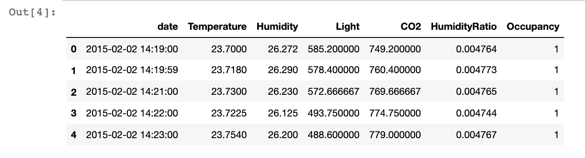
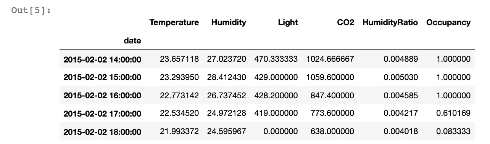
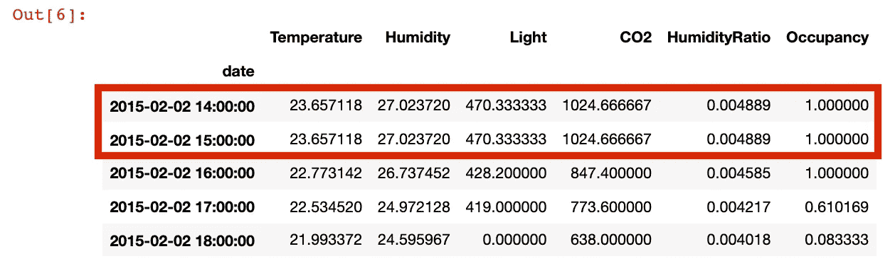
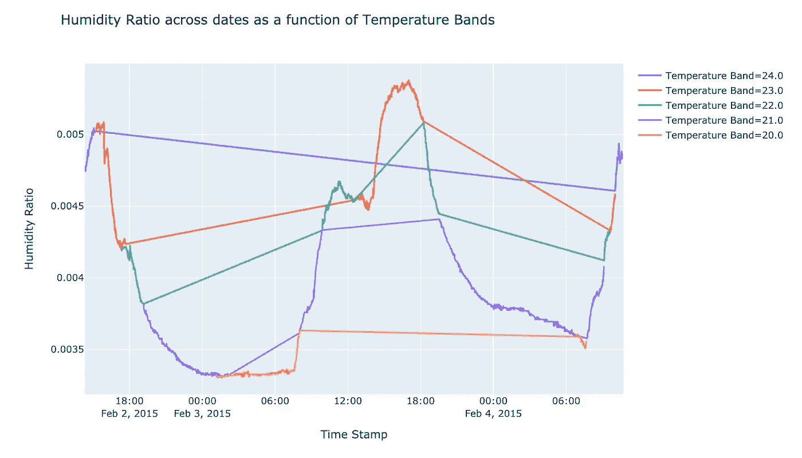
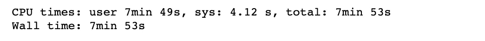
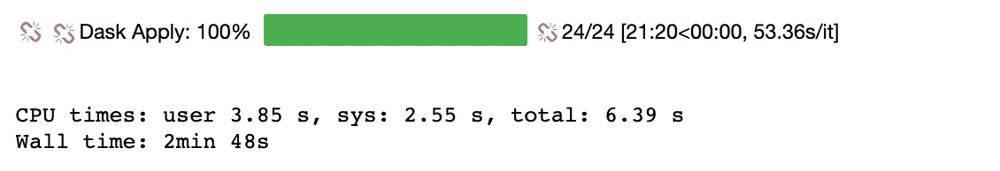
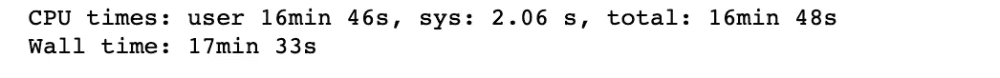
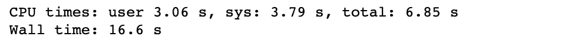

# 让我作为数据科学家的工作更轻松的 5 件事

> 原文：<https://towardsdatascience.com/5-things-that-make-my-job-as-a-data-scientist-easier-dc0820f0f136?source=collection_archive---------1----------------------->

## [办公时间](https://towardsdatascience.com/tagged/office-hours)

## 在作为一名数据科学家工作了一年之后，我在这里分享我一路走来学到的一些东西，我觉得这些东西很有帮助，并且提高了我的效率。希望这些建议能对你的旅程有所帮助:)


[博伊图梅洛·菲特拉](https://unsplash.com/@writecodenow?utm_source=medium&utm_medium=referral)在 [Unsplash](https://unsplash.com?utm_source=medium&utm_medium=referral) 上的照片

1.  **熊猫的时间序列数据处理**

如果您使用时间序列数据，那么您可能已经花费了大量的时间来计算缺失的记录，或者通过 SQL 查询或编写自定义函数以特定的时间粒度来聚合数据。Pandas 有一个非常高效的[重采样函数](https://pandas.pydata.org/pandas-docs/stable/reference/api/pandas.DataFrame.resample.html)，它可以帮助您以特定的频率处理数据，只需将 DataFrame 索引设置为时间戳列。

我将使用房间占用率数据集来举例说明这个函数。你可以在这里找到数据集。这个数据集记录了分钟级别的观察结果。

```
import pandas as pd
data = pd.read_csv('occupancy_data/datatest.txt').reset_index(drop = True)
data.head(5)
```



首先，我展示了一个简单的聚合，可以每小时获取一次指标。

```
data.index = pd.to_datetime(data['date'])
pd.DataFrame(data.resample('H').agg({'Temperature':'mean',
                                     'Humidity':'mean',
                                     'Light':'last',
                                     'CO2':'last',
                                     'HumidityRatio' : 'mean',
                                     'Occupancy' : 'mean'})).head(5)
```



尽管这个数据集并不稀疏，但在现实世界中，人们经常会遇到缺少记录的数据。考虑这些记录很重要，因为如果没有记录，您可能希望输入 0 值，或者使用上一个或下一个时间步长进行插补。下面，我删除了第 15 小时的记录，以展示如何使用第 14 小时的时间戳来估算缺失值:

```
data = pd.read_csv('occupancy_data/datatest.txt').reset_index(drop = True)data_missing_records = data[~(pd.to_datetime(data.date).dt.hour == 15)].reset_index(drop = True)data_missing_records.index = pd.to_datetime(data_missing_records['date'])data_missing_records.resample('H', base = 1).agg({'Temperature':'mean',
        'Humidity':'mean',
        'Light':'last',
        'CO2':'last',
        'HumidityRatio' : 'mean',
         'Occupancy' : 'mean'}).fillna(method  = 'ffill').head(5)
```



2.**通过 Plotly Express 实现快速可视化**

从分析到模型训练到模型报告，经常需要可视化。特别是对于时间序列图，我注意到我花了很多时间试图在 matplotlib 中定制我的 x 轴刻度的大小和角度。在我改用 Plotly Express 后，我减少了大约 70%的制作图表的时间。如果我想在我的视觉效果中实现特定的细节，我仍然可以通过使用 Plotly Graph 对象来实现。此外，Plotly 通过 Express 提供了许多简单的选项，如在绘图中设置组颜色，从而产生更强大的可视化效果。

```
import plotly.express as px
data['Temp_Bands'] = np.round(data['Temperature'])
fig = px.line(data, x = 'date',
              y = 'HumidityRatio',
              color = 'Temp_Bands',
             title = 'Humidity Ratio across dates as a function of
             Temperature Bands',
             labels = {'date' : 'Time Stamp',
                      'HumidityRatio' : 'Humidity Ratio',
                      'Temp_Bands' : 'Temperature Band'})
fig.show()
```

使用上面提到的占用数据集，我使用 Plotly Express 创建了带有颜色分组的线图。我们可以看到只用两个函数创建这些图是多么容易。



3.**通过 Swifter 加速熊猫申请()**

我有时在处理 pandas 列时会遇到很长的等待时间，即使是在有大型实例的笔记本上运行代码。取而代之的是一个简单的单词添加，可以用来加速 pandas 数据框架中的应用功能。人们只需要更快地导入库。

```
def custom(num1, num2):

    if num1 > num2:
        if num1 < 0:
            return "Greater Negative"
        else:
            return "Greater Positive"
    elif num2 > num1:
        if num2 < 0:
            return "Less Negative"
        else:
            return "Less Positive"
    else:
        return "Rare Equal"import swifter 
import pandas as pd
import numpy as npdata_sample = pd.DataFrame(np.random.randint(-10000, 10000, size = (50000000, 2)), columns = list('XY'))
```

我创建了一个 5000 万行的数据帧，并比较了通过更快的 apply()和普通的 apply()处理它所需的时间。我还创建了一个带有简单 if else 条件的虚拟函数来测试这两种方法。

```
%%timeresults_arr = data_sample.apply(lambda x : custom(x['X'], x['Y']), axis = 1)
```



```
%%timeresults_arr = data_sample.swifter.apply(lambda x : custom(x['X'], x['Y']), axis = 1)
```



我们能够将处理时间减少 64.4%，从 7 分 53 秒减少到 2 分 38 秒。

4.**Python 中的多重处理**

虽然我们的主题是降低时间复杂度，但我经常以处理我希望在多个粒度上处理的数据集而告终。在 python 中使用多处理可以帮助我通过利用多个工作者来节省时间。

我使用上面创建的相同的 5000 万行数据框架来演示多处理的有效性。除了这次我添加了一个分类变量，它是从一组元音中选择的随机值。

```
import pandas as pd
import numpy as np
import randomstring =  'AEIOU'data_sample = pd.DataFrame(np.random.randint(-10000, 10000, size = (50000000, 2)), columns = list('XY'))
data_sample['random_char'] = random.choices(string, k = data_sample.shape[0])
unique_char = data_sample['random_char'].unique()
```

我使用了一个 for 循环和 concurrent.futures 中的进程池执行器来演示我们可以实现的运行时减少。

```
%%timearr = []for i in range(len(data_sample)):

    num1 = data_sample.X.iloc[i]
    num2 = data_sample.Y.iloc[i]

    if num1 > num2:
        if num1 < 0:
            arr.append("Greater Negative")
        else:
            arr.append("Greater Positive")
    elif num2 > num1:
        if num2 < 0:
            arr.append("Less Negative")
        else:
            arr.append("Less Positive")
    else:
        arr.append("Rare Equal")
```



```
def custom_multiprocessing(i):

    sample = data_sample[data_sample['random_char'] == \
    unique_char[i]]

    arr = []

    for j in range(len(sample)):
        if num1 > num2:
            if num1 < 0:
                arr.append("Greater Negative")
            else:
                arr.append("Greater Positive")
        elif num2 > num1:
            if num2 < 0:
                arr.append("Less Negative")
            else:
                arr.append("Less Positive")
        else:
            arr.append("Rare Equal")

    sample['values'] = arr

    return sample
```

我创建了一个函数，允许我分别处理每个元音分组:

```
 %%time 
import concurrentdef main():
    aggregated = pd.DataFrame()

    with concurrent.futures.ProcessPoolExecutor(max_workers = 5) as executor:
        results = executor.map(custom_multiprocessing, range(len(unique_char)))if __name__ == '__main__':
    main()
```



我们看到 CPU 时间减少了 99.3%。尽管必须记住小心使用这些方法，因为它们不会序列化输出，因此通过分组使用它们是利用这种能力的好方法。

5.**作为公制的梅斯**

随着使用机器学习和深度学习方法进行时间序列预测的兴起，使用仅仅基于预测值和实际值之间的距离的度量标准**而不是**是必不可少的。预测模型的度量还应该使用时间趋势的误差来评估模型的性能，而不仅仅是时间点的误差估计。输入[平均绝对刻度误差](https://robjhyndman.com/publications/another-look-at-measures-of-forecast-accuracy/)！该指标考虑了如果我们使用随机游走方法(上一个时间戳的值将是下一个时间戳的预测值)时会出现的误差。它将模型的误差与简单预测的误差进行比较。

```
def MASE(y_train, y_test, pred): 

    naive_error = np.sum(np.abs(np.diff(y_train)))/(len(y_train)-1)        
    model_error = np.mean(np.abs(y_test - pred))return model_error/naive_error
```

如果 MASE > 1，则该模型的表现比随机漫步差。MASE 越接近 0，预测模型越好。

在本文中，我们介绍了一些我经常使用的技巧，让我作为一名数据科学家的生活变得更加轻松。评论分享一些你的小技巧吧！我很想了解更多其他数据科学家在工作中使用的技巧。

这也是我的第一篇媒体文章，我觉得我在对虚无说话，所以如果你有任何反馈要分享，请随时批评和联系:)