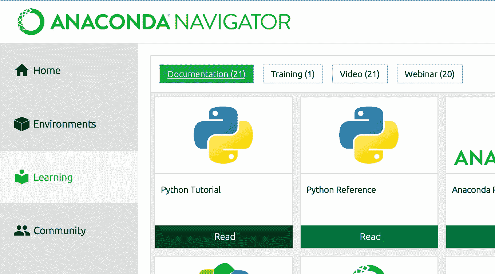
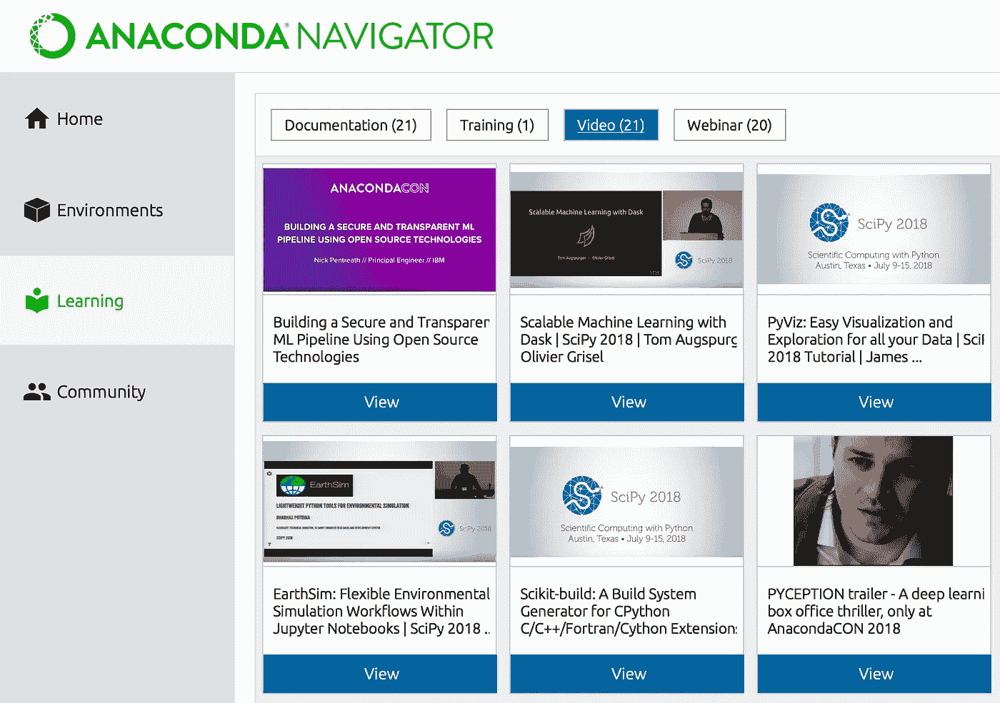
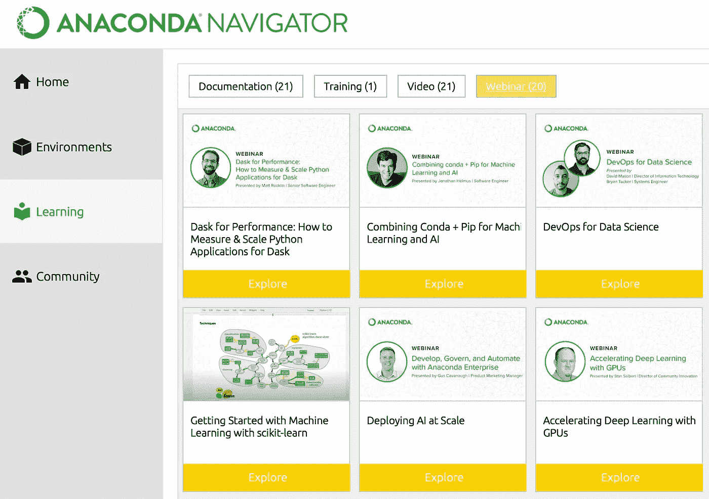
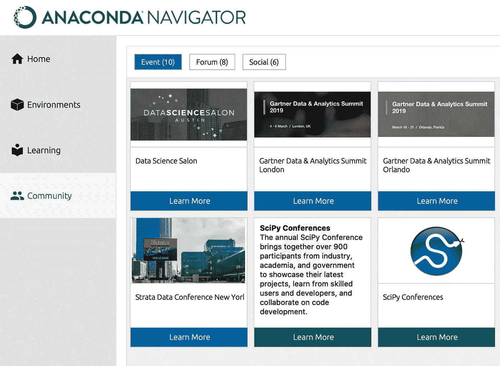
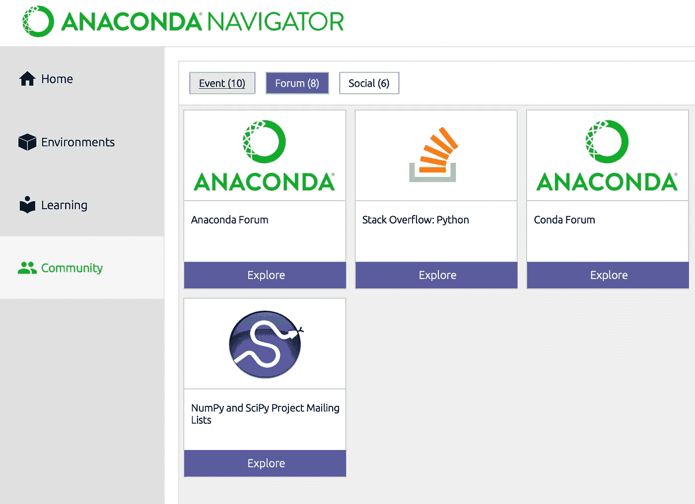

# Anaconda Navigator 有 5 样你不知道的东西

> 原文：<https://towardsdatascience.com/5-things-you-didnt-know-anaconda-navigator-had-a09ad3080cdd?source=collection_archive---------27----------------------->

## 意见

## 深入探讨这一流行的数据科学平台的特性和优势。


简·kopřiva 在[unsplash](https://unsplash.com/s/photos/anaconda?utm_source=unsplash&utm_medium=referral&utm_content=creditCopyText)【1】上的照片。

# 目录

1.  介绍
2.  Python 培训
3.  视频教程
4.  学习网络研讨会
5.  社区活动
6.  社区论坛
7.  摘要
8.  参考

# 介绍

数据科学家经常使用[Anaconda Navigator](https://www.anaconda.com/products/individual)【2】，其中包含了 JupyterLab、Jupyter Notebook 和 RStudio 等流行且有用的应用程序。通常在这三个应用程序中，我们会停止在这个平台上寻找其他工具。当您离开主页或主页仪表板时，您会看到有`Environments`、`Learning`和`Community`部分。后两个功能是我们可能会错过的，因为它们与编写您自己的即时代码和在主笔记本应用程序中处理您的机器学习算法没有直接关系。然而，它们仍然很重要，可能是你还没有注意到的。我将讨论这些与 Jupyter 笔记本等更受欢迎的功能相一致的功能。其中一些工具可能对刚刚开始职业生涯的数据科学家特别有用，而其中一些工具对更有经验的数据科学家更有益，如下文所示。记住这一点，如果您想了解关于 Anaconda Navigator 平台的五件事情，请继续阅读。

# Python 培训



Python 教程位置。作者截图[3]。

第一个特性是为刚刚开始学习如何编码的数据科学家准备的，或者是为想要更新和提高 Python 技能的数据科学家准备的。也就是说，如果您是更高级的人员，那么请随意进入下一部分，在那里您将找到更多关于数据科学中更复杂的用例的信息。

该功能位于`Learning`选项卡中，然后位于`Documentation`选项卡下。它被命名为' *Python 教程*'，简单来说就是一个“*官方 Python 新手入门指南*”的链接。

本教程涵盖了 Python 的所有主要主题，当您开始将编程语言与统计学和数据科学理论和实践相结合时，了解这些主题至关重要。

> 以下是本教程将涉及的一些主要章节:

*   控制流工具
*   数据结构
*   模块
*   输入和输出
*   错误和异常
*   班
*   虚拟环境和包
*   浮点运算

正如您所看到的，在 Python 的官方指南中有许多您期望看到的主要主题。几乎所有这些都是你在数据科学家的职业生涯中会遇到的事情。除了本教程之外，Anaconda 本身也有专门的 Python 培训，其中他们提到“通过***Anaconda Academy****可以让你的数据科学更上一层楼”。*

# 视频教程



视频教程位置。作者截图[4]。

在菜单的`Learning`部分，您会看到大约有 21 个视频可供选择。这些视频特定于数据科学的某些使用案例。例如，显示的第一个“使用开源技术*构建安全和透明的 ML 管道*”在单击时，将会弹出一个 YouTube 页面。这个例子大约有 36 分钟长。它具体讨论了对抗性鲁棒性工具箱(ART)、深度学习和 Kubeflow 管道。可以看出，这个特性比 Python 初学者指南更高级。无论哪种方式，接触这种类型的数据科学内容或作为数据科学家自己学习都是有益的。

你可能会问自己，为什么不自己在 YouTube 上搜索数据科学视频呢？当然，你可以这样做，但这很有趣，可以让你更加信任这些视频，因为它们是由一个你可能已经在使用的知名数据科学平台推广的。它们也与 Anaconda 的其他工具和特性相关。

> 以下是他们在平台上分享的一些有趣的视频:

*   阿帕奇箭；用于内存分析的跨语言开发平台
*   康达深潜
*   用 Dask 并行化科学 Python
*   PyViz:轻松可视化和探索您的所有数据
*   用于图像分类的深度学习:识别分心驾驶行为

这些主题可能更复杂、更具体、更高级。然而，对于任何数据科学家来说，它们都仍然是很好的资源。

# 学习网络研讨会



网络研讨会地点。作者截图[5]。

类似于`Learning`选项卡的视频部分，该功能允许您查看和学习 Anaconda 赞助的内容，这些内容被标记为网络研讨会。还有大约 20 场这样的网络研讨会，包括各种数据科学主题的视频。

> 以下是一些您有望在该平台上看到的有趣的网络研讨会:

*   使用 GPU 加速深度学习
*   在整个组织中扩展数据科学的最佳实践
*   人工智能治理和安全——领导者需要知道什么
*   用 Dask 扩展 Python
*   金融服务人工智能
*   带着 Python 数据可视化丛林

如您所见，有几个不同的视频可以让您和您的数据科学职业受益。这些网络研讨会从关注个人贡献者到领导者，如数据科学经理。网络研讨会还涵盖金融和安全等特定行业。

# 社区活动



活动地点。作者截图[6]。

主菜单的最后一个选项卡是`Community`部分。本部分包括更多关于数据科学活动的独特信息，如数据科学领域主要公司的会议。我个人去过的一个地方是*数据科学沙龙*，参加这个沙龙不仅有趣，而且对体验非常有益，可以见到来自不同公司的不同数据科学家。

> 以下是本节中您可能会看到的一些有趣的事件:

*   数据科学沙龙
*   紧张的会议
*   地层数据会议
*   PyCon
*   Gartner 数据和分析峰会

重要的是要记住，其中一些事件现在可能是虚拟的，一些事件可能取决于你的物理位置。

# 社区论坛



论坛地点。作者截图[7]。

类似于事件部分，在`Community`选项卡中有论坛位置。您可能已经在使用其中的一些论坛，在这些论坛上，您可以就数据科学中的常见问题和特定用例问题展开对话，包括编码和理论。

> 虽然您可能已经对 Stack Overflow 很熟悉了，但是还有一些其他更独特的论坛，加入其中仍然很有好处，例如:

*   Bokeh 论坛
*   火焰发展论坛
*   数字发展论坛
*   Matplotlib 论坛
*   NumPy 和 SciPy 项目邮件列表

# 摘要

无论您是刚刚开始数据科学职业生涯，还是数据科学专家，Anaconda Navigator 都有几个特性可以让您和您的工作受益。这些功能的主题从学习到社区。我希望其中一些工具是新的，对您也有用。

> 总结一下，这里有你可能不知道的 Anaconda Navigator 的五个特性:

```
* Python Training* Video Tutorials* Learning Webinars* Community Events* Community Forum
```

我希望你觉得我的文章既有趣又有用。如果您使用过 Anaconda Navigator 的任何这些特性，或者如果您认为这些特性已经或将会对您作为一名数据科学家有所帮助，请在下面不吝赐教。

*请随时查看我的个人资料和其他文章，也可以通过 LinkedIn 联系我。我不隶属于蟒蛇导航。*

# 参考

[1]扬·kopřiva 在 [Unsplash](https://unsplash.com/s/photos/anaconda?utm_source=unsplash&utm_medium=referral&utm_content=creditCopyText) 上拍摄的照片，(2019)

[2] Anaconda 公司，Anaconda Navigator 个人版，(2021 年)

[3] M. Przybyla，Python 教程位置截图，(2021)

[4] M. Przybyla，视频教程位置截图，(2021)

[5] M. Przybyla，网络研讨会地点截图，(2021 年)

[6] M. Przybyla，活动地点截图，(2021 年)

[7] M. Przybyla，论坛位置截图，(2021 年)