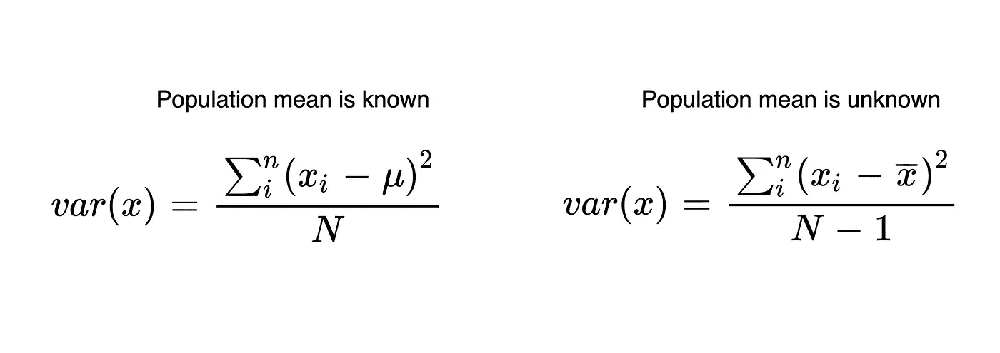
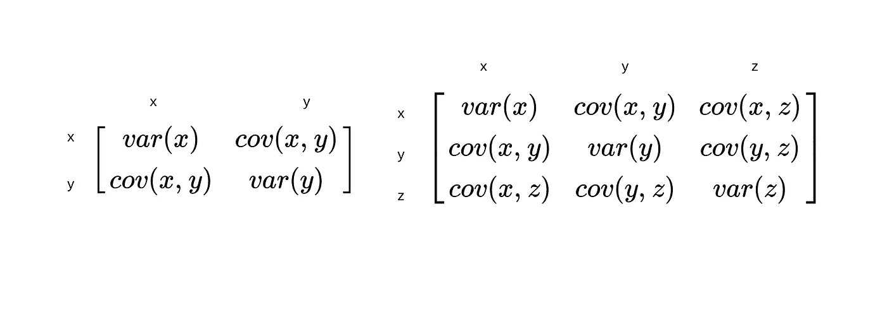
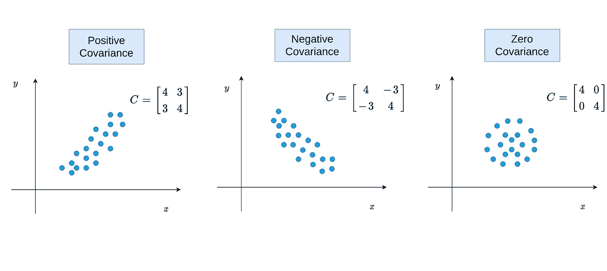
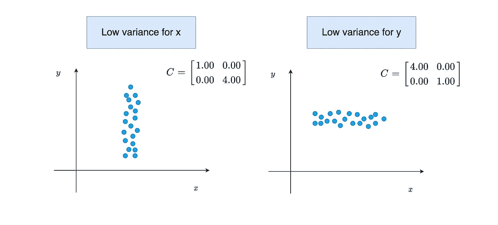
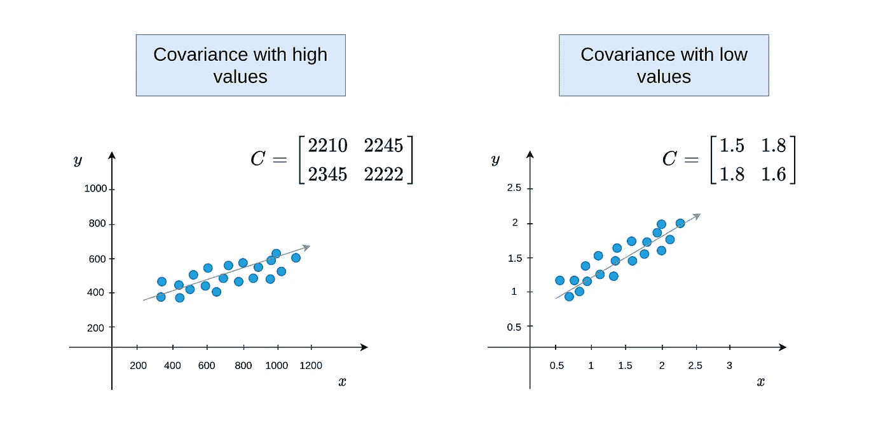
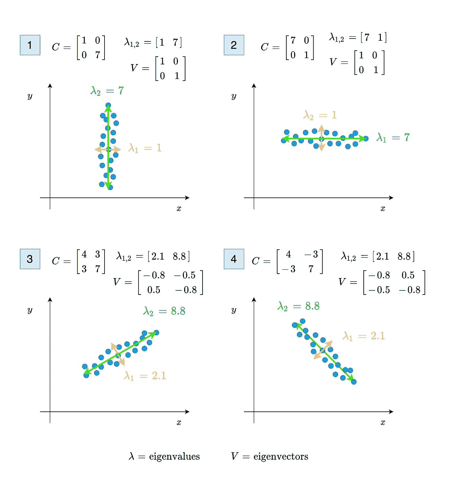

# 关于协方差你应该知道的 5 件事

> 原文：<https://towardsdatascience.com/5-things-you-should-know-about-covariance-26b12a0516f1?source=collection_archive---------1----------------------->

## 协方差的详细解释

米克·豪普特在 [Unsplash](https://unsplash.com/s/photos/dots?utm_source=unsplash&utm_medium=referral&utm_content=creditCopyText) 上的照片

在处理统计和机器学习问题时，最常遇到的一件事就是协方差。虽然我们大多数人都知道方差代表单个变量的值的变化，但我们可能不确定协方差代表什么。此外，知道协方差可以为解决多元问题提供更多的信息。大多数预处理或预测分析的方法都依赖于协方差。多元异常值检测、维数减少和回归可以作为例子给出。

在这篇文章中，我将解释关于协方差你应该知道的五件事。我们不会从[维基百科](https://en.wikipedia.org/wiki/Covariance)中的定义来解释它，而是试图从它的公式来理解它。读完这篇文章，你将能够回答以下问题。

*   协方差是如何计算的？
*   协方差告诉我们什么？
*   什么是强协方差？
*   协方差矩阵告诉你什么？
*   协方差矩阵的特征向量和特征值给了我们什么？

## 1-方差和协方差公式

最好先看一下方差来理解协方差。方差解释了变量中的值是如何变化的。这取决于彼此的价值观有多远。看一下公式 1，了解方差是如何计算的。

公式 1-根据已知和未知总体均值的方差公式

在公式中，变量中的每个值都从该变量的平均值中减去。差值平方后，除以该变量中值的数量(N)。好的，当方差低或高时会发生什么。您可以查看图 1，了解方差值低或高时会发生什么。

图 1——高低方差之间的差异(图片由作者提供)

现在，是时候看看协方差公式了。它就像方差公式一样简单。与方差不同，协方差是在两个不同的变量之间计算的。它的目的是找到指示这两个变量如何一起变化的值。在协方差公式中，两个变量的值通过取平均值的差来相乘。可以看看公式 2 看清楚。

公式 2-根据已知和未知总体均值的协方差公式

方差和协方差之间的唯一区别是使用两个变量的值和平均值，而不是一个。现在，让我们看看你应该知道的第二件事。

> **注:**从公式 1 和公式 2 可以看出，有两个不同的公式，分别是已知总体和未知总体。当我们处理样本数据时，我们不知道总体均值，我们只知道样本均值。这就是为什么我们应该用 N-1 的公式。当我们有了受试者的全部人口，我们就可以用 n 来表示。

## 2-协方差矩阵

你应该知道的第二件事是协方差矩阵。因为协方差只能在两个变量之间计算，所以协方差矩阵代表多元数据中每对变量的协方差值。同样，相同变量之间的协方差等于方差，因此，对角线表示每个变量的方差。假设在我们的数据集中有两个变量 x 和 y。协方差矩阵应该类似于公式 3。

公式 3–2 和 3 维协方差矩阵

它是一个对称矩阵，显示每对变量的协方差。协方差矩阵中的这些值显示了多维空间中多元数据的分布大小和方向。通过控制这些值，我们可以获得关于数据如何在二维空间中传播的信息。

## 3-协方差的正、负和零状态。

关于协方差，你应该知道的第三件事是它们的正、负和零状态。我们可以通过公式来理解它。当`Xi-Xmean`和`Yi-Ymean`同时为负或同时为正时，乘法返回正值。如果这些值的和为正，协方差为正。这意味着变量 X 和变量 Y 的变化方向相同。换句话说，如果变量 X 中的某个值较高，则预计变量 Y 中的相应值也会较高。简而言之，两者之间是正相关的。如果有一个负的协方差，这被正确地解释为相反。也就是说，这两个变量之间是负相关的。

只有当`Xi-Xmean`和`Yi-Ymeanis`的乘积之和为零时，协方差才能为零。然而，`Xi-Xmean`和`Yi-Ymean`的乘积可以在一个或两个都为零时接近零。在这种情况下，变量之间没有任何关系。为了清楚地理解它，你可以看到下面的图 2。

图 2-正、负和接近零的协方差(图片由作者提供)

作为另一个可能的场景，我们可以有一个如图 3 所示的分布。当协方差接近于零，变量的方差不同时，就会发生这种情况。

图 3-不同的方差和接近零的协方差(图片由作者提供)

## 4-协方差值的大小

与相关性不同，协方差值没有介于-1 和 1 之间的限制。因此，当协方差较高时，得出变量之间可能存在较高关系的结论可能是错误的。协方差值的大小取决于变量中值之间的差异。例如，如果变量中的值介于 1000 和 2000 之间，则可能具有高协方差。但是，如果两个变量的值都在 1 和 2 之间，则可能会有较低的协方差。因此，我们不能说第一个例子中的关系比第二个更牢固。协方差只代表两个变量之间的变化和关系方向。从图 4 可以理解。

图 4-高协方差值与低协方差值的对比(图片由作者提供)

虽然第一个图中的协方差非常大，但第二个图中的关系可以更高或相同。(图 4 中的值是作为例子给出的，它们不是来自任何数据集，也不是真实值)

## 5 —协方差矩阵的特征值和特征向量

特征值和特征向量告诉我们什么？这些是协方差矩阵的基本部分。需要协方差矩阵来寻找数据点的大小和方向的方法使用特征值和特征向量。例如，特征值代表 PCA 中主分量方向上的扩展幅度。在图 5 中，第一个和第二个图显示了协方差接近零时的点分布。当协方差为零时，特征值将直接等于方差值。第三和第四个图表示协方差不为零时的点分布。与前两个不同，这两个都要计算特征值和特征向量。

图 5-协方差的特征值和特征向量及其对方向和大小的影响(图片由作者提供)

从图 5 可以看出，特征值代表变量 x 和 y 的幅度，特征向量表示方向。当协方差为正时，可以从值`v[0,0]`的反余弦中找到传播角度。如果协方差为负，则值`v[0,0]`的余弦给出传播方向。

如何从协方差矩阵中求特征值和特征向量？在 Python 中使用 NumPY 可以同时找到特征向量和特征值。你要做的第一件事是用方法`[numpy.cov()](https://numpy.org/doc/stable/reference/generated/numpy.cov.html).`找到协方差矩阵，找到协方差矩阵后，你可以用方法`numpy.linalg.eig(M)`找到特征向量和特征值。

你可以看看我的另一篇文章，了解特征值在主成分分析中是如何使用的。

 [## PCA:在哪里使用和如何使用

### 以直观的方式了解 PCA 是如何工作的

sergencansiz.medium.com](https://sergencansiz.medium.com/pca-where-to-use-and-how-to-use-b207a1d8e206) 

## 结论

协方差是数据科学中最常用的度量之一。了解协方差及其细节为理解多元数据提供了许多机会。因此，我想和你分享关于协方差你应该知道的五件事。如果您有任何问题或建议，请随时发表评论。