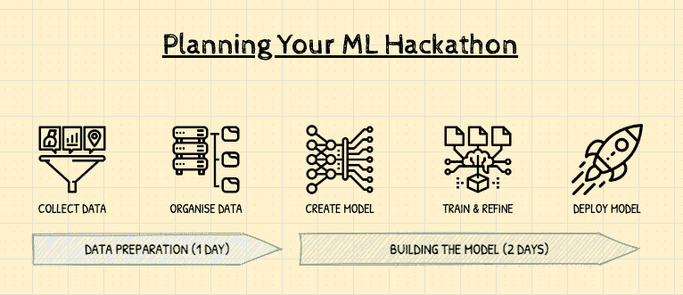

# 策划一次成功的 ML 黑客马拉松的 5 个技巧

> 原文：<https://towardsdatascience.com/5-tips-for-planning-a-successful-ml-hackathon-1ac4c24a73dd?source=collection_archive---------22----------------------->

## [办公时间](https://towardsdatascience.com/tagged/office-hours)

## 一应俱全

由[马文·迈耶](https://unsplash.com/@marvelous?utm_source=unsplash&utm_medium=referral&utm_content=creditCopyText)在 [Unsplash](https://unsplash.com/?utm_source=unsplash&utm_medium=referral&utm_content=creditCopyText) 上拍摄的照片

# TL；速度三角形定位法(dead reckoning)

**黑客马拉松【hak-*uh*-thon】*名词***

*   无论你是一家初创企业还是成熟企业，黑客马拉松都是创新的催化剂。
*   黑客马拉松通常旨在利用技术解决特定的问题。在这篇文章中，我们要关注的技术是机器学习(ML)。
*   在黑客马拉松中，团队成员聚集在一起，目标是在短时间内编码(或一起黑客攻击)一个最小可行产品**——因此得名！**
*   在黑客马拉松上开发的原型可以成为新想法和产品的发射台。

# 🔩#1:做好基础工作

在这里，我们将介绍规划黑客马拉松的基础知识。实际上，你可以将这篇技巧中的大部分建议应用于任何黑客马拉松。我们将在稍后的文章中讨论 ML 黑客马拉松的细节。

## 定义你的目标

我们都喜欢好的黑客马拉松。有什么比一群工程师和设计师聚在一起更有趣的呢——在红牛和披萨的神奇组合的推动下，在短短几天内，一直干到深夜，完成他们伟大想法的精彩演示？

在进入运行黑客马拉松的细节之前，首先弄清楚你想从黑客马拉松中得到什么是很重要的。

你想:

*   关注新产品创意
*   教开发人员新工具
*   满足紧急需要

💡了解目标将有助于你确定黑客马拉松的最佳形式和持续时间。在我们的 ML hackathon 例子中，它覆盖了 3 天，但是 hackathon 可以在任何地方运行 1 到 7 天。

## 解决后勤问题

您将希望创建一个环境，让人们能够轻松协作，并为他们提供所有设备和资源，以最大限度地提高工作效率。

*   **虚拟的(或物理的)**

自疫情以来，我们不得不变得更有创意，让人们一起参加传统上作为大型室内聚会举行的活动。

希望在不久的将来，将有机会举行物理会议。

对于一项体育活动，你最好想要一个宽敞的房间，桌子成组摆放，这样人们就可以团队合作了。假设人们会带着自己的笔记本电脑，你还需要确保足够多的电源插座(或延长线)。拥有一个易于访问的可靠 Wi-Fi 网络也很重要。

*   **何时以及持续多长时间**

建议尽早确定活动的日期(如果可行的话，还有场地)。给人们尽可能多的通知，以提高参与水平。还要决定你是想在工作时间还是工作时间之外举办活动，如果这可能会中断你的正常业务活动——**参与者能够 100%专注于黑客马拉松是很重要的。**

在我们的例子中，我们选择中间范围，因为一天的时间可能不足以运行一个 ML 黑客马拉松。下图显示了 3 天时间内通常涵盖的内容:

*图 1:ML 黑客马拉松的关键组成部分和建议时间。作者插图。*

你们当中精明的🧐会注意到，这只是创建和部署 ML 模型所需的典型数据科学步骤的压缩版本。

➡️ **参见提示 2 & 3，了解如何为不同的日子做计划。**

*   **技术**

你使用的技术需要准确，特别是如果你的活动是虚拟的。

你决定好参与者如何合作了吗？我们建议结合使用可靠的视频会议工具(例如 Google Meet 或 Zoom)、团队可以聊天的地方(例如 Slack 或 Discord)以及请求辅导员或导师的帮助。

您希望参与者在哪里开发和部署他们的代码？你是否乐于让团队自己解决这个问题，或者有你更喜欢的特定平台、产品或工具集吗？

例如，如果您打算使用云环境，如 GCP 或 AWS，您将需要确保为入职用户提供一个良好的、一致的流程——请不要把这留到将来的某一天！

> **无论你做出什么决定，都要事先测试你所有的技术是否如预期的那样工作。**

*   🍕**食物和** ☕️ **咖啡因**

无论是虚拟的还是物理的，你都想让每个人吃饱，用他们选择的兴奋剂/松弛剂。无论如何都要让参与者开心地进入夜晚！😃

如果您有预算，您可以将食品和饮料包裹送到参与者的家中，甚至可以分享食品配送券(例如，Just Eat，Doordash)。

当我们再次见面时，提前组织餐饮是非常值得的。

如果你选择在正常工作时间举办你的黑客马拉松，在一天辛苦的黑客工作后举办一个晚上的活动是个不错的主意。非正式的烧烤或欢乐时光是团队和主持人放松、交流想法和谈论一天中最重要的事情的好方法。

## 招募人员、项目和团队

*   **招募参与者(和导师)**

你想让谁参加？你的目标是你的企业或社区中的特定团队吗？根据你的黑客马拉松的目标，你会想相应地招募一些人。

同样重要的是招募志愿者。例如，能够在当天帮助你进行后勤工作的辅导员。我们稍后还将讨论导师的角色。

*   **征集项目**

只要与你的黑客马拉松目标一致，你会让黑客做他们选择的任何事情吗？或者也许只有选定的项目才能参与？

如果有选择过程:确定**是谁**在选择项目，以及如何选择。此外，一定要清楚地传达选择过程和标准。

如果所有的项目都受欢迎，人们可以自由地用脚投票——让人们尽可能容易地招募/加入团队。

鼓励参与者事先考虑他们的项目和团队总是一个好主意，这样他们就可以在黑客马拉松期间充分利用他们的时间。

这里有一些简单的方法可以帮助你提前征求项目想法:

1.  使用一个简单的共享谷歌表单，人们可以在其中提交他们的项目想法，并注册领导或加入一个团队。
2.  使用类似专用 Slack 频道的东西，人们可以通过投票提交项目并进行投票。
3.  使用类似 Miro 或 Sketchboard 的东西创建自己的想法板，人们可以提交、投票和/或讨论项目想法。

*   **组建团队**

任何参加过黑客马拉松的人，如果组织者没有促进团队组建过程，都会体验到那种轻微的无助和失落。

这是黑客马拉松组织过程的一部分，在这个过程中，主持人可以真正帮助参与者放松，并创造一个愉快而富有成效的体验。

关于如何做到这一点的一些想法:

1.  推介会议—您可能已经有了预定义的项目，参与者可以注册成为团队成员。或者邀请那些已经知道他们想要做什么的人来展示他们的想法，时间限制在 30 秒到 1 分钟。
2.  社交聚会时间——当你轮流进行推销后，给人们机会进行交流，这样他们可以问更多的问题。给它一个有趣的非正式氛围，鸡尾酒桌或小吃是一个好主意。
3.  终于有一个简单的方法来跟踪谁将做什么。这可能是共享的谷歌文档或类似的东西。

# 🖼 #2:第一天，数据准备

让您的参与者直接进入代码和模型构建可能很有诱惑力。但是任何 ML 应用的成功都严重依赖于:

1.  正确描述你试图解决的问题，
2.  收集正确的培训数据

在这里，我们涵盖了你可以用来帮助引导你的参与者通过问题框架和数据准备过程的问题。

为了省去你的麻烦，我们还为参与者提供了一个“问题框架和数据设计”模板，你可以在自己的黑客马拉松中重复使用。跳转到本文末尾的参考资料部分下载。

## 框定问题

一个好的开始方式是用简单的语言描述你的问题。你甚至需要 ML 来解决问题吗？你希望你的 ML 模型做什么，它将如何帮助你实现你的目标？

假设你建立了一个闪亮的 ML 模型，成功是什么样子的？您将使用什么标准来确定您的 ML 模型是产生了成功的结果，还是失败了！

通常一个好的基准是在应用 ML 之前解决问题的方法。你的模型比这种启发式方法成功多少？

## 数据收集和组织

因此，现在您已经确定了 ML 将如何解决您的问题，您将需要弄清楚您需要哪些数据来训练您的模型。

首先，您可能希望编写希望 ML 模型使用的数据，以便进行预测。例如，什么是输入，什么是期望的输出(或标签)。

下一步是弄清楚你需要的数据从哪里来。您需要的输入是否可以以原始形式获得，在使用之前，您是否必须从多个来源收集数据、净化并混合它们？

您还应该考虑您使用的训练数据中是否存在任何偏差，这会对模型预测产生不利影响吗？模型能够有效地“学习”吗？例如，如果某个特定输出的训练数据不足。

**你有没有考虑过你收集训练数据的方式或者你如何应用 ML 是否有任何道德风险？**这是一个复杂且有时被忽视的设计因素，参见参考资料部分的一些推荐读物。

# 🏗#3:第 2-3 天，构建模型

最后两天是关于构建模型，迭代，最后到达你的参与者已经部署了他们的最小可行产品(MVP)的点。

在这一点上，你可能想要提供一些关于你期望参与者使用的特定 ML 框架和产品的指导。根据每个团队的经验水平和黑客马拉松的目标，这一点尤其重要。

## 先决条件

当谈到 ML 时，你希望每个参与者都有一个基本的理解水平吗？为了确保你的团队有一个公平的竞争环境，你可以建议一个免费的在线课程，比如谷歌的[机器学习速成班、](https://developers.google.com/machine-learning/crash-course)或者用你自己的材料代替。

在进入黑客马拉松的这个阶段之前，创建一个你希望每个团队完成的项目清单也是值得的。

**甚至考虑一下“数据准备”和“建立模型”之间几天或几周的间隔。**这让人们有时间收集高质量的数据，并确保他们从接下来的两天黑客马拉松中获得最大收益。

例如，对于每个团队来说，一个好的检查点可能是:

*   一个明确定义的 ML 问题
*   您和/或您的导师可以访问带有标签的培训数据
*   一个明确定义的(或者至少是思考过的)ML 生产系统在部署 MVP 时的样子。从数据收集、培训、可视化到服务基础设施，无所不包。

## 问题的类型

缩小选择范围的另一个方法是让你的团队积极地思考他们提出的问题的最佳 ML 解决方案。

例如，它是一个“有监督的”还是“无监督的”问题，对于前者，它是一个“回归”还是“分类”任务？这里有一个关于[常见 ML 问题](https://developers.google.com/machine-learning/problem-framing/cases)的便捷指南。

我们在“问题框架和数据设计”模板中也提到了这一点。

## API，代码什么的中间？

根据你的团队的经验水平，引导参与者走这条或那条路可能是个好主意。

例如，如果你有一个由优秀开发人员组成的黑客马拉松团队，但是他们缺乏 ML 经验。你可以建议他们走预先训练好的 ML 模型的路线，公开为 API，用最少的编码接受输入并返回结果。

大多数领先的云提供商为不同的应用程序提供此类服务，如图像识别、语音转文本、自然语言处理等等。

如果大多数人都是经验丰富的 ML 开发人员，他们可能已经有了特定的选择。现在并不缺少框架，TensorFlow、PyTorch 和 SciKit Learn 是其中比较流行的。您可以选择将它缩小到一个特定的框架。

最后，您可能会发现 AutoML 工具提供了一个很好的中间地带。AutoML 使具有有限机器学习专业知识的开发人员能够训练针对其业务需求的高质量模型。

AutoML 和 ML APIs 之间的关键区别在于使用您自己的数据构建定制模型的能力。

# ☀️ #4:当天

## 闪电谈话

“闪电谈话”只是简短、易于理解的陈述。他们通常由一名主题专家带领，涵盖与您的黑客马拉松相关的主题。

它们是激励人们的好方法，也可以帮助你的参与者熟悉他们可能第一次遇到的新技术、平台或概念。

你进行闪电谈话的次数取决于你需要报道的内容。我们建议每次不要超过 15-20 分钟，采用清晰一致的格式。

通常在一天开始时安排灯光讲座是个好主意。剩下的时间保持非结构化，直到你结束，这样人们就有足够的时间来编写他们的项目。

## 导师

导师在这一天扮演着非常重要的角色，并将成为你的黑客马拉松成功的关键因素。

导师如何帮助你的黑客马拉松团队和参与者:

*   集思广益，挑战想法，引导问题框架。
*   定期检查，以便每个人都保持在正轨上，并专注于黑客马拉松。
*   分享知识、良好实践，并帮助避免想法重复。

导师的良好实践:

1.  试着经常交换导师，以确保团队获得不同的视角，不要推行你自己的想法。
2.  作为一名导师，你作为一个集体团队来帮助所有的团队
3.  强调心理安全。导师允许团队不带任何评判地表达感受，这是一个安全的地方。
4.  使用感觉词来识别和验证情绪，让团队敞开心扉，尝试讲述您自己的经历以及您过去如何处理类似情况。
5.  如果我帮不上忙怎么办？这完全没问题，这也是一个招募广泛的导师的好理由，这样你们就能一起找到答案。你不需要成为技术专家，但应该能够鼓励团队以不同的方式思考问题，并促进讨论。

# 👩🏾‍⚖️ #5:总结和判断

## 结束黑客马拉松

有一个明确的截止时间，团队必须停止使用工具，停止黑客攻击，并准备与团队的其他成员分享他们的项目。

**迅速失败。经常失败。**强调 3 天后，产品可能不会推出，而且在这 3 天里想出的大部分主意都会失败。但同样要认识到，这种快速的原型和迭代过程可以带来巨大的创新！

让参与者了解未来的黑客马拉松机会，如果适用的话，让他们知道如何与导师和其他软件工程师会面，以构建新想法的原型。

## 选择获胜者

最后，您已经到达了黑客马拉松的终点，最重要的任务之一仍然存在——选择获胜者！

如果可行，试着从你组织中的执行发起人那里获得支持。他们不仅可以帮助评判团队，还可以确保获胜的项目获得适当水平的资源并坚持到底。这是在早期激励团队的好方法，因为他们知道获胜的想法会产生持久的影响。

如何确保评判成功:

*   为每个团队安排演示时间(确保提前提醒他们，以便他们练习演示)。大约 3-5 分钟是一个很好的经验法则。
*   召集不同背景和经验的专家小组，提供有用的反馈。
*   使用清晰的评判标准选出获胜者，这些标准也应该提供给参赛队。
*   如果合适的话，为获胜者决定合适的奖品。

## 后续步骤

一天结束了，但你的工作还没有完成，收集与会者的反馈以了解哪些进展顺利以及如何改进非常重要。

***专业提示:*确保人们在离开前填写好调查问卷！**

与获胜团队(和执行发起人)合作，讨论他们将如何推进他们的想法，以及接下来需要采取什么行动。

鼓励所有参与者保存他们的代码、输出和调查结果摘要。

最后，在得到许可的情况下，在社交媒体上与与会者分享当天的任何照片、视频、引言和截图——这是给每个人一天纪念品的简单方式！

# 🙏🏼谢谢

非常感谢夏洛特·哈钦森与我在这篇文章上的合作！

# 📚资源和延伸阅读

*   [**问题框架和数据设计工作表**](https://www.dropbox.com/s/548w1drh5tpgvtk/Problem%20framing%20and%20data%20design%20worksheet.pdf?dl=0)
*   [构建道德人工智能的实用指南](https://hbr.org/2020/10/a-practical-guide-to-building-ethical-ai)
*   [斯坦福——人工智能和机器人伦理](https://plato.stanford.edu/entries/ethics-ai/)