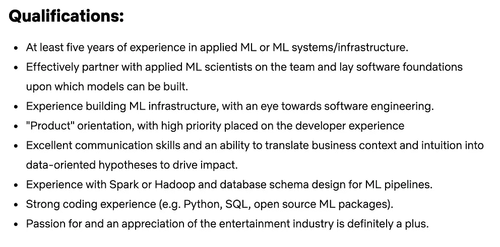
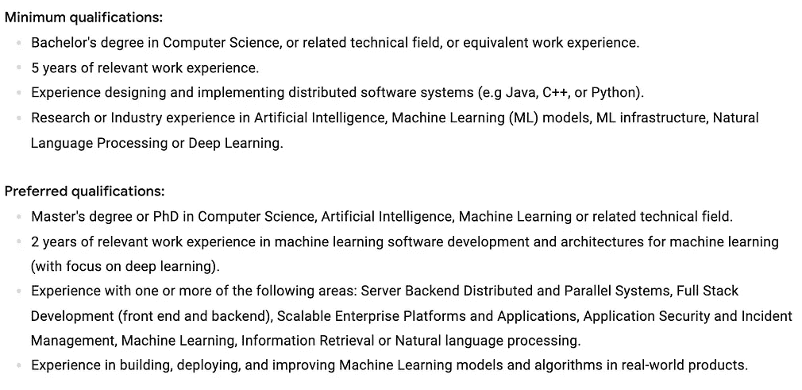

# 如何获得机器学习工作的 5 个技巧

> 原文：<https://towardsdatascience.com/5-tips-on-how-to-land-machine-learning-jobs-8eb5c1c3ee95?source=collection_archive---------10----------------------->

在 [Unsplash](https://unsplash.com?utm_source=medium&utm_medium=referral) 上 [Marten Newhall](https://unsplash.com/@laughayette?utm_source=medium&utm_medium=referral) 拍摄的照片

## 从 FAANG MLE

机器学习是一个不断发展的领域，受到了很多关注，但获得机器学习工作仍然非常困难。在大公司获得工程职位意味着不仅要知道数据科学，还要知道编程和系统设计之类的东西。通常情况下，为申请新职位做准备需要大量的研究和学习。

当我准备机器学习工作面试时，我在面试前两个月就开始准备了。这时候我才真正明白我想要的数据科学和机器学习岗位需要什么。幸运的是，许多招聘人员允许并鼓励你花时间准备。

然而，这留下了一个重要的问题:你到底如何为你的角色做准备？在这篇文章中，我将分享一些获得机器学习工作的策略，从了解市场和建立投资组合到技能提高和申请过程本身。

# 1.熟悉机器学习

MLE - [1](https://jobs.netflix.com/jobs/37329556) 和 [2](https://careers.google.com/jobs/results/106621576809456326-software-engineer-machine-learning/?hl=en_US&jlo=en_US&q=machine%20learning) 的部分工作描述

每一个机器学习的工作都是不同的，每一个都会有不同的侧重点。例如，有些专注于机器学习，有些专注于机器学习管道，有些专注于大数据，还有一些专注于深度学习。

也就是说，任何机器学习工程师(MLE)工作的核心部分都是进行机器学习。因此，即使在申请任何 MLE 职位之前，首先要确保你对 ML 有足够的了解。亲身体验各种机器学习项目。构建自己的基本系统，了解它们是如何工作的。了解 Spark 这样的大数据平台和 Pytorch 这样的深度学习库。如果你需要更多的资源来理解这一切，我有一个专门的博客[来帮助你。](https://mlwhiz.com/blog/2020/02/21/ds2020/)

这里有一个很好的基本目标，让你知道你已经做好了充分的准备:在你的 ML 准备结束时，你应该能够将一个商业问题转化为一个机器学习系统。理想情况下，您应该能够设计一个端到端的系统，这意味着数据收集、探索性数据分析、特性工程、模型评估、模型测试和部署。

# 2.为机器学习工作应用建立一个文件夹:在 Github 和 Kaggle 上创建一个存在

对于机器学习工程师职位的工作申请来说，一个重大挑战就是获得面试机会。那么，公司怎么才能找到你呢？怎样才能让自己脱颖而出？

一个答案是用你的技能去创造和完成项目。尝试许多新的玩具项目，并利用 Kaggle 等资源获取灵感。参加论坛是另一个有多重好处的途径；在推销自己的同时，你可以向他人学习并与他人讨论。

尽可能有创造性和主动性。在 GitHub 上建立你的个人资料真的很有帮助。编写大量代码，解决各种问题。靠自己很难找到这些，但是参加 [Kaggle 比赛](https://medium.com/p/what-my-first-silver-medal-taught-me-about-text-classification-and-kaggle-in-general-ebae0df16278)是一个很好的开始。

从事编程项目是建立投资组合的另一个选择。当我刚开始的时候，我做我喜欢做的事情，做我感兴趣的事情。有一段时间我试图自己创造一些游戏，但现在我经常通过[实现他们的系统](https://lionbridge.ai/articles/transformers-in-nlp-creating-a-translator-model-from-scratch/)来理解研究论文。理解理论是一回事，写代码实现系统是另一回事。当你申请一份机器学习的工作时，你会想确保你能做到这两者。

# 3.提高你的编码技能

由[约书亚·阿拉贡](https://unsplash.com/@goshua13?utm_source=medium&utm_medium=referral)在 [Unsplash](https://unsplash.com?utm_source=medium&utm_medium=referral) 拍摄的照片

许多公司在选择过程中会进行多次编码。这是目前为止你准备工作中最关键的部分，因为即使是机器学习工程师，到最后还是工程师。虽然这似乎是寻找合适人选的次优过程，但它仍然是当前结构的一部分，所以如果你想做 MLE，你需要了解与特定工作领域相关的各种数据结构和算法。为了有所帮助，这里有一些建议和资源。

为了理解数据结构的基础知识，Gayle Laakmann McDowell 的书[破解编码面试](https://amzn.to/3fKwwBh)包含了许多准备技巧。这是一本简明的书，包含了破解编码面试的适量信息。每种数据结构都有 2-3 页的解释，并附有练习题以加深理解。

我还建议根据你的喜好、经验等，列出你需要准备的话题清单。例如，我的列表是这样的:

**数据结构:**数组、栈/队列、字典、树、堆、图。

**算法:**排序、分治、动态规划/记忆、递归、二分搜索法、广度优先搜索/深度优先搜索、树遍历。

理想的情况是，在你准备结束的时候，你已经熟读了必要的题目，并且在 Leetcode 这样的地方解决了一些容易和中等难度的问题。

我也推荐 UCSanDiego 在 Coursera 上的[算法专精课程](https://coursera.pxf.io/15MOo6)。我也写了一些关于这些主题的简单解释的基础文章。你可以在下面找到它们。

*   [**数据科学家的 3 个编程概念**](https://mlwhiz.com/blog/2019/12/09/pc/) —递归/记忆化、DP 和二分搜索法
*   [**数据科学家链表的简单介绍**](https://mlwhiz.com/blog/2020/01/28/ll/)
*   [**数据科学家的动态编程**](https://mlwhiz.com/blog/2020/01/28/dp/)
*   [**处理数据科学算法面试中的树**](https://mlwhiz.com/blog/2020/01/29/altr/)

# 4.理解大系统是如何工作的

[疾控中心](https://unsplash.com/@cdc?utm_source=medium&utm_medium=referral)在 [Unsplash](https://unsplash.com?utm_source=medium&utm_medium=referral) 上拍照

在一家公司工作本质上意味着致力于创建端到端的系统，同时牢记诸如延迟、可维护性和可伸缩性等因素。出于这个原因，许多公司将系统设计作为面试过程的一部分。他们想知道你能理解到什么程度，并有可能帮助他们改进自己的系统。为此，示例问题可能如下所示:

*   你会如何设计网飞？
*   你会如何设计 Youtube？
*   你会如何设计 Twitter/脸书订阅源？

虽然这些问题看起来令人生畏，但当你开始准备它们时，它们是相当开放的。另外，记住没有错误的答案。互联网上有很多这种准备的好资源，但我想特别提到两个:

*   Donne Martin 的《系统设计入门》:这是任何准备进行系统设计的人都应该至少浏览一次的资源。它对性能、延迟、可扩展性、可用性、吞吐量、一致性、cdn、数据库、缓存、负载平衡等基本主题进行了精彩的报道。
*   [Techdummies](https://www.youtube.com/c/TechDummiesNarendraL) :虽然 Youtube 上有很多视频在谈论最受欢迎和最大的服务(网飞、Youtube、WhatsApp、脸书、Gmail、亚马逊等)的系统设计。)，这是我参考故障最多的渠道

***最后，最重要的是了解一个特定的系统在最基础的层面上是如何工作的，它是如何被设置来减轻各种故障点的，以及该系统如何为大量用户工作。正是从这些构件开始，你将真正展示你的系统设计能力。***

# 5.如何开始申请机器学习工作

所以你对数据科学有信心，你了解数据结构，你知道各种系统如何工作，你已经开发了一个很好的投资组合。

你应该如何开始申请工作？ ***这是一个根本问题，往往没有任何真正细节的回答。因此，如果我建议我的任何一个朋友如何开始找工作，我会给他们以下建议:***

*   **调查并列出你的公司**:首先调查并创建一份提供你所寻找工作的目标公司名单。
*   **努力获得推荐**:如果可能，如果你有朋友或同事在你列出的公司工作，努力获得推荐。
*   **不要完全依赖你的推荐人:**如果你不能获得推荐(即使你能获得)，试着联系公司的人力资源代表，或者通过 LinkedIn 联系招聘人员。我建议每家公司至少联系 3 到 4 名招聘人员。这会增加你得到回复的机会。
*   **按照偏好对公司进行排序:**根据你接到的电话数量，尝试按照最不感兴趣到最感兴趣的顺序对你的面试进行排序。例如，如果你的目标梦想公司是谷歌，试着把谷歌面试留到最后。这将确保之前的面试也作为你最重要的面试的练习。许多公司也有冷静期，所以你不想浪费这个机会。
*   冲洗并重复:如果你找到了工作，太好了！然而，事实是您可能不会，在这种情况下，您可以从列表的顶部重新开始。不要失去希望！

# 结论

这篇文章列出了我如何准备机器学习工作的面试，以及我目前为我的工作做了哪些研究和准备。正如我在开始时所说的，这不是一个简单的过程，所以重要的是要有时间和耐心。也就是说，不要失去希望是非常重要的！每天专注于学习和提高一点，明白这里没有捷径，每个人都走相同的路，所以你必须坚持下去。

毕竟，只有通过一系列的小步骤，一步接一步，你才能走完长距离。所以保持决心，坚持下去。你的结果会出来的。

另外，如果你想了解我自己的面试经历，请看这里。

# 继续学习

如果你想以更结构化的方式阅读更多关于算法和数据结构的内容，这里有一个 UCSanDiego **在 Coursera 上的 [**算法专门化。我在准备的时候旁听了这门课程。**](https://coursera.pxf.io/15MOo6)**

谢谢你的阅读。将来我也会写更多初学者友好的帖子。关注我在 [**媒体**](http://mlwhiz.medium.com) 或订阅我的 [**博客**](https://mlwhiz.ck.page/a9b8bda70c) 了解他们**。**

此外，一个小小的免责声明——这篇文章中可能会有一些相关资源的附属链接，因为分享知识从来都不是一个坏主意。