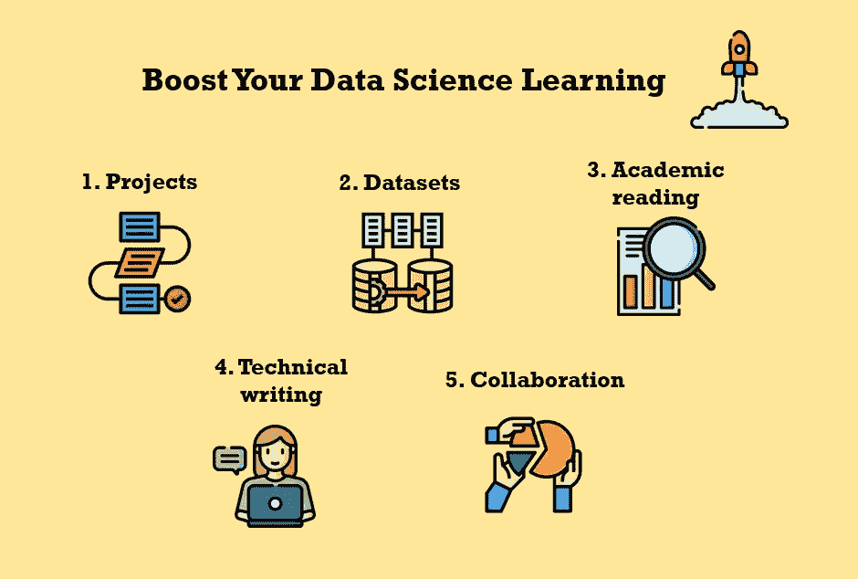

# 促进数据科学学习的 5 个技巧

> 原文：<https://towardsdatascience.com/5-tips-to-boost-your-data-science-learning-320a2284690?source=collection_archive---------12----------------------->

Julia Nikulski 制作的图片展示了推动您的数据科学学习之旅的 5 个技巧。由 [Flaticon](https://www.flaticon.com/) 制作的 [Becris](https://creativemarket.com/Becris) 、 [Freepik](https://www.freepik.com/) 、 [ultimatearm](https://www.flaticon.com/authors/ultimatearm) 和[桉树](https://creativemarket.com/eucalyp)的图标。

## [入门](https://towardsdatascience.com/tagged/getting-started)

## 通过专注于这 5 件事来增加你的学习曲线，而不是参加更多的在线课程

许多指导者给你关于如何开始数据科学的建议:参加哪些在线课程，为你的作品集实施哪些项目，以及获得哪些技能。但是，如果你已经开始了你的学习之旅，而现在你正处于中途，不知道下一步该去哪里，那该怎么办？

在 [Udacity](https://www.udacity.com/) 完成我的数据科学家纳米学位后，我处于那个*中间*点。我已经建立了各种数据科学主题的基础——ML、深度神经网络、NLP、推荐系统等等——我的学习曲线非常陡峭。所以我觉得仅仅参加另一个在线课程不会每天学到很多东西另外，我有点不耐烦了，想现在就应用我的技能，而不是在一个半小时的讲座之后。但是我该怎么办呢？

我想分享我关注的 5 件事，它们确实帮助我提高了数据科学学习，并构建了更深刻的知识和技能。我提高了自己的技术和非技术能力，以实施成功的项目并取得成果。如果你正处于这个中间点，你将会学到更多的东西，如果你花时间在这 5 件事情上的话，这将会比你参加另一个在线课程或者进行一万次的卡格尔竞赛要多得多。

[Firmbee.com](https://unsplash.com/@firmbee?utm_source=medium&utm_medium=referral)在 [Unsplash](https://unsplash.com?utm_source=medium&utm_medium=referral) 上拍照

# 1.从头到尾实施大型项目

大多数人倾向于通过*做*学得最好。这就是为什么[在线课程](https://www.udacity.com/course/data-scientist-nanodegree--nd025)通常会教你一项技能或概念，然后要求你在一个小练习或项目中实现它。所以参与项目会教会你很多。从头到尾实施**大型项目，潜在的许多陷阱会让你学到更多**。

如果你在一个项目上工作，作为在线课程的一部分，研究问题，数据集，有时甚至模型和评估指标都是为你选择的。所以你只需要关注代码和实现。然而，决定一个[研究问题、数据集、模型和评估指标](https://yanirseroussi.com/2015/11/23/the-hardest-parts-of-data-science/)实际上是棘手的部分！如果你曾经不得不写一篇论文作为大学学位的一部分，你就会知道定义一个研究问题是非常困难的。

无论你是数据分析师、商业智能分析师还是数据科学家，你工作的一部分就是在大量数据中识别模式*而不需要任何人告诉你到底要寻找什么。在其他情况下，您可能需要调查一个特定的问题，但是您没有数据集，需要考虑可以用什么来回答这个问题，以及如何获得它。这些例子表明**实施本身并不能让你为数据科学工作**做好充分准备。*

为了练习你在实现之外的技能，你应该**从头开始开发你自己的项目**——从研究问题开始，到部署结束。以下资源可帮助您完成这项任务:

*   [**开发项目想法**](/5-steps-to-develop-unique-data-science-project-ideas-6c2b3a0014b) **:** 如果你需要灵感来提出独特的数据科学项目想法，你可以查看[我的指南](/5-steps-to-develop-unique-data-science-project-ideas-6c2b3a0014b)，在那里我讨论了 5 个步骤，它们将帮助你提出有趣且可执行的想法。
*   [**项目规划方法**](https://www.datascience-pm.com/10-ways-to-manage-a-data-science-project/) :本帖介绍了 10 种不同的方法，帮助你规划和管理你的数据科学项目。它们包括 [CRISP-DM](https://www.datascience-pm.com/crisp-dm-2/) 、敏捷、特别和瀑布方法。
*   [**数据科学项目结构**](http://drivendata.github.io/cookiecutter-data-science/) **:** Cookiecutter 数据科学提供了一个标准化的项目结构，帮助您创建可重复、自我记录的项目。它考虑了项目中的所有步骤—从收集和转换数据到生成结果报告。

除了从头到尾实施一个项目，**关注更大的项目也会增加你的学习**。处理大型数据集，实现更多的模型，回答更多的问题，这一过程中会产生更多的问题和困难。虽然奋斗可能会令人沮丧，但它实际上教会了你宝贵的知识和技能。与被告知潜在问题及其解决方案相比，面对问题然后自己解决是一种更有效的学习方式。

[卡洛斯·穆扎](https://unsplash.com/@kmuza?utm_source=medium&utm_medium=referral)在 [Unsplash](https://unsplash.com?utm_source=medium&utm_medium=referral) 上的照片

# 2.创建您自己的数据集

对于许多数据科学家来说，建模是最令人兴奋的部分——找出要使用的算法、实现、微调和评估它们。然而，作为一名专业的数据科学家，**你必须处理数据收集和清理，**需要你 80%的时间。

如果你在一家没有指定数据工程师的公司工作，你可能要负责数据采集。因此，了解哪些数据与特定的研究问题相关，在哪里以及如何获取这些数据，以及采取哪些预处理步骤至关重要。你应该练习网络搜集(但[保持其合法性和道德性](https://www.ionos.com/digitalguide/websites/web-development/what-is-web-scraping/))，熟悉提供现有数据集和[API](https://www.springboard.com/library/data-science/top-apis-for-data-scientists/)的[资源(你可以对其进行组合和扩展)，并转换数据以供进一步分析和建模。](https://www.dataquest.io/blog/free-datasets-for-projects/)

虽然许多投资组合项目需要一次性获取数据，但现实世界的应用程序通常需要持续提取、转换和加载新数据的 ETL 管道。因此**通过编写一个脚本，将您的数据获取转变成一个 ETL 过程**，该脚本不断提取新数据、转换数据并将其保存到数据库中。

以下资源可帮助您开始创建自己的数据集和 ETL 管道:

*   [**ka ggle 上的数据集**](https://www.kaggle.com/datasets)**:**ka ggle 上的用户已经分享了他们创建的数百个数据集。其中许多解释了用于获取数据的来源和过程，并给你一个在哪里寻找数据的想法。
*   [**数据科学的网络搜集**](/data-science-skills-web-scraping-using-python-d1a85ef607ed) **:** [凯瑞·帕克](https://medium.com/u/219e4d5d0c99?source=post_page-----320a2284690--------------------------------)为数据科学家写了一本很棒的网络搜集指南。
*   [**用于数据科学的 API**](https://www.springboard.com/library/data-science/top-apis-for-data-scientists/)**:**展示了 22 个 API——包括 IBM Watson、Spotify 和 Census.gov——为数据科学和机器学习提供数据。
*   [**Awesome-ETL**](https://github.com/pawl/awesome-etl#python)**:**用各种语言构建 ETL 管道的资源概述—包括 Python。

苏珊·Q·尹在 [Unsplash](https://unsplash.com?utm_source=medium&utm_medium=referral) 上的照片

# 3.阅读学术论文

当我想获得一个主题的高层次概述或理解算法的基本机制时，我的资源包括在[和其他网站上发表的关于数据科学](https://towardsdatascience.com/)的博客文章。然而，**高层次的理解只能让你到此为止**。

**阅读介绍、比较和对比算法和机器学习方法的学术论文**将**为你提供比任何博客文章都更深刻的知识**。例如，您将了解为什么要引入一种特定的算法，它在数学上是如何工作的，还有哪些研究和模型可以解决类似的问题，以及未来的研究需要解决哪些问题。

此外，阅读学术论文有助于你掌握你所在领域的最新进展。所有你喜欢的 ML 算法和 NLP 模型都是由研究人员开发的，并在论文中介绍过——[随机森林](https://link.springer.com/content/pdf/10.1023/A:1010933404324.pdf)、 [XGBoost](https://dl.acm.org/doi/pdf/10.1145/2939672.2939785) 、 [BERT](https://arxiv.org/pdf/1810.04805.pdf&usg=ALkJrhhzxlCL6yTht2BRmH9atgvKFxHsxQ) 、 [GPT-3](https://arxiv.org/pdf/2005.14165.pdf) 。其他论文有助于理解哪些算法在特定场景中表现最佳。

有了从定期阅读学术论文中获得的知识，**你将能够更好地解释算法的内部工作原理，为你的用例选择合适的模型，并证明你的决定**。是的，阅读科学著作是困难和令人疲惫的。但是这是值得的，随着时间的推移，你会做得更好。你对理解一篇论文的关注和努力会导致一个更陡峭的学习曲线。

以下资源可以帮助您开始撰写学术论文:

*   [**学术论文阅读指南**](/guide-to-reading-academic-research-papers-c69c21619de6) **:** [凯尔·M·香农](https://medium.com/u/ac2996b9004a?source=post_page-----320a2284690--------------------------------)解释了为什么阅读学术著作如此困难，以及你如何能做得更好。
*   [**要读的深度学习论文**](/four-deep-learning-papers-to-read-in-june-2021-5570cc5213bb) **:** [罗伯特·兰格](https://medium.com/u/638b9cae9933?source=post_page-----320a2284690--------------------------------)每月发布他最喜欢的新深度学习论文的摘要。
*   **RSS 提要**:使用 RSS 提要来了解最新的研究。arXiv feed 允许访问与特定类别相关的研究，如计算机科学、统计学或机器学习。

[戴红帽的女孩](https://unsplash.com/@girlwithredhat?utm_source=medium&utm_medium=referral)在 [Unsplash](https://unsplash.com?utm_source=medium&utm_medium=referral) 上的照片

# 4.撰写技术博客文章

根据费曼技巧，向别人解释一个话题是你自己学习的好方法。当您在 Medium 或 TDS 撰写关于数据科学的技术文章时，您需要足够详细地理解这些材料，以便向您的受众解释。因此，写关于数据科学的文章是费曼技巧的一个很好的应用。TDS 上的作家已经无数次证实了这一点。

写技术文章的一个奇妙的好处是你有自己的资源。如果您想重温一下不久前实现的算法或项目，可以回到您的文章。此外，这些博客文章还可以向雇主们展示你了解某个主题，并且对数据科学有全面的了解。最后，写作有助于练习你的 [**沟通技巧**](https://doordash.engineering/2021/02/11/how-to-drive-effective-data-science-communication/) ，这对于数据科学家来说是一项至关重要的技能！

以下资源可帮助您入门并提高您的技术写作能力:

*   [**如何入门数据科学写作**](/how-to-start-writing-data-science-blogs-73bc55f59169) : [拉希德赛](https://medium.com/u/856a7c948cc2?source=post_page-----320a2284690--------------------------------)提供如何写数据科学文章的理由和指导。
*   [**数据科学写作指南**](/the-all-time-best-guides-to-data-science-writing-tues-b6fec391e9d9)**:**[Elliot Gunn](https://medium.com/u/aad1101621dd?source=post_page-----320a2284690--------------------------------)撰写了一篇讨论如何提高数据科学写作的 TDS 文章概述。
*   [**发表成功文章的工具和建议**](https://medium.com/swlh/how-to-write-and-publish-articles-that-get-noticed-60e9701daed4) **:** [安妮·邦纳](https://medium.com/u/a71060a2ef24?source=post_page-----320a2284690--------------------------------)分享了在媒体上写博客的一般建议，并讨论了有价值的工具，如[语法上的](https://app.grammarly.com/)和[海明威应用](https://hemingwayapp.com/)。

照片由[印尼 UX](https://unsplash.com/@uxindo?utm_source=medium&utm_medium=referral)在 [Unsplash](https://unsplash.com?utm_source=medium&utm_medium=referral) 上拍摄

# 5.与他人合作

**我曾经低估了在数据科学和编码项目中与他人合作或为他人工作的价值**。当我和一个朋友一起设计一个网络游戏时，这种情况发生了变化。我注意到我可以从他那里学到很多东西，不是因为他教了我什么，而是因为我们交换了想法，共享了代码，并且必须相互交流我们的愿景和进展。

**与数据科学家或程序员同事合作**以及为朋友或你当前的雇主解决数据相关的问题**教会你在线课程所不具备的技能**:

1.  **与技术和非技术受众交流**并向他们展示您的发现。
2.  解决与业务相关的问题，其中错误会产生**实际影响**(如果工作发生在业务环境中)。
3.  **根据用户反馈调整**你的想法和代码。

要开始与他人合作，请与一位可能面临问题的朋友交谈，您可以用自己的数据和编码技能解决这个问题。如果你认识数据科学家或程序员，请他们合作一个联合项目。**在工作中注意发现潜在的机会**，在这些机会中你可以利用你的数据科学技能。也有很多机会与在线社区合作项目，如 [DataKind](https://www.datakind.org/) 、 [Data for Good](https://dataforgood.ca/) 或 [Statistics Without Borders](https://swb.wildapricot.org/volunteers/) 。

照片由[S O C I A L C U T](https://unsplash.com/@socialcut?utm_source=medium&utm_medium=referral)在 [Unsplash](https://unsplash.com?utm_source=medium&utm_medium=referral) 上拍摄

# 摘要

**学习数据科学很难** —不仅仅是因为你需要获得所有的技术知识。构建你的学习之旅，坚持下去，并获得你的努力有回报的感觉是具有挑战性的。我曾经认为在线课程是成为伟大的数据科学家的秘诀。

我发现，从头到尾参与大型项目，创建自己的数据集和 ETL 管道，阅读研究论文，撰写技术博客帖子，以及与他人合作**教会了我宝贵的技能，否则我不会获得这些技能**。我希望你自己尝试一下这些技巧，并**提高你的数据科学学习**。

你想在媒体上阅读更多高质量的故事吗？考虑注册一个支持我和其他媒体作者的会员。

 [## 通过我的推荐链接加入 Medium-Julia Nikulski

### 作为一个媒体会员，你的会员费的一部分给了你所阅读的作家，你可以在…上看到所有的故事

medium.com](https://medium.com/@julia.nikulski/membership) 

您是否正在寻找展示您的数据科学产品组合的方法，但不知道从哪里开始？查看我关于如何建立数据科学组合网站的指南**:**

** [## 如何建立数据科学作品集网站

### 展示您的作品——从零开始创建网站

towardsdatascience.com](/how-to-build-a-data-science-portfolio-website-335b0f253822)**