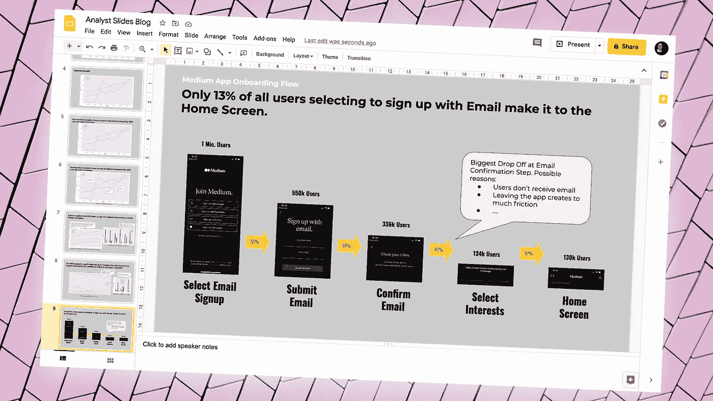
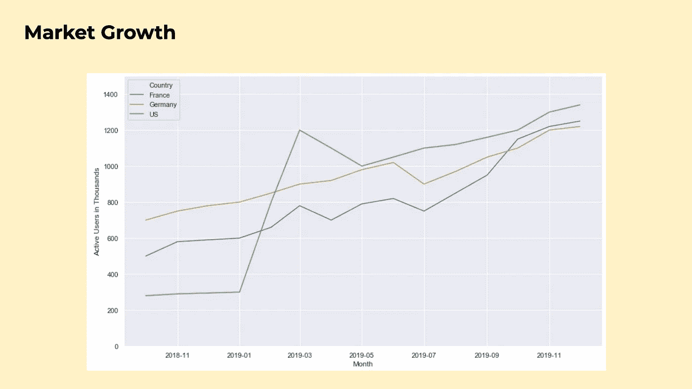
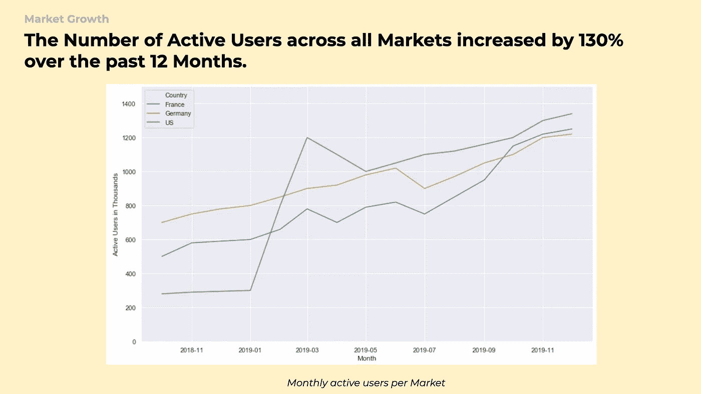
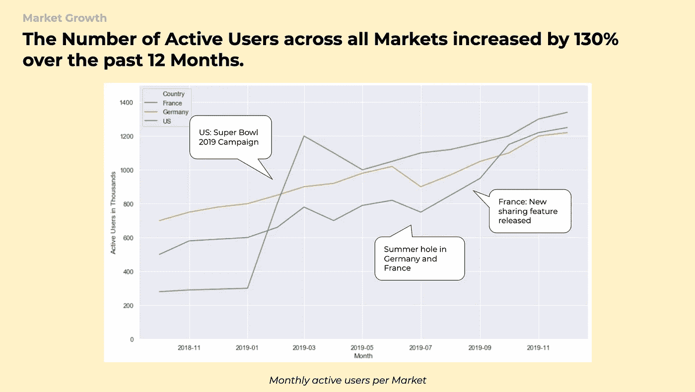
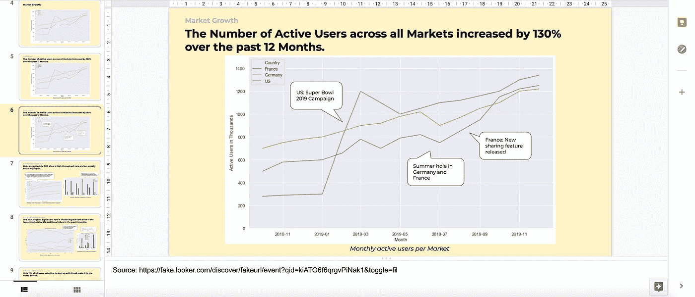
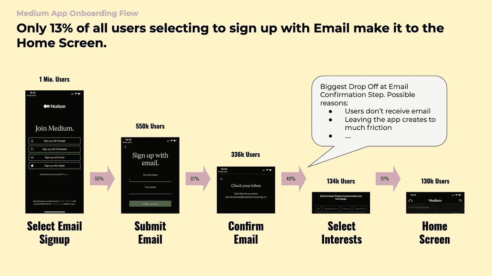

# 改进分析幻灯片的 5 个技巧

> 原文：<https://towardsdatascience.com/5-tips-to-improve-your-analytics-slide-decks-c5d0559259c0?source=collection_archive---------18----------------------->

## 因为没有良好的沟通，伟大的分析是没有价值的

(图片编辑自[unsplash.com](https://unsplash.com/photos/jhw1cRdWkEI))

幻灯片仍然是展示任何分析结果的最常用工具。它们不仅是一个通知、激励和说服你的观众的工具，而且通常也是一种文档，人们会在几周或几个月后回来查阅。

我们都知道饼图是邪恶的，我们不应该使用三维图表，甚至更糟的是，动画。我不会在这篇文章中再提到这些(保证)。相反，我喜欢分享我在过去几年的产品分析工作中学到的一些原则，这些原则极大地帮助我设计了更易于阅读、更吸引观众的演示文稿。

首先，让我们看一下下面的幻灯片:

(图片由作者提供)

乍一看，这一页没什么问题。在我注意到我必须改变一些东西之前，我可能在过去制作了数百张这样的幻灯片。但是对于第一次看这张幻灯片的人来说，可能会出现很多问题，比如:

*   *这应该告诉我什么？*
*   *为什么 2019 年 2 月美国活跃用户数量激增？*
*   *这些数字是从哪里来的，我如何自己深入了解它们？*

只要稍加修改，这些信息就能以更直接的方式呈现出来。

# 1.在标题中使用完整的句子

最常见的情况是，幻灯片标题像书中的章节名称一样使用。*议程*、*市场概述*、*建议*、*总结*等。都是经典的例子。但是，尽管它们在幻灯片上占据最突出的位置，但它们并没有提供多少信息或价值。

每张幻灯片都应该传达特定的信息。例如，上面的幻灯片告诉我们，在过去的 12 个月中，活跃用户的数量增长了很多。将这一主要信息以标题的形式放在幻灯片的顶部，会立即让你的观众了解他们在看什么。同样重要的是，对于作为分析师的您来说，无论何时看到演示文稿中的这张特定幻灯片，它都是一个很好的起点:

(图片由作者提供)

在标题中使用完整的句子最初可能会觉得有点奇怪，但是我强烈建议你试一试。观众的注意力会立即被吸引到特定幻灯片上最重要的内容上，从而更容易记住您的信息。

在创建幻灯片时，我试图设计和组织标题，以形成一个清晰的故事情节。如果有人只是通读那些完整的句子标题，他们仍然应该按照逻辑顺序获得所有的重要信息。

突出幻灯片上重要的一条信息也迫使你思考一张幻灯片是否真的有必要，或者是否应该一分为二。

# 2.添加带注释的上下文信息

如果你展示的图表是有趣的(它应该是有趣的)，就会有问题。"*为什么 5 月份转化率暴跌？"，“为什么我们会在第 3 季度看到新用户注册量激增？”、“为什么法国的回头率低那么多？”*是展示图表时必须回答的问题。

以我的经验来看，最好的办法是努力预测这些问题。通常，这些相对容易预见，因此人们可以在图表上以小注释的形式添加答案:

(图片由作者提供)

这些笔记不仅会帮助你更自信地陈述，留下更少的开放性问题。在你展示结果的几个星期或几个月之后，人们仍然在浏览幻灯片，这也会有很大的帮助。

# 3.为后代设计:包括你的来源

当我开始我的分析师生涯时，添加你的来源可能是我得到的最有价值的提示。想象一下，你做了这个奇妙的分析，将结果展示给更广泛的人群，然后继续下一个任务。三个月后，一位同事找到你，问你是否能找出你展示的图表的实际数字。或者更糟糕的是，一些数字现在看起来有点不对，他想确保你提供的结果是可靠的。

根据你用来进行分析的工具，如果你没有在演示中包括你的源，或者没有一个特殊的文件管理系统来管理你所做的所有分析，这可能并不容易。幸运的是，像 Looker、Tableau 和 Co .这样的 BI 工具提供了使用 URL 链接分享你的作品的可能性。在幻灯片注释中添加这些链接只需几秒钟就能完成，这是一种真正的安全方式。更好的是，你的同事也可以在回复你之前检查这些东西。

如果您使用 Jupyter Notebooks 之类的其他工具，至少添加可以找到您的源代码的目录或 git 存储库的链接已经非常有用了。

(图片由作者提供)

# 4.你是专家:解释结果

作为分析师，我们通常根据数字来陈述事实。与此同时，我们展示的结果仍然可以留下足够的解释空间——无论你是在营销、金融、产品还是其他领域工作。作为分析师，我们是我们领域的专家，因此应该对为什么我们会看到特定的结果或用户行为有很好的感觉。根据我的经验，提供一些解释会非常有助于帮助你的听众理解问题并提出他们自己的想法。

在应用程序中查看以下(虚构的)Medium 入职流程转换数字。我们可以看到，用户应该在收件箱中确认电子邮件地址的步骤明显减少了:

中型入职流程幻灯片(*数字是由作者*创建的随机数)

# 5.毫无意外:提前分享你的卡片

提前分享你的卡片并不一定是一个与风格相关的提示，但重要性不亚于前面的原则。当我开始做分析师的时候，我试图让我的演讲尽可能地令人兴奋和吸引人。这意味着我会给观众带来和我切入新话题时一样的体验。

首先，我会定义问题和解决问题的方法。然后，我展示了我所掌握的所有证据，最终得出了我的结论和建议。

这种做法的问题在于，它迫使人们一直跟随你的想法。作为一个听众，如果你不知道整个演讲的方向，就很难提出问题并提出不同的方向。同时，作为演示者，你可能会对你无法回答的问题或你没有注意的事情感到惊讶。

至少在演示前几个小时分享你的幻灯片，这不仅有助于提高会议效率，让每个人都知道正在发生什么。这也让你有机会检查你是否遗漏了什么，或者在展示之前最好仔细检查你牌组中的一些数字。

我希望这些建议能像帮助我一样帮助你改进你的演讲。如果你有我在这篇文章中没有提到的好建议，请在评论中分享。

喜欢这篇文章吗？那么你可能也会对我的另一篇关于(产品)分析的文章感兴趣:

<https://productcoalition.com/mastering-user-retention-like-amazon-spotify-and-co-5d2bd2931717>  </challenging-the-stakeholder-as-an-analyst-e8ce0dc92ea5> 