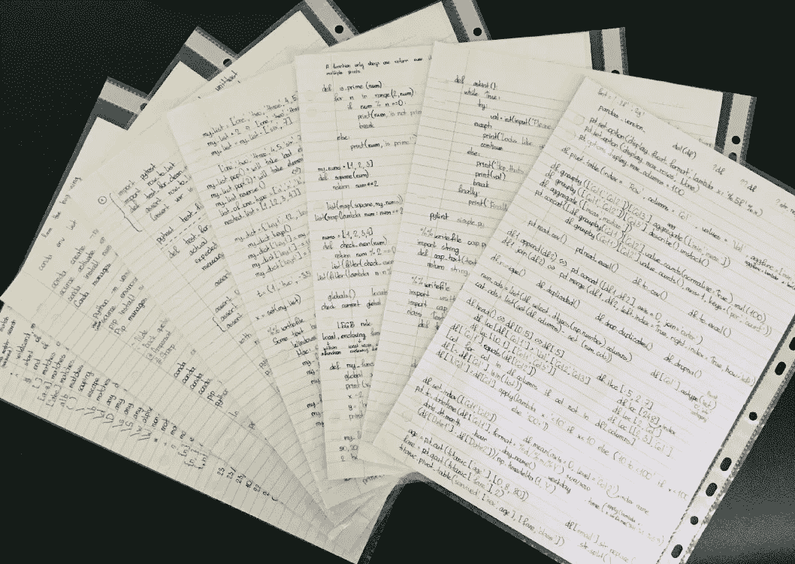

# 从零开始学习 Python 的 5 个技巧

> 原文：<https://towardsdatascience.com/5-tips-to-learn-python-from-zero-e4f6a9106558?source=collection_archive---------17----------------------->

## 学习过程中的实用技巧

如果您计划学习 Python，学习过程需要多长时间以及有多顺利将取决于许多因素，例如:

*   你的背景:你以前是否接触过其他编程语言，特别是面向对象编程语言
*   **你的承诺:**每周你会付出多少努力
*   **你的方法:**你将如何学习🍁

最近在回想大约一年前刚开始认真学习 Python 的时候。在这篇文章中，我分享了我对第三个因素的五大建议🍁这来自我对那些即将踏上旅程的人的思考。

照片由[蒂莫西·戴克斯](https://unsplash.com/@timothycdykes?utm_source=medium&utm_medium=referral)在 [Unsplash](https://unsplash.com?utm_source=medium&utm_medium=referral) 上拍摄

# 1.找一门优秀的课程和/或一本书来指导你🎒

当你完全是 Python 的初学者时，学习 Python 似乎是势不可挡的。甚至像安装 Python 和打开它这样的基本事情看起来也令人困惑。注册并完成一个结构良好的在线课程可以帮助你在短时间内理解基础知识。如果你喜欢这种格式，它也可以是一本写得很好的书。有时从多个来源学习可以互补，有助于巩固知识。如果你想要推荐，我在下面分享了我的推荐。标有星号(*)的资源更适合学习数据科学的 Python。

## 1.1.在线课程

当我第一次学习 Python 的时候，我在 Udemy 上完成了何塞·波尔蒂利亚的以下两门课程:

◼ [完成 Python 训练营从零到英雄的 Python](https://www.udemy.com/course/complete-python-bootcamp/)
◼ [数据科学和机器学习的 Python 训练营](https://www.udemy.com/course/python-for-data-science-and-machine-learning-bootcamp/) *

我发现这些课程结构良好，内容全面。我非常喜欢并强烈推荐它们。然而，这些课程不是免费的，但通常会有折扣，就像大多数 Udemy 课程一样。但是，你完全可以不花钱学习 Python。有很多免费的在线资源可以利用。这里有一个由 Udacity 提供的非常棒的免费课程:

◼[python 编程简介](https://www.udacity.com/course/introduction-to-python--ud1110)

## 1.2.书

我是[奥莱利](https://www.oreilly.com/)的超级粉丝。这里有两本由[杰克·范德普拉斯](https://github.com/jakevdp)写的很棒的奥莱利的书(每本都有免费的电子版链接):

◼[python 旋风之旅](https://jakevdp.github.io/WhirlwindTourOfPython/)
◼ [Python 数据科学手册](https://jakevdp.github.io/PythonDataScienceHandbook/) *

如果你在谷歌上搜索“ [O'Reilly Python books](https://www.google.com/search?q=oreilly+python+books&rlz=1C1CHBF_enAU847AU848&oq=oreilly+python+books&aqs=chrome.0.69i59j0i10l2j0i22i30l2j0i10i22i30j0i22i30.3927j0j7&sourceid=chrome&ie=UTF-8) ”，你可以找到更广泛的书籍可供选择。

📍**推荐行动点:**从免费的 Udacity 课程开始。

# 2.制作你自己的小抄📜

据我观察，主动学习比被动学习学得更多。观看和阅读是被动学习，而记笔记、总结所学和练习是主动学习。所以看教程视频的时候，不要像看电影一样看！同样的，说到辅导书/博客，也不要像看科幻小说一样去读！一定要在学习的时候创建你自己的语法备忘单。这样会让你的练习时间更轻松。当我在做前面提到的 Udemy 课程时，我学到了很多有用的概念，我知道我不会记住所有的概念，尽管它们有时看起来很直观。所以在看完每个教程视频后，我会再次浏览材料，记下对我的备忘单来说重要和有用的关键示例代码片段。

我的一些手写小抄。每个主题都有自己独立的页面，所以以后可以更容易地通过主题找到语法。

当记下示例语法时，我实际上是手写的。😅这可能看起来不酷，但是手写我自己的小抄有以下好处:
🍀用笔和纸写下片段的行为让我注意到语法的小细节，并提高了回忆能力🍀随着我了解的越来越多，更容易在同一主题上添加更多注释
🍀更容易找到特定的语法，因为我会大致记得我写它们的地方

如果你不喜欢手写代码，你可以在你的电脑上创建一个数字备忘单。这样做的一个好处是，它使搜索更容易。上面提到的手写的好处在某种程度上也是真实的，尤其是如果你打字而不是复制粘贴的话。基本上，您希望示例代码易于参考，这样可以帮助您减少 Python 实践中的麻烦，提高工作效率。

最后，你也可以看看预先做好的小抄来获取灵感。这里有一些由 [Datacamp](https://www.datacamp.com/community/data-science-cheatsheets) 或 [Dataquest](https://www.dataquest.io/blog/topics/cheat-sheets/) 提供的例子。

📍**推荐行动点:**当你在做推荐的 Udacity 课程时，一定要自己做小抄，以备后用。

# 3.不要复制粘贴代码，而是键入它们💪

虽然能够用 Python 编码并不等同于记住语法结构，但不用查找每个小细节就能编码基本的东西仍然非常有用。任何人都可以复制粘贴一个代码，但是你不认为如果你自己可以无缝地编写基本代码，你会感觉更胜任吗？

这是《我是如何遇见你的母亲》中一个有趣且有关联的场景。这是一个很好的提醒，告诉我们这些天来我们是如何变得越来越依赖自动更正和自动完成的。这篇文章有一个相关的要点。当您在实践所学内容时，最好是一个字符一个字符地键入代码，而不是复制粘贴或自动完成。我注意到，如果我输入一个特定的代码几次，很快我就开始记住它(💪肌肉记忆？).所以当我第一次开始学习 Python 时，我键入代码并最小化自动完成的使用(当我熟悉新的库时仍然如此)。这真的帮助我能够自己键入基本代码，而不需要谷歌或参考笔记。

一旦您完全熟悉了某个特定的代码，并且认为进一步键入没有什么好处，您当然可以使用自动补全工具和其他快捷方式来加快进度。

📍**推荐动作点:**练习 Python 时，键入代码和，尽量减少复制粘贴和自动补全。

# 4.从错误中学习👀

当你在练习 Python 的时候，你会得到很多错误。这是完全正常的。尽管如此，它仍然让人感到相当沮丧。如果你一直出错，你可能会感到气馁和绝望。学习如何调试(即查找和修复错误)是学习 Python 的一个关键部分。如果你坚持练习调试，这可以帮助你在将来更快地调试代码，并且明白应该避免什么样的错误。

下次你出错时，戴上你的侦探帽！首先阅读错误消息，寻找可能导致错误的提示。如果错误消息看起来不具信息性，请在 Google 或任何搜索引擎中搜索该错误。很可能其他有同样错误的人已经寻求帮助并修复了它。

📍**建议行动点:**读取错误信息。如果错误消息中的提示不够充分，请搜索它。记住，当你识别和修正错误时，你会学到更多！

# 5.有目的地练习编码💦

为了让自己保持动力并更有效率，在练习 Python 时，总是要有*小目标*。这些小目标应该与你想学习 Python 的总体原因相一致。当你有时间的时候，花几分钟记下你想用 Python 做的事情的清单。如果这些项目太大，把它们分成小的任务。这些正是你最终希望能够在 Python 中完成的事情。您可以将此视为提高您所在领域的 Python 流畅性的路线图。这个路线图不是一个静态的文件，相反，它是你可以在学习过程中不断更新的东西。

每次你练习的时候，你从这个列表中选择一个任务。花在练习上的时间可能感觉更有成效，因为当你在练习中需要它们时，你可以利用它们。这也很令人兴奋，因为你会觉得“现在我可以用 Python 做这个了！”。每次练习时，你都应该以一种有组织的方式记录你的代码片段，这样更容易找到它们。随着时间的推移，您从实践中积累了大量有用的代码和模板。有时，您可能会在多个练习会话中处理一个任务，或者有时，您可能会在一个会话中处理多个任务，因为这取决于许多因素，如任务的性质、您的 Python 舒适度以及您投入的专注时间。

想象你周围有一个小泡泡。这个气泡代表您的 Python 舒适气泡。开始时很小。久而久之，你会随着练习慢慢扩大这个泡泡。

📍**推荐行动点:**为你的 Python 练习时间制定路线图。每次您练习路线图中的任务时，将最终代码记录在您的集合中，以便于下次访问。

# 额外提示。将您的 Python 实践游戏化🎮

这是为那些渴望额外挑战的人准备的。如果你能让你的 Python 练习时间变得更有趣，并对它着迷，你就更有可能继续并花时间在它上面。这里有一些在线平台，你可以用有趣的方式免费练习编码:

*   [黑客排名](https://www.hackerrank.com/domains/python)
*   [代码大战](https://www.codewars.com/)

在这些平台中，你可以收集分数、升级并与他人竞争。

📍**建议行动点:**探索这两个平台，并考虑在其中一个(或两个)平台上建立每日娱乐时间。

由[大卫·克劳德](https://unsplash.com/@davidclode?utm_source=medium&utm_medium=referral)在 [Unsplash](https://unsplash.com?utm_source=medium&utm_medium=referral) 上拍摄的照片

*您想访问更多这样的内容吗？媒体会员可以无限制地访问媒体上的任何文章。如果你使用* [*我的推荐链接*](https://zluvsand.medium.com/membership) ，*成为会员，你的一部分会费会直接去支持我。*

每个人都有第一次。通过练习和努力，你将很快熟悉 Python 的编码！我希望你有一些可以在日常学习过程中开始实施的方法。感谢您阅读这篇文章。如果你感兴趣， 以下是我的一些其他帖子的链接:
◼️ [有用的 IPython 魔法命令](/useful-ipython-magic-commands-245e6c024711)
◼️[python 虚拟数据科学环境简介](/introduction-to-python-virtual-environment-for-data-science-3c216929f1a7)
◼️[git 数据科学简介](/introduction-to-git-for-data-science-ca5ffd1cebbe?source=your_stories_page-------------------------------------)
◼️ [用这些技巧整理你的 Jupyter 笔记本](/organise-your-jupyter-notebook-with-these-tips-d164d5dcd51f)
◼️[python 中的简单数据可视化，你会发现有用的](/simple-data-visualisations-in-python-that-you-will-find-useful-5e42c92df51e)
◼️ [6 个更漂亮和定制的简单技巧](/6-simple-tips-for-prettier-and-customised-plots-in-seaborn-python-22f02ecc2393)

再见🏃💨