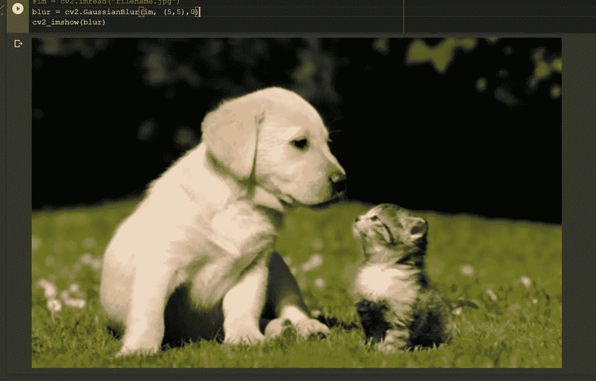
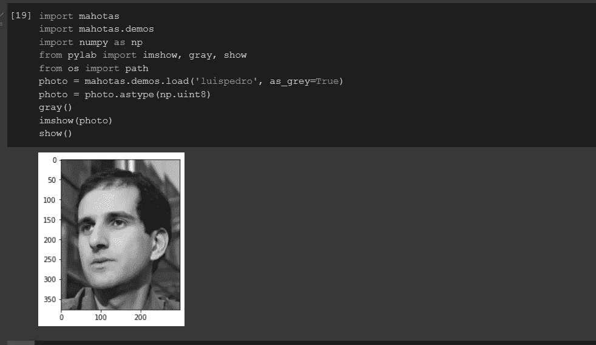

# 用于图像处理的 5 个终极 Python 库

> 原文：<https://towardsdatascience.com/5-ultimate-python-libraries-for-image-processing-13f89d32769e?source=collection_archive---------13----------------------->

## OpenCV 不是唯一的一个


照片由 [**麦克**](https://www.pexels.com/@mike-468229?utm_content=attributionCopyText&utm_medium=referral&utm_source=pexels) 发自 [**像素**](https://www.pexels.com/photo/hourglass-in-close-up-photography-1178683/?utm_content=attributionCopyText&utm_medium=referral&utm_source=pexels)

图像处理是操纵图像以从中提取特征的现象。

在当今的计算机视觉和深度学习领域，大量使用不同的图像处理算法来从图像数据集进行边缘检测、识别和分类。

有时，这些算法还会逐帧应用于视频，以从中提取特征。

在今天的文章中，我们将看看 5 个最好的 Python 库，它们可能会帮助你对图像进行操作，如裁剪、灰度化等。

# **1。** **OpenCV**

OpenCV 是用于图像处理和计算机视觉的最流行和最广泛使用的库之一。这个口头库可以用于许多编程语言，如 C、C++、Python、Java，但 Python 绑定库是最流行的一个。

使用该库不仅可以实现图像操作，还可以轻松实现与计算机视觉相关的复杂深度学习算法。open CV 最大的优点是它是跨平台的，并且可以在移动设备上运行。

> ***安装***

```
pip install opencv-python
```

对图像进行高斯模糊处理。我们将使用 Colab，因为在那里我们不需要设置环境——这里一切都是预先设置好的。

首先，让我们导入必要的包。Colab 不支持 cv2 . im show()——但是，我们有一个替代方案。

```
import cv2import numpy as npimport urllibimport urllib.request as urfrom google.colab.patches import cv2_imshow
```

现在，让我们从互联网上加载一个图像，并应用一些过滤器。



应用滤镜后的模糊图像—作者截图

# **2。** **简单 CV**

SimpleCV 是一个 python 框架，使用了 OpenCV 这样的计算机视觉库。这个库非常简单易用，对快速原型制作非常有帮助。

这个库对那些不了解不同图像处理概念的人特别有用，比如特征值、色彩空间和位深度。

> ***安装***

```
pip install SimpleCV
```

这个库可能是执行对象检测任务的更好选择。你可以找到一些令人惊奇的任务，比如使用这个库来检测一辆车是否停着。

你可以在这里了解更多关于这个库的信息。

# **3。** **枕头**

Pillow 是 Python 的一个图像处理库，派生自 PIL 或 Python 图像库。虽然它不如 openCV 强大和快速，但它可以用于简单的图像处理工作，如裁剪、调整大小、旋转和灰度图像。另一个好处是可以不用 NumPy 和 Matplotlib。

> **安装**

```
pip install pillow
```

> 要阅读 PIL 的图像，我们可以使用:

```
**from** PIL **import** Imageim **=** Image.open(r"C:\Users\System-Pc\Desktop\image1.jpg")im.show()
```

你可以在这里了解更多关于这个图书馆[的信息。](https://pillow.readthedocs.io/en/stable/)

# **4。** **Mahotas**

Mahotas 是一个用于图像处理和计算机视觉的 Python 库，最初是为生物图像信息学设计的。但是也可以使用它来执行其他计算机视觉任务。它最初是用 C++编写的，这使得它非常快，并且除了 NumPy 之外，它没有其他依赖项。

> **安装**

```
pip install mahotas
```

> 使用 mahotas 对图像进行灰度缩放:

最后，在运行代码之后，我们可以得到下面的结果。



作者添加的截图

# **5。** **pgmagick**

Pgmagick 是 GraphicsMagick 的 Python 包装器，它是用于图像操作的工具和库的集合。它支持超过 88 种格式的图像。除了图像处理工作，它还可以在 web 应用程序中用于创建新图像。

> **安装**

```
pip install pgmagick
```

> 要从图片中提取边缘:

```
from pgmagick.api import Imageimg = Image(‘lena.jpg’) #Your image path will come hereimg.edge(2)img.write(‘lena_edge.jpg’)
```

# **结论**

虽然 OpenCV 是我们将来要使用的主要图像处理库，但了解一点其他图像处理库的知识肯定是个好主意。

所有这些库都可以使您的工作流程变得更加简单，因为它们为特定的功能提供了更简单的实现。

要了解关于这些库的更多信息，您可以随时关注官方文档，也可以咨询这些库的开源社区。

> *在你走之前……*

如果你喜欢这篇文章，并且想要**继续关注关于 **Python &数据科学**的更多**精彩**文章**——请点击这里[https://pranjalai.medium.com/membership](https://pranjalai.medium.com/membership)考虑成为一名中级会员。

请考虑使用[我的推荐链接](https://pranjalai.medium.com/membership)注册。通过这种方式，会员费的一部分归我，这激励我写更多关于 Python 和数据科学的令人兴奋的东西。

还有，可以随时订阅我的免费简讯: [**Pranjal 的简讯**](https://pranjalai.medium.com/subscribe) 。