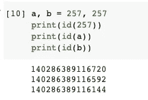

# Python 中 5 个未知的有趣事实

> 原文：<https://towardsdatascience.com/5-uncharted-interesting-facts-in-python-2f6c73d70e0?source=collection_archive---------18----------------------->


图片来自 [Pixabay](https://pixabay.com/?utm_source=link-attribution&utm_medium=referral&utm_campaign=image&utm_content=6406450)

## 需要注意 Python 的这些神秘行为

每种编程语言都会有一些奇怪的行为。这些通常不是因为 bug 或错误，而更有可能是关于一些困境的决定。就像当我们面对一些选项时，选择一个项目通常意味着放弃其他项目提供的可能性。当然，这也发生在 Python 上。

在本文中，我挑选了 Python 中几个“奇怪”的行为。我相信不是每个人都知道。希望你能喜欢阅读这些关于 Python 的有趣事实。

# 1.发电机相当懒惰


图片由[photos 为您提供](https://pixabay.com/users/photosforyou-124319/?utm_source=link-attribution&utm_medium=referral&utm_campaign=image&utm_content=2360863)来自 [Pixabay](https://pixabay.com/?utm_source=link-attribution&utm_medium=referral&utm_campaign=image&utm_content=2360863)

生成器是 Python 中最流行的语法糖之一。它允许我们定义一个对象，该对象将基于预定义的规则按需迭代和生成项目。

等等，我说的是“点播”。是的，这就是 Python 生成器相当懒的原因。先说个例子。

```
my_list = [1, 1, 2]
my_gen = (num for num in my_list if my_list.count(num) > 1)list(my_gen)
```

在上面的代码中，我们定义了一个列表，并使用这个列表来定义一个生成器。生成器将返回列表中出现不止一次的项目。为了让生成器一次性输出所有内容，我在最后将其转换为一个列表。


在`my_list`中，只有数字`1`重复了不止一次。因此，返回了两个`1`而不是数字`2`。

然而，如果我们在定义了生成器之后改变了`my_list`会怎么样呢？

```
my_list = [1, 1, 2]
my_gen = (num for num in my_list if my_list.count(num) > 1)
my_list = [1, 2, 2]list(my_gen)
```


这一次，数字`2`被返回，因为在新列表中它被重复了两次。但是，如果生成器使用新的列表，为什么它没有返回两个`2`?也许下面的例子更清楚。

```
my_list = [1, 1, 2]
my_gen = (num for num in my_list if my_list.count(num) > 1)
my_list = [3, 3, 3]list(my_gen)
```


我们应该让数字`3`重复三次，为什么生成器什么也不返回？

有趣的事实是，生成器将根据其定义执行“in”子句。然而,“if”子句是懒惰的，只在迭代时执行。换句话说，它试图找出`1`或`2`是否重复了不止一次，但是列表中只有数字`3`。所以，什么都没回。

到这里，你可能已经在其他教程中看到了，但我们可以再深入一步。你认为“in”条款发生了什么事？事实上，生成器保留了对列表对象的引用。因此，当我们给`my_list`分配一个新的列表，比如`[3, 3, 3]`时，引用的列表仍然存在，但是变量`my_list`已经改为指向新的列表。

这意味着我们可以通过修改列表对象本身来调整这个例子。那么，结果就“不诡异”了。

```
my_list = [1, 1, 2]
my_gen = (num for num in my_list if my_list.count(num) > 1)
my_list[0] = 3
my_list[1] = 3
my_list[2] = 3print('my_list ->', my_list)
print('generator ->', list(my_gen))
```


# 2.“是”不一致


图片来自 [Pixabay](https://pixabay.com/?utm_source=link-attribution&utm_medium=referral&utm_campaign=image&utm_content=362182) 的 [Ryan McGuire](https://pixabay.com/users/ryanmcguire-123690/?utm_source=link-attribution&utm_medium=referral&utm_campaign=image&utm_content=362182)

这是 Python 中一个著名的怪异例子。如果你以前从未见过，你会喜欢这个的。

```
a, b = 256, 256
a is b
```


我们让`a`和`b`都等于数字 256。然后，我们使用`is`来检查它们是否引用同一个对象。答案是真的。

但是，如果我们将数字改为 257，答案将是假的。

```
a, b = 257, 257
a is b
```


你大概知道关键词`is`和`==`不一样。前者检查两个变量是否在内存级别引用同一个对象，而后者检查实际的文字值。

因此，我们可以使用`id()`函数来验证这一点。

```
a, b = 256, 256
print(id(256))
print(id(a))
print(id(b))
```


对于数字 256，它们都指向同一个对象。

```
a, b = 257, 257
print(id(257))
print(id(a))
print(id(b))
```



但是，如果是 257，他们就不一样了。这意味着它们是位于不同内存地址的不同对象，即使它们的算术值是相同的。

怎么会这样我们可以从官方文档中找到答案:[https://docs.python.org/3/c-api/long.html#c.PyLong_FromLong](https://docs.python.org/3/c-api/long.html#c.PyLong_FromLong)。

> 当前的实现为`-5`和`256`之间的所有整数保留了一个 integer 对象数组，当你在这个范围内创建一个 int 时，你实际上只是得到了一个对现有对象的引用。

嗯，这意味着当我们启动 Python 会话时，`-5`和`256`之间的所有数字都被加载。这是为了加速执行，因为这些整数可能比其他整数使用得更频繁。

所以不管我们定义了多少个整数变量，只要在范围内，Python 都会把现有整数对象的内存地址给那个变量。然而，当我们定义一个超出这个范围的变量时，Python 必须创建一个全新的对象。这就是为什么它们会有不同的内存地址。

# 3.超越两个灵魂


图片来自 [Pixabay](https://pixabay.com/?utm_source=link-attribution&utm_medium=referral&utm_campaign=image&utm_content=2763553) 的 [suju-foto](https://pixabay.com/users/suju-foto-165106/?utm_source=link-attribution&utm_medium=referral&utm_campaign=image&utm_content=2763553)

当我第一次意识到这个 Python 技巧时，我就想到了这个名字。这是一个电子游戏的名字。不用担心，这个我就不展开了，因为不在主题之内。

让我们定义一个表示向量的列表。当我们定义一个列表时，我们可以使用星号来重复相同的对象一定的次数。

```
vector = [1] * 2
```


现在，我们有了一个矢量。让我们重复这个向量两次，得到一个矩阵。

```
matrix = [vector] * 2
```


现在，假设我们想要更改第 1 行第 1 列的元素值。

```
matrix[0][0] = 2
```


什么？为什么第二行的第一个数字被相应地更新了？如果我们想改变两行中的任何一行，另一行也会跟着改变。


问题就出在这一行代码`matrix = [vector] * 2`。当我们使用星号来复制任何对象时，它实际上并没有创建一个新的对象。换句话说，这两行引用同一个向量。

所以，我们改变其中一个，另一个也会改变。

定义这种矩阵的更安全的方法是使用常规的 for 循环。

```
matrix = [[1]*2 for _ in range(2)]
matrix[0][0] = 2
```


# 4.扩展运算符优先级教程


图片来自 [Pixabay](https://pixabay.com/?utm_source=link-attribution&utm_medium=referral&utm_campaign=image&utm_content=3217049) 的 [DaKub](https://pixabay.com/users/dakub-8222964/?utm_source=link-attribution&utm_medium=referral&utm_campaign=image&utm_content=3217049)

在这个例子中，我们可能永远没有机会像这样编写代码，但知道这一点真的很有趣。我们都知道`not True`就是`False`的意思。因此，`not True == False`。


那一定是暗示`True == not False`吧？让我们看看。


为什么？因为`==`符号测试的优先级高于`not`。我不认为我们需要了解`+, -, *, /`操作符的优先级，因为这是非常必要的。然而，这一点是很容易被忽视的。

因此，这将是正确的。

```
True == (not False)
```


# 5.秘密串连接方法


不幸的是，此时此地，我在 Pixabay 上的旅程结束了

这次，我们先来看例子。

```
print("Chris""")
print('Chris''')
```


这些是如何工作的？

我们都知道在 Python 中可以使用加号`+`轻松连接两个字符串。当我们有一个字符串列表时，使用`join()`方法也很流行。

然而，很少有人知道，我们甚至可以在 Python 中不使用任何运算符或函数来连接字符串，只需将它们放在一起。我们可以在中间放一个空格，甚至什么都不放。

```
print("Chris" "Tao")
print("Chris""Tao")
```


然而，如果我们不放任何东西，而是把一个空字符串和另一个连接起来，这个错误就会发生。

```
print("""Chris")
```


这很容易理解，Python 对多行文字使用三重引号。当它找到三重引号时，它会尝试找到另一对。如果没有其他对，它将抛出错误。

当然，我们可以在中间加一个空格，这样就可以消除误差。

```
print("" "Chris")
```


嗯，可能不是很有用，但是了解:D 真的很有趣

# 摘要


图片来自 [Pixabay](https://pixabay.com/?utm_source=link-attribution&utm_medium=referral&utm_campaign=image&utm_content=6519572) 的[Pietro carbucicichio](https://pixabay.com/users/pietrofotografie-22669930/?utm_source=link-attribution&utm_medium=referral&utm_campaign=image&utm_content=6519572)

在这篇文章中，我收集了 Python 中 5 个有趣的、不为人知的“怪异”事实。希望你喜欢这本书，并发现它们…有用…好吧，可能不是很有用，但至少有趣。

<https://medium.com/@qiuyujx/membership>  

如果你觉得我的文章有帮助，请考虑加入 Medium 会员来支持我和成千上万的其他作者！(点击上面的链接)