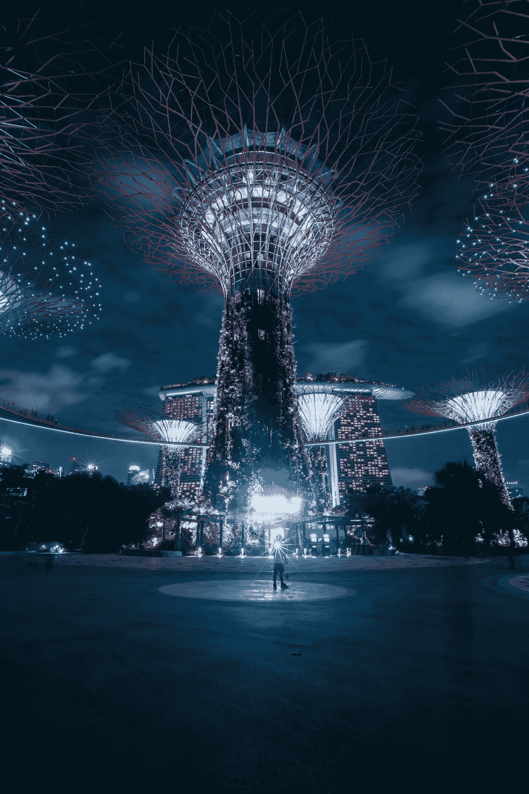
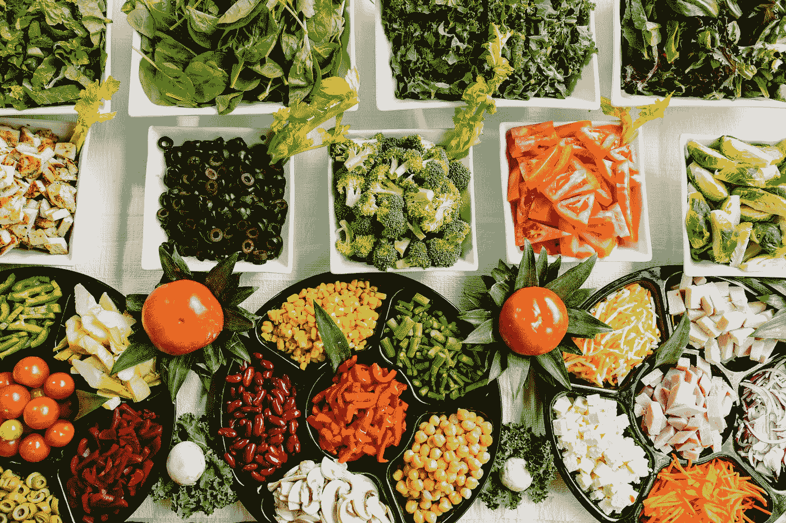

# 可能会让你惊讶的 5 个独特的人工智能用例

> 原文：<https://towardsdatascience.com/5-unique-use-cases-of-ai-that-might-surprise-you-22478aaaabaf?source=collection_archive---------19----------------------->

## 找出人工智能在现实世界中令人着迷的五个独特应用

图安·加图伊拉特·维尔戈斯在 [Unsplash](https://unsplash.com?utm_source=medium&utm_medium=referral) 拍摄的照片

> “有人称之为人工智能，但事实是这项技术将增强我们的能力。因此，我认为我们应该增强我们的智能，而不是人工智能。”
> 
> — [吉尼·罗梅蒂](https://www.bernardmarr.com/default.asp?contentID=1158)

人工智能能够在现代世界取得巨大成就。很难想象我们的日常生活没有人工智能的使用，因为从字面上看，几乎我们现实中的每一个组成部分都以某种方式象征性地使用了人工智能。

当你用手机开始新的一天时，你会自动利用各种人工智能功能。智能锁可以通过人工智能控制的模式或基于人脸识别模式的锁定系统来打开手机，以解锁智能手机设备。

然后，你开始打开其他应用程序，其中大多数应用程序以某种形式利用人工智能，如 YouTube 中的推荐系统，为你提供最合适的内容。如果你在浏览网页，你会经常发现自己在使用 autocomplete 的功能，它也使用了 AI。

当给别人发短信时，如果你犯了一个错误，你的错误通常会被自动更正等人工智能应用程序更正。为了探索数据科学和人工智能的更多日常应用，我强烈推荐通过下面提供的链接查看下面的文章。涵盖了我们日常生活中 AI 的大部分常见用例。

</10-awesome-real-world-applications-of-data-science-and-ai-6fddf3f34d74>  

毫不奇怪，人工智能在现代世界中有这些奇妙的日常应用。然而，看看当代人工智能的一些更奇特和独特的用例是耐人寻味的。

在这篇文章中，我们将试图涵盖人工智能的一些令人惊叹的应用，这些应用可能会让你感到惊讶，或者你尚未发现人工智能的这些独特的现有应用。让我们开始讨论现代社会中五种独特的应用吧！

# 1.探索宇宙中的人工智能

[乔什·戈登](https://unsplash.com/@joshgordon?utm_source=medium&utm_medium=referral)在 [Unsplash](https://unsplash.com?utm_source=medium&utm_medium=referral) 上拍照

宇宙是一个谜。在广阔无垠的宇宙中，有太多的东西我们一无所知，还有太多的东西有待发现。尽管我们有物理上的发明和发现，探索宇宙的大部分成功充其量也仅限于我们的太阳系或附近的星系。

然而，随着人工智能和各种技术进步的集成，我们可以利用人工智能的力量来揭示宇宙隐藏的真相，否则这将被认为是不可能的。人工智能对探索宇宙的主要贡献可以归功于深度学习和神经网络领域的进步。

为了讨论人工智能在探索宇宙中的一些应用，发现生成敌对网络具有创建宇宙映射的能力，该映射与人类在其理论愿景中所希望的现实期望极其相似。

这些人工神经网络还被用于创建对从用于观察极远距离的望远镜接收到的失真图像的现实解释。这些神经网络也用于火星等行星上的路虎上，通过将图像转换为人类感知的顶级视觉效果，发回高质量的图像。

要了解这个主题以及人工智能如何影响与宇宙相关的主题的定期发现，我强烈建议查看我以前的一篇文章“人工智能是破解宇宙奥秘的关键，原因如下！”从下面提供的链接。

</artificial-intelligence-is-the-key-to-crack-the-mysteries-of-the-universe-heres-why-56c208d35b62>  

# 2.人工智能在占星术、命理学和其他类似领域的应用

照片由[乔纳森·弗朗西斯卡](https://unsplash.com/@jonathan_francisca?utm_source=medium&utm_medium=referral)在 [Unsplash](https://unsplash.com?utm_source=medium&utm_medium=referral) 上拍摄

无论你是占星术、命理学或任何其他类似领域的坚定信徒，还是你并不真正关心这些领域的存在，探索人工智能对这些主题会产生什么影响都是耐人寻味和令人着迷的。

前面提到的主题和话题有一些值得考虑的吸引人的情节点。人工智能在用于这些学科时，可以创造出奇妙的结果。你是否同意它们完全取决于你的信念，但不可否认的是，人工智能在这些概念中找到了高度有益的用途。

有大量的数据可用，有了这些可用的信息，我们可以创建人工智能模型，以遇到关于这些主题的各种任务。它有可能将这些黄道十二宫和星座的主题联系起来，以提供某种科学或事实信息。最终，我们可以在人工智能的帮助下解读这些主题的现实可能性。

我强烈推荐看看下面的 [**参考**](https://medium.com/@elizabethsong65/is-astrology-real-we-used-data-science-to-find-out-a0edcd28cf93) **，**他们分析了他们在热门星座推特账户上发现的数千条推文，使用机器学习 [Bertmoticon](https://github.com/Stefanos-stk/bertmoticon) 包来预测每个星座的表情符号。如果你是人工智能对世界的潜在影响的粉丝，这绝对值得一读！

# 3.教育中的人工智能

照片由 [NeONBRAND](https://unsplash.com/@neonbrand?utm_source=medium&utm_medium=referral) 在 [Unsplash](https://unsplash.com?utm_source=medium&utm_medium=referral) 上拍摄

人工智能和教育有着密切的关系。毕竟，人工智能或数据科学可能是学生选择掌握的科目之一，并获得对这些优秀科目的进一步直觉和理解。人工智能的受欢迎程度在过去十年中显著上升，这一新兴趋势将在未来几年继续下去。然而，我们将重点关注如何利用人工智能来改善教育领域。

我第一次遇到像光学字符识别这样的人工智能技术是在我的学生时代，我们的多项选择类型问题(mcq)的答案脚本将由这些设备进行分析。可以从这些答案脚本中提取数据，并根据答案标记答案。随着现代技术的发展，光学字符识别被用于各种应用中，并且它们更加先进。这些设备的精确度已经大大提高了。

人工智能可以作为一种方法论，以更现实和独特的方式教授学生。使用现代人工智能技术，教育可以达到一个新的动态潜力，让学生享受他们正在学习的东西。这些人工神经网络，像生成对抗网络一样，可以在创建新的图像和视觉效果方面找到它们的用途，用于教授小学生各种独特的主题。

人工智能的另一个惊人用途是来自自然语言处理(NLP)领域。课程材料可以使用转换技术或注意力模型的序列到序列技术从一种语言翻译成其他语言。使用这一程序，课程内容和主题可以被更广泛的受众和学生所接触，他们可以从这种趋势中获得巨大的好处。

# 4.食品中的人工智能

照片由[丹金](https://unsplash.com/@danielcgold?utm_source=medium&utm_medium=referral)在 [Unsplash](https://unsplash.com?utm_source=medium&utm_medium=referral) 上拍摄

令人惊讶的是，人工智能甚至被用于食品行业！

人工智能的主要用途是优化和自动化流程的众多可能性。它们还有助于节省大量资金，并减少许多行业中可能发生的任何类型的人为错误。

人工智能和机器学习可以让食品行业的一大领域受益。它们可以促进餐馆、酒吧、咖啡馆以及食品制造业的发展。先进的人工智能技术还可以通过分析和执行各种计算来生成关于最佳方法的数据和信息，从而用于提高水果和蔬菜的生产质量。

用于点餐和选择食物的新 Android 和 iOS 应用程序的开发，使人们更容易更快地点餐和预订食物，只需使用智能手机设备点击几个按钮。人工智能技术的这些进步直接影响了整个食品行业。它有效地改善了食品行业的经营方式。

我强烈建议查看下面的 [**参考文献**](https://spd.group/machine-learning/machine-learning-and-ai-in-food-industry/#:~:text=The%20Benefits%20of%20AI%20in%20the%20Food%20Industry,-Recently%2C%20more%20and&text=Artificial%20Intelligence%20helps%20businesses%20to,improve%20the%20quality%20of%20yields.) ，以获得关于该主题的更多信息，并了解与以下主题相关的更复杂的细节。这篇文章包含了关于人工智能在食品行业中的使用以及人工智能和机器学习的技术进步如何彻底改变食品制造业的完整详细解释。

# 5.服装和配饰中的人工智能

照片由[克拉克街商业](https://unsplash.com/@mercantile?utm_source=medium&utm_medium=referral)在 [Unsplash](https://unsplash.com?utm_source=medium&utm_medium=referral) 拍摄

人工智能在服装和其他配饰方面的应用潜力巨大。亚马逊是利用人工智能和技术策略改善整体业务的最成功的例子之一。他们已经能够操纵人工智能的使用，通过实现客户满意度，为他们的公司提供最好的可能结果和结果。

像亚马逊这样的公司最重要的特征之一就是由这些公司提供的奇妙的推荐系统。像推荐系统这样的技术基于机器学习的原理工作，其中主要有两种类型的推荐——协作和基于内容的过滤。基于用户的偏好，一些最好的推荐被给予用户。

服装人工智能的另一个惊人特征可以归功于深度学习和神经网络的成功。生成对立网络能够创造服装和品牌的风格方法，这可能会导致一些非常流行的趋势。这些也可以用来纠正自拍的图像，使它们看起来更真实，更有吸引力。

如果你有兴趣了解更多关于如何利用人工智能的力量来改善你的营销策略，请查看下面提供的链接。

</3-ways-to-utilize-the-power-of-artificial-intelligence-for-your-marketing-today-f30b7b76feda>  

# 结论:

照片由[达维德·扎维亚](https://unsplash.com/@davealmine?utm_source=medium&utm_medium=referral)在 [Unsplash](https://unsplash.com?utm_source=medium&utm_medium=referral) 上拍摄

> “人工智能(我指的不是狭义的 AI)的进步速度快得令人难以置信。除非你直接接触过像 Deepmind 这样的团体，否则你根本不知道它的发展速度有多快——它正以接近指数级的速度增长。发生非常危险的事情的风险是在五年的时间框架内。最多 10 年。”— [埃隆·马斯克在评论 Edge.org](https://www.bernardmarr.com/default.asp?contentID=1158)时写道

人工智能无疑改变了我们生活的世界的现状，并为我们提供了许多选择来探索自然的不同元素和各种不同的领域及其各自的方面。随着人工智能在我们世界的崛起，它几乎在每个重要领域都有好处。

在本文中，我们讨论了人工智能可以发挥效用的五个独特领域和主题。各种各样的技术进步已经使人工智能成为一种动力。我们能够以前所未有的方式构建人工智能模型，并且我们能够通过这些人工智能构建获得巨大的成果。

人工智能的未来是光明的，在人工智能领域将创造更多的机会。如果你有任何其他你遇到过的人工智能的独特应用，请随时告诉我，我会确保在我的下一篇文章中包括它们。我确信人工智能会有更多精彩的用例，随着不断的发展和进步，会有更多的用例出现。

如果你对这篇文章中提到的各点有任何疑问，请在下面的评论中告诉我。我会尽快给你回复。

看看我的其他一些文章，你可能会喜欢读！

</10-best-free-websites-to-learn-programming-939ec029009b>  </best-topics-to-focus-on-to-master-data-science-as-fast-as-possible-609ce5cb05e3>  </5-reasons-why-you-should-develop-a-game-with-python-and-ai-9f5f276e7637>  </can-your-ai-have-emotions-7efc35721e12>  </working-with-object-storage-and-jupyter-notebooks-96915cba815a>  

谢谢你们坚持到最后。我希望你们喜欢阅读这篇文章。我希望你们都有美好的一天！