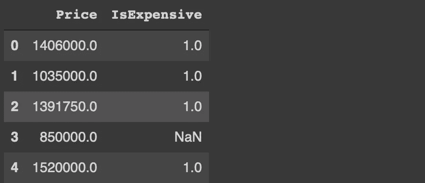
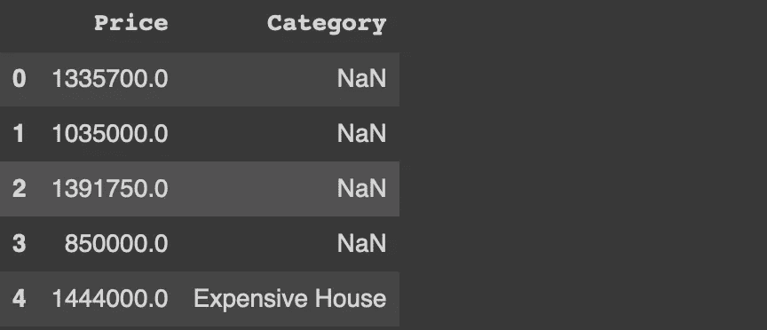
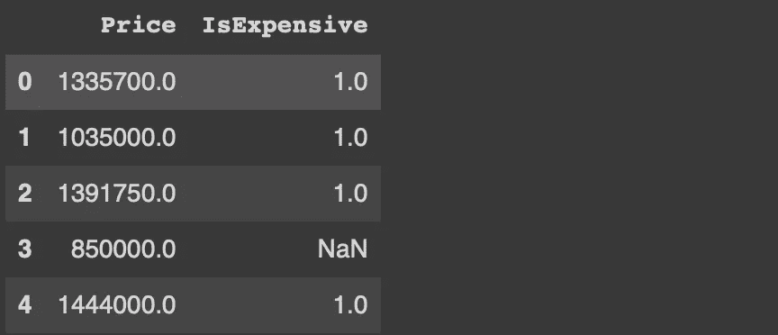

# Pandas loc 和 iloc 方法的 5 个用例

> 原文：<https://towardsdatascience.com/5-use-cases-of-pandas-loc-and-iloc-methods-a94796b1f734?source=collection_archive---------25----------------------->

## 让它们更有用。


亚历杭德罗·皮涅罗·阿梅里奥在 Unsplash 上拍摄的照片

Pandas 是一个高度灵活和强大的数据分析和操作库。它提供了许多函数和方法来在数据分析过程的每个步骤中执行有效的操作。

loc 和 iloc 是用于过滤、选择和操作数据的基本方法。它们允许我们访问数据帧中的特定单元格或多个单元格。

在本文中，我们将讨论 loc 和 iloc 的 5 个用例，我认为它们在典型的数据分析过程中非常有用。

我们将使用 Kaggle 上的墨尔本房产[数据集](https://www.kaggle.com/dansbecker/melbourne-housing-snapshot)作为例子。我们首先使用 read_csv 函数读取 csv 文件。

```
import numpy as np
import pandas as pddf = pd.read_csv("/content/melb_data.csv")print(df.shape)
(13580, 21)df.columnsIndex(['Suburb', 'Address', 'Rooms', 'Type', 'Price', 'Method', 'SellerG','Date', 'Distance', 'Postcode', 'Bedroom2', 'Bathroom', 'Car','Landsize', 'BuildingArea', 'YearBuilt', 'CouncilArea', 'Lattitude','Longtitude', 'Regionname', 'Propertycount'],
dtype='object')
```

该数据集包含墨尔本约 13580 所房屋的 21 个要素。

## 示例 1

之间的主要区别在于它们访问行和列的方式:

*   loc 使用行和列标签
*   iloc 使用行和列索引

让我们使用这两种方法来选择地址列中的第一行。

```
df.loc[:5, 'Address'] # df.loc[0:5, 'Address'] works as well
0        85 Turner St 
1     25 Bloomburg St 
2        5 Charles St 
3    40 Federation La 
4         55a Park St 
5      129 Charles St df.iloc[:5, 1]
0        85 Turner St 
1     25 Bloomburg St 
2        5 Charles St 
3    40 Federation La 
4         55a Park St
```

您可能已经注意到，我们使用相同的表达式来选择行。原因是 Pandas 默认分配整数行标签。因此，除非我们指定行标签，否则行的索引和标签是相同的。唯一的区别是上限包含在 loc 方法中。

列索引也从 0 开始，因此地址列的索引是 1。

## 示例 2

我们不必指定一个范围来选择多行或多列。我们也可以在列表中传递它们。

```
df.loc[[5,7,9], ['Address', 'Type']]df.iloc[[5,7,9], [1,2]]
```


(图片由作者提供)

我们选择了地址和类型列中标签(或索引)为 5、7 和 9 的行。

## 示例 3

我们可以使用 loc 方法创建一个新列。让我们创建一个列，对于价格超过 100 万英镑的房屋，该列的值为 1。因为每个数据点(即行)代表一所房子，所以我们将条件应用于价格列。

```
df.loc[df.Price > 1000000, 'IsExpensive'] = 1
```

对于满足条件的行,“IsExpensive”列为 1，对于其他行为 NaN。

```
df.loc[:4, ['Price','IsExpensive']]
```



(图片由作者提供)

## 实例 4

loc 方法接受多个条件。让我们创建一个名为 category 的新列，对于价格高于 140 万且类型为“h”的行，该列的值为“昂贵的房子”。

```
df.loc[(df.Price > 1400000) & (df.Type == 'h'), 'Category'] = 'Expensive House'df.loc[:4, ['Price','Category']]
```



(图片由作者提供)

我们可以稍后处理 NaN 值。例如，Pandas 的 fillna 函数提供了处理缺失值的灵活方式。我们还可以使用 loc 方法根据其他条件来填充缺失的值。

## 实例 5

我们可以使用 loc 方法根据条件更新现有列中的值。例如，下面的代码将对高于 140 万美元的价格应用 5%的折扣。

```
df.loc[df.Price > 1400000, 'Price'] = df.Price * 0.95df.loc[:4, ['Price','IsExpensive']]
```



(图片由作者提供)

我们也可以使用 iloc 方法来完成这项任务，但是我们需要提供 price 列的索引。因为使用列标签比使用索引更方便，所以对于此类任务，loc 方法比 iloc 方法更可取。

## 结论

由于现实生活中的数据通常是混乱的或者不是最合适的格式，数据科学家或分析师最常见的任务之一就是清理和处理数据。

拥有一种灵活的方法来访问行和列以完成这样的任务是至关重要的。loc 和 iloc 方法正是我们在这些情况下所需要的。

感谢您的阅读。如果您有任何反馈，请告诉我。