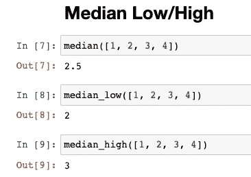

# 用 Python 计算平均值的 5 个有用技巧

> 原文：<https://towardsdatascience.com/5-useful-tips-for-calculating-average-in-python-7e77380fb15e?source=collection_archive---------27----------------------->


由 [Danganhfoto](https://pixabay.com/users/danganhfoto-14195971/) 在 [Pixabay](https://pixabay.com/photos/seascape-landscape-beach-coast-4844697/) 上拍摄的照片

## 它不可能既准确又快速

测量数据集的集中趋势是探索性数据分析最常用的技术之一。在这篇文章中，我不会重复什么是均值，中位数和众数，因为这些是基本的统计知识，很容易通过谷歌搜索找到。相反，我将重点介绍 Python 统计库。

*   它提供了哪些很酷的功能？
*   为什么我们仍然需要 Numpy 上的统计库？
*   基于不同的问题，测量数据集中心的其他方法有哪些？

在本文中，提供的所有代码都假设所有函数都是从统计库导入的，如下所示。

```
from statistics import *
```

# 0.基本用法


照片由 [PublicDomainPictures](https://pixabay.com/users/publicdomainpictures-14/) 在 [Pixabay](https://pixabay.com/photos/drink-cocktail-beach-beverage-84533/) 上拍摄

在开始引入任何库之前，我们不能绕过基本用法。为了测量数据集的中心，统计库提供了所有三种方法。

1.  Mean，基本上是数据的平均值。

```
mean([1, 2, 3, 4])
```


2.中位数，即排序后数据集的中间数。

```
median([1, 2, 3, 4])
```


3.模式，它是数据集中出现频率最高的值。

```
mode([1, 2, 3, 4, 4])
```


基础的就不多解释了。然后，让我们关注一下统计库提供了什么样的特性。

# 1.低/高中位数


由 [cocoparisienne](https://pixabay.com/users/cocoparisienne-127419/) 在 [Pixabay](https://pixabay.com/photos/aircraft-double-decker-oldtimer-2795557/) 上拍摄的照片

基于“中间”数的定义，很明显，它要么是中间的数(如果元素总数是奇数)，要么是中间两个数的平均值(如果元素总数是偶数)。

然而，我们有这样的要求并不罕见。也就是说，我们希望使用中间数，但它必须存在于数字列表中。

通常情况下，得到这个数字不会很简单。例如，我们可以先得到中间数，然后尝试在列表中找到比它大或小的数。或者，我们也可以使用列表的总计数，然后得到中间的索引。因此，我们可以根据指数得到低或高的中位数。

有了统计库，我们实际上不必这样做，因为它提供了开箱即用的功能。

```
median_low([1, 2, 3, 4])
median_high([1, 2, 3, 4])
```



# 2.多模式


由 [sasint](https://pixabay.com/users/sasint-3639875/) 在 [Pixabay](https://pixabay.com/photos/boy-scout-scouting-asia-same-1822631/) 上拍摄的照片

在我的工作中，我接触过这样一个实际的案例。我们有一个字符串列表，我们需要得到列表中出现频率最高的字符串。然而，具有最高频率的字符串不能保证是唯一的。有时，有两个或更多。

那时，当模式不唯一时，将抛出“StatisticsError”。令人高兴的是，在 Python 3.8 中，通过返回第一个模式，这个问题已经得到了解决。

```
mode(['a', 'b', 'c', 'c', 'd', 'd'])
```


但是，如果我们想保留所有的模式呢？在上述情况下，我们应该有两种模式，即“c”和“d”。在这种情况下，我们可以使用 Python 3.8 中的`multimode()`函数。

```
multimode(['a', 'b', 'c', 'c', 'd', 'd'])
```


# 3.快速均值


图片由 [herbert2512](https://pixabay.com/users/herbert2512-2929941/) 在 [Pixabay](https://pixabay.com/photos/powerboat-speed-speedboat-fast-2784250/) 上拍摄

从 Python 3.8 开始，增加了一个名为`fmean()`的新函数。这个名字应该解释为“快速的意思”。基本上，它会比正常功能`mean()`更快。我相信你会有几个问题，让我一一回答，希望你不会再有问题了:)

## 3.1 为什么快速均值更快？

快速平均会在计算前将所有数字转换成浮点型。因此，使用`fmean()`总会给我们一个浮点数作为结果，但`mean()`不会。

```
mean([1, 2, 3, 4])
fmean([1, 2, 3, 4])
```


但是，请注意，这并不是**而不是**的意思

*   浮点运算速度更快
*   `fmean()`和`mean()`性能对于所有浮点数都是相同的

不同之处在于`fmean()`使用简单但快速的浮点数学，而`mean()`执行复杂得多的程序来实现最大可能的精度，甚至以牺牲性能为代价。

## 3.2 如果原始均值函数更慢，为什么我们还需要它？

其实就像我的小标题说的，性能和准确性，我们是不可兼得的。这意味着，由于`fmean()`函数比`mean()`快得多，它牺牲的精度非常小。

我们可以说`fmean()`还是很准的，除了处理分数。

```
from fractions import Fractionmean([Fraction(1, 2), Fraction(1, 3)])
fmean([Fraction(1, 2), Fraction(1, 3)])
```


该示例显示分数在`fmean()`中被转换为浮点数。`mean()`函数不仅要将所有数据转换成精确的值，还要监控“最佳”类并返回相同的值。

基本上，`fmean()`在正常情况下仍然非常准确，但是如果你的数据是分数，mean 会给你一个数学上完美的结果。

## 3.3 fast mean 有多快，跟 Numpy 比一下怎么样？

我们可以在这里做一个简单的实验。首先使用 Numpy 生成 100k 随机浮点数。

```
import numpy as nparr_float = np.random.random(100000)
```

然后，测试三个不同的函数。

```
mean(arr_float)
fmean(arr_float)
np.mean(arr_float)
```


在上面的例子中，我们可以看到`fmean()`比`mean()`快 20 倍左右，而 Numpy 均值函数比`fmean()`快 150 倍。如果我们真的关心精确度，我们可能不会选择 Numpy 均值。让我给你看另一个例子。

假设我们有这样一个数字列表。

```
[1e20, 1, 3, -1e20]
```

很明显，这 4 个数的和应该是 4，所以平均值应该是 1。让我们看看每个均值函数的行为。


在这种极端情况下，Numpy mean 会因为成对求和算法而失去准确性，该算法显著降低了计算成本，但引入了一些“可接受的”舍入误差。

你的用例是否会“接受”这样的不准确，这是你的决定。

# 4.几何平均值


照片由 [stevepb](https://pixabay.com/users/stevepb-282134/) 在 Pixabay 上拍摄

我们在许多情况下使用“平均”一词。然而，这并不总是意味着我们需要计算“算术”平均值。考虑下面的问题。

> 第一年增长 10%，第二年下跌 20%，第三年再增长 30%的基金。
> 
> 该基金在过去三年的平均表现如何？

我们可以说`mean([0.1, -0.2, 0.3]) = 0.067 = 6.7%`吗？这是不对的。在这种情况下，我们应该使用几何平均数。

```
geometric_mean([(1+0.1), (1-0.2), (1+0.3)]) - 1
```


因此，这只基金的平均业绩约为 4.6%。

# 5.调和平均值


照片由 [mibro](https://pixabay.com/users/mibro-8455312/) 在 [Pixabay](https://pixabay.com/photos/car-racing-race-track-n%C3%BCrburgring-4394450/) 上拍摄

另一种平均值是调和平均值。考虑下面的问题。

> 我们正在开车。前 10 分钟，我们的速度是 60 公里/小时，然后在接下来的 10 分钟里，我们将速度提高到 80 公里/小时。然后，我们到了。
> 
> 我们的平均速度是多少？

当然，我们不能说[60，80]的算术平均数是 70 所以平均速度是 70。这是错误的。

在这种情况下，我们应该使用调和平均数。

```
harmonic_mean([60, 80])
```


所以 20 分钟内我们的平均速度大概是 68.57km/h。这也告诉我们超速对更快到达目的地没有太大的帮助。所以，还是安全驾驶吧:)

# 摘要


由 [Pixabay](https://pixabay.com/photos/beach-ocean-sea-coast-sunset-5660459/) 上的 [lamorimfotografia](https://pixabay.com/users/lamorimfotografia-18553138/) 拍摄的照片

在本文中，我介绍了 Python 内置统计库的几个重要函数。它提供了许多很酷的功能，如低/高中值和多模式，允许我们灵活地测量数据集的中心。此外，快速均值函数为我们提供了一种更快的方法来计算算术平均值，并且在大多数情况下不会损失准确性。此外，它提供了除算术平均值之外的一些现成的平均值函数。

<https://medium.com/@qiuyujx/membership>  

**如果你觉得我的文章有帮助，请考虑加入灵媒会员来支持我和成千上万的其他作家！(点击上面的链接)**