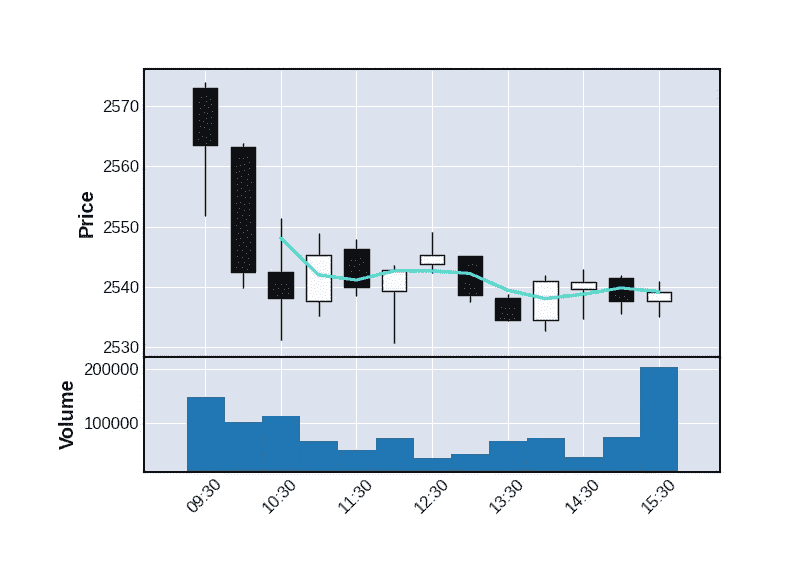

# Python 的 5 个可视化库

> 原文：<https://towardsdatascience.com/5-visualization-libraries-for-python-7705527bcf99?source=collection_archive---------27----------------------->

## Matplotlib、Pandas、Seaborn、Plotnine 和 MplFinance 都有它们的长处——让我们感受一下它们


图表示例—按作者分类的图片

可视化是数据通信的关键。无论你是想让你的老板、客户还是同事明白你的意思，一张精心制作的图表通常比一张数字表更能清楚地表达你的观点。

Python 有很多图表库，但我将快速浏览一下我最喜欢的 5 个。

Matplotlib 是 Python 可视化库的始祖，也是我考虑的所有可视化库的基础。但是 Matplotlib 可能有点笨拙，为了简化事情，其他库都是在它的基础上构建的。

每个库都有自己的优势:Matplotlib 灵活而强大，Pandas 绘图简单，Seaborn 适合统计图表，Plotnine 实现 R 的 ggplot 和图形语法，而 MplFinance 专门针对金融数据。

我希望给你一个他们每个人的味道。

但首先我们需要一些数据来绘图。

# Gapminder 数据

Gapminder 是一个致力于消除公众对全球趋势误解的组织，它的网站非常值得一去。它在其任务中使用了大量的数据集，我们将在这里使用其中的一些数据。这是一个从 1952 年到 2007 年每个国家的人口、预期寿命和人均 GDP 的表格。该数据由 Github 上的 Jenny Bryan*主持。

我们这样设置数据源的 url:

```
popDataURL = "https://raw.githubusercontent.com/jennybc/gapminder/master/inst/extdata/gapminder.tsv"
```

然后把数据下载到熊猫的数据框架中。

```
import pandas as pd
popData = pd.read_csv(popDataURL,
   delimiter='\t', 
   dtype=({'year':int})) popData['pop']=popData['pop']/1000000
```

我将人口数除以 100 万，以便在下面的图表中让数字更清晰一些。我将*年*列改为整数，而不是浮点数，以便于比较。数据帧看起来像这样:


数据框架—作者提供的图像

这里的数据太多了，所以我将数据分为西班牙、英国、印度和美国的子集，如下所示:

```
SpainData = popData[popData['country']=='Spain']
UKData = popData[popData['country']=='United Kingdom']
IndiaData = popData[popData['country']=='India']
USData = popData[popData['country']=='United States']
```

我们将在下面的例子中使用这些子集。

# Matplotlib

如果你不能在 Mathplotlib 中做你想做的事情，那么你也不能在其他任何库中做。Matplotlib 是我将讨论的其他每个库的基础，因此下面的所有示例都可以用 Matplotlib 进行编码——然而，其他库使生活变得更加方便。

因此，在继续之前，让我们从一个非常简单的 Matplotlib 示例开始。

我在这个例子中使用了`UKData`数据框架，并绘制了过去几十年的人口增长图。代码很简单:首先我们导入库(当然)，接下来我们用 *x* 和 *y* 数据指定绘图，这些数据是 dataframe 中的‘year’和‘pop’列(使用默认参数我们得到一个线图)，然后我们为 x 和 y 轴设置标签，最后，我们调用方法`plt.show()`显示下图。

```
import matplotlib.pyplot as plt
plt.plot(UKData['year'],UKData['pop'])
plt.ylabel('Population in millions')
plt.xlabel('Year')
plt.show()
```


Matplotlib 图表示例—作者图片

在本例中，Matplotlib 期望以类似数组的参数给出数据——在本例中，我们以 Pandas 列(实际上是 Pandas 系列)的形式提供了 *year* 和 *pop* 数据。我们也可以传递普通的 Python 列表或 Numpy 数组。

这是另一个例子:散点图。

```
data = popData[popData['year']==2007]plt.scatter('country', 'gdpPercap', s='pop', data=data)
plt.xticks([])
plt.xlabel('Countries')
plt.ylabel('GDP Per Cap')
plt.show()
```


Matplotlib 散点图示例—作者图片

在这种情况下，数据只需要一个参数——2007 年的数据——我们指定 Pandas dataframe 列为 *x* 和 *y* 值。`s`参数是散点图中圆点的大小，它使用 *pop* 列的值，所以人口越多，圆点越大。我还取消了 x 轴上的记号，因为有太多的国家名称，它们将无法阅读。

Matplotlib 有很多内容，但这是我们将把重点放在其他库上的地方。

# 熊猫情节

Pandas 绘图功能提供了一组简单的基本绘图功能。使用 Pandas plot，您可以创建折线图、条形图和散点图、箱线图和直方图，当然，它完全集成了 Pandas dataframes。

为了从一个数据帧创建一个图，我们调用该数据帧的`plot()`方法，并从数据帧中以列的形式提供 *x* 和 *y* 数据。

这是美国人均 GDP 的线图，只有一行代码。

```
USData.plot.bar(x='year',y='gdpPercap')
```

注意，我们在前面创建数据帧时导入了 Pandas 库。


熊猫图表示例—作者图片

你可以在以前的文章中读到更多关于熊猫密谋的内容:

</plotting-with-pandas-an-introduction-to-data-visualization-8bd7c0831650>  

# 海生的

当谈到统计图表时，Seaborn 接管了熊猫停止的地方。下面是西班牙人口随时间变化的曲线图。这不是我们在前面的例子中看到的简单的线形图，这是 Seaborn *regplot* 的散点图，其中包含一条回归曲线。

下面的代码用线性回归绘制了数据，但是，正如您可能看到的，数据并不真正符合直线模型。

```
import seaborn as sns
sns.regplot(x="year", y="pop", data=SpainData)
```


Seaborn regplot 示例-作者提供的图像

我特意选择西班牙在这里绘图，因为我碰巧知道那里的人口增长不是线性增长，而是在过去几年中逐渐放缓。因此，线性回归并不真正符合数据。通过改变回归的顺序，我们可以更好地了解数据的变化方式。它默认为 *1* ，一个线性回归，但是这里我们将把它改为 *2* ，这给了我们一个二次曲线。我还关闭了*置信区间*、`ci=None`。

```
sns.regplot(x="year", y="pop", data=SpainData, order=2, ci=None)
```


Seaborn 二阶正则图示例—作者提供的图像

二次曲线并不完全符合数据，但它给出了放缓趋势的更好印象。Seaborn 不允许您出于预测目的提取模型； *regplot* 仅用于说明目的。Seaborn 自己建议，如果你想这样做，你应该使用 Python 的 *Statsmodels* 库。

Seaborn 包括几种统计图表类型，但对于简单的线形和条形图表，Pandas plot 可能更适合。

# 普洛特宁

Plotnine 是 Python 中 *ggplot2* (众所周知的 R 图形包)的实现。它采用分层的方法来定义一个图。在下面的示例中，第一行代码指定了数据源，第二行代码指定了图形(折线图)的类型以及线条的大小和颜色。剩下的几行添加一个内置主题，修改该主题以改变图形的大小，最后为图形设置一个标题。

```
from plotnine import *(ggplot(IndiaData,aes('year','pop'))
 + geom_line(color='Blue',size=2)
 + theme_light()
 + theme(figure_size=(6,3))
 + ggtitle('India Population Growth')
)
```


示例 Plotnine 图表—按作者分类的图像

这种构建图表的方式非常令人满意，并且在所有图表类型中都是一致的。这是另一个例子，演示了如何将多个方面构建到一个图形中。

```
(ggplot(popData, aes('year','pop', fill='continent'))
 + geom_col(show_legend=False)
 + facet_wrap('continent', scales='free')
 + theme_light()
 + theme(panel_spacing=0.5, figure_size=(10,5))
)
```


示例多面图九个图表—作者提供的图像

最后是一个类似于 Matplotlib 中早期示例的图形，但是增加了颜色(代表国家所在的大陆)。这给了我们一个相当混乱的数字，所以我选择了 *void* 主题，它基本上移除了所有的标签、记号等等。然后添加了垂直标签和基线。

```
(ggplot(popData[popData['year']>=2007], aes('country','gdpPercap',size='pop',color='continent'))
 + geom_point()
 + theme_void()
 + theme(axis_line_x=element_line(), axis_title_y=element_text(rotation=90))
 + ggtitle('Countries')
)
```


Plotnine 散点图示例—作者图片

结果并不完美，但围绕主题进行一些调整可能会得到更好的结果。

Plotnine 允许您绘制任意数量的图表类型，这些图表类型是由标准组件构建的，如果您来自 R 背景，这可能是一个不错的选择。

我在这里写了更多关于 Plotnine 的内容:

</ggplot-grammar-of-graphics-in-python-with-plotnine-2e97edd4dacf>  

# MplFinance

Mplfinance 专门针对金融数据，并希望这些数据是标准格式的。它允许的图表数量相对有限，但也是针对有限的领域。

在这里，我举例说明了最全面的图表。它是一组显示一段时间内股票价格变动的盒须图和显示同一时期交易量的条形图的组合。

我们不能在这个库中使用我们的 Gapminder 数据，所以我包含了 *yfinance* 库，它从雅虎财经抓取数据，并为 Alphabet(谷歌的母公司)提取一天的数据。每 30 分钟给出一次价格。

```
import yfinance as yp
import mplfinance as mpf

googl = yp.Ticker('GOOGL')
df = googl.history(period="1d", interval="30m")

mpf.plot(df,type='candle',mav=3,volume=True)
```



Mplfinance 图表示例—作者图片

Mplfinance 显然是一个专业产品，不适合一般用途。但是如果你感兴趣的是财务数据，这是一个很好的易用的软件包。

# 结论

选择图表库的一些原因将是个人的:如果你喜欢 *ggplot2* 使用的*图形语法*方法，那么 Plotnine 将是你的一个好选择。对于简单明了的图形，熊猫内置的绘图是一个很好的选择，而且编程简单。另一方面，Seaborn 不太适合简单的图表，但是它为统计图表提供了很多选择。Mplfinance 擅长它所做的，但不适合一般的图形。

最后，由于我看到的所有库都是基于 Matplotlib 的，所以您可以使用 Matplotlib 来生成其他库支持的任何图表。不过，要做到这一点，你需要理解 Matplotlib 的复杂性，并且需要做更多的编程工作。

最后，你可能会问自己，为什么我忽略了 Plotly、Bokeh 或 Altair。主要原因是它们是不同的库系列，更适合于基于 web 的应用程序，而我所看到的那些库更适合于生成静态文档。

感谢您的阅读，我希望这激起了您的兴趣，您会想要探索这些图书馆提供的机会。

如果你想知道我什么时候发表其他文章，请考虑在这里订阅我的免费和不定期简讯。

# 密码

你可以在我的 [Github 页面](https://alanjones2.github.io/Alan-Jones-article-code/)上找到一个 Jupyter 笔记本，上面有所有上述代码以及我的其他文章中的代码。

# *致谢

我们使用来自 Jennifer Bryan 维护的 Github 库的数据，该库可以在 https://github.com/jennybc/gapminder 找到。

原始 Gapminder 数据也可以在[http://www.gapminder.org/data/](http://www.gapminder.org/data/)找到

Gapminder 的数据是在知识共享署名 3.0 无版权许可下发布的。