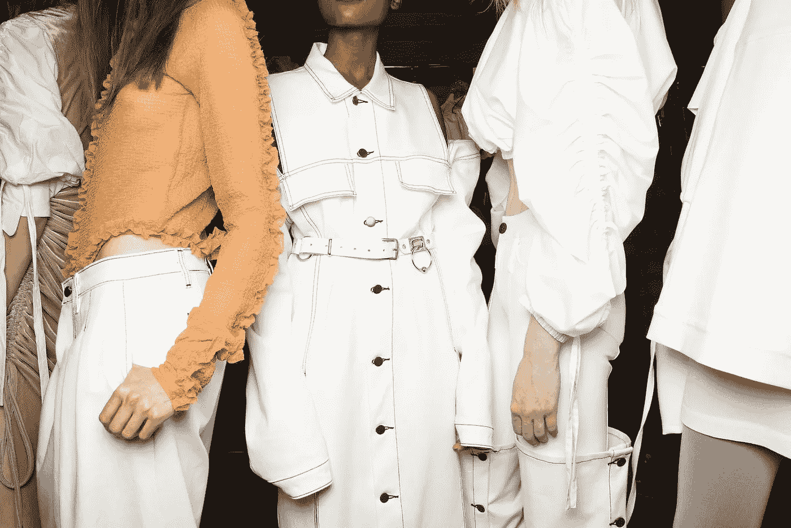
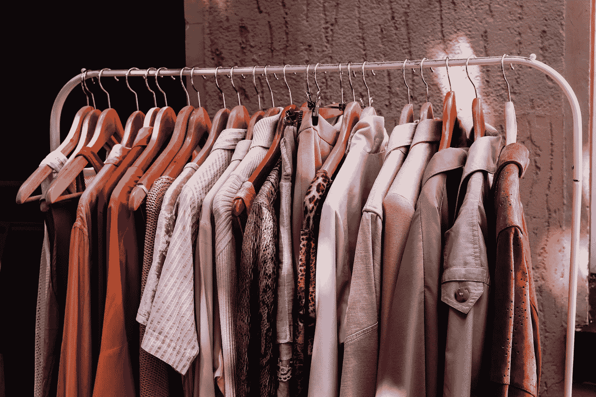
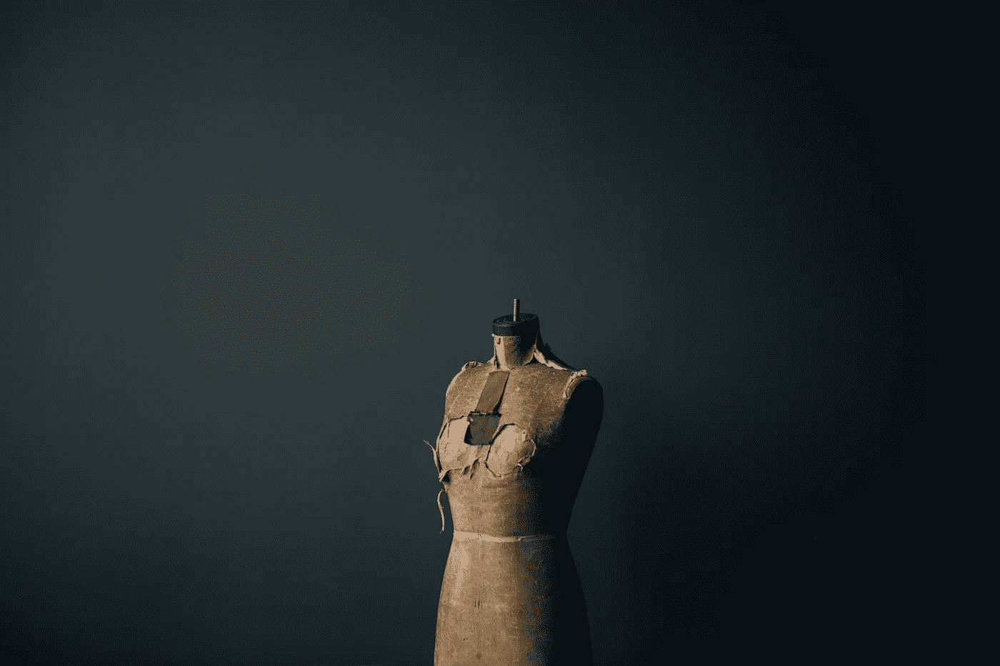

# 人工智能改变时尚产业可持续发展的 5 种方式

> 原文：<https://towardsdatascience.com/5-ways-ai-is-transforming-the-fashion-industry-for-sustainability-bfd3bb1fc00a?source=collection_archive---------11----------------------->

来源: [Unsplash](https://unsplash.com/photos/LI_8-X9cei0)

> “时尚是一门关于外表的科学，它激发一个人渴望看起来更好，而不是更真实。”——亨利·菲尔丁。

G 从 2020 年到 2021 年以 5.8%的速度增长，(IBISWorld，2021)在新冠肺炎期间，全球服装制造业的扩张并没有停止，这要归功于我们让自己跟上最新时尚潮流的愿望。虽然麦肯锡报告称，2021 年时尚行业的收入下降了 20%(麦肯锡&公司，2021)，但这主要是由于中小型企业的关闭，这些企业因财务困境而被迫退出市场，导致市场更大的不平等。虽然市场正在经历混乱，但时尚产业本身也加剧了全球灾难的风险。

时尚产业从多个方面对我们的星球产生了巨大的影响。从纤维生产，到设计、生产、交付、使用和用后处理，其价值链的每个阶段都加剧了可持续性危机。

根据[联合国环境规划署](https://www.unep.org/news-and-stories/story/putting-brakes-fast-fashion)的数据，全球 20%的废水来自纺织品染色。(环境署，2021 年)全球 10%的碳排放来自服装业，此外，24 %的杀虫剂和 11 %的杀虫剂来自棉花种植。(艾伦·麦克阿瑟基金会，2017 年)。虽然它的生产对环境是毁灭性的，但我们不可持续的消费习惯和我们处理服装的方式使它变得更糟。从 2000 年到 2015 年，服装销售额翻了一番，从每年 1000 亿件增加到 2000 亿件，而一件衣服的平均穿着次数总体下降了 36%。(艾伦·麦克阿瑟基金会，2017 年)。服装行业生命周期的线性使得**“购买—穿着—处理”**成为标准做法。

这不是我们第一次意识到时装业需要朝着可持续发展迈出大步。早在 2018 年，麦肯锡就已经将“可持续发展可信度”确定为 2018 年的 10 大时尚议程之一，当然，走向未来，“循环纺织品”也包括在 2022 年的议程中。这是一个长期未解决的问题，但进展缓慢。2020 年《Vogue》时尚奖得主穆罕默德·本切拉尔(Mohamed Benchellal)说 ***“这不仅仅是关于服装的可持续性；这个行业的整个商业模式是不可持续的。在 t 台上，在我们的衣柜里，在无休止的堆积中，需要发生革命，而不是渐进的步骤。***

但是改变商业模式并不容易，我们能够利用数字技术加快转型的步伐吗？这里有几个潜力。

## 1.营销活动和时装秀走向虚拟化

莫斯奇诺的虚拟时装秀

在麦肯锡的 2019 年服装 CPO 调查中，83%的受访者认为到 2025 年 ***实物样品的使用频率将低于虚拟样品。*** 事实上，由于新冠肺炎，转变发生得比我们预期的要快。对于大型奢侈品牌来说，许多时装秀已经以创造性的方式虚拟化了。 [***莫斯奇诺*** 创造了一场“玩偶时装秀”](https://www.youtube.com/watch?v=EQQE9PrcIDo&t=501s)，可爱的玩偶大小的服装由提线木偶玩偶在 t 台上展示，节省了举办真人 t 台所需的材料和资源。虽然这没有使用人工智能，但它表明**即使是那些在客户体验中建立大部分品牌价值的奢侈品牌，也愿意转移到虚拟世界，用更少的资源做更多的事情。**

来自[爆发](https://burst.shopify.com/market?utm_campaign=photo_credit&utm_content=Browse+Free+HD+Images+of+Metal+Clothing+Rack+With+Warm+Colored+Clothing&utm_medium=referral&utm_source=credit)的[托马什·胡斯托莱斯](https://burst.shopify.com/@txh?utm_campaign=photo_credit&utm_content=Browse+Free+HD+Images+of+Metal+Clothing+Rack+With+Warm+Colored+Clothing&utm_medium=referral&utm_source=credit)的照片

有了人工智能，我们能够制作 3D 数字时装模型。(在我看来，他们看起来甚至比人体模型更具视觉吸引力。)制作者<https://www.thefabricant.com/sustainability>*就是这样一家——它是“世界上第一家数字时装屋”，据报道在设计和开发阶段用**数字样品取代实体服装，极大地减少了该品牌高达 30%的碳足迹。**与知名品牌如**彪马、**阿迪达斯、 **Aape** 合作，可以减少广告服装生产过程中产生的二氧化碳污染、水资源浪费和有毒化学物质污染，这些在传统做法中会被浪费掉，因为它们不能转售给消费者。*

## *2.虚拟试衣间和更好的定制减少退货并增强顾客体验*

**

*照片由[马太·亨利](https://burst.shopify.com/@matthew_henry?utm_campaign=photo_credit&utm_content=Browse+Free+HD+Images+of+Slow+Fashion+Dress+From&utm_medium=referral&utm_source=credit)发自[突发](https://burst.shopify.com/sewing?utm_campaign=photo_credit&utm_content=Browse+Free+HD+Images+of+Slow+Fashion+Dress+From&utm_medium=referral&utm_source=credit)*

*一个更隐性的污染源是价值链中的**交付**环节，例如，在中国，运输效率极高且成本低廉，如果你不确定产品是否合适，退货比一开始就不买是更好的选择。不必要的污染结果。*

*从以前的潜力延伸，随着 3D 虚拟模型技术的出现，**每个人的虚拟试衣间**很快就会出现。人工智能可以帮助我们精确地测量我们的尺寸，并相应地调整数字模型。[***MySize***](https://mysizeid.com/)开发了这样的技术，只需一个智能手机摄像头就可以实现这些，帮助顾客在网上购物时**购买正确尺寸的服装。***

*此外，**推荐系统和基于人工智能的个性化风格正在提升客户的在线购物体验。** [Stitch Fix](http://www.stitchfix.com) 使用初始风格测验，结合来自客户个人特征、服装特征、修复后反馈、与服务和商品数据的历史交互的数据点，为客户创建风格档案，以开发预测算法。这简化了传统上令人沮丧的在线搜索适合你风格的衣服的体验，减少了不满意和退回不合适衣服的机会。*

## *3.推动二手市场*

*为了接受循环经济的原则并延长产品的生命周期，更多的新新人类正在拥抱二手服装市场，预计该市场将从 2018 年的 240 亿美元快速增长到 2023 年的 510 亿美元。人工智能有潜力从各种不同的角度改善二手服装市场的客户体验，包括**更可靠的定价，更个性化的用户体验，更好的造型服务**，当然，正如我们之前介绍的，**更精确的尺寸**。由[***RISE***](https://www.ri.se/en/our-stories/ai-sets-the-price-in-second-hand-stores)*发起的一个项目允许 AI 研究服装广告，以开发自己的定价模型，从二手产品的大量广告中学习，它识别与特定价格水平相关的特征，帮助它建立可靠的价格预测模型。可信的定价反过来让更多的顾客放心地参与二手服装市场。**

**让我们来探索一下 [thredUP](https://www.thredup.com/impact#recirculate) 是如何撼动这个行业的:Vue.ai 提供的人工智能服务被用来使用图像识别来处理图像，根据图案、颜色、时尚前沿来提供准确的定价和标记，这使得他们的处理中心更加高效，每天可以处理 10 万个独特的项目。为了进一步减少浪费和退货，thredUp 提供盒子服务，发送 10 件由设计师亲手挑选的物品。设计师使用人工智能来帮助他们根据消费者以往的历史和时尚趋势，以高速度和准确性完成订单。**

## **4.出租时尚遇上 AI**

****提高服装利用率**被循环纤维倡议确定为更可持续纺织经济的目标之一。我们都知道我们花了 100 英镑为我们最好的朋友的婚礼买了一件最华丽的晚礼服，而我们下一次穿它是在 10 年后。为特殊场合买衣服对我们的钱包和地球来说都是一种痛苦。**时尚租赁**是一个解决方案，可以帮你节省购买几乎是一次性使用的昂贵服装的费用，还可以节省数百万件未充分利用的服装。2021 年末， [***租跑道***](https://www.renttherunway.com/)——一家租时尚电商平台上市，标志着租时尚市场的一个重要里程碑。该平台采用会员制订阅模式，允许客户以固定的月租价格租赁服装。其工程总监迈克·利伯兰特阐述了人工智能是如何集成到其仓库中的。为了扩大该系统的规模，并更快地释放库存，以便客户可以租赁它们，机械臂需要在分类时自动识别退回衣服的材料和相应的清洁方法。**实现了最短的入站处理时间，从而最大限度地发挥了衣物的再利用潜力及其对环境的益处。****

## **5.人工智能销售预测防止囤积**

**最后一个潜力可能是业内最广为人知和最广泛采用的实践。随着时尚潮流每天都在变化，快速时尚产业制造了巨大的浪费。人工智能在这方面最明显的一个用例是**使用高级数据分析和机器学习销售预测来更好地预测销售、服装趋势、客户行为，并减少每季未售出的服装数量。为了节约成本和保护环境，人们在这一领域进行了大量的研究，以使其完美无瑕。****

**M 我所强调的任何潜力都是**相辅相成**的，例如 ***MySize*** 正在为二手服装开发其功能的专门版本。找到技术、时尚和环境之间的共同点应该能够改变世界第二大污染者，并确保外观和可持续性可以同时实现。**

# **关于我**

**我是世界可持续发展规划师学会的会员，目前在联合国教科文组织香港协会及其秘书处-香港可持续发展教育学会工作。在伦敦大学学院攻读统计学学位期间，我对可持续发展和技术有着强烈的热情。因此，我致力于撰写和发表与可持续发展目标、人工智能和区块链等创新技术以及经济学相关的文章。我渴望将数字技术和可持续发展结合在一起，激励更多的人为所有人创造更美好的未来。**

# **我的作品**

*   **我关于可持续发展目标的第一本书——《Hi 17 SDG:动态世界中的可持续发展目标》是一本介绍性指南，涵盖了专家意见和年轻人对实现可持续发展目标的创新方法的看法。亚马逊上可以买到数字版:[https://www.amazon.com/dp/9887566918](https://www.amazon.com/dp/9887566918)/香港读者可以买到实体版:[http://hiesd.org/wp/publications/](http://hiesd.org/wp/publications/)**
*   **我在活动的写作和报道方面也很有经验:阅读更多关于我的文章组合:【https://americanachen.wixsite.com/my-site/me】T4(如果有任何合作或您希望我为您的活动写作，请联系我)**

# **联系人:**

**电子邮件:americanachen@unesco.hk**

**领英:[美国陈](https://www.linkedin.com/in/americana-chen-94432219a/)**

**insta gram:[@ africccana](https://www.instagram.com/africcccana/)**

**美国陈**

# **参考资料:**

1.  **Ellen MacArthur Foundation，《新纺织品经济:重新设计时尚的未来》(2017 年，[http://www.ellenmacarthurfoundation.org/publications](http://www.ellenmacarthurfoundation.org/publications))。**
2.  **麦肯锡公司,《时尚新必备:规模化可持续采购》,麦肯锡服装、时尚和奢侈品集团，2019 年 10 月**
3.  **多罗彻，亚尼。"议会邮报:人工智能和大规模定制如何改变时尚产业."*福布斯*，《福布斯》杂志，2021 年 11 月 10 日，[https://www . Forbes . com/sites/forbesagencycouncil/2021/11/10/how-ai-and-mass-customization-can-change-the-fashion-industry/？sh=502b640e50b9。](https://www.forbes.com/sites/forbesagencycouncil/2021/11/10/how-ai-and-mass-customization-could-change-the-fashion-industry/?sh=502b640e50b9.)**
4.  **多罗彻，亚尼。"议会邮报:人工智能和大规模定制如何改变时尚产业."*福布斯*，《福布斯》杂志，2021 年 11 月 10 日，[https://www . Forbes . com/sites/forbesagencycouncil/2021/11/10/how-ai-and-mass-customization-can-change-the-fashion-industry/？sh=502b640e50b9。](https://www.forbes.com/sites/forbesagencycouncil/2021/11/10/how-ai-and-mass-customization-could-change-the-fashion-industry/?sh=502b640e50b9.)**
5.  **“时尚与可持续发展目标:联合国的角色是什么？."*联合国欧洲经济委员会*，2018 年 3 月 1 日。**
6.  **“快时尚仍然是我们环境的一大威胁——以下是需要改变的地方。”*时尚阿拉伯*，2021 年 6 月 27 日，[https://en.vogue.me/fashion/fast-fashion-2021-statistics/.](https://en.vogue.me/fashion/fast-fashion-2021-statistics/.)**
7.  **"行业市场研究、报告和统计." *IBISWorld* ，[https://www . ibis world . com/global/market-size/global-apparel-manufacturing/。](https://www.ibisworld.com/global/market-size/global-apparel-manufacturing/.)**
8.  **桑德拉·庞塞德·莱昂。" ThredUP 是如何用人工智能推动循环时尚运动的."*福布斯*《福布斯》杂志 2019 年 8 月 28 日[https://www . Forbes . com/sites/cognitive world/2019/08/27/how-thredup-circular-fashion-ai/？sh=1e0eb62879a0。](https://www.forbes.com/sites/cognitiveworld/2019/08/27/how-thredup-circular-fashion-ai/?sh=1e0eb62879a0.)**
9.  **“麦肯锡服装 CPO 调查 2019，时尚的新必备:大规模可持续采购。”*麦肯锡&公司*，2019 年 10 月。**
10.  **MongoDB。"《出租跑道》采用代码优先、动态数据模型的方法来扩展仓库操作." *VentureBeat* ，VentureBeat，2021 年 7 月 13 日，[https://VentureBeat . com/2021/07/13/rent-the-runway-enchances-code-first-dynamic-data-model-approach-to-scale-warehouse-operations/。](https://venturebeat.com/2021/07/13/rent-the-runway-embraces-code-first-dynamic-data-model-approach-to-scale-warehouse-operations/.)**
11.  **"给快速时尚踩刹车。"*环境署*、[https://www . UNEP . org/news-and-stories/story/put-brakes-fast-fashion。](https://www.unep.org/news-and-stories/story/putting-brakes-fast-fashion.)**
12.  **"转售时装市场是下一个大事件." *Vue.ai 博客*，2021 年 5 月 3 日，[https://vue . ai/Blog/leaders-in-retail/转售-fashion-market/。](https://vue.ai/blog/leaders-in-retail/resale-fashion-market/.)**