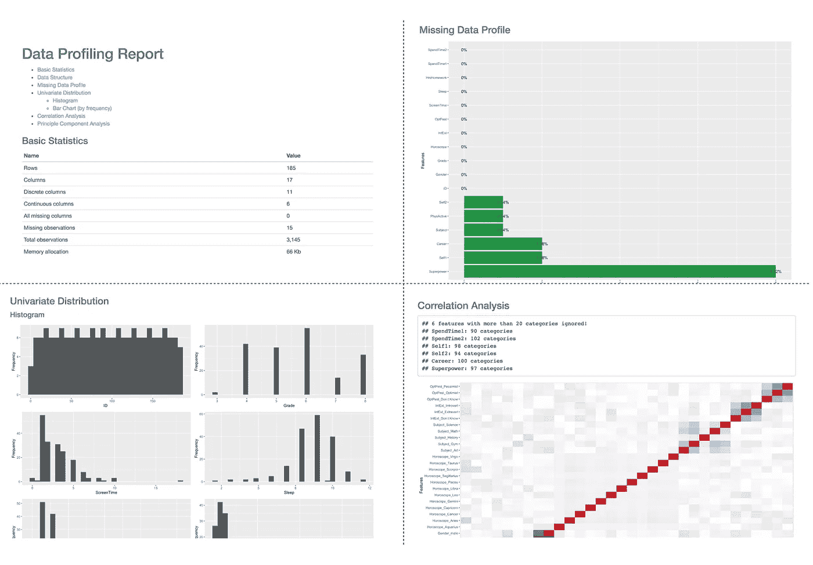

# 快速数据分析报告的 5 种方法

> 原文：<https://towardsdatascience.com/5-ways-for-a-quick-data-analysis-report-3362d1fc6e4?source=collection_archive---------26----------------------->

## 没有代码，没有烦恼


克里斯里德在 [Unsplash](https://unsplash.com?utm_source=medium&utm_medium=referral) 上的照片

在当今世界，人们都在投资学习编码，但也不是每个人都对编码感兴趣。我们不都想知道这是不是一种无需编码就能开发即时探索性数据分析报告的方法吗？我已经策划了 5 种不用编码就能得到你的分析报告的方法。

# **Excel 数据透视表:**


照片由[米卡·鲍梅斯特](https://unsplash.com/@mbaumi?utm_source=medium&utm_medium=referral)在 [Unsplash](https://unsplash.com?utm_source=medium&utm_medium=referral) 上拍摄

Excel 是最广为人知的数据分析工具。每个人在职业生涯的某个阶段肯定都接触过 excel。在每个公司，人们都使用 excel 立即进行数据处理和验证。但是我们也可以用 Excel 做一些事情。即汇总更广泛的类似表格格式的数据的数据透视表(即带有数据透视表图表的数据分析报告)。

开发一个数据透视表，提供对数据的即时理解:

*获取您的 id，获取数据透视表以有意义的方式组合在一起的总和、平均值、计数和其他统计数据。*

*数据报告可以通过提供过滤器、切片器和直观的数据透视表图表与用户进行交互，数据透视表图表可以根据数据透视表自动改变图表。*

一些关于如何构建 excel 数据透视表的帖子/教程:

[](https://www.google.com/url?sa=t&source=web&rct=j&url=https://www.tutorialspoint.com/excel_data_analysis/excel_data_analysis_pivottables.htm&ved=2ahUKEwi54tmI34LwAhVxmuYKHZYTB5AQFjACegQIAxAF&usg=AOvVaw2Om-ZveUKj-eqWLzq2ERlC) [## Excel 数据分析-数据透视表

### 对大量数据进行数据分析通常是必要且重要的。它包括汇总数据…

www.google.com](https://www.google.com/url?sa=t&source=web&rct=j&url=https://www.tutorialspoint.com/excel_data_analysis/excel_data_analysis_pivottables.htm&ved=2ahUKEwi54tmI34LwAhVxmuYKHZYTB5AQFjACegQIAxAF&usg=AOvVaw2Om-ZveUKj-eqWLzq2ERlC) [](https://www.excel-easy.com/data-analysis/pivot-tables.html) [## Excel 中的数据透视表

### 插入数据透视表|拖动字段|排序|筛选|更改汇总计算|二维数据透视表透视…

www.excel-easy.com](https://www.excel-easy.com/data-analysis/pivot-tables.html) 

# 使用 Tableau 的仪表板:


[粘土堤](https://unsplash.com/@claybanks?utm_source=medium&utm_medium=referral)在 [Unsplash](https://unsplash.com?utm_source=medium&utm_medium=referral) 上拍照

Tableau 是另一个广为人知的工具，可以帮助任何人查看和理解他们的数据。这个工具可以连接你选择的任何数据库。我们可以通过拖放功能开发数据仪表板或故事板，而无需编码。

*Anyboday 可以通过求和、计数、平均值、百分比差异和更多计算来创建数据汇总，以从数据中获取价值。*

*我们还可以实时混合数据集(不同的关系、半结构化和原始数据源)，而无需任何高级编程专业知识。*

*开发者只需点击一下鼠标，就可以向用户共享和更新仪表板。*

一些关于如何开发 Tableau 仪表板的帖子/教程:

[](https://www.google.com/url?sa=t&source=web&rct=j&url=https://www.tableau.com/solutions/analytics&ved=2ahUKEwjM1Krg3oLwAhXZ7XMBHbiQDpQQFjAXegQIHxAC&usg=AOvVaw2R0vWzi97ZygBiA9IxsqWJ) [## 我们的分析方法

### 我们唯一的使命是帮助人们看到和理解数据。这意味着提供一个分析平台，允许…

www.google.com](https://www.google.com/url?sa=t&source=web&rct=j&url=https://www.tableau.com/solutions/analytics&ved=2ahUKEwjM1Krg3oLwAhXZ7XMBHbiQDpQQFjAXegQIHxAC&usg=AOvVaw2R0vWzi97ZygBiA9IxsqWJ) [](https://www.analyticsvidhya.com/learning-paths-data-science-business-analytics-business-intelligence-big-data/tableau-learning-path/) [## 学习 Tableau 的分步资源指南

### 文章视频书籍数据可视化是一种艺术，以一种方式呈现数据，即使是非分析师也可以…

www.analyticsvidhya.com](https://www.analyticsvidhya.com/learning-paths-data-science-business-analytics-business-intelligence-big-data/tableau-learning-path/) 

# 使用 Python 进行熊猫剖析:


卢克·切瑟在 [Unsplash](https://unsplash.com?utm_source=medium&utm_medium=referral) 上拍摄的照片

Pandas profiling 是一种创建探索性数据分析报告的即时方法。你只需要安装软件包，并确保它启动和运行。

**例如:**

```
pip install pandas-profiling
```

之后。您必须导入您需要开发报告的数据。开发报告只需要一个函数。即`df.profile_report()`用于快速数据分析。

数据框架中每一列的统计数据都显示在一个交互式 HTML 报告中。

一些关于如何建立熊猫概况报告的帖子/教程:

[](/speed-up-your-exploratory-data-analysis-with-pandas-profiling-88b33dc53625) [## 使用 Pandas-Profiling 加速您的探索性数据分析

### 只需一行代码就能直观地了解数据的结构

towardsdatascience.com](/speed-up-your-exploratory-data-analysis-with-pandas-profiling-88b33dc53625) [](https://www.google.com/url?sa=t&source=web&rct=j&url=https://towardsdatascience.com/exploratory-data-analysis-with-pandas-profiling-de3aae2ddff3&ved=2ahUKEwjww8Ck3ILwAhUJ7HMBHZbuC90QjjgwBHoECBkQAg&usg=AOvVaw3OvX_S8_vPFQPt9D3PHkiI) [## 探索性数据分析与熊猫概况

### Pandas profiling 是一个开源的 Python 模块，使用它我们可以快速地进行探索性的数据分析，只需要一个…

www.google.comm](https://www.google.com/url?sa=t&source=web&rct=j&url=https://towardsdatascience.com/exploratory-data-analysis-with-pandas-profiling-de3aae2ddff3&ved=2ahUKEwjww8Ck3ILwAhUJ7HMBHZbuC90QjjgwBHoECBkQAg&usg=AOvVaw3OvX_S8_vPFQPt9D3PHkiI) 

# 使用 R 的数据浏览器:



样本数据分析报告的屏幕截图

r 作为统计计算和图形的编程语言广为人知。在过去的 5 年里，我个人使用 R 完成了一些数据分析任务和机器学习模型。但是有 ***一包*** 可以即时开发数据分析报告。即**“数据浏览器”**。这是一个为自动化数据探索和处理而创建的包。

*安装并下载软件包。*

*用于创建数据归档报告的函数是* `*create_report()*` *，根据所用数据和格式的要求，需要填写几个参数。*

*该软件包还提供了一些数据处理功能，如 set_missing、group category，以及 plot_missing()、plot_intro、plot_bar 等图形功能。*

在 R 中构建数据分析报告的一些帖子/教程:

 [## RPubs

### 编辑描述

rpubs.com](https://rpubs.com/danapower/563991)  [## DataExplorer 简介

### 这个文档介绍了 DataExplorer 包，并展示了它如何帮助你完成不同的任务…

cran.r-project.org](https://cran.r-project.org/web/packages/DataExplorer/vignettes/dataexplorer-intro.html#exploratory-data-analysis) 

# KNIME 分析平台:


Knime 是一个分析平台，用于在开源环境中生产数据科学。人们已经通过集成 ML 和数据挖掘的各种组件，将该工具用于非常自动化的技术。该工具允许开发人员使用混合不同数据源的节点，包括数据分析的预处理、建模和可视化，使用或不使用任何高级编程。

用户可以使用节点资源管理器或节点存储库来搜索快速拖放。经常使用的节点:

*输入文件阅读器:Excel 阅读器、CSV 阅读器、文件阅读器等。*

*输出文件阅读器:Excel Writer、CSV Writer 等。*

*预处理节点:缺失值、字符串到数字、字符串到日期时间等。*

*可视化节点:散点图、饼图、折线图等。*

在 Knime 中构建工作流的一些帖子/教程:

[](https://www.knime.com/learning) [## 学习|学习

### 有多种支持材料可供使用:书籍、课程(在线、现场和自定进度)、技术…

www.knime.com](https://www.knime.com/learning) 

我对这些工具都有亲身体验，这有助于我理解其中的含义并轻松操作数据。上述工具并不仅限于此。我们可以开发详细的分析报告，预测模型，包括编程技能的 ML 模型。

如果你喜欢这个帖子，请随时提供反馈和分享。您可以通过以下媒体链接关注我:

您可以通过以下网站关注我:

**领英:**[www.linkedin.com/in/neema-madayi-veetil](http://www.linkedin.com/in/neema-madayi-veetil)

**推特:**[https://twitter.com/NeemaMV](https://twitter.com/NeemaMV)

**子栈**(我写的是书评和我从优秀书籍中学到的教训)**:**[https://neemamv10.substack.com/](https://neemamv10.substack.com/)