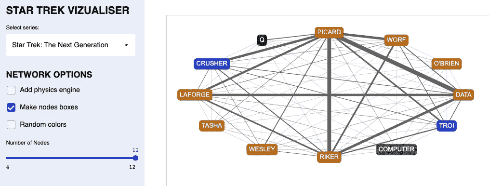
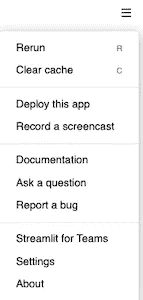
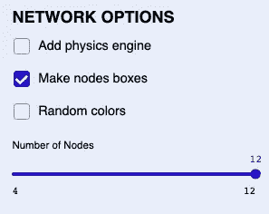

# 定制您的 Streamlit UI 的 5 种方法

> 原文：<https://towardsdatascience.com/5-ways-to-customise-your-streamlit-ui-e914e458a17c?source=collection_archive---------13----------------------->

## 如果可以自定义，为什么要使用默认设置？

[Streamlit 应用示例](https://trekviz.com/)(图片由作者提供)

你想做一个 web app，但是又不想学任何一个 web app 框架？要不要部署一个 app，却发现 Heroku 太复杂？**那么** [**细流**](http://streamlit.io/) **就是给你的！**

甚至像我这样连 HTML 和 JavaScript 的区别都分不清的数据科学家，也可以使用 Streamlit 快速创建一个应用程序。

当然，简单也有缺点，例如，如何定制用户界面的某些方面并不明显。因此，如果您是 Streamlit 的新手，您可能不知道以下定制 UI 的简单方法…

简化菜单(作者图片)

## **1。隐藏菜单按钮**

默认情况下，在你的应用程序的右上角有一个汉堡按钮，点击它会打开 Streamlit 菜单。

虽然这个菜单确实包含了各种顶级的东西，但是当你向用户部署你的应用时，你可能想要隐藏它。

幸运的是，您可以通过添加以下代码片段来做到这一点([感谢 Mani 提供的这个](https://discuss.streamlit.io/t/how-do-i-hide-remove-the-menu-in-production/362/9)):

菜单，走开！

## 2.精简布局

这些天来，我们花了太多的时间在滚动上。因此，所有应用程序开发人员都有责任尝试在一个屏幕上显示尽可能多的内容，从而减少用户需要滚动的次数。

你可以采取的一个小步骤是使用下面的代码片段删除应用程序组件之间的填充(感谢 Marc 的):

如果没有叫做“零填充”的波段，那么应该有

## 3.自定义调色板

蓝色美学(作者图片)

事实证明，如果你深入了解 Streamlit，你很快就会发现做各种事情是多么容易

例如，我是蓝色美学的粉丝，并热衷于在我的应用程序中使用这个方向。

我所要做的就是创建一个**。精简我的存储库中的**文件夹，并添加这个 **config.toml** 文件(它只设置了[许多可用配置选项中的一部分](https://docs.streamlit.io/en/stable/streamlit_configuration.html)):

令人惊讶的是，像蓝色美学这样的艺术美可以用简单的计算机代码来表示

**4。设置页面标题和图标**

这是一个标签(图片由作者提供)

去年增加了**set _ page _ config**([感谢 akrolsmir](https://github.com/streamlit/streamlit/issues/1770#issue-666966510) )。这允许您调整浏览器选项卡中显示的标题和图标:

> ST . set _ page _ config(page _ title = ' trekviz '，page_icon="🖖")

Streamlit 现在完全支持表情符号。

**5。多列**

多列只是 Streamlit 在 2020 年末添加的众多[布局选项之一](https://blog.streamlit.io/introducing-new-layout-options-for-streamlit/)。现在，拥有三列就像 1、2、3 一样简单:

> st1，st2，st3 = STβ_ columns(3)

我听说你甚至可以做一个网格布局，但这超出了我的理解。

## 结论

乍一看，Streamlit 似乎缺乏太多的可定制性。但是在表面之下是一个充满可能性的世界，本文只列出了其中的一部分。

该团队一直在开发新功能，并且有许多优秀的 Streamlit 应用程序可以从中汲取灵感。所以下次你需要开发一个应用的时候，为什么不考虑 Streamlit 呢？

下面是我总结《星际迷航》角色互动的一个例子:

 [## 特莱维兹

### 特莱维兹

TrekViztrekviz.com](https://trekviz.com)