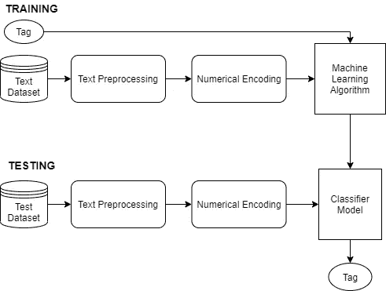

# 在机器学习中开发情感分析器的 5 种方法

> 原文：<https://towardsdatascience.com/5-ways-to-develop-a-sentiment-analyser-in-machine-learning-e8352872118?source=collection_archive---------5----------------------->

## 探索不同的方法来开发一个模型来预测给定文本的情感


图片由 [LTD EHU](https://pixabay.com/users/ltdatehu-9079918/?utm_source=link-attribution&amp;utm_medium=referral&amp;utm_campaign=image&amp;utm_content=1095751) 发自 [Pixabay](https://pixabay.com/?utm_source=link-attribution&amp;utm_medium=referral&amp;utm_campaign=image&amp;utm_content=1095751)

S **情感分析**是一种自然语言处理技术，用于确定给定文本的情感或观点。情感分析模型可以通过从自然语言中提取含义并将其分配给数字分数来预测给定的文本数据是正面的、负面的还是中性的。

开发或训练情感分析模型有多种方法，在本文中，我们将讨论 5 种不同的方法:

*   **定制训练监督模型**
*   **文本块**
*   **基于单词词典的模型**
*   伯特
*   **基于命名实体的情感分析器**

各种组织使用情绪分析来了解其客户的情绪，使用评论、社交媒体对话，并相应地做出更快、更准确的商业决策。

# 定制训练的监督模型:

你可以训练一个定制的机器学习或者深度学习的情感分析模型。标记数据集是训练鲁棒 ML 模型的关键要求。ML 模型将学习数据集中的各种模式，并可以预测给定的看不见的文本的情感。

要训练自定义情感分析模型，必须遵循以下步骤:

*   收集用于情感分析的原始标注数据集。
*   文本预处理
*   文本的数字编码
*   选择合适的 ML 算法
*   超学习和训练 ML 模型
*   预言；预测；预告



(图片由作者提供)，自定义情感分析模型管道

> 阅读下面的文章，了解如何使用朴素贝叶斯分类算法开发一个电影评论情感分析模型。

<https://satyam-kumar.medium.com/imdb-movie-review-polarity-using-naive-bayes-classifier-9f92c13efa2d>  

# 文本 Blob:

**TextBlob** 是一个开源的 Python 库，用于处理文本数据，并允许您在其简单的 API 下指定想要使用的算法。TextBlobs 的 API 可以用来执行词性标注、名词短语提取、分类、翻译、情感分析等任务。

对于情感分析，TextBlob 库提供了两种实现:

*   **模式分析器**:(默认)基于模式库。
*   **NaiveBayesAnalyzer** :在电影评论语料库上训练的 NLTK 分类器。

## 安装:

```
**pip install -U textblob**
```

## 实施:

(作者代码)

# 基于单词词典的模型:

它包括从文本语料库中创建一个包含正面和负面单词的 n-gram 字典。该方法需要一个带标签的文本语料库，并使用定制的 python 函数分别为正负文本创建一个 n 元词字典。

自定义单词也可以根据领域知识添加到词典中，这是一个额外的优势。

在下一步中，创建一个定制函数，该函数可以使用上面形成的正面和负面单词的字典来分析给定的输入文本，并且可以被分类为正面或负面情绪。

*   输入文本中出现的每个正面单词增加情感分数，负面单词减少情感分数。
*   将最终情感分数除以该文本中的字数，以标准化分数。

范围在 0 到 1 之间的积极情绪得分描绘积极情绪，其中 1 是具有 100%置信度的积极情绪预测。然而，负面情绪得分的范围在-1 到 0 之间，其中-1 是具有 100%置信度的负面情绪预测。

## 实施:

(作者代码)

# 伯特:

BERT 代表 Google 开发的 Transformers 的双向编码器表示，它是用于 NLP 任务的最先进的 ML 模型。要使用 BERT 训练情感分析模型，请遵循以下步骤:

*   安装变压器库
*   加载 BERT 分类器和记号赋予器
*   创建已处理的数据集
*   配置和训练加载的 BERT 模型并微调其超参数
*   进行情感分析预测

## 实施:

遵循下面提到的关于用 BERT 实现情感分析模型的文章。

</sentiment-analysis-in-10-minutes-with-bert-and-hugging-face-294e8a04b671>  

# 基于命名实体的情感分析器；

基于命名实体的情感分析器主要针对实体或重要词。它也可以被称为目标情感分析，并且比上面提到的三种方法更准确和有用，因为它只关注重要的词或实体。

*   第一步是找到文本语料库中的所有命名实体。
*   对文本应用名称实体识别，以查找各种实体，如个人、组织、GPE。
*   基于顶级命名实体的情感分析。
*   通过查找包含命名实体的句子并仅对那些句子逐一执行情感分析来作为目标。

# 结论:

在这篇文章中，我们讨论了 5 种不同的方法来开发一个情感分析模型。让我们明白，在开发情感分析模型时，没有一种方法是必须遵循的硬性规则。它需要根据问题陈述和数据集规划和调整算法。

# 参考资料:

[1]伯特维基:[https://en.wikipedia.org/wiki/BERT](https://en.wikipedia.org/wiki/BERT_(language_model))

[2]Orhan g . yaln 著《使用 bert 的情绪分析:[https://towards data science . com/10 分钟内情绪分析-与 BERT 和拥抱脸-294e8a04b671](/sentiment-analysis-in-10-minutes-with-bert-and-hugging-face-294e8a04b671)

> 感谢您的阅读