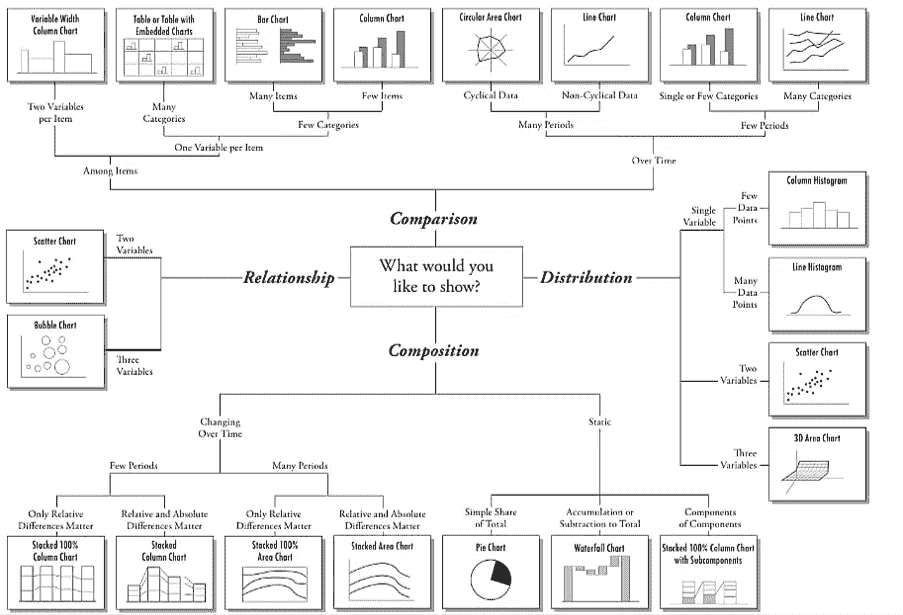
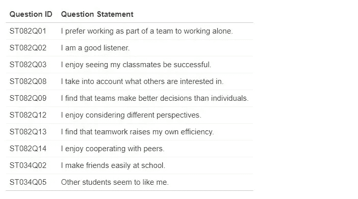
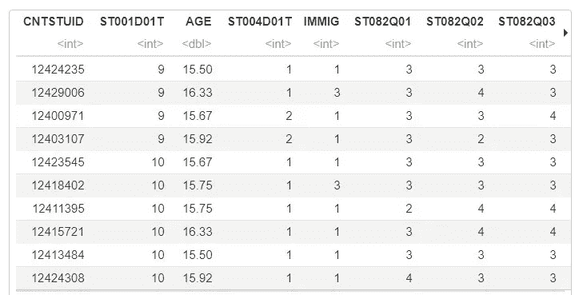
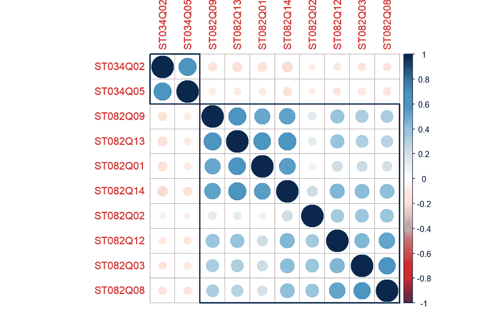
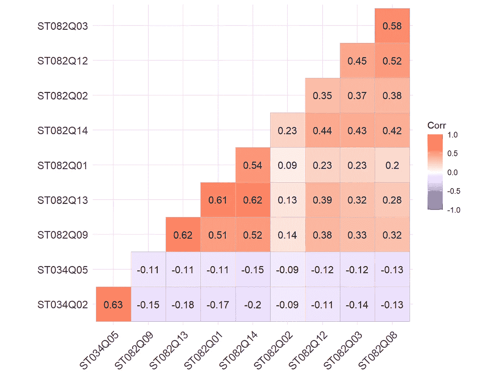
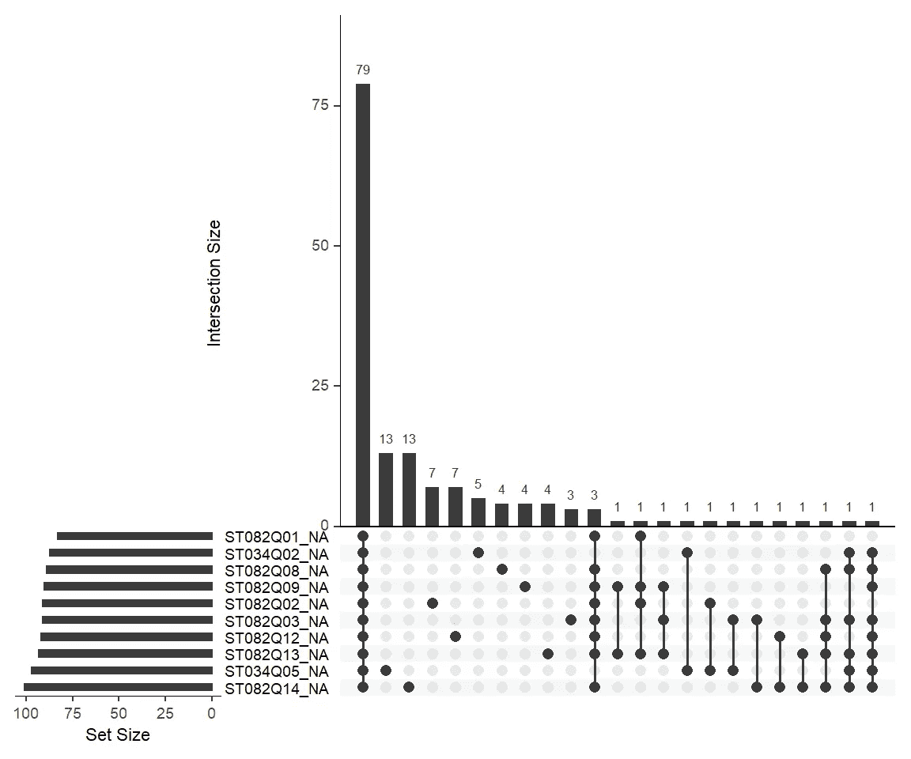
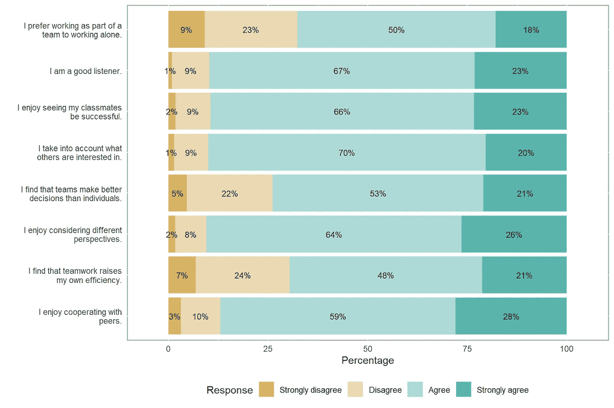
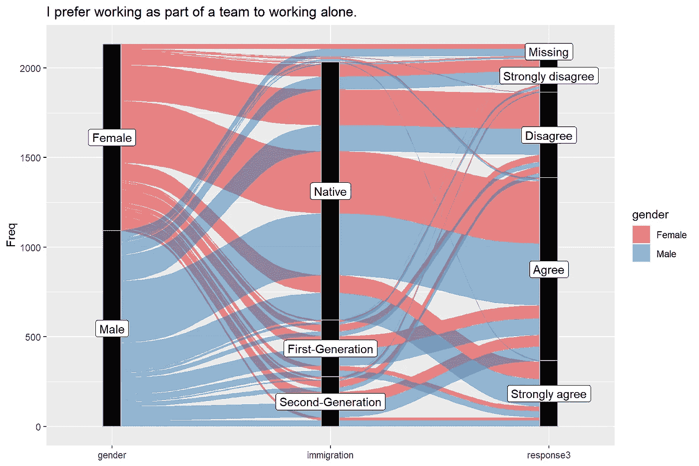
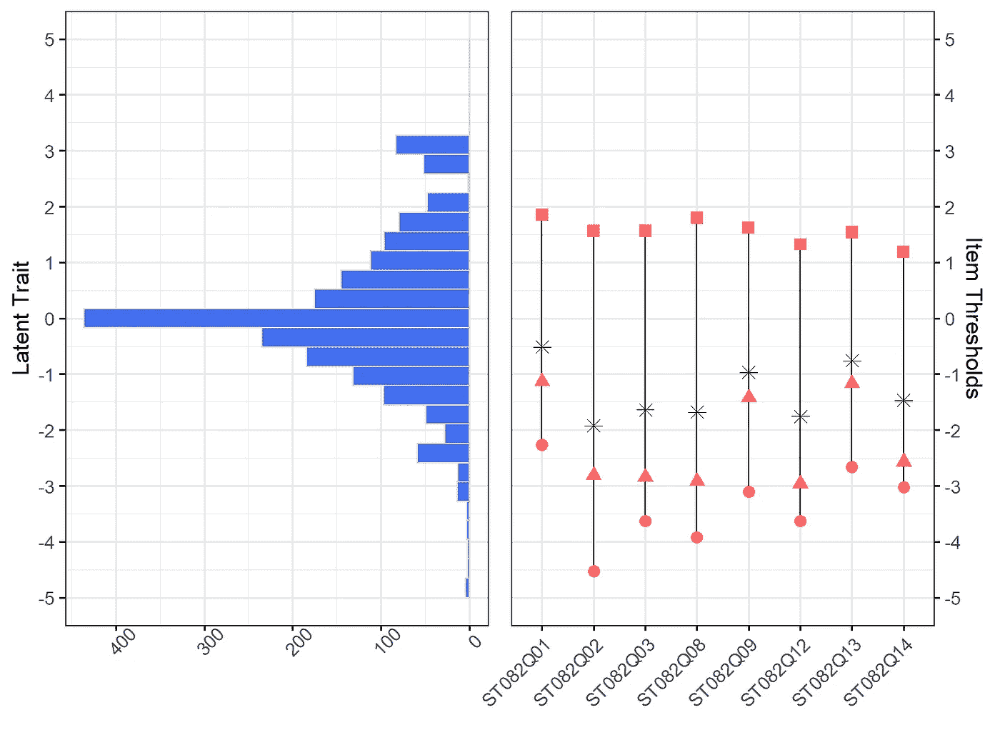

# 使用 R 有效可视化调查数据的 5 种方法

> 原文：<https://towardsdatascience.com/5-ways-to-effectively-visualize-survey-data-using-r-89928bf08cb2?source=collection_archive---------4----------------------->

图片由 [200 度](https://pixabay.com/users/200degrees-2051452/?utm_source=link-attribution&utm_medium=referral&utm_campaign=image&utm_content=1606951)来自 [Pixabay](https://pixabay.com/?utm_source=link-attribution&utm_medium=referral&utm_campaign=image&utm_content=1606951)

当可视化地呈现时，调查结果变得比一些塞进枯燥表格的数字有趣得多。数据可视化可以帮助您的受众查看和理解结果中的关键见解。有许多数据可视化工具可以直观地呈现调查结果，包括条形图、饼图和折线图。在这篇文章中，我展示了 5 种可视化调查结果的方法。

作为一名视觉学习者，我经常使用数据可视化来展示调查结果和其他类型的自我报告措施(如心理量表)。在 2019 年[加拿大教育研究学会](https://csse-scee.ca/)年会上，我就如何有效地可视化评估和调查结果举办了为期半天的研讨会(研讨会幻灯片可在[我的 GitHub 页面](https://github.com/okanbulut/dataviz/raw/master/CSSE_Workshop.pdf)上获得)。我的目标是展示可用的工具，这些工具可用于创建调查和评估数据的有效可视化。自从我在 2019 年举办研讨会以来，我遇到了几个其他工具，这些工具对可视化地展示调查结果非常有用。所以，我决定在一个帖子里分享它们。

根据变量的类型以及要传达给受众的信息，有几种方法可以将数据可视化。图 1 给出了根据可视化目的、变量类型和变量数量选择哪种类型的可视化的一些指导原则。类似的指南可在[venengage](https://venngage.com/blog/how-to-choose-the-best-charts-for-your-infographic/)网站上找到。我还推荐黑马分析公司的博客文章[数据裸体看起来更好](https://www.darkhorseanalytics.com/blog/data-looks-better-naked)。这篇文章很好地解释了如何通过消除数字和图表中的冗余来创建有效的可视化。

图 1:数据可视化的类型(来源:[https://extremepresentation.com/](https://extremepresentation.com/))

在这篇文章中，我将使用经合组织国际学生评估项目(PISA)T1 中的学生问卷数据。PISA 是一项国际性的大规模评估，面向全球许多国家和经济体的 15 岁学生。2015 年，来自 72 个国家的近 54 万名学生参加了 PISA。在完成几项评估后，所有学生还要完成一份背景调查问卷，重点是他们在学校的学习，他们对学习不同方面的态度，以及非认知/元认知结构。利用学生在调查问卷中的回答，我将演示五种可视化调查数据的替代工具。

我们开始吧📊。

# 例子

在本例中，我们将使用 PISA 2015 数据库的一个子集，其中包括学生对一些调查项目和人口统计变量(如年龄、性别和移民身份)的回答。样本仅包括来自加拿大艾伯塔省参加 PISA 2015 的学生(n = 2,133)。数据集以. csv 格式[在这里](https://raw.githubusercontent.com/okanbulut/tds/main/survey_visualization/PISA_Alberta.csv)提供。

在数据中，有 10 个李克特式的调查项目*潜在地*测量学生对团队合作的态度。前八项共享同一个问题陈述:“你在多大程度上不同意或认同自己？”而后两项是独立的。现在让我们看看数据中包含的所有项目。

图二。PISA 数据集中的调查项目

学生可以通过选择以下答案选项之一来回答这些问题，或者跳过这些问题而不选择答案选项(遗漏的答案在数据中标记为 999):

*   1 =强烈反对
*   2 =不同意
*   3 =同意
*   4 =非常同意

我们将从读取 R 中的数据并预览前几行开始分析。

图 3。PISA 数据集的预览

在接下来的部分中，我将演示如何可视化 PISA 数据集中的项目。可视化集中在单个项目或项目之间的关系上。

## 相关矩阵图

我们将通过创建相关矩阵图来开始可视化过程。该图将一组项目的相关矩阵作为输入，并将其转换为类似于热图的彩色表格。负相关和正相关用不同的颜色表示。此外，颜色的暗(或亮)表示成对相关的强度。使用该图，我们可以:

*   理解项目之间关系的方向和强度，
*   检测有问题的项目(即，与其余项目弱相关的项目)，以及
*   确定由于措辞不一致而可能需要反向编码的项目(例如，某些项目中的负面措辞)。

为了创建相关矩阵图，我们可以使用**corr plot**【1】或**ggcorrplot**【2】。首先，我们将选择调查项目(数据中以 ST082 和 ST034 开头的项目)。接下来，我们将保存项目之间的成对相关性(即，10x10 相关性矩阵)。最后，我们将使用上面的两个包创建一个相关矩阵图。为了准备数据可视化的数据，我们将使用 **dplyr** 包【3】。

现在，让我们使用 **corrplot** 创建相关性矩阵图。在`corrplot`函数中，`order = "hclust"`应用层次聚类，根据项目之间的相关性将项目分组。另一个选项，`addrect = 2`，指的是我们想要在项目簇周围绘制的矩形的数量。在我们的示例中，我们怀疑可能有两个项目集群:一个用于前 8 个项目(侧重于团队合作)，另一个用于后 2 个项目(侧重于被朋友喜欢)。图 4 中的项目群似乎证实了我们的怀疑。

图 4。PISA 调查项目的相关矩阵图(使用 corrplot)

我们还将使用 **ggcorrplot** 创建一个相关矩阵图。程序非常相似。通过使用`type = "lower"`，我们将只可视化相关矩阵的下对角线部分。

图 5。PISA 调查项目的相关矩阵图(使用 ggcorrplot)

两个相关矩阵图证实了我们最初的怀疑，即最后两个项目(即 ST034Q02 和 ST034Q05)彼此相关，但与调查项目的其余部分不相关。如果我们建立一个关注“团队合作”的量表，我们可能会排除这两个项目，因为它们对量表的贡献不足。

## 扰乱情节

我们要尝试的下一个可视化工具叫做“颠覆图”。打乱图可以显示多组数据的交集。这些图允许用户可视化来自不同数据集的变量之间的复杂关系。这种可视化方法使用户能够组合不同的图(例如，文氏图、条形图等)。)基于数据中的交叉点。你可以看[这个好看的视频](https://youtu.be/-IfF2wGw7Qk)来更好的理解打乱情节的设计和使用。在 R 中，**镦锻机**包【4】可用于轻松生成镦锻图。该软件包的作者也有一个[闪亮的](https://gehlenborglab.shinyapps.io/upsetr/)应用程序和一个网页版([https://vcg.github.io/upset/](https://vcg.github.io/upset/))来帮助用户在没有任何 r 代码的情况下生成打乱的情节

在我们的例子中，我们将使用 **naniar** 包[5]来创建一个翻转图，用于可视化丢失的数据。naniar 包提供了几个可视化缺失数据的工具，包括打乱图。使用这个包，我们将创建一个打乱图，显示我们调查数据中缺失的响应模式。首先，我们将选择数据中的调查项目，然后将这些项目发送到`gg_miss_upset`函数，以创建一个颠覆图。在函数中，`nsets = 10`是指我们想要可视化的项目集的数量。因此，我们使用 10 来可视化数据中的所有 10 个项目。此外，我们可以使用`nintersects`参数(如`nintersects = 10`)来改变图中显示的交点数量。

图 6。显示 PISA 调查项目中缺失数据模式的打乱图

我们可以使用图 6 来了解每个项目的缺失响应数量。例如，如果我们查看第一行(ST082Q01)，我们可以看到，根据为此项目标记的三个频率的总和，有 83 个遗漏响应(即 79 + 3 + 1)。此外，我们可以使用该图来识别缺失的响应模式。例如，该图显示 79 名学生跳过了所有调查项目而没有选择答案(见第一个竖线)，而 13 名学生跳过了 ST034Q05 或 ST082Q14(见第二和第三个竖线)。每一列代表具有遗漏响应的项目的不同组合(即，具有黑色标记的项目)。总的来说，翻转图对于识别遗漏方面的问题项目非常有用。

## 堆积条形图

下一个可视化工具是堆叠条形图。堆积条形图不一定是非常令人兴奋的数据可视化形式，但它们在调查研究中广泛用于可视化 Likert 类型的项目(例如，具有强烈不同意、不同意、同意和强烈同意响应选项的项目)。likert 包[6]提供了一种相对简单的方法来创建调查项目的堆积条形图。我不会深入研究定制这些图表的所有选项，我将演示如何使用前八个项目创建一个简单的堆积条形图，重点是团队合作。由于**李克特**包依赖于 **plyr** 包，我们将不得不激活这两个包。结果图显示了八个项目中每个响应选项的响应百分比。

图 7。PISA 调查项目的堆叠条形图

## 冲积地块

冲积图(或图表)类似于流程图，表示随时间或不同组之间的变化。使用冲积图，我们可以展示不同项目之间或不同受访者群体之间的调查响应流程。你可以查看包[的插图](https://cran.r-project.org/web/packages/ggalluvial/vignettes/ggalluvial.html)来获得更多的例子。在这个例子中，我们将使用**gg 冲积**包【7】。我们将选择一个调查项目，并使用性别、移民身份和对该项目的回答创建一个冲积图。为了将数据从宽格式转换为长格式，我们将使用 **reshape2** 包[8]。

图 8。项目 ST082Q01、性别和移民身份的冲积图

## 项目-人员图

我们将回顾的最后一个数据可视化工具称为物品-人地图(也称为 Wright 地图)。部分信任模型(PCM)是 Rasch 模型的扩展，可用于调查开发和验证。我们可以使用 PCM 分析调查项目，并获得每个项目的项目阈值。这些阈值表示选择特定响应选项所需的潜在特性的大小(例如，选择不同意而不是强烈不同意)。使用项目-人图，我们可以看到项目的阈值以及回答者潜在特征的分布。此图对于分析项目和回答项目的受访者之间的对齐(或匹配)非常有用。

PCM 可以使用各种 R 包进行估算，例如**mirt**【9】和**eRm**【10】。在[使用 R 的教育测量和心理测量手册](https://www.routledge.com/Handbook-of-Educational-Measurement-and-Psychometrics-Using-R/Desjardins-Bulut/p/book/9781498770132)中，我们提供了如何使用 **mirt** 软件包评估 PCM 的分步演示。要创建物品-人员图，用户可以使用 **eRm** 包中的`plotPImap`函数。因为我通常使用 **mirt** 包而不是 **eRm** 包，所以我编写了自己的函数来使用从 **mirt** 包返回的 PCM 结果创建一个物品-人映射。我的`itempersonmap`功能在这里可用[。](https://raw.githubusercontent.com/okanbulut/tds/main/survey_visualization/itempersonmap.R)

在下载了`itempersonmap`函数的 R 代码后，我们可以使用`source`函数将其导入 R。首先，我们将选择 8 个注重团队合作的项目(记住，其他两个项目似乎与其他项目不太协调，因此在此将其排除在外)。接下来，我们将记录从 1-2-3-4 到 0-1-2-3 的响应。最后，我们将使用 PCM 估计项目参数。在`mirt`功能中，`itemtype = "Rasch"`将 Rasch 模型应用于二进制项目，将 PCM 应用于多进制项目。由于我们的调查回答是多型的，PCM 将被选择用于估计项目阈值。请注意，我们添加了 technical = `list(removeEmptyRows=TRUE)`,因为有 79 名受访者跳过了调查中的所有项目。因此，我们必须在估计模型之前移除它们。

我们将模型估计的结果保存为“mod”如果模型适当收敛，我们创建物品-人映射所需的所有信息都将保存在这个`mirt`对象中。估算完成后，我们可以简单地使用`itempersonmap(mod)`来创建一个物品-人员图。在图中，红点表示每个项目的项目阈值(三个阈值分隔四个响应类别)，星号表示每个项目阈值的平均值。这些门槛越高，就越需要“团队合作”。在图的左侧，我们还看到了潜在特征的分布(即团队合作的结构)。

图 9。PISA 调查项目的项目-人地图

# 结论

在这篇文章中，我想展示五种有效可视化调查数据的方法。一些可视化(例如，堆积条形图和冲积图)可以用于呈现调查结果，而其他图(例如，扰乱图和相关矩阵图)可以用于识别调查中的有问题的项目。项目-人图也是一个非常有效的工具，可用于评估调查的整体质量(即项目和受访者之间的一致性)，并确定是否需要更多的项目来精确测量潜在特质。

# 参考

[1]魏，t .，&西姆科，V. (2017)。 *R 包“corrplot”:相关矩阵的可视化*。【https://github.com/taiyun/corrplot 号

[2] Kassambara，A. (2019)。 *Ggcorrplot:使用“ggplot2”可视化相关矩阵*。[https://CRAN.R-project.org/package=ggcorrplot](https://cran.r-project.org/package=ggcorrplot)

[3]h .威克姆、r .弗朗索瓦、l .亨利和 k .米勒(2020 年)。 *Dplyr:一种数据操作的语法*。[https://CRAN.R-project.org/package=dplyr](https://cran.r-project.org/package=dplyr)

[4]北卡罗来纳州盖伦堡(2019 年)。*翻转器:一种更具可扩展性的替代文氏图和欧拉图的可视化交叉集合*。[https://CRAN.R-project.org/package=UpSetR](https://cran.r-project.org/package=UpSetR)

[5]n .蒂尔尼、d .库克、m .麦克拜恩和 c .费伊(2020 年)。 *Naniar:缺失数据的数据结构、摘要和可视化*。[https://CRAN.R-project.org/package=naniar](https://cran.r-project.org/package=naniar)

[6]j .布赖尔和 k .施佩尔施奈德(2016 年)。*李克特:分析和可视化李克特项目*。[https://CRAN.R-project.org/package=likert](https://cran.r-project.org/package=likert)

[7]j . c .布伦森(2020 年)。冲积:冲积地块的分层语法。*开源软件杂志*， *5* (49)，2017。[https://doi.org/10.21105/joss.02017](https://doi.org/10.21105/joss.02017)

[8]韦翰·h .(2007 年)。使用整形包整形数据。*统计软件杂志*， *21* (12)，1–20。[http://www.jstatsoft.org/v21/i12/](http://www.jstatsoft.org/v21/i12/)

[9]查默斯，R. P. (2012 年)。mirt:用于 R 环境的多维项目反应理论包。*统计软件杂志*， *48* (6)，1–29。【https://doi.org/10.18637/jss.v048.i06 

[10]迈尔 p .哈辛格 r .和迈尔 M. J. (2020 年)。 *eRm:扩展 Rasch 建模*。[https://cran.r-project.org/package=eRm](https://cran.r-project.org/package=eRm)