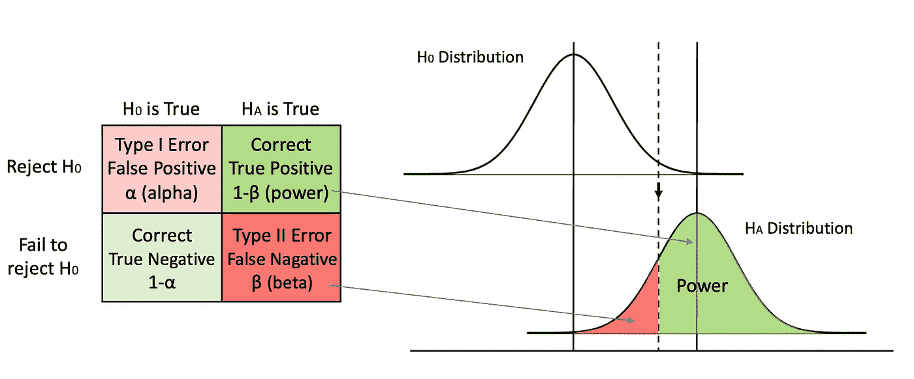
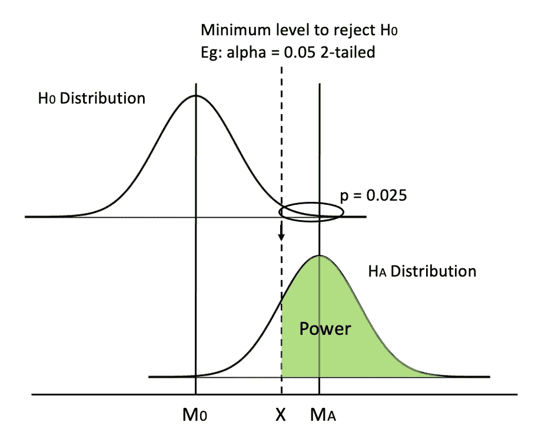
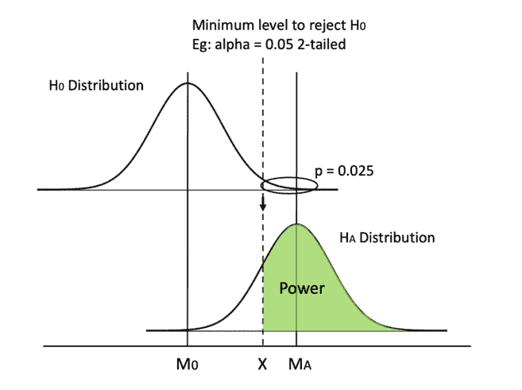
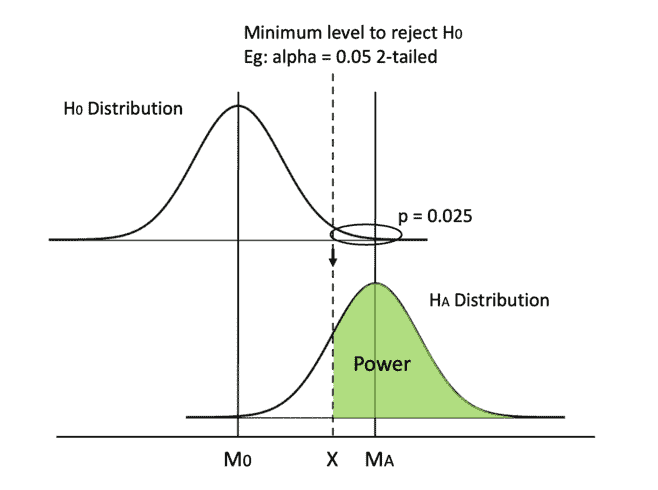
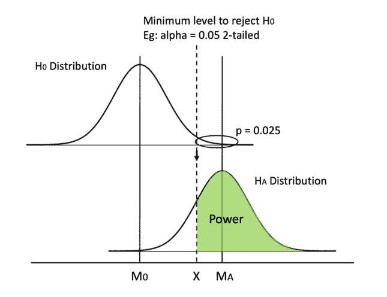
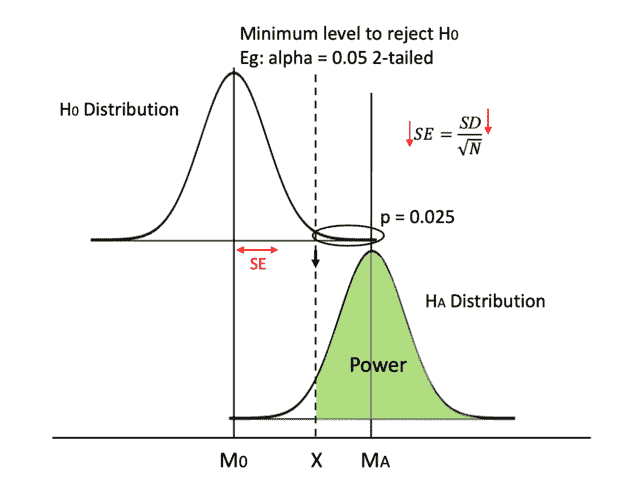
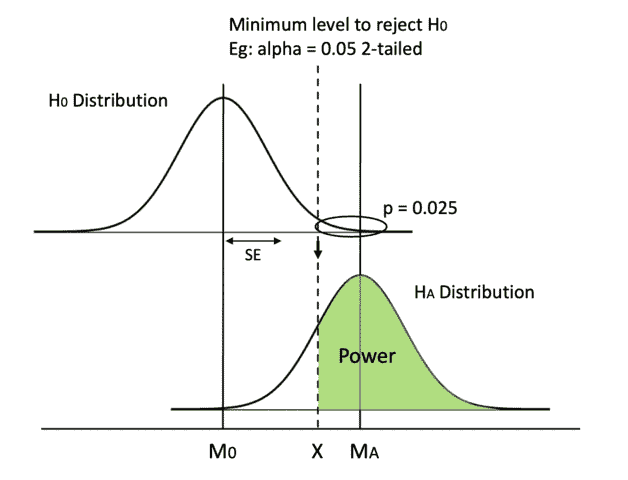

# 提高统计能力的 5 种方法

> 原文：<https://towardsdatascience.com/5-ways-to-increase-statistical-power-377c00dd0214?source=collection_archive---------0----------------------->

## 可视化 A/B 测试中的统计功效

在数据科学中，我们经常需要运行 A/B 测试，并使用统计能力来解释结果。在博客中，我将解释什么是力量，以及如何使用可视化来增加力量。而且我强调一下，这些方法和 p 黑没有任何关系。

开始之前，我假设您对以下内容有一些基本的了解:

1.  [假设检验](https://en.wikipedia.org/wiki/Statistical_hypothesis_testing) (p 值)
2.  [I 型和 II 型错误，或假阴性和假阳性](https://en.wikipedia.org/wiki/Type_I_and_type_II_errors)

# 什么是权力

在二元假设检验中，要么零假设 H0 为真，要么备选假设 HA 为真。通常，我们将 null 设置为没有任何影响或事物保持不变，例如两个意味着相同(mu1 = mu2)。而我们把备择假设设定为，在你把一个变量引入实验之后，产生了某种影响或者事情发生了变化，比如两个均值不一样(mu1 ≠ mu2)。

对于我们测试人员来说，我们不希望 H0 是真实的。我们不想经历所有的困难来实现测试，却发现我们引入的变量是无用的。相反，我们关心 HA 是否为真，因为我们想要找到重要的变量，所以我们需要关心我们是正确的概率:当 HA 确实为真时，我们拒绝 H0 并因此接受 HA 的概率。这就是所谓的统计能力，当它存在的时候，你发现它的能力。

作者图片

在这个图表中，我们用深绿色来表示能量。在假设检验中，我们总是预先确定 alpha 值，通常设置为 0.05，所以在我们开始检验之前，I 类错误率就已经确定了。然后，我们可以计算出剔除 H0 所需的最小临界值。我们可以从零假设分布到备选假设分布画一条线，并将曲线下的区域分成两部分。如果我们计算的 t 或 z 值落在虚线的左边，当 HA 为真时，我们不能拒绝 H0，我们犯了第二类错误。如果计算的值落在右边，当 HA 为真时，我们拒绝 H0，我们做出正确的调用。因此，曲线右边的区域就是我们的功率。

请注意，我们只在 HA 为真的情况下谈论功率。如果不幸的是，H0 是真的，没有任何影响，没有任何力量会帮助我们。如图所示，当 H0 为真时，我们只处理α。但在现实生活中，我们不知道 H0 或哈是真的，我们不能改变地面的真相。我们所能控制的就是拒绝或者不拒绝 H0，同时希望他是真实的。尽管如此，我们仍然希望提高我们的统计能力，这样当它确实存在时，我们就有最好的机会去检测它。

# 如何增加功率

让我们更仔细地看看可视化，并了解我们在图中知道什么样的信息。

作者图片

开始之前，我们知道:(1)阿尔法水平，(2)我们是否使用 1-尾或 2-尾测试，(3)分布的形状(t 或 z)。在完成测试后，我们知道:(4)样本大小，(5)分布 M0 和马的平均值(或它们之间的差)，(6)分布的标准偏差，因此(7)标准误差(SE)和(8)最小临界值，也就是虚线 X 的值(使用 M0、最小临界值和 SE)。

一个**例子**可以测试做练习册上的每一道 SAT 问题是否真的有所不同。SAT 的人口平均值为 M0 = 500，人口标准差= 100。因为我们知道总体平均值，我们可以使用 z 分布。我们可以像往常一样将测试设为双尾(alpha = 0.05)。现在，我们进行测试并检查测试数据。假设 N = 100，HA 分布的平均值为 MA = 530。由于我们假设两个分布相同，我们可以计算出 SE = SD/√N = 100/√100 = 10，因此 X = z_crit * SE + M0 = 1.96(我们从 z 表中得知)* 10 + 500 = 519.6。好了，现在我们终于可以计算功率了。HA 分布的临界值为 z _ crit 2 =(X-MA)/SE =(519.6-530)/10 =-1.04。我们可以查一下 [z 表](https://www.dummies.com/wp-content/uploads/451654.image0.jpg)，看到对应的 p(x ≤ -1.04) = 0.1492，所以幂是 1-0.1492 = 0.8508。

好吧，现在最大的问题是。我们如何增加功率？

我相信**更容易视觉化思考**。你会如何增加绿色的面积？我们可以移动虚线(方法 0 & 1)、移动均线(方法 2)或改变分布的形状(方法 3–5)。

## 0.提高重要级别 alpha(错误的方式)

作者 GIF

保持其他一切都在原位，一个简单的方法是将虚线向左移动。通过增加α或从双尾检验切换到单尾检验，我们可以降低最小临界值 x。

很容易，但是一个大的警告是增加 alpha 会导致更高的犯 I 型错误的概率，所以我们从不篡改 alpha 的值。

## 1.从双尾检验切换到单尾检验

作者 GIF

类似地，从双尾测试切换到单尾测试可以将虚线向左移动。在双尾检验中，每个尾的临界 p 值是α的一半，而在单尾检验中，临界 p 等于α。

我们是使用双尾还是单尾测试取决于测试设计，并且是在进行实验之前设置的，所以我们需要从一开始就记住支持单尾测试。

## 2.增加平均差异

另一种方法是增加两种方法之间的差异。由于 H0 分布是固定的，因为零假设通常不会改变，我们只能希望 HA 分布能够向右移动。

作者 GIF

然而，我们无法手动实现这一点。我们需要如实报告我们从测试数据中得到的分布(否则就是数据操纵！).但这量化了为什么我们喜欢更大的均值差异，因为它给了我们更多的力量。

特别说明:
均值差是效应大小的一种，所以我们可以说增加效应大小可以增加功效。

## 3.用 z 分布代替 t 分布

从这种方法开始，我们着重于修改分布的形状。使用 z 分布将更容易达到统计显著性。为什么？

作者 GIF

因为 z 分布有更大的峰度(z 比 t 分布高)和更细的尾部。通过改变形状，X 也减少了，所以这两种效应增加了功率。在前面的 SAT 分数的例子中，使用 z 分布是合适的，因为我们知道总体均值。虽然这种情况在现实生活中并不经常发生，但是当样本量较大时，我们可以用 z 来近似一个 t 分布。

这种形状上的变化不会很明显。我在 GIF 中夸大了一点，以便更容易看到。

## 4.降低标准偏差

修改分布形状的另一种方法是通过降低 SD 来降低 SE。

作者 GIF

我们可以使用更精确的测量方法，比如在用户反馈调查中提出清晰的问题，而不是模糊的问题。这样，我们的数据将会有更少的错误和噪音。

此外，如果适用的话，我们可以尝试运行一个[配对样本 t 检验](http://mlwiki.org/index.php/Paired_t-test)。其工作原理是配对组有更高的相关性，配对样本之间的分数差异更小。

## 5.增加样本量(最实际的方法)

作者 GIF

最后，我们可以一直依赖的一个方法是增加样本量。如果 SD 保持不变，较大的样本大小 N 会增加分母，则 SE 会降低。

这也是真实业务场景中最实用的方式。与上面列出的方法相比，从更多的用户那里收集数据或发出更多的调查要容易得多。

# 这不是黑客入侵

如果你读这篇博客的第一个想法是 p-hacking，那么恭喜你！你是一个训练有素的统计学从业者，知道实验伦理。

的确,“增加”这个词给我们一种错觉，以为我们在控制实验结果，而事实上我们并没有。例如，方法(2)增加平均差异超出了我们的控制范围，但我认为理解为什么更大的平均差异导致更大的功率的机制仍然很重要。所以我把它放在这里，就像其他 [帖子](https://support.minitab.com/en-us/minitab/19/help-and-how-to/statistics/power-and-sample-size/supporting-topics/increase-power/)一样。

虽然我们不能控制测试数据，**但我们可以控制实验设计**。方法 0、1、3、4 和 5 都是在之前预先确定的**，我们进行测试并查看测试数据。我们从不篡改测试数据！**

比如说(5)增加样本量。我们是在实验期间还是之后增加样本量？不要！我们基于期望的幂(例如:幂=0.85)预先计算样本大小。如果 N=50，那么让我们找 50 个人，进行实验，检查测试数据并如实报告 p 值。

如果我是 p-hack，我会在得到 50 个人后首先检查我的 p 值= 0.053。哦不。p> 0.05，如此接近。我该怎么办？在进行测试后，我增加了样本量，并找到了另外两名参与者。我再次检查我的 p 值。现在 p = 0.049，我停止一切，报告我发现了一个效应。这是非常错误的！如果我每次添加新的参与者时都检查我的 p 值，那么在进行测试之前，任何事情都有可能获得 p < 0.05 and I will always find an effect.

Therefore, the meaning of increasing sample size is using N=50 instead of 20 or 40 **。这同样适用于方法 1、3 和 4。**

重要的是要知道增加统计能力的方法不止一种，因为有时增加样本量根本负担不起。从一个大学生的角度来说，如果我的资助被批准了，我只能负担 50 个测试对象，我将不得不在其他方面采取更聪明的实验设计来增加统计能力。

(此部分是在原博客发布 2 天后添加的。我在评论部分看到了一些混乱，所以希望这是更清晰的。)

# 结论

在这篇文章中，我们讨论了什么是使用可视化的统计能力，通过一个例子来更好地理解图表，并讨论了提高能力的 5 种方法(实际上是 6 种方法):

*   提高重要级别 alpha(错误的方式)
*   从双尾检验切换到单尾检验
*   增加平均差异
*   用 z 分布代替 t 分布
*   降低标准偏差(通过使用精确测量和配对样本 t 检验)
*   增加样本量(最实际的方法)

感谢您的阅读！希望这篇博客对你有所帮助。