# 5 种方法使组织病理学图像模型对域转移更加稳健

> 原文：<https://towardsdatascience.com/5-ways-to-make-histopathology-image-models-more-robust-to-domain-shifts-323d4d21d889?source=collection_archive---------5----------------------->

## 探索各种方法:染色标准化、颜色增强、对立领域适应、模型适应和微调

组织病理学图像分析中的最大挑战之一是创建对不同实验室和成像系统的变化具有鲁棒性的模型。这些差异可能是由载玻片扫描仪、原材料、制造技术和染色方案的不同颜色响应造成的。

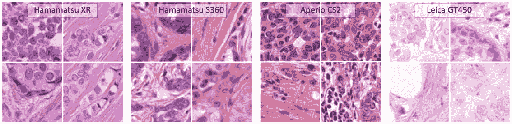

不同扫描仪引起的 H&E 图像变化[ [Aubreville2021](https://arxiv.org/abs/2103.16515)

不同的设置可以生成具有不同染色强度或其他变化的图像，从而在模型训练所基于的源数据和部署的解决方案需要操作的目标数据之间产生域转换。当域转移太大时，在一种类型的数据上训练的模型将在另一种数据上失败，通常是以不可预测的方式。

我一直在与一个客户合作，他有兴趣为他们的用例选择最佳的对象检测模型。但是他们的模型一旦部署将检查的图像来自不同的实验室和各种扫描仪。

从他们的训练数据集到目标数据集的领域转换可能比在训练集上获得最先进的结果更具挑战性。

我给他们的建议是尽早解决这个领域适应的挑战。一旦他们学会了如何处理域转换，他们总是可以在以后试验更好的对象检测模型。

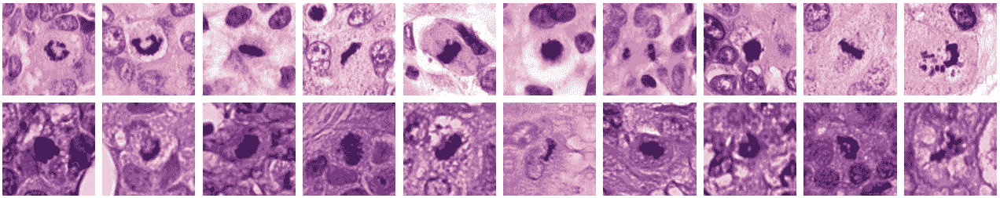

两个不同数据集的有丝分裂外观:Radboudumc(上)和 TUPAC(下)[ [Tellez2018](https://geertlitjens.nl/publication/tell-18-a/tell-18-a.pdf) ]

那么，你如何处理域名转换呢？有几个不同的选项:

1.  使用污渍标准化技术标准化图像的外观
2.  在训练期间增加颜色以利用染色的变化
3.  学习领域不变特征的领域对抗训练
4.  在测试时调整模型以处理新的图像分布
5.  在目标域上微调模型

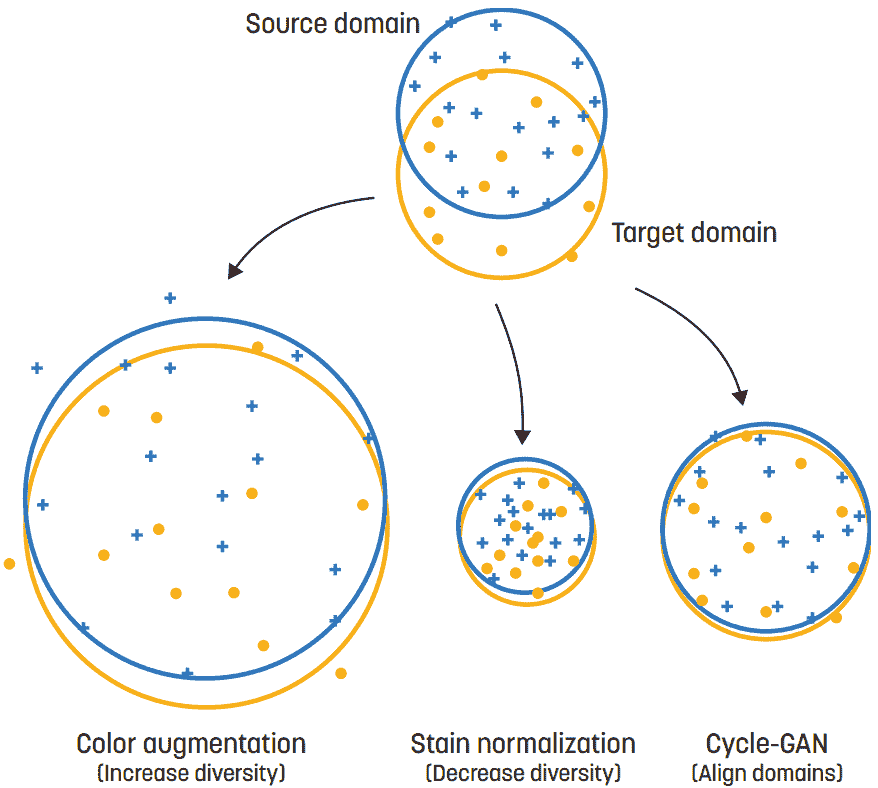

通过 GAN [ [Stacke2020](https://www.diva-portal.org/smash/record.jsf?pid=diva2%3A1478702&dswid=9029) ]实现色彩增强、染色标准化和域对齐的不同目标

这些方法中的一些具有相反的目标。例如，颜色增强增加了图像的多样性，而染色归一化试图减少变化。领域对抗训练试图学习领域不变的特征，而适应或微调模型将模型转换为仅适合目标领域。

本文将回顾这五种策略中的每一种，随后是揭示哪种方法最有效的研究总结。

# **1。色斑标准化**

不同的实验室和扫描仪可以为特定的污渍生成不同颜色配置文件的图像。污渍标准化的目标是使这些污渍的外观标准化。

传统上，像配色[ [莱因哈德 2001](https://ieeexplore.ieee.org/abstract/document/946629) ]和污渍分离[ [马森科 2009](https://ieeexplore.ieee.org/abstract/document/5193250) 、[坎恩 2014](https://ieeexplore.ieee.org/abstract/document/6727397) 、[瓦哈达尼 2016](https://ieeexplore.ieee.org/abstract/document/7460968) ]这样的方法被使用。然而，这些方法依赖于单个参考载玻片的选择。任等人已经证明，使用具有不同参考幻灯片的集合是一种可能的解决方案[ [Ren2019](https://www.frontiersin.org/articles/10.3389/fbioe.2019.00102/full) ]。

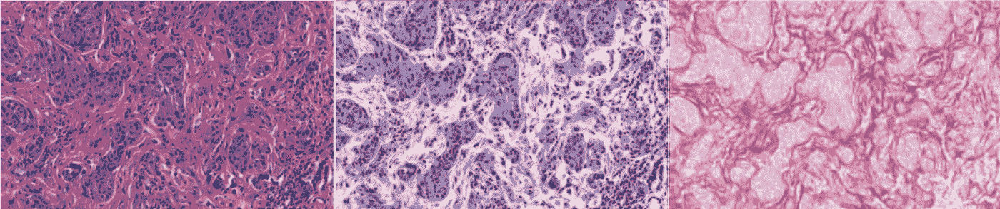

H&E 图像(左)和解卷积的苏木精(中)和曙红(右)[ [Macenko2009](https://ieeexplore.ieee.org/abstract/document/5193250)

更大的问题是，这些技术没有考虑空间特征，这可能导致组织结构得不到保留。

生成对抗网络(GANs)是当今染色标准化的最新技术。给定来自域 A 的图像，生成器将其转换到域 B。鉴别器网络试图区分真实的域 B 图像和伪造的域 B 图像，帮助生成器进行改进。

如果来自域 A 和 B 的成对和对齐的图像可用，则该设置执行良好。但是，它通常需要在两个不同的扫描仪上扫描每张载玻片，甚至可能需要重新扫描每张载玻片。

但是有一个更简单的方法可以获得配对图像:将一幅彩色图像转换成灰度(域 A)，并与原始彩色图像(域 B)配对[ [Salehi2020](https://arxiv.org/abs/2002.00647) ]。两者完全对准，并且可以训练条件 GAN 来重建彩色图像。

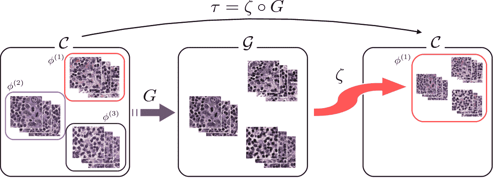

使用有条件的 GAN 从灰度到 H&E 的染色风格转换[ [Cho2017](https://arxiv.org/abs/1710.08543)

这种方法的一个主要优点是，为一个特定领域训练的再训练模型可以为各种不同的实验室和扫描仪工作，因为输入灰度图像中的变化小于彩色图像中的变化。

当成对图像不可用时的替代方法是 CycleGAN [ [Zhu2017](https://openaccess.thecvf.com/content_iccv_2017/html/Zhu_Unpaired_Image-To-Image_Translation_ICCV_2017_paper.html) ]。在此设置中，有两个生成器:一个用于从域 A 转换到 B，另一个用于从域 B 转换到 A。这两个模型的目标是能够重建原始图像:A - > B - > A 或 B->A->B。cycle gans 还利用鉴别器来预测每个域的真实图像与生成的图像。

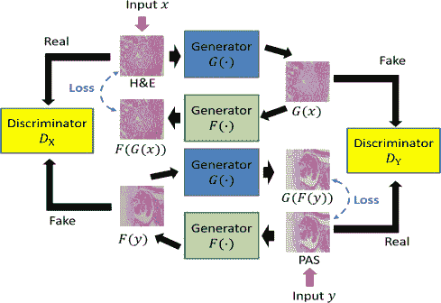

使用 CycleGAN [ [Lo2021](https://www.sciencedirect.com/science/article/abs/pii/S1568494620307602) ]进行染色风格转移

使用深度学习的色斑归一化方法已经变得越来越复杂。作为检验这种标准化对您的任务是否有帮助的第一步，我建议从简单开始。[染色工具](https://staintools.readthedocs.io/en/latest/normalization.html)和[组织切片工具](https://digitalslidearchive.github.io/HistomicsTK/histomicstk.preprocessing.color_normalization.html)都实现了一些颜色匹配和染色分离的方法。

这些简单的方法在某些情况下是足够的，但不是全部。下图展示了不同方法在五个不同数据集上的表现。

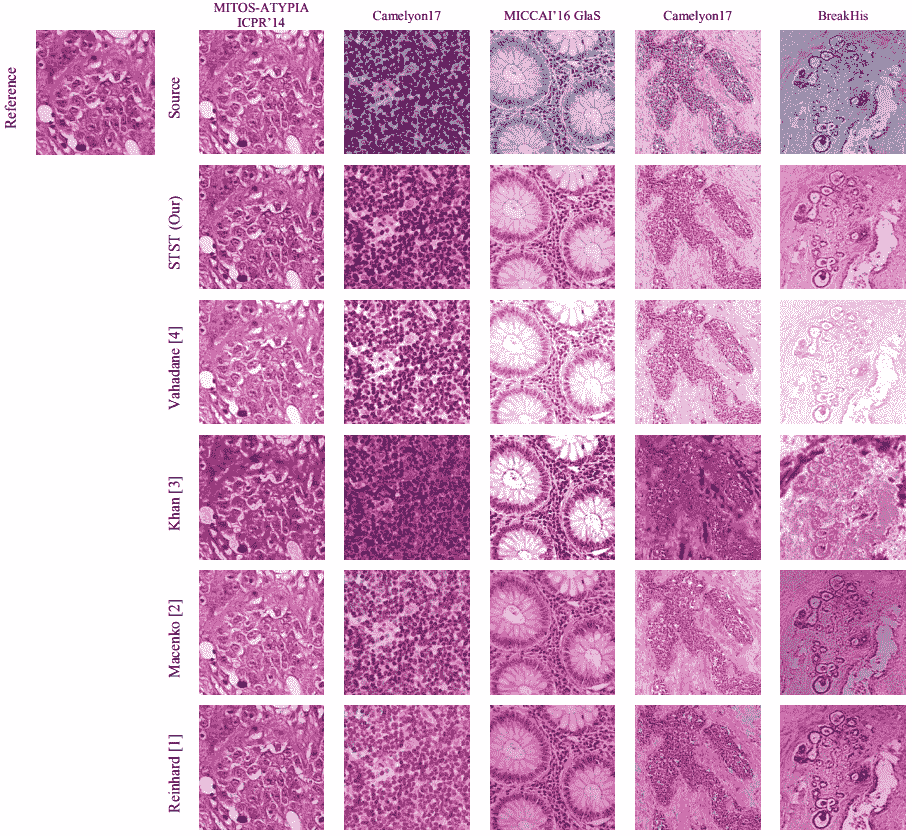

不同数据集上染色归一化结果的比较[ [Salehi2020](https://arxiv.org/abs/2002.00647) ]

# **2。色彩增强**

通过应用随机仿射变换或添加噪声的图像增强是用于对抗过拟合的最常见的正则化技术之一。类似地，可以利用染色的变化来增加在训练期间呈现给模型的图像外观的多样性。

虽然颜色的剧烈变化对于组织学来说是不现实的，但是通过对每个颜色通道进行随机的加法和乘法变化而产生的更微妙的变化已经被证明可以提高模型性能。

颜色增强的强度是一个额外的超参数，应该在训练期间进行实验，并在来自不同实验室或扫描仪的测试集上进行验证。

Faryna 等人展示了组织病理学上的随机扩增技术[ [Faryna2021](https://openreview.net/forum?id=JrBfXaoxbA2) ]。这种方法将增强参数化为所选择的随机变换的数量及其大小。

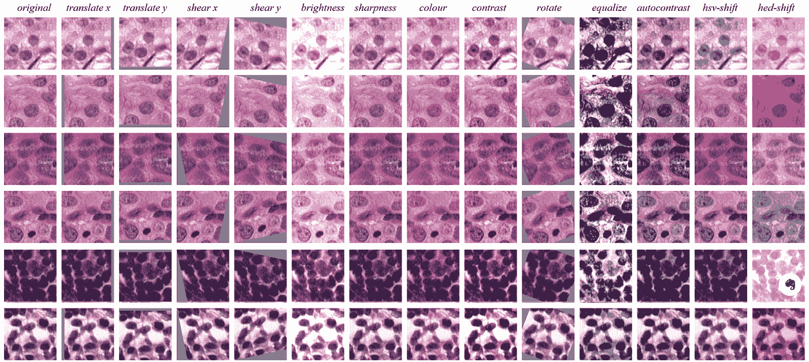

图像增强技术

特列斯等人研究了不同增强技术(单独和组合)对有丝分裂检测的影响，并提出了 H&E 特异性变换[ [Tellez2018](https://geertlitjens.nl/publication/tell-18-a/tell-18-a.pdf) ]。他们执行了颜色去卷积(如上文提到的染色分离方法中所使用的)，然后在转换回 RGB 之前，在苏木精和曙红空间中应用随机移位。H & E 变换是性能最好的个体增强方法。所有增强方法的组合对于将性能推广到新数据集至关重要。

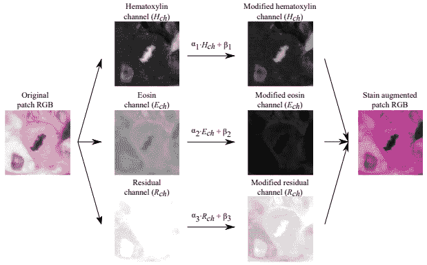

苏木精和曙红通道上的颜色增强[ [Tellez2018](https://geertlitjens.nl/publication/tell-18-a/tell-18-a.pdf)

**3。无监督领域对抗训练**

领域适应的下一个技术是领域对抗训练。这种方法利用来自目标域的未标记图像。

域对抗模块被添加到现有模型中。该分类器的目标是预测图像是属于源域还是目标域。梯度反转层将该模块连接到现有网络，以便训练优化原始任务并鼓励网络学习域不变特征。

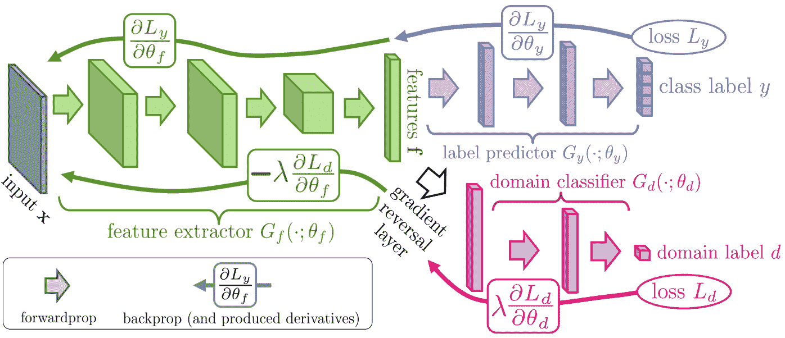

附属于 CNN 分类器的域对抗模块[ [Ganin2016](https://dl.acm.org/doi/abs/10.5555/2946645.2946704) ]

在训练期间，使用来自源域的标记图像和来自目标域的未标记图像。对于标记的源图像，应用原始网络的损失和域损失。对于未标记的目标图像，仅使用域损失。

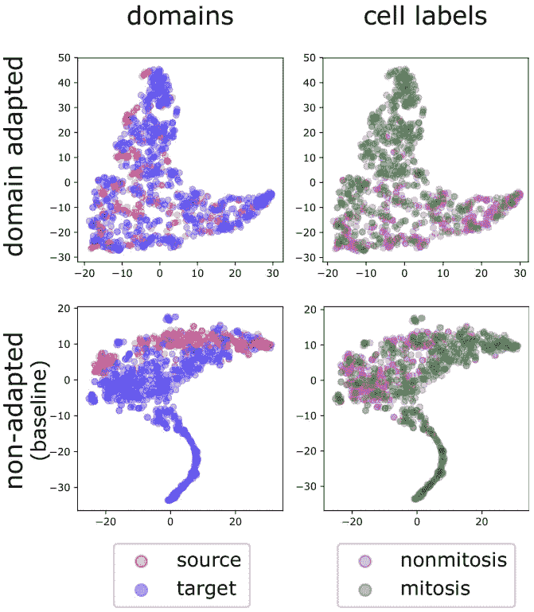

利用领域适应模型改进领域不变性[ [Aubreville2019](https://arxiv.org/abs/1911.10873)

这个模块可以添加到各种深度学习模型中。对于分类，它通常连接到输出附近的图层。对于分段，它通常应用于瓶颈层—尽管它也可以应用于多个层。对于检测，它可以应用于特征金字塔网络。对于像有丝分裂这样需要附加分类器网络的具有挑战性的对象检测器，域对抗网络可以仅应用于第二阶段[ [Aubreville2020a](https://arxiv.org/abs/1911.10873) ]。

# **4。测试时调整模型**

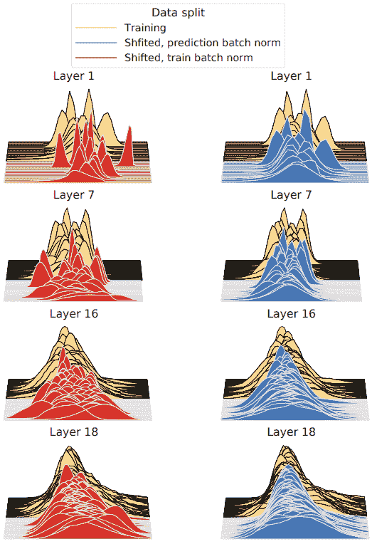

预测时间批量标准化将移位激活与训练分布对齐

不是在训练期间适应域转移，而是在测试时修改模型。域的变化反映在特征空间分布的变化中，即协变量的变化。因此，对于使用批量标准化图层的模型，可以为新的测试集重新计算平均值和标准偏差。

这些新的统计数据可以在整个测试集上进行计算，并在运行推理之前在模型中进行更新。或者可以为每批新数据计算它们。Nado 等人发现后一种方法，称为预测时间批量标准化，就足够了[ [Nado2020](https://arxiv.org/abs/2006.10963) ]。此外，一批 500 张图像足以在模型准确性方面获得实质性的提高。

# **5。模型微调**

最后，可以在测试集上用域转移[ [Aubreville2020b](https://www.nature.com/articles/s41597-020-00756-z) ]对模型进行微调。如果测试集中有足够多的标记样本，这种方法可能会产生最好的结果。然而，它是最耗时和最不可推广的。该模型可能需要在未来的其他测试集上再次进行微调。

# **方法比较**

颜色增强和染色标准化广泛用于病理学成像应用中，尤其是对于整个载玻片 H&E 图像。迄今为止，领域对抗训练和测试时的模型适应研究较少。

**色斑标准化与增色**

Khan 等人研究了单独使用和一起使用时的色斑标准化和增色[ [Khan2020](https://www.researchgate.net/publication/338826217_Generalizing_Convolution_Neural_Networks_on_Stain_Color_Heterogeneous_Data_for_Computational_Pathology) ]。当这些方法一起使用时，可以获得最好的结果。

特列斯等人针对各种不同的组织学分类任务测试了图像增强和归一化策略的不同组合。最佳配置是随机移动颜色通道，并应用无污点标准化。使用染色标准化的实验表现稍差。这验证了图像增强在创建组织学的鲁棒分类器中的重要性，并强调了颜色转换的重要性。虽然应用污点归一化并没有真正的伤害，但这种额外的计算可能是不必要的。

**污点规范化 vs 领域对抗训练**

Ren 等人将领域对抗训练与一些染色归一化和颜色增强方法进行了比较，证明了领域对抗方法在推广到新图像集时更具优势[ [Ren2019](https://www.frontiersin.org/articles/10.3389/fbioe.2019.00102/full) ]。

**色斑归一化 vs 颜色增强 vs 领域对抗训练**

Larfarge 等人进行了一项类似的研究，其中也包括领域对抗训练。他们在有丝分裂分类和细胞核分割任务上比较了域对抗训练与颜色增强和染色归一化[ [Lafarge2019](https://www.frontiersin.org/articles/10.3389/fmed.2019.00162/full) ]。

在有丝分裂分类上，他们发现颜色增强对来自模型训练的同一实验室的测试图像表现最佳。然而，在其他实验室的图像上，领域对抗训练结合色彩增强是最好的。

对于细胞核分割，结果略有不同。当在相同组织类型的图像上测试时，染色标准化是关键。在不同的组织类型上，染色标准化的领域对抗训练是最好的。

很明显，领域对抗性训练对两种类型的领域转换都有好处！

然而，最佳的预处理和增强策略因数据集而异。Lafarge 推测这是由于训练集中的域可变性的数量。

在上述方法分析中测试的污迹标准化方法仅仅是传统的颜色匹配和污迹分离技术。许多更新的基于深度学习的方法并没有包含在这些基准中。

# **建议**

传统的污渍标准化技术值得尝试作为第一步，因为它们更容易实施，通常运行更快。对于一些域偏移，这些甚至可能是足够的，特别是当与颜色增加或域适应相结合时。用一种更简单的方法进行的实验还可以提供关于一定量的染色归一化是否会提高模型泛化性能的见解。为了使染色标准化更加可靠，并保留组织结构，请评估上述方法。

可用数据也可能是选择适当技术的决定因素。染色归一化和颜色增强在训练期间不需要目标域图像，而其他三种方法需要。模型自适应需要未标记的目标数据，而微调需要对其进行标记。出于这些原因，通常首先尝试染色正常化和颜色增强，并在需要时包括对抗性域适应。这三种方法也是训练单个可概括模型的最佳方法。如果有大量的目标图像可用，那么调整模型(使用未标记的数据)或微调(使用标记的数据)可能是最有效的。

监控已部署系统的意外域转移也很重要。Stacke 等人开发了一种量化畴变的方法[ [Stacke2020](https://www.diva-portal.org/smash/record.jsf?pid=diva2%3A1478702&dswid=9029) ]。他们的度量标准不需要带注释的数据，所以可以作为一个简单的测试，看看新数据是否可以被现有的模型很好地处理。

**希望从图像和算法中获得最大的洞察力？**

[Heather D. Couture](https://www.linkedin.com/in/hdcouture/) 是 [Pixel Scientia Labs](http://pixelscientia.com/) 的创始人，该实验室提取最新的机器学习研究，以帮助研发团队抗击癌症。

联系她，了解如何实施更好的模式并产生影响。

**参考文献**

[Aubreville2020a] M. Aubreville，C.A. Bertram，s .贾巴里，C. Marzahl，R. Klopfleisch，A. Maier，[用于有丝分裂图评估的物种间、组织间域适应](https://arxiv.org/abs/1911.10873) (2020)，Bildverarbeitung für die Medizin

[Aubreville2020b] M. Aubreville，C.A. Bertram，T.A. Donovan，C. Marzahl，A. Maier，R. Klopfleisch，[一个完全注释的犬乳腺癌全幻灯片图像数据集，以帮助人类乳腺癌研究](https://www.nature.com/articles/s41597-020-00756-z) (2020b)，科学数据

[Aubreville2021] M. Aubreville，C. Bertram，M. Veta，R. Klopfleisch，N. Stathonikos，K. Breininger，N. ter Hoeve，F. Ciompi，A. Maier，[量化有丝分裂检测中扫描仪诱导的结构域缺口](https://arxiv.org/abs/2103.16515) (2021)，arXiv 预印本 arXiv:2103.16515

[Cho2017] H. Cho，S. Lim，G. Choi，H. Min，[使用 gan 进行组织病理学图像的神经染色式转移学习](https://arxiv.org/abs/1710.08543) (2017)，arXiv 预印本 arXiv:1710.08543

[Faryna2021] K. Faryna，J. van der Laak，G. Litjens，[为 H & E 染色组织病理学](https://openreview.net/forum?id=JrBfXaoxbA2) (2021)，深度学习医学成像

[Ganin2016] Y. Ganin，E. Ustinova，H. Ajakan，P. Germain，H. Larochelle，F. Laviolette，M. Marchand，V. Lempitsky，[神经网络的领域对抗性训练](https://dl.acm.org/doi/abs/10.5555/2946645.2946704) (2016)，《机器学习研究杂志》

【Khan 2014】[一种使用图像特定颜色去卷积对数字组织病理学图像进行染色归一化的非线性映射方法](https://ieeexplore.ieee.org/abstract/document/6727397)

[Khan2020] A. Khan，M. Atzori，S. Otálora，V. Andrearczyk，H. Müller，[对计算病理学染色颜色异质数据的卷积神经网络进行推广](https://www.researchgate.net/publication/338826217_Generalizing_Convolution_Neural_Networks_on_Stain_Color_Heterogeneous_Data_for_Computational_Pathology) (2020)，医学成像

[Lafarge2019] M.W. Lafarge，J.P .普鲁伊姆，K.A. Eppenhof，M. Veta，[组织学图像的学习域不变表示](https://www.frontiersin.org/articles/10.3389/fmed.2019.00162/full) (2019)，医学前沿

[Lo2021] Y.C. Lo，I.F. Chung，S.N. Guo，M.C. Wen，C.F. Juang，[使用肾小球检测应用对肾脏病理图像进行周期一致性 GAN 染色翻译](https://www.sciencedirect.com/science/article/abs/pii/S1568494620307602) (2021)，应用软计算

[Macenko2009] M. Macenko，M. Niethammer，J.S. Marron，D. Borland，J.T. Woosley，X. Guan，C. Schmitt，N.E. Thomas，[用于定量分析的组织切片标准化方法](https://ieeexplore.ieee.org/abstract/document/5193250) (2009)，生物医学成像国际研讨会

[Nado2020] Z. Nado，S. Padhy，D .斯卡利，A. D'Amour，B. Lakshminarayanan，J. Snoek，[评估协变量转移下稳健性的预测时间批次归一化](https://arxiv.org/abs/2006.10963) (2020)，arXiv 预印本 arXiv:2006.10963

[Reinhard2001] E .赖因哈德，M. Adhikhmin，B. Gooch，P. Shirley，[图像间的颜色传递](https://ieeexplore.ieee.org/abstract/document/946629) (2001)，计算机图形学与应用

[Ren2019] J. Ren，I. Hacihaliloglu，E.A. Singer，D.J. Foran，X. Qi，]用于组织病理学全载玻片图像分类的无监督域自适应算法 (2019)，生物工程与生物技术前沿

[Salehi2020] P. Salehi，A. Chalechale， [Pix2pix 基染色间转换:组织病理学图像分析中稳健染色归一化的解决方案](https://arxiv.org/abs/2002.00647) (2020)，国际机器视觉和图像处理会议

[stack e 2020]k . stack，G. Eilertsen，J. Unger，C. Lundströ，[测量结构域移位以实现组织病理学的深度学习](https://www.diva-portal.org/smash/record.jsf?pid=diva2%3A1478702&dswid=9029) (2020)，《生物医学与健康信息学杂志》

[Tellez2018] D .特列斯，M. Balkenhol，N. Karssemeijer，G. Litjens，J. van der Laak，F. Ciompi， [H 和 E 染色增强可提高用于组织病理学有丝分裂检测的卷积网络的泛化能力](https://geertlitjens.nl/publication/tell-18-a/tell-18-a.pdf) (2018)，医学影像学

[Tellez2019] D .特列斯，G. Litjens，P. Bándi，W. Bulten，J.M. Bokhorst，F. Ciompi，J. van der Laak，[量化计算病理学卷积神经网络中数据增加和染色颜色归一化的影响](https://arxiv.org/abs/1902.06543) (2019)，医学图像分析

【vahadane 2016】[组织学图像的保结构颜色归一化和稀疏染色分离](https://ieeexplore.ieee.org/abstract/document/7460968)

[Zhu2017] J.Y. Zhu，T. Park，P. Isola，A.A. Efros，[使用周期一致敌对网络的不成对图像到图像翻译](https://openaccess.thecvf.com/content_iccv_2017/html/Zhu_Unpaired_Image-To-Image_Translation_ICCV_2017_paper.html) (2017)，国际计算机视觉会议录