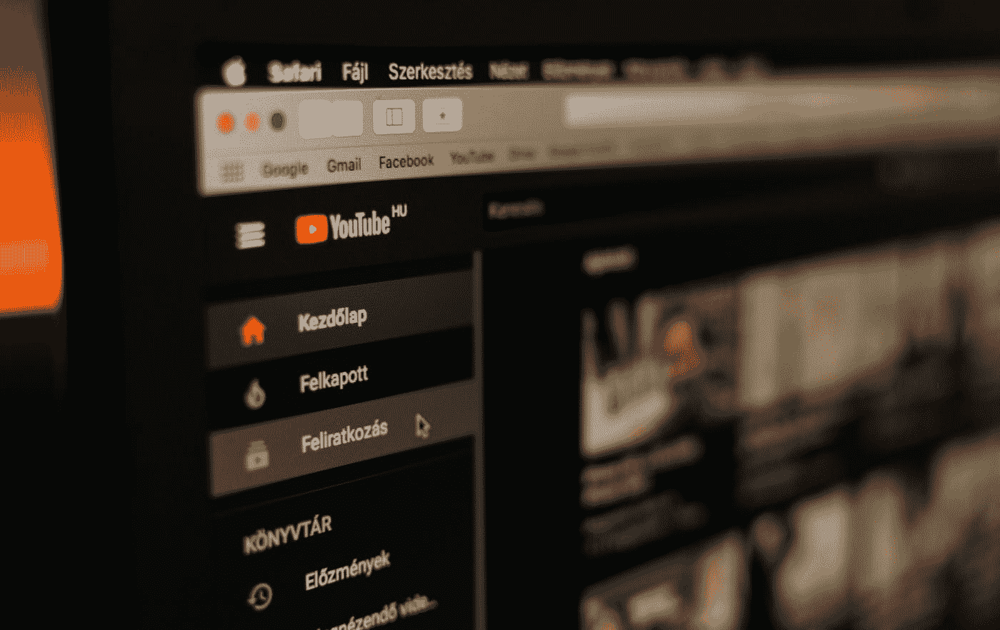

# 5 个 YouTube 播放列表，教你所有关于数据科学的知识

> 原文：<https://towardsdatascience.com/5-youtube-playlists-that-teach-you-all-about-data-science-ea300d6d8ed5?source=collection_archive---------23----------------------->

## 从一个来源获得你需要的所有知识

Szabo Viktor 在 [Unsplash](https://unsplash.com?utm_source=medium&utm_medium=referral) 上拍摄的照片

所以，你想成为一名数据科学家，你已经对该领域、子领域做了研究，你知道——模糊地——你对该领域感兴趣，你可能想进入并进一步探索的领域，你已经准备好投入时间和精力来展示自己。

*但是，你从哪里开始呢？*

互联网上充满了各种各样的教程，可以教你数据科学的各个方面。它们以各种形式存在，包括书面、视频、网络研讨会，甚至是面对面的课程。不仅如此，如果你更喜欢书，有很多针对不同层次和背景知识的人的书。

</a-learning-path-to-becoming-a-data-scientist-56c5c2e8ae3f>  

这很好，因为您可以选择浏览和选择最适合您的方法。一些人喜欢书，而另一些人可能想在上班路上或做饭时通过听有声读物或播客来学习。其他人可能会学习书面教程，或者在 YouTube 或其他平台上观看一些视频教程。

无论您喜欢哪种格式，您的目的都是找到好的、简单明了的材料，您可以使用这些材料轻松地学习数据科学的各个方面，如果可能的话，还可以免费学习。

也就是说，人类是视觉生物；我们从我们所看到的比我们所听到的或读到的学得最好。这就是为什么许多人选择观看视频教程来学习他们需要的任何新技能。在本文中，我将带您浏览 5 个 YouTube 播放列表，您可以通过观看这些列表来获得开始数据科学所需的知识。

</7-tips-for-data-science-newbies-d95d979add54>  

# №1:数据教授的数据科学 101

这个列表中的第一个播放列表涵盖了数据科学基础知识，由[数据教授](https://www.youtube.com/c/DataProfessor)制作的[数据科学 101](https://www.youtube.com/playlist?list=PLtqF5YXg7GLn0WWB_wQx7wHrIvbs0EH2e) 播放列表。截至撰写本文时，该播放列表包含 46 个视频，这些视频以简单易懂的短片形式介绍了数据科学的所有基本概念。

此播放列表中的视频不仅关注数据科学的技术方面。它们还包含书籍、证书和其他免费资源的推荐，供您在数据科学学习过程中使用。

这个播放列表以及 Data Professor 的整个频道的好处在于它是如何活跃的，并且总是更新以跟上该领域的最新进展。

# №2:史蒂夫·布伦顿的《数据科学导论》

了解数据科学和机器学习所有基础知识的一个令人惊叹的播放列表是由[史蒂夫·布伦顿](https://www.youtube.com/c/Eigensteve)和他的团队制作的[数据科学简介](https://www.youtube.com/playlist?list=PLMrJAkhIeNNQV7wi9r7Kut8liLFMWQOXn)播放列表。Steven Brunton 是西雅图华盛顿大学的机械工程和应用数学副教授以及数据科学研究员。

虽然布伦顿教授是一名学者，但他的视频并不具有学术风格。每个视频不到 10 分钟，只专注于彻底解释数据科学和机器学习的一个方面。

布伦顿教授频道还包括一个奇妙的线性代数播放列表，教授数据科学中使用的基本线性代数知识。

</data-science-lingo-101-10-terms-you-need-to-know-as-a-data-scientist-981aa17d5cdf>  

# №3: CSE 519 —数据科学基础，作者:
Steven Skiena

[这个](https://www.youtube.com/playlist?list=PLOtl7M3yp-DVODzTKX8JtXkm1EG3u2BsD)播放列表包含了史蒂文·索尔·斯基纳在石溪大学教授的数据科学课程。Steven Skiena 是一位杰出的计算机/数据科学教授，也是石溪人工智能研究所的主任。

斯基纳教授有一种非常容易理解的方法来解释复杂的概念，并混合了淡淡的幽默感，以保持轻松。他还非常活跃，对视频讲座中的大多数评论和问题都有回应。

由于 CSE 519 播放列表视频是讲座格式的，它们每个都超过一个小时。他的频道还包括其他重要计算方面的播放列表，如算法分析和编程基础。

# №4:freeCodeCamp.org 的数据科学

freeCodeCamp.org 是最著名、设计最精良的学习资源之一，几乎是任何与科技相关的资源。该网站提供了完整的课程，你可以学习技术的所有不同方面，数据科学也不例外。

但是，除了免费代码营的官方方面，他们的 YouTube 频道为他们所有的书面教程提供了许多播放列表。数据科学播放列表包括 10 个独立的视频，有些超过一小时，专注于数据科学的某些方面。

在这些视频中，你会发现一些使用 Python 的视频和一些使用 R 编程语言的视频。除了专注于某些数据科学包的视频，如 PyTorch、Numpy 和 Pandas。

</5-online-data-science-courses-you-can-start-now-748e4a2b5403>  

# №5:由
Codebasics 为初学者提供的数据科学完整课程

最后但同样重要的是 [Codebasics](https://www.youtube.com/channel/UCh9nVJoWXmFb7sLApWGcLPQ) 的[数据科学课程](https://www.youtube.com/playlist?list=PLeo1K3hjS3us_ELKYSj_Fth2tIEkdKXvV)播放列表。这个播放列表可能是这个列表中最大的一个，包含了 108 个视频，还有更多视频有待上传。

这个播放列表是一个很好的起点，尤其是如果你是科技领域的新手，以前没有任何知识。该播放列表涵盖了所有基础知识，从编程基础、数学基础、可视化开始，然后是数据科学和机器学习的基础知识。

Codebase 频道还包括侧重于版本控制、数据结构以及如何使用和优化 Jupyter 笔记本环境的播放列表。

# 外卖食品

YouTube 是最大最好的视频流媒体网站；如果你想学习一项新技能——不管是什么——很可能你会在 YouTube 上找到不止一个视频教程。

因此，很清楚为什么你会认为 YouTube 是你学习各种数据科学方面的主要资源。但是，你应该看哪些视频呢？如果你尝试在 YouTube 上搜索数据科学，你可能会得到来自不同语言(口语和编程语言)的不同内容提供商的数百个(更有可能是数千个)结果！。

</5-data-science-programming-languages-not-including-python-or-r-3ad111134771>  

你会发现视频的数量绝对是压倒性的。我写这篇文章的目的是帮助您决定观看哪些视频来开始学习数据科学。我选择这些播放列表是因为它们完整、清晰，对于初学者和那些已经有一定知识的人来说容易理解。

给他们一个尝试，看看哪一个最适合你，坚持用那个。你所需要的就是坚持不懈，不断学习。