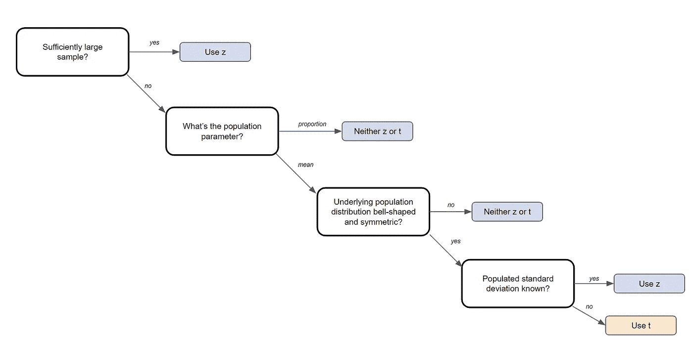
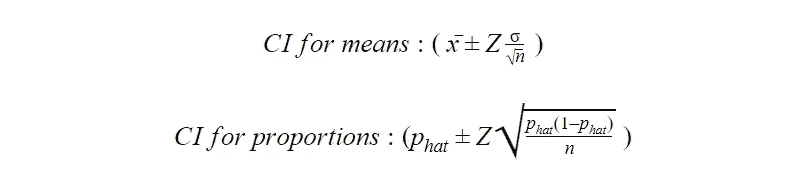
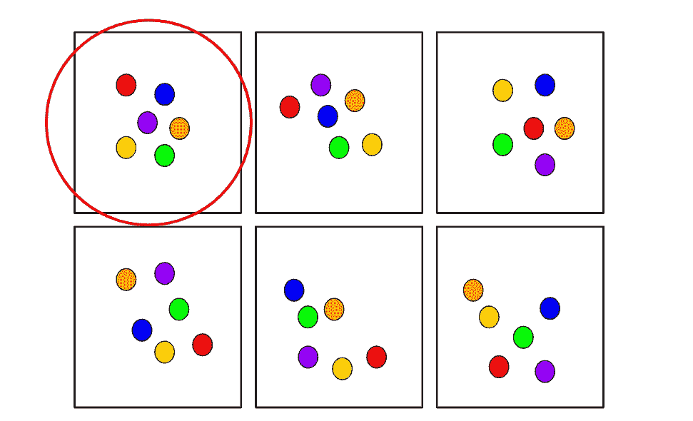
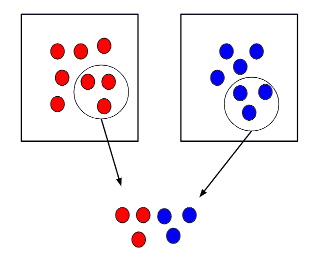
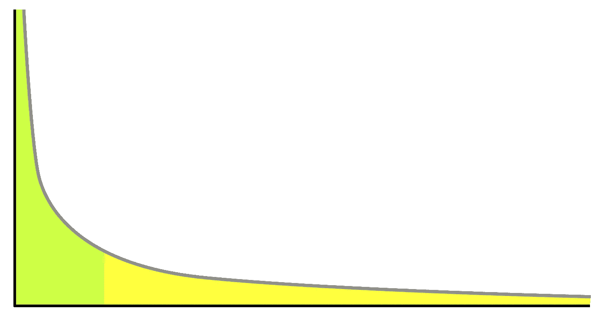
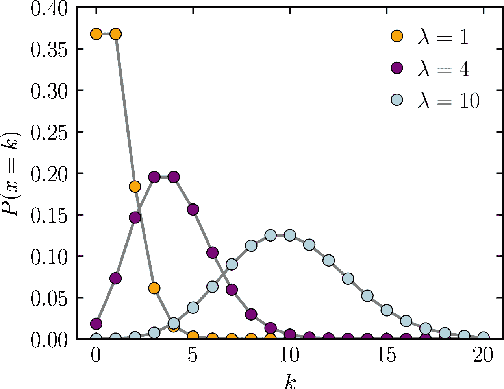
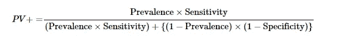
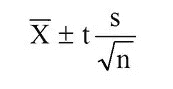
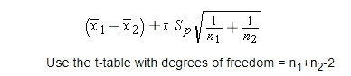
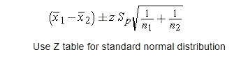

# 2022 年数据科学家 50+统计面试问答

> 原文：<https://towardsdatascience.com/50-statistics-interview-questions-and-answers-for-data-scientists-for-2021-24f886221271?source=collection_archive---------0----------------------->

## 一个更新的资源，为你的面试刷统计知识！

由 [Unsplash](https://unsplash.com/s/photos/statistics?utm_source=unsplash&utm_medium=referral&utm_content=creditCopyText) 上的 [Edge2Edge 媒体](https://unsplash.com/@edge2edgemedia?utm_source=unsplash&utm_medium=referral&utm_content=creditCopyText)拍摄

> ***请务必*** [***订阅此处***](https://terenceshin.medium.com/membership) ***千万不要错过另一篇关于数据科学指南、诀窍和技巧、生活经验等的文章！***

# 介绍

你可能已经听我说过无数次了，但是数据科学家实际上是统计学家的现代术语，机器学习是统计学的现代术语。

因为统计学如此重要，[**StrataScratch**](https://platform.stratascratch.com/?utm_source=blog&utm_medium=click&utm_campaign=terenceshin&utm_content=statistics-interview-questions-article)的创始人内森·罗西迪和我合作写了 50 多个统计学面试问题和答案。

说到这里，让我们开始吧！

## 问:什么时候应该使用 t 检验和 z 检验？

**Z-检验**是一种使用**Z-统计量**的正态分布假设检验。当您知道总体方差或不知道总体方差但样本量很大时，可以使用 z 检验。

**T-检验**是一种假设检验，带有使用**T-统计量**的 T-分布。当不知道总体方差并且样本量很小时，可以使用 t 检验。

您可以查看下图，作为参考来指导您应该使用哪种测试:

作者创建的图像

## 问:对于一个非技术人员来说，你如何描述“p 值”是什么？

用简单的术语描述 p 值的最好方法是用一个例子。实际上，如果 p 值小于α值，比如说 0.05，那么我们说这个结果偶然发生的概率小于 5%。类似地，p 值为 0.05 相当于说“在 5%的时间里，我们会偶然看到这种情况。”

## 问:什么是摘樱桃、P-hacking、意义追逐？

**摘樱桃**指的是只挑选支持自己想要的结论的数据或信息的做法。

**P-hacking** 指的是一个人操纵他/她的数据收集或分析，直到不重要的结果变得重要。这包括决定测试中期不再收集数据。

**重要性追逐**指的是当研究人员报告无关紧要的结果时，好像它们“几乎”是重要的。

## 问:常态的假设是什么？

根据中心极限定理，正态性的假设是抽样分布是正态的，并且以总体参数为中心。

## 问:什么是中心极限定理，为什么它如此重要？

中心极限定理是非常强大的——它指出样本均值的分布近似于正态分布。

举个例子，你可以从一个数据集中抽取一个样本，然后计算这个样本的平均值。一旦重复多次，你就可以把所有的平均值和它们的频率绘制到一个图表上，你会看到一个钟形曲线，也就是众所周知的正态分布，已经被创建出来了。该分布的平均值将非常类似于原始数据的平均值。

中心极限定理很重要，因为它用于假设检验和计算置信区间。

> ***务必*** [***订阅此处***](https://terenceshin.medium.com/membership) ***或至我的*** [***独家快讯***](https://terenceshin.substack.com/embed) ***千万不要错过另一篇关于数据科学的指南、窍门和技巧、生活经验等！***

## 问:经验法则是什么？

经验法则表明，如果数据集呈正态分布，68%的数据将落在一个标准差内，95%的数据将落在两个标准差内，99.7%的数据将落在 3 个标准差内。

## 问:中心极限定理成立必须满足什么一般条件？

1.  数据必须随机抽样
2.  样本值必须相互独立
3.  样本量必须足够大，通常应大于或等于 30

## 问:平均值和比例的置信区间的等式是什么？

## 问:组合和排列的区别是什么？

n 个元素的排列是这 n 个元素以**确定顺序**的任意排列。有 n 个阶乘(n！)排列 n 个元素的方式。注意粗体字:顺序很重要！

另一方面，组合指的是从 n 个对象中选择 r 的方式的数量，其中**顺序与**无关。**一次取 r 个的 n 个事物的组合数**定义为一个有 n 个元素的集合中有 r 个元素的子集的个数，等于下式:

## *问:一个 6 位数的车牌有多少种排列？*

## 问:*从一副 52 张牌中抽出 6 张牌有多少种方法？*

> 如果你想要更多类似这样的技术面试问题，可以在这里找到更多！

## 问:信心测试和假设测试有什么相似之处？它们有什么不同？

置信区间和假设检验都是用于进行统计推断的工具。

置信区间建议未知参数的值的范围，然后与真实参数在建议范围内的置信水平相关联。置信区间在医学研究中通常非常重要，可以为研究人员的估计提供更有力的基础。举例来说，置信区间可以显示为“10 +/- 0.5”或[9.5，10.5]。

假设检验是任何研究问题的基础，通常归结为试图证明一些事情不是偶然发生的。例如，你可以试着证明当滚动一种染料时，一个数字比其他数字更有可能出现。

## 问:观察数据和实验数据有什么区别？

**观察数据**来自观察研究，即观察某些变量并试图确定它们之间是否存在关联。

**实验数据**来自实验研究，即当你控制某些变量并保持它们不变，以确定是否存在因果关系。

实验设计的一个例子如下:将一组分成两个。对照组正常生活。测试组被告知在 30 天内每天晚上喝一杯酒。然后可以进行研究，看看酒是如何影响睡眠的。

## 问:举一些随机抽样技术的例子

**简单随机抽样**要求使用随机生成的数字选择一个样本。更具体地说，它最初需要一个**抽样框架**，一个群体所有成员的列表或数据库。然后，您可以使用 Excel 为每个元素随机生成一个数字，并获取您需要的前 n 个样本。

**系统采样**甚至更简单，只需从样品中取出一种元素，跳过预定的数量(n ),然后取出下一种元素。回到我们的例子，你可以选择列表中的第四个名字。

**整群抽样**从将一个群体分成几个组开始，或者叫做**群。**分层抽样的不同之处在于，每个聚类必须能够代表总体。然后，随机选择整个集群进行采样。例如，如果一所小学有五个不同的八年级班级，可以使用整群随机抽样，例如，只选择一个班级作为样本。

整群抽样示例

**分层随机抽样**从将人群分成具有相似属性的组开始。然后从每组中随机抽取一个样本。这种方法用于确保群体中的不同部分得到平等的代表。举个例子，假设在一所学校进行了一项调查，以确定总体满意度。这里使用分层随机抽样来平等地代表每个系学生的意见可能是有意义的。

分层随机抽样示例

## 问:1 型错误和 2 型错误有什么区别？

第一类错误**是当你错误地拒绝了一个真的零假设。这也叫做假阳性。**

第二类错误是你没有拒绝一个错误的零假设。这也被称为假阴性。

> ***请务必*** [***订阅此处***](https://terenceshin.medium.com/membership) ***或至我的*** [***独家快讯***](https://terenceshin.substack.com/embed) ***千万不要错过另一篇关于数据科学的指南、技巧和提示、生活经验等！***

## 问:测试的力量是什么？提高测试能力的两种方法是什么？

测试的能力是当假设为假时拒绝零假设的概率。它也等于 1 减去β。

要提高测试的能力，您可以做两件事:

1.  您可以增加 alpha，但是它也增加了类型 1 错误的机会
2.  增加样本大小，n。这保持了类型 1 误差，但减少了类型 2 误差。

## 问:什么是大数定律？

大数定律是一种理论，它指出随着试验次数的增加，结果的平均值将越来越接近期望值。

正面硬币 100，000 次的翻转次数应该接近 0.5 次而不是 100 次。

## 问:什么是帕累托原理？

帕累托原则，也称为 80/20 法则，指出 80%的结果来自 20%的原因。80%的销售额来自 20%的顾客。

## 问:什么是混杂变量？

混杂变量或混杂因素是一种既影响因变量又影响自变量的变量，导致虚假关联，即两个或更多变量相关但无因果关系的数学关系。

## 问:线性回归需要哪些假设？

有四个主要假设:

1.  因变量和回归变量之间存在线性关系，这意味着您创建的模型实际上符合数据
2.  数据的误差或残差是正态分布的，并且彼此独立
3.  解释变量之间的多重共线性最小
4.  同质性。这意味着回归线周围的方差对于预测变量的所有值都是相同的。

## 问:如果一个模型是异方差的，这意味着什么？那 homoscedastic 呢？

当误差方差**不**一致时，模型是异方差的。相反，当误差方差一致时，模型是同方差的。

## 问:内插法和外推法是什么意思？一般哪个更准确？

插值是使用一组观察值内的输入进行的预测。外推是指使用一组观察值之外的输入进行预测。

一般来说，插值更准确。

## 问:解释选择偏差(关于数据集，而不是变量选择)。为什么重要？丢失数据处理等数据管理程序如何使情况变得更糟？

**选择偏倚**是指在选择个人、群体或数据进行分析时，没有实现适当的随机化，最终导致样本不能代表总体的现象。

理解和识别选择偏差是很重要的，因为它会严重扭曲结果，并提供关于特定人群的错误见解。

选择偏差的类型包括:

*   **抽样偏差**:非随机抽样导致的有偏差样本
*   **时间间隔**:选择支持预期结论的特定时间范围。例如，在临近圣诞节时进行销售分析。
*   **暴露**:包括临床易感性偏倚、原发性偏倚、适应症偏倚。*此处阅读更多***。**
*   ***数据**:包括摘樱桃、压制证据、证据不全的谬误。*
*   ***流失**:流失偏倚类似于生存偏倚，即只有那些在长期过程中“幸存”的人才会被纳入分析，或者类似于失败偏倚，即那些“失败”的人才会被纳入分析*
*   ***观察者选择**:与人择原理相关，这是一种哲学上的考虑，我们收集的关于宇宙的任何数据都要经过过滤，为了让它可以被观察到，它必须与观察它的有意识和有智慧的生命兼容。*

*处理缺失数据会使选择偏差变得更糟，因为不同的方法会以不同的方式影响数据。例如，如果您用数据的平均值替换空值，您就增加了偏差，因为您假设数据并不像实际可能的那样分散。*

## *问:缺失数据的均值插补是可接受的做法吗？为什么或为什么不？*

***均值插补**是用数据的均值替换数据集中的空值的做法。*

*均值插补通常是不好的做法，因为它没有考虑特征相关性。例如，假设我们有一个显示年龄和健康分数的表格，并假设一个 80 岁的老人缺少健康分数。如果我们从 15 岁到 80 岁的年龄范围内取平均健康分数，那么 80 岁的人看起来会有一个比他实际应该有的高得多的健康分数。*

*第二，均值插补减少了数据的方差，增加了数据的偏倚。由于方差较小，这导致模型不太精确，置信区间较窄。*

> ****请务必*** [***订阅此处***](https://terenceshin.medium.com/membership) ***或至我的*** [***独家快讯***](https://terenceshin.substack.com/embed) ***千万不要错过另一篇关于数据科学的指南、窍门和技巧、生活经验等！****

## *问:自相关是什么意思？*

*自相关是指未来的结果依赖于之前的结果。当存在自相关时，误差显示为序列模式，模型不太准确。*

## *问:当你取样时，你会造成什么样的潜在偏见？*

*潜在的偏见包括:*

*   ***抽样偏倚:**由非随机抽样引起的有偏倚的样本*
*   ***覆盖偏差不足:**采样太少的观测值*
*   ***生存偏差:**忽略观察的错误，没有通过一种形式的选择过程。*

## *问:如何评估洞察力的统计显著性？*

*您将执行假设检验来确定统计显著性。首先，你要陈述零假设和替代假设。*

*其次，您将计算 p 值，即假设零假设为真，获得测试观察结果的概率。*

*最后，您将设置显著性水平(alpha ),如果 p 值小于 alpha，您将拒绝 null 换句话说，结果具有统计显著性。*

## *问:解释什么是长尾分布，并提供三个具有长尾的相关现象的例子。为什么它们在分类和回归问题中很重要？*

**

*长尾分布的例子*

***长尾分布**是一种重尾分布，它有一条(或多条)逐渐渐近消失的尾巴。*

*3 实际例子包括幂定律、帕累托原则(通常称为 80-20 法则)和产品销售(即最畅销的产品与其他产品相比)。*

*在分类和回归问题中注意长尾分布是很重要的，因为出现频率最低的值构成了总体的大多数。这最终会改变您处理异常值的方式，并且它也与一些假设数据正态分布的机器学习技术相冲突。*

## *问:什么是异常值？解释如何筛选异常值，如果在数据集中发现异常值，您会怎么做。此外，解释什么是内联体，如何筛选内联体，如果在数据集中发现了内联体，你会怎么做。*

*一个**异常值**是一个明显不同于其他观察值的数据点。*

*根据异常值的原因，从机器学习的角度来看，它们可能是坏的，因为它们会降低模型的准确性。如果异常值是由测量误差引起的，那么将它们从数据集中移除是非常重要的。有几种方法可以识别异常值:*

***Z 值/标准偏差:**如果我们知道一个数据集中 99.7%的数据位于三个标准偏差之内，那么我们可以计算一个标准偏差的大小，将其乘以 3，并确定超出该范围的数据点。同样，我们可以计算给定点的 z 分数，如果它等于+/- 3，那么它就是异常值。
注意:使用该方法时，需要考虑一些意外情况；数据必须呈正态分布，这一点[不适用于小数据集](https://statisticsbyjim.com/basics/outliers/)，过多异常值的存在会影响 z 值*

***四分位距(IQR):** IQR，用于构建箱线图的概念，也可用于识别异常值。IQR 等于第三个四分位数和第一个四分位数之差。然后，如果一个点小于 Q1-1.5 * IRQ 或大于 Q3 + 1.5*IQR，则可以确定该点是否为异常值。这达到大约 2.698 个标准偏差。*

*其他方法包括 DBScan 聚类、隔离森林和稳健随机采伐森林。*

## *什么是内球？*

*一个**内联者**是一个数据观察，它位于数据集的其余部分内，是不寻常的或错误的。由于它位于数据集中，通常比异常值更难识别，需要外部数据来识别它们。如果您发现了任何内联者，您可以简单地将它们从数据集中删除以解决它们。*

## *问:泊松分布代表什么？*

**

*[图片来自维基媒体](https://commons.wikimedia.org/wiki/File:Poisson_pmf.svg)*

*泊松分布是一种离散分布，它给出了在固定时间内独立事件发生的概率。使用这种方法的一个例子是，如果您想确定在给定的一个小时内有 X 个病人来医院的可能性。*

*均值和方差都等于λ。*

## *问:实验设计是什么意思？*

***实验设计**也称为 DOE，它是在假设反映变量的条件下，旨在描述和解释信息变化的任何任务的设计。本质上，实验的目的是根据一个或多个输入(独立变量)的变化来预测结果。*

## *问:你正在为每个月上传的用户内容编写一份报告，并注意到 10 月份的上传量有一个峰值。特别是图片上传的高峰。您可能认为这是什么原因造成的，您将如何测试它？*

*照片上传数量激增的潜在原因有很多:*

1.  *一项新功能可能已经在 10 月份实施，它涉及上传照片，并获得了用户的大量关注。例如，提供创建相册能力的功能。*
2.  *同样，有可能之前上传照片的过程不直观，在 10 月份得到了改善。*
3.  *可能有一场病毒式的社交媒体运动，包括持续了整个 10 月的上传照片。八月天，但更具扩展性的东西。*
4.  *这有可能是因为人们上传了自己穿着万圣节服装的照片。*

*测试的方法取决于尖峰的原因，但是您可以进行假设测试来确定推断的原因是否是实际原因。*

## *问:医院的感染率高于每 100 人-日感染 1 例被认为是高的。某医院在过去的 1787 人/天中有 10 例感染风险。给出医院是否低于标准的正确片面检验的 p 值。*

*由于我们查看的是给定时间段内发生的事件数量(感染数量)，因此这是一个泊松分布问题。*

**

*在一个区间内观察到 k 个事件的概率*

*零(H0):每人每天 1 例感染
替代(H1): >每人每天 1 例感染*

*k(实际)= 10 次感染
λ(理论)= (1/100)*1787
p = 0.032372 或 3.2372%*

*因为 p 值< alpha (assuming 5% level of significance), we reject the null and conclude that the hospital is below the standard.*

## *Q: You roll a biased coin (p(head)=0.8) five times. What’s the probability of getting three or more heads?*

*Use the General Binomial Probability formula to answer this question:*

**

*General Binomial Probability Formula*

*p = 0.8
n = 5
k = 3，4，5*

*P(3 头以上)= P(3 头)+ P(4 头)+ P(5 头)= **0.94 或 94%***

## *问:一个随机变量 X 是正态的，均值为 1020，标准差为 50。计算 P(X>1200)*

*使用 Excel…
p =1-norm.dist(1200，1020，50，true)
**p= 0.000159***

## *问:假设出现在公交车站的人数为泊松分布，平均值为 2.5 人/小时。四小时内最多出现三人的概率是多少？*

*x = 3
平均值= 2.5*4 = 10*

*使用 Excel…*

*p = poisson.dist(3，10，true)
**p = 0.010336***

## *问:艾滋病毒检测的敏感性为 99.7%，特异性为 98.5%。患病率为 0.1%的人群中的受试者获得阳性测试结果。测试的精确度是多少(即他是 HIV 阳性的概率)？*

**

*精度方程(PV)*

*精度=阳性预测值= PV
PV =(0.001 * 0.997)/[(0.001 * 0.997)+((1–0.001)*(1–0.985))]
PV = 0.0624 或 6.24%*

**更多关于这个方程的内容参见* [*这里的*](https://online.stat.psu.edu/stat509/node/151/) *。**

## *问:你正在竞选公职，你的民意调查机构调查了数百人。他们中的 60 个人声称他们会投你的票。你能放松吗？*

*   *假设只有你和另一个对手。*
*   *另外，假设我们想要 95%的置信区间。这使我们的 z 值为 1.96。*

**

*置信区间公式*

*p-hat = 60/100 = 0.6
z * = 1.96
n = 100
这就给了我们一个[50.4，69.6]的置信区间。因此，给定 95%的置信区间，如果你可以接受最糟糕的捆绑情形，那么你可以放松了。否则，你不能放松，直到 100 分中有 61 分说是。*

## *问:苏格兰的谋杀率从前年的 115 下降到了去年的 99。这种报道的变化真的值得注意吗？*

*   *因为这是一个泊松分布问题，均值=λ=方差，这也意味着标准差=均值的平方根*
*   *95%的置信区间意味着 z 值为 1.96*
*   *一个标准偏差= sqrt(115) = 10.724*

*因此置信区间= 115+/- 21.45 = [93.55，136.45]。由于 99 在这个置信区间内，我们可以假设这个变化不是很值得注意。*

## *问:考虑双亲异性恋家庭的流感流行。假设父母中至少有一方患病的概率是 17%。父亲感染流感的概率为 12%，而母亲和父亲都感染该疾病的概率为 6%。母亲感染流感的概率有多大？*

*利用概率中的一般加法法则:
P(母亲或父亲)= P(母亲)+ P(父亲)— P(母亲和父亲)
P(母亲)= P(母亲或父亲)+ P(母亲和父亲)— P(父亲)
P(母亲)= 0.17+0.06–0.12
P(母亲)= 0.11*

## *问:假设 35-44 岁男性的舒张压(DBPs)呈正态分布，均值为 80(毫米汞柱)，标准差为 10。随机选择一个 35-44 岁的人，其 DBP 低于 70 的概率是多少？*

*因为 70 比平均值低一个标准差，所以取一个标准差左边的高斯分布的面积。*

*= 2.3 + 13.6 = 15.9%*

## *问:在感兴趣的人群中，9 名男性的样本产生了 1,100cc 的样本平均脑容量和 30cc 的标准偏差。这个新群体的平均脑容量的 95%学生 T 置信区间是多少？*

**

*样本的置信区间*

*假设置信度为 95%，自由度等于 8，t 值= 2.306*

*置信区间= 1100±2.306 *(30/3)
置信区间= [1076.94，1123.06]*

## *问:在六周的时间里，9 名受试者服用了减肥药。体重的平均差异(随访-基线)为-2 磅。要使 95% T 置信区间的上端点达到 0，体重差异的标准偏差必须是多少？*

*上限=平均值+ t 得分*(标准偏差/sqrt(样本大小))
0 =-2+2.306 *(s/3)
2 = 2.306 * s/3
s = 2.601903
因此，标准偏差必须至少约为 2.60，95% T 置信区间的上限才能达到 0。*

## *问:在一项关于急诊室等待时间的研究中，调查人员考虑了一种新的标准的分流系统。为了测试系统，管理员选择了 20 个晚上，并随机分配新的分流系统在 10 个晚上使用，标准系统在其余 10 个晚上使用。他们计算了每晚看医生的平均等待时间(MWT)。新系统的平均 MWT 为 3 小时，方差为 0.60，而旧系统的平均 MWT 为 5 小时，方差为 0.68。考虑与新系统相关的平均 MWT 差异的 95%置信区间估计。假设方差不变。间隔是多少？按此顺序减去(新系统—旧系统)。*

*点击这里查看寻找两个独立样本的置信区间的完整教程。*

**

*置信区间=均值+/- t 分数*标准误差*(见上文)**

*均值=新均值-旧均值= 3–5 =-2*

*给定 df = 18(20–2)和 95%的置信区间，t 得分= 2.101*

**

*标准误差= sqrt((0。⁶ *9+0.⁶⁸* 9)/(10+10–2))* sqrt(1/10+1/10)
标准误差= 0.352*

*置信区间= [-2.75，-1.25]*

## *问:为了进一步测试医院的分诊系统，管理员选择了 200 个晚上，并随机分配了一个新的分诊系统用于 100 个晚上，一个标准系统用于其余的 100 个晚上。他们计算了每晚看医生的平均等待时间(MWT)。新系统的平均 MWT 为 4 小时，标准偏差为 0.5 小时，而旧系统的平均 MWT 为 6 小时，标准偏差为 2 小时。考虑与新治疗相关的平均 MWT 降低的假设。相对于这一假设，方差不等的 95%独立组置信区间说明了什么？(因为每组有如此多的观察值，所以用 Z 分位数代替 t 分位数。)*

*假设我们按照这个顺序减去(新系统—旧系统):*

**

*两个独立样本的置信区间公式*

*均值=新均值-旧均值= 4–6 =-2*

*z 得分= 1.96 95%的置信区间*

**

*st. error = sqrt((0。⁵* 99+* 99)/(100+100–2))* sqrt(1/100+1/100)
标准差= 0.205061
下界=-2–1.96 * 0.205061 =-2.40192
上界= -2+1.96*0.205061 = -1.59808*

*置信区间= [-2.40192，-1.59808]*

## *问:有一个盒子——有 12 张黑色和 12 张红色卡片，第二个盒子有 24 张黑色和 24 张红色卡片；如果你想从 2 个盒子中随机抽取 2 张卡片，哪个盒子获得相同颜色的概率更高？你能直观地说出为什么第二个盒子有更高的概率吗*

*有 24 张红卡和 24 张黑卡的盒子获得两张同色卡片的概率更大。让我们走过每一步。*

*假设你从每副牌中抽出的第一张牌是红色的 a。*

*这意味着在有 12 个红和 12 个黑的牌组中，现在有 11 个红和 12 个黑。因此，你再抽一张红色的几率等于 11/(11+12)或 11/23。*

*一副牌中有 24 个红和 24 个黑，那么就有 23 个红和 24 个黑。因此，你再抽一张红色的几率等于 23/(23+24)或 23/47。*

*由于 23/47 > 11/23，所以卡数较多的第二副牌有较大概率得到相同的两张牌。*

## *问:举一个例子，中间值比平均值更好衡量*

*当有许多异常值正或负地扭曲了数据时。*

## *问:给定两个公平的骰子，得分总和为 4 的概率是多少？到 8？*

*滚动 a 4 有 4 种组合(1+3，3+1，2+2):
P(滚动 a 4) = 3/36 = 1/12*

*有滚安 8 的组合(2+6，6+2，3+5，5+3，4+4):
P(滚安 8) = 5/36*

## *问:如果一个分布向右倾斜，并且中位数为 30，那么平均值会大于还是小于 30？*

*如果给定的分布是右偏分布，那么平均值应该大于 30，而众数仍然小于 30。*

## *问:你即将登上飞往西雅图的飞机。你想知道你是否应该带一把伞。你打电话给住在那里的三个朋友，分别问他们是否在下雨。你的每个朋友都有 2/3 的机会对你说真话，1/3 的机会用谎言来搞乱你。三个朋友都告诉你“是的”下雨了。西雅图真的下雨的概率有多大？*

*你可以看出这个问题与贝叶斯理论有关，因为最后一个陈述本质上遵循这样的结构，“假设 B 为真，A 为真**的概率是多少？”因此，我们需要知道某一天伦敦下雨的概率。假设是 25%。***

*P(A) =下雨的概率= 25%
P(B) =三个朋友都说在下雨的概率
P(A|B)假定他们说在下雨的概率
P(B|A)假定在下雨的情况下三个朋友都说在下雨的概率= (2/3) = 8/27*

**第一步:求解 P(B)*
P(A | B)= P(B | A)* P(A)/P(B)，可以改写为
P(B)= P(B | A)* P(A)+P(B | not A)* P(not A)
P(B)=(2/3)* 0.25+(1/3)* 0.75 = 0.25 * 8/27+0.75 * 1/1*

**第二步:求解 P(A | B)*
P(A | B)= 0.25 *(8/27)/(0.25 * 8/27+0.75 * 1/27)
P(A | B)= 8/(8+3)= 8/11*

*因此，如果三个朋友都说在下雨，那么有 8/11 的几率是真的在下雨。*

> ***如果你想要更多的数据科学面试问题和答案来备考，你可以在这里找到更多的******！*****

# ***感谢阅读！***

***如果你坚持到了最后，恭喜你！我希望这有助于你更新和修补你的统计知识。我知道有很多东西要记，但是你用得越频繁，就越不容易丢失。***

***一如既往，我祝你在数据科学的努力中一切顺利。如果你喜欢这篇文章，我会很感激你给我一个关注！:)***

> ******如果您喜欢这篇文章，请务必点击*** [***订阅此处***](https://terenceshin.medium.com/membership) ***或至我的*** [***独家快讯***](https://terenceshin.substack.com/embed) ***千万不要错过另一篇关于数据科学指南、技巧和提示、生活经验等的文章！******

***不确定接下来要读什么？我为你选了另一篇文章:***

*** [## 数据科学面试中你应该知道的 10 个统计概念

### 学习聪明，不努力。

towardsdatascience.com](/10-statistical-concepts-you-should-know-for-data-science-interviews-373f417e7d11) 

**又一个！**

 [## 2021 年成为数据科学家的完整 52 周课程

### 连续 52 周，每周学点东西！

towardsdatascience.com](/a-complete-52-week-curriculum-to-become-a-data-scientist-in-2021-2b5fc77bd160) 

# 特伦斯·申

*   ***如果你喜欢这个，*** [***订阅我的媒介***](https://terenceshin.medium.com/membership) ***获取内容！***
*   [***同样，您也可以订阅我的独家简讯***](https://terenceshin.substack.com/embed)
*   ***跟我上***[***LinkedIn***](https://www.linkedin.com/in/terenceshin/)***其他内容******