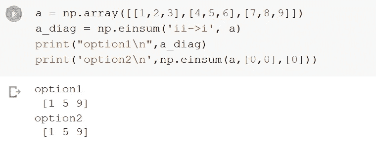
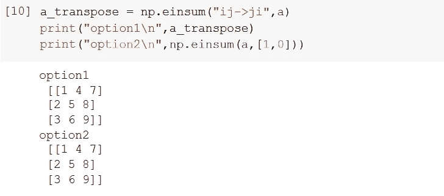

# 6 个令人惊讶的数字函数可能会让你大吃一惊

> 原文：<https://towardsdatascience.com/6-amazing-numpy-operations-that-might-surprise-you-52a88da77b9a?source=collection_archive---------21----------------------->

## 提高性能，检查平等，重塑，等等


照片由 [**安民**](https://www.pexels.com/@minan1398?utm_content=attributionCopyText&utm_medium=referral&utm_source=pexels) 发自 [**像素**](https://www.pexels.com/photo/white-and-gray-cat-lying-on-mossy-ground-1441586/?utm_content=attributionCopyText&utm_medium=referral&utm_source=pexels)

NumPy 是科学应用的基础 Python 模块。它是各种领域中最广泛使用的统计分析软件包之一，包括数据科学家、高级分析和统计分析。

接下来的文章将讨论令人惊奇的功能和使用 NumPy 可以做的事情。

# **1。allclose()函数**

一个比较函数，检查两个数组是否相等或非常相似。这个函数逐项比较两个数据数组，看它们是否在某个阈值内相等，然后返回一个布尔值作为结果。

如果两个数组的项在指定的容差内不相等，则返回 false 否则，它返回 true。值得注意的是，默认的容忍度是相当适度和有利的。

```
a = np.array([0.16,0.26,0.365])
b = np.array([0.15,0.25,0.36])tolerance1 = 0.1
tolerance2 = 0.05print(np.allclose(a,b,tolerance1))
print(np.allclose(a,b,tolerance2))
```

> 输出

```
True
False
```

# 2. **where()函数**

其中()是一个函数，它从满足一组条件的数组中返回元素。此外，该函数返回满足一组标准的元素的索引位置。这与 SQL 中的 where 子句基本相同。

```
list1 = np.array([1,4,7,6,1,7,3,8,9])# Where the elements in list1 are less than 7, returns the index position
np.where(list1<7)
```

> 输出

```
(array([0, 1, 3, 4, 6]),)
```

# 3. **extract()函数**

顾名思义，Extract()用于根据条件用数组检索特定成员。我们也可以使用 and、or 或 extract()这样的标准。

让我们定义一个随机数组。

```
# Random integers
array_test = np.random.randint(18, size=12)#Output: array_test
array([ 2, 13, 16,  9,  2,  8, 12,  6,  6,  1, 15,  3])
```

让我们根据特定的条件从数组中构造一个布尔数组。

```
# Divide by 2 and check if the remainder is 1
cond = np.mod(array_test, 2)==1

**Output:** cond
array([False,  True, False,  True, False, False, False, False, False, True,  True,  True])
```

现在让我们看看 extract()如何帮助我们。

```
# Use extract to get the values
np.extract(cond, array_test)**Output**
array([13,  9,  1, 15,  3])
```

我们也可以在提取函数中直接应用条件。

```
# Apply condition on extract directly

np.extract(((array_test < 2) | (array_test > 14)), array_test)**Output**
array([16,  1, 15])
```

# 4. **reshape()函数**

NumPy 中的 reshape 数组函数用于给数组一个新的形式。这是 NumPy 最受欢迎的功能之一。整形功能非常有用；我们可以用它给数组一个新的形式或者我们想要的形状。

它可以增加或减少数组维数，同时保持项目总数不变。

```
arr = np.arange(1,36,2)
print(arr)*#reshape* print("reshape1\n",arr.reshape(3,6))
print('reshape2\n',arr.reshape(2,3,3))
```

> 输出

```
[1 3 5 7 9 11 13 15 17 19 21 23 25 27 29 31 33 35]reshape1 
[[ 1 3 5 7 9 11]
[ 13 15 17 19 21 23]
[25 27 29 31 33 35]]reshape2 
[[[ 1 3 5]
[ 7 9 11]
[ 13 15 17]][[19 21 23]
[25 27 29]
[31 33 35]]]
```

# 5. **einsum()函数**

Numpy 最有用的函数之一是 einsum()函数，通常称为爱因斯坦求和约定。由于它的表达能力和巧妙的循环，它可以在性能和内存经济方面胜过我们传统的数组函数。

困难的方面是学习符号需要时间，并且可能需要多次尝试才能有效地将它应用到复杂的情况中。einsum()提供了数组`np.multiply`、`np.addition`、`np.transpose`和`np.diag`等 NumPy 函数来加速和简化我们的工作。

当我们第一次开始使用 einsum()时，我们将经历一些我们需要知道的基本操作。

```
*find array diagonal, transpose using einsum*a = np.array([[1,2,3],[4,5,6],[7,8,9]])
a_diag = np.einsum('ii->i', a)print("option1\n",a_diag)
print('option2\n',np.einsum(a,[0,0],[0]))
```



```
a_transpose = np.einsum("ij->ji",a)print("option1\n",a_transpose)
print("option2\n",np.einsum(a,[1,0]))
```



# 6.**剪辑()功能**

Clip()是一个将数组中的值保持在指定范围内的函数。我们有时需要将数字保持在一定的范围内。给定间隔时，外部值将被修剪到间隔边缘。

```
x = np.array([3, 4, 12, 20, 2, 2, 3, 7, 1, 2, 12, 0])
print(np.clip(x,2,5))
```

> 输出

```
array([3, 4, 5, 5, 2, 2, 3, 5, 2, 2, 5, 2])
```

这里有一本 [**书**](https://amzn.to/2VzqI91) ，我一定会推荐给所有 Python &数据科学初学者。一定要去看看！

# **结论**

Numpy 不仅仅是一个更快更方便的 Python 数组计算包。除了其明显的科学用途之外，NumPy 还可以用作普通数据的多维存储。

可以定义的数据类型数量没有限制。因此，NumPy 可以简单高效地与各种数据库进行交互。

文章中提到的各种令人惊奇的函数在使用 Numpy 库时会非常有用。

***注:*** *本文包含代销商链接。这意味着，如果你点击它，并选择购买我上面链接的资源，你的订阅费的一小部分将归我所有。*

*然而，推荐的资源是我亲身经历的，并在我的数据科学职业生涯中帮助了我。*

> *在你走之前……*

如果你喜欢这篇文章，并且想继续关注更多关于 **Python &数据科学**的**激动人心的**文章，请点击这里[https://pranjalai.medium.com/membership](https://pranjalai.medium.com/membership)考虑成为一名中等会员。

请考虑使用[我的推荐链接](https://pranjalai.medium.com/membership)注册。通过这种方式，会员费的一部分归我，这激励我写更多关于 Python 和数据科学的令人兴奋的东西。

还有，可以随时订阅我的免费简讯: [**Pranjal 的简讯**](https://pranjalai.medium.com/subscribe) 。