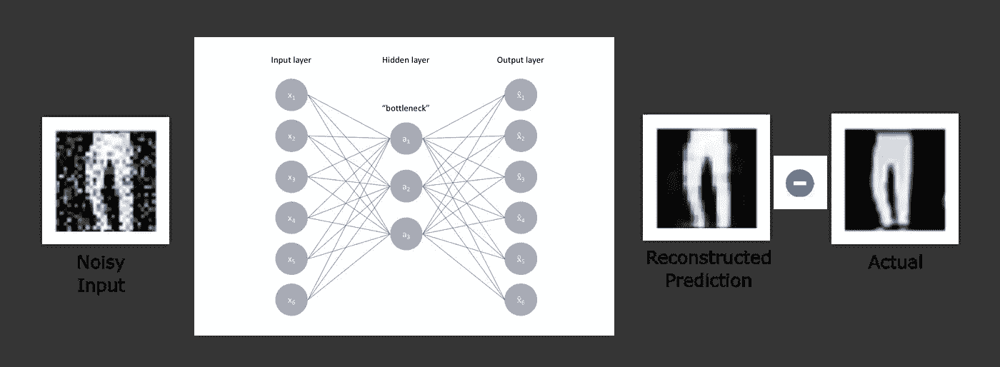

# 每个数据科学家都应该知道的自动编码器的 7 种应用

> 原文：<https://towardsdatascience.com/6-applications-of-auto-encoders-every-data-scientist-should-know-dc703cbc892b?source=collection_archive---------5----------------------->

## 自动编码器及其使用基本指南


图片由来自 [Pixabay](https://pixabay.com/?utm_source=link-attribution&amp;utm_medium=referral&amp;utm_campaign=image&amp;utm_content=5475661) 的[巴菲克](https://pixabay.com/users/buffik-17824401/?utm_source=link-attribution&amp;utm_medium=referral&amp;utm_campaign=image&amp;utm_content=5475661)拍摄

自动编码器是一种流行的无监督人工神经网络，它采用未标记的数据，并学习关于数据结构的有效编码，可用于另一个上下文。自动编码器近似于将数据从全输入空间映射到较低维度坐标的函数，并且进一步近似于具有最小损失的输入空间的相同维度。

对于分类或回归任务，可以使用自动编码器从原始数据中提取特征，以提高模型的稳健性。自动编码器网络还有各种其他应用，可以用于一些其他环境。我们将在本文中介绍自动编码器的 7 种应用:

```
***Checklist:***
**1) Dimensionality Reduction
2) Feature Extraction
3) Image Denoising
4) Image Compression
5) Image Search
6) Anomaly Detection
7) Missing Value Imputation**
```

在深入研究自动编码器的应用之前，让我们简单讨论一下自动编码器网络到底是什么。

# 什么是自动编码器？

Autoencoder 是一种无监督的神经网络，它尝试将输出层重建为与输入层相似。自动编码器架构有两个部分:

*   **编码器:**从输入空间到低维空间的映射
*   **解码器:**从低维空间重构到输出空间

自动编码器首先将输入向量压缩到低维空间，然后试图通过最小化重构误差来重构输出。自动编码器会尝试重建与输入层尽可能相似的输出向量。


([来源](https://en.wikipedia.org/wiki/Autoencoder))，自动编码器架构

有各种类型的自动编码器，包括正则化的、具体的和变化的自动编码器。参考自动编码器的维基百科页面[来详细了解自动编码器的变化。](https://en.wikipedia.org/wiki/Autoencoder)

# 1)降维:

自动编码器训练网络将数据中的自然结构解释为有效的低维表示。它通过使用解码和编码策略来最小化重建误差。


([来源](/autoencoders-in-practice-dimensionality-reduction-and-image-denoising-ed9b9201e7e1))，自动编码器的编码器-解码器架构

输入和输出维度有 3000 个维度，期望的缩减维度是 200。我们可以开发一个 5 层网络，其中编码器有 3000 和 1500 个神经元，类似于解码器网络。

压缩输入层的矢量嵌入可以被认为是输入层的降维嵌入。

# 2)特征提取:

自动编码器可以用作分类或回归任务的特征提取器。自动编码器获取未标记的数据，并学习可用于监督学习任务的关于数据结构的有效编码。

在使用训练数据的样本来训练自动编码器网络之后，我们可以忽略自动编码器的解码器部分，并且仅使用编码器来将较高维的原始输入数据转换到较低维的编码空间。这种较低维度的数据可用作监督任务的特征。


(图片由作者提供)，AutoEncoder 作为特征提取器

跟随我的另一篇文章，逐步实现作为特征提取器的 autoencoder:

</improve-your-model-performance-with-auto-encoders-d4ee543b4154>  

# 3)图像去噪:

真实世界的原始输入数据通常在本质上是有噪声的，并且训练健壮的监督模型需要干净和无噪声的数据。自动编码器可用于数据去噪。

图像去噪是自动编码器试图从有噪声的输入图像重建无噪声图像的流行应用之一。



(图片由作者提供)，使用自动编码器架构对图像进行去噪

将有噪声的输入图像作为输入馈入自动编码器，并通过最小化来自原始目标输出(无噪声)的重建损失来重建无噪声输出。一旦训练了自动编码器权重，它们可以进一步用于对原始图像去噪。

# 4)图像压缩:

图像压缩是自动编码器网络的另一个应用。原始输入图像可以被传递到编码器网络，并获得编码数据的压缩维度。可以通过使用解码器网络从压缩编码中重构图像来学习自动编码器网络权重。


(图片由作者提供)，使用自动编码器进行图像压缩

通常，自动编码器不太适合数据压缩，基本的压缩算法效果更好。

# 5)图片搜索:

自动编码器可用于压缩图像数据库。压缩嵌入可以与搜索图像的编码版本进行比较或搜索。


(图片由作者提供)，使用 AutoEncoder 进行图片搜索

# 6)异常检测:

异常检测是自动编码器网络的另一个有用的应用。异常检测模型可用于检测欺诈性交易或任何高度不平衡的监督任务。

这个想法是仅在一个类(多数类)的样本数据上训练自动编码器。这样，网络能够以良好的或更少的重建损失来重建输入。现在，如果另一个目标类的样本数据通过自动编码器网络，则会导致相对较大的重建损失。

可以确定重建损失(异常分数)的阈值，大于该阈值可以被认为是异常。

# 7)缺失值插补:

去噪自动编码器可用于估算数据集中缺失的值。其思想是通过在输入数据中随机放置缺失值来训练自动编码器网络，并通过最小化重建损失来尝试重建原始原始数据。

一旦训练了自动编码器权重，具有缺失值的记录可以通过自动编码器网络来重构输入数据，该输入数据也具有估算的缺失特征。


(图片由作者提供)，使用去噪自动编码器输入缺失值

# 结论:

在本文中，我们简要介绍了自动编码器的各种应用。对于图像重建，我们可以使用一种称为卷积自动编码器的自动编码器，它通过学习最佳滤波器来最小化重建误差。

在我即将发表的文章中，我将实现上面讨论的每个应用程序。

喜欢这篇文章吗？成为 [*中等会员*](https://satyam-kumar.medium.com/membership) *继续无限制学习。如果你使用下面的链接，我会收到你的一小部分会员费，不需要你额外付费。*

<https://satyam-kumar.medium.com/membership>  

> 感谢您的阅读