# 让你的 Python 程序变慢的六个坏习惯

> 原文：<https://towardsdatascience.com/6-bad-manners-makes-your-python-program-slower-15b6fce62927?source=collection_archive---------1----------------------->


图片来自 [Pixabay](https://pixabay.com/?utm_source=link-attribution&utm_medium=referral&utm_campaign=image&utm_content=2759724) 的[迈克尔·莫西曼](https://pixabay.com/users/myagi-280090/?utm_source=link-attribution&utm_medium=referral&utm_campaign=image&utm_content=2759724)

## Python 代码中通常被忽视的常见问题

随着 Python 越来越受欢迎，Python 用户的数量也在激增。Python 确实是比较好学的。它也非常灵活，因此有更多可能的方法来实现一个功能。

然而，每当有多种方法来做一件特定的事情时，就意味着每种方法都有利弊。在本文中，我收集了 6 种编写 Python 代码的典型方法，它们可能会导致相对较差的性能。

# 1.不要导入根模块


图片来自 [Pixabay](https://pixabay.com/?utm_source=link-attribution&utm_medium=referral&utm_campaign=image&utm_content=1335737) 的 [Andreas Riedelmeier](https://pixabay.com/users/riedelmeier-130476/?utm_source=link-attribution&utm_medium=referral&utm_campaign=image&utm_content=1335737)

使用 Python 时，我们无法避免的一件事就是导入模块，无论是内置模块还是第三方模块。有时，我们可能只需要那个模块中的一个或几个函数或对象。在这种情况下，我们应该尝试只导入我们需要的函数或对象，而不是导入根模块。

这里有一个简单的例子。假设我们需要在程序中计算一些数字的平方根。

## 较慢的例子

```
import math
math.sqrt(100)
```

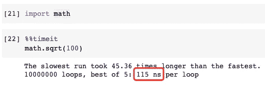

在这个糟糕的例子中，我们导入了`math`模块，并使用`math.sqrt()`来访问函数。当然，它完成工作没有任何问题，但是如果我们能导入`sqrt()`函数，性能会更好。

## 更快的例子

```
from math import sqrt
sqrt(100)
```

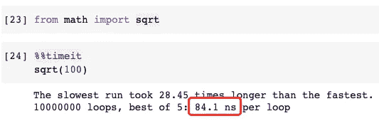

这比原来快了 25%。同样，如果我们需要在程序中多次使用平方根函数，代码会更整洁。

# 2.避免使用点/点链接


图片由 [anncapictures](https://pixabay.com/users/anncapictures-1564471/?utm_source=link-attribution&utm_medium=referral&utm_campaign=image&utm_content=3156771) 从 [Pixabay](https://pixabay.com/?utm_source=link-attribution&utm_medium=referral&utm_campaign=image&utm_content=3156771) 获得

在 Python 中使用点`.`来访问对象的属性或函数是非常直观的。大多数时候，没有问题。然而，如果我们能避免使用点，甚至是一串点，性能实际上会更好。

下面的例子显示了在列表中添加一个数字，然后删除它。

## 较慢的例子

```
my_list = [1, 2, 3]my_list.append(4)
my_list.remove(4)
```

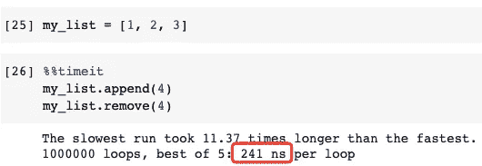

## 更快的例子

```
my_list = [1, 2, 3]append = my_list.append
remove = my_list.removeappend(4)
remove(4)
```

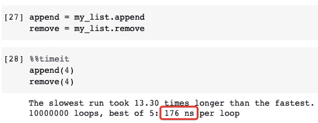

如果你不相信实际上做同样的事情，我们可以验证它。

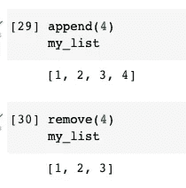

## 考虑

我可以预料许多 Python 开发者会跳出来说这个例子中的技术有点可笑。其实就算是对我自己来说，我也很少像上面那样写代码。然而，很高兴知道我们可以这样编程，甚至可以让它更快。

如果我们想在一个列表中添加和删除数百万次，我们应该考虑使用这个技巧。这就是为什么我们需要平衡代码的性能和可读性。

# 3.不要使用+来连接字符串


图片来自 [Pixabay](https://pixabay.com/?utm_source=link-attribution&utm_medium=referral&utm_campaign=image&utm_content=2820987) 的 [PIRO4D](https://pixabay.com/users/piro4d-2707530/?utm_source=link-attribution&utm_medium=referral&utm_campaign=image&utm_content=2820987)

Python 中的字符串是不可变的。因此，当我们使用“+”将多个字符串连接在一起作为一个长字符串时，每个子字符串都是单独操作的。

## 较慢的例子

```
strs = ['Life', 'is', 'short,', 'I', 'use', 'Python']def join_strs(strs):
    result = ''
    for s in strs:
        result += ' ' + s
    return result[1:]
```

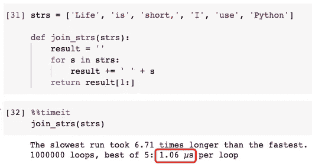

具体来说，对于每个子字符串，它需要请求一个内存地址，然后将它与该内存地址中的原始字符串连接起来。这就变成了一种开销。

## 更快的例子

```
def join_strs_better(strs):
    return ' '.join(strs)join_strs_better(strs)
```

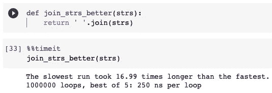

然而，当我们使用`join()`函数时，该函数预先知道所有的子字符串，并且分配的内存地址的长度将适合最终连接的字符串。因此，没有为每个子字符串分配内存的开销。

## 考虑

强烈建议尽可能使用`join()`功能。然而，有时我们可能只想连接两个字符串。或者说，只是为了方便起见，我们想用“+”。在这种情况下，使用“+”符号可以提高可读性，减少代码长度。

# 4.不要使用临时变量进行值交换


图片来自 [Pixabay](https://pixabay.com/?utm_source=link-attribution&utm_medium=referral&utm_campaign=image&utm_content=686100) 的 [magee](https://pixabay.com/users/magee-830963/?utm_source=link-attribution&utm_medium=referral&utm_campaign=image&utm_content=686100)

许多算法需要两个变量的值交换。在大多数其他编程语言中，这通常是通过引入临时变量来实现的，如下所示。

## 较慢的例子

```
a = 1
b = 2
temp = a
a = b
b = temp
```

非常直观的是，我们需要一个临时变量作为缓冲区。因此，当变量`b`的值被传递给变量`a`时，保存变量`a`的值会有所帮助。然后，缓冲器中`a`的值可以赋给变量`b`。

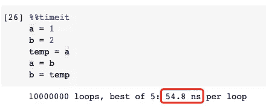

## 更快的例子

然而，在 Python 中，我们不必使用 temp 变量。Python 有内置语法来实现这种值交换，如下所示。

```
a = 1
b = 2
a, b = b, a
```

它不仅快了一点，而且使我们的代码更加整洁干净。

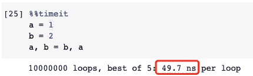

# 5.If 条件下使用短路


图片由[拍摄](https://pixabay.com/users/taken-336382/?utm_source=link-attribution&utm_medium=referral&utm_campaign=image&utm_content=1098059)来自 [Pixabay](https://pixabay.com/?utm_source=link-attribution&utm_medium=referral&utm_campaign=image&utm_content=1098059)

“短路”评估存在于许多编程语言中，Python 也是如此。基本上，它指的是某些布尔运算符的行为，其中只有当第一个参数不足以确定整个表达式的值时，才执行或计算第二个参数。

让我们用一个例子来证明这一点。假设我们有一个如下的列表。

```
my_dict = [
    {
        'name': 'Alice',
        'age': 28
    },
    {
        'name': 'Bob',
        'age': 23
    },
    {
        'name': 'Chris',
        'age': 33
    },
    {
        'name': 'Chelsea',
        'age': 2
    },
    {
        'name': 'Carol',
        'age': 24
    }
]
```

我们的工作是过滤列表，找出所有姓名以“C”开头、年龄大于或等于 30 岁的人。

## 较慢的例子

需要满足两个条件:

*   名字以“C”开头
*   年龄≥ 30 岁

因此，我们可以编写如下代码。

```
filtered_list = []
for person in my_dict:
    if person['name'].startswith('C') and person['age'] >= 30:
        filtered_list.append(person)
```

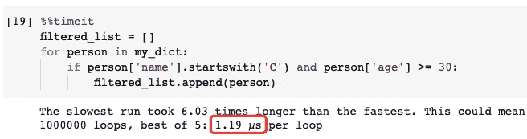

## 更快的例子

嗯，上一个例子中的代码没有问题。然而，在这个特别编造的例子中，只有“克里斯”的年龄超过了 30 岁。

所以，如果先写出查名字的条件，有 3 个名字满足(克里斯、切尔西、卡罗尔)。然后，关于年龄的第二个条件将对所有这 3 个人进行双重检查。

但是因为短路评估，如果先写年龄条件，只有克里斯的年龄在 30 以上，会被反复检查名字是否以“C”开头。

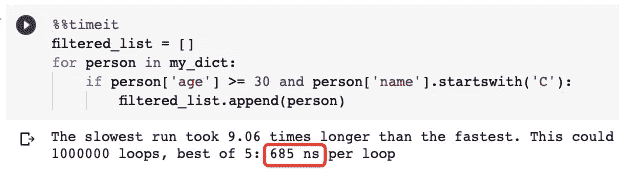

在这种情况下，它几乎快了 100%。

# 6.如果可以使用 For 循环，请不要使用 While 循环


图片由 [anncapictures](https://pixabay.com/users/anncapictures-1564471/?utm_source=link-attribution&utm_medium=referral&utm_campaign=image&utm_content=2678544) 来自 [Pixabay](https://pixabay.com/?utm_source=link-attribution&utm_medium=referral&utm_campaign=image&utm_content=2678544)

Python 使用了大量的 C 来提高性能，即 CPython。就循环语句而言，Python 中 For 循环的步骤相对较少，而作为 C 代码运行的步骤比 While 循环多。

所以在 Python 中可以使用 For 循环的时候，就不应该使用 while 循环。这不仅是因为 For-Loop 在 Python 中更优雅，而且性能更好。

## 较慢的例子

```
result = 0
max_number = 10i = 0
while i < 10:
    result += i
    i +=1
```

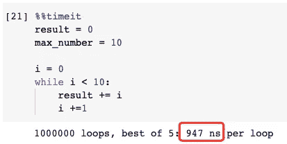

## 更快的例子

```
result = 0
max_number = 10for i in range(max_number):
    result += i
```

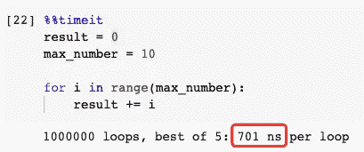

# 摘要


图片由[赫尔维·拉格朗日](https://pixabay.com/users/lagrangeherv%C3%A9-22927133/?utm_source=link-attribution&utm_medium=referral&utm_campaign=image&utm_content=6574455)从 [Pixabay](https://pixabay.com/?utm_source=link-attribution&utm_medium=referral&utm_campaign=image&utm_content=6574455) 拍摄

在这篇文章中，我列出了 6 个可以让你的 Python 程序更快的技巧。但是，也需要注意的是，我们不应该总是把性能放在第一位。有时，可读性和简洁性也应该考虑在内。

都是关于平衡的:)

[](https://medium.com/@qiuyujx/membership) [## 阅读克里斯托弗·陶的每一个故事(以及媒体上成千上万的其他作家)

### 作为一个媒体会员，你的会员费的一部分会给你阅读的作家，你可以完全接触到每一个故事…

medium.com](https://medium.com/@qiuyujx/membership) 

如果你觉得我的文章有帮助，请考虑加入 Medium 会员来支持我和成千上万的其他作者！(点击上面的链接)