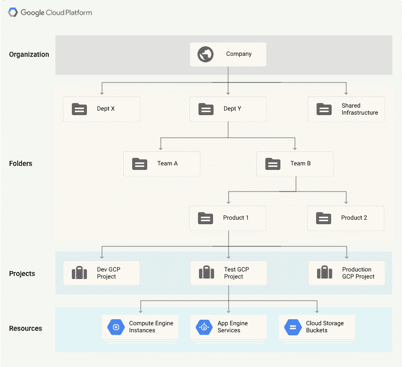

# 管理 BigQuery 数据访问的 6 个最佳实践

> 原文：<https://towardsdatascience.com/6-best-practices-for-managing-data-access-to-bigquery-4396b0a3cfba?source=collection_archive---------9----------------------->

## 在 BigQuery 中设置数据环境时，在安全性方面需要了解什么。

杰森·登特在 [Unsplash](https://unsplash.com?utm_source=medium&utm_medium=referral) 上拍摄的照片

我们都看到了，也听说了数据泄露及其可能造成的财务和声誉损失。随着我们越来越依赖数据来做出更好的决策，数据正成为任何组织的重要资产。因此，与公司的任何其他资产一样，控制对数据的访问对于保护您的数据至关重要。

幸运的是，现代数据仓库具有强大的内置功能，可以精确控制谁可以访问什么。这通常被称为身份和访问管理或 IAM。云提供商通常设计多个层来控制数据访问，这篇文章旨在揭示 Google 是如何使用 BigQuery 的。

然而，要知道在许多控制层中控制访问的最佳实践可能是一个挑战。这篇文章试图列出我多年来遇到的一些推荐做法。

# 谷歌云中的资源是如何组织的

BigQuery 是 Google 选择的数据仓库技术。要了解如何控制对 BigQuery 的访问，首先必须了解资源在 Google Cloud 中是如何组织的。

图片来自谷歌云的[文档](https://cloud.google.com/resource-manager/docs/cloud-platform-resource-hierarchy?hl=zh-tw)

Google Cloud 的构建方式是，我们可以在**资源级别**或任何**层级**授予访问权限，比如项目、文件夹和组织。

如果不需要资源级别的细粒度访问，可以在层次级别授予许可 IAM。换句话说，如果允许所有人访问项目中的每个数据集和表，就没有必要在资源级别明确定义权限。

但是，如果您仍在阅读本文，您很可能希望控制谁可以访问项目中的内容。

# BigQuery 的访问控制模式

## 授予资源级别的细粒度访问权限

[Lutz Wernitz](https://unsplash.com/@luwe83?utm_source=medium&utm_medium=referral) 在 [Unsplash](https://unsplash.com?utm_source=medium&utm_medium=referral) 上拍摄的照片

要在 BigQuery 中查询一个表，需要两个权限:运行查询的权限**和查看数据的权限**和查看数据的权限。

运行查询的权限可以在任何层次级别上定义。您可以战略性地设置查询运行权限，以获得更好的可见性。例如，如果数据处理被划分到不同的项目中，您可以分别查看与数据转换和使用相关的所有查询开销、查询日志和数据访问日志。

查看数据的权限也可以在分层级别上设置。但是，强烈建议您在项目或资源级别(数据集和表)设置此权限。经验法则是，如果一个角色应该可以访问项目中的所有数据，那么就在项目级别授予它。如果需要限制对某个数据集或表的访问，请在资源级别授予权限。

BigQuery 还能够设置行级和列级安全性，从而允许更细粒度的访问控制。这将成为另一篇文章的好话题。

## 最小特权

照片由[飞:D](https://unsplash.com/@flyd2069?utm_source=medium&utm_medium=referral) 在 [Unsplash](https://unsplash.com?utm_source=medium&utm_medium=referral)

通俗地说，最小特权就是给予履行职责所需的最少权限。该原则有助于为实体(用户、组和服务帐户)和 GCP 资源创建职责分离。在许多系统上，最低特权是安全的推荐做法。

例如，数据分析师的职责是查询和汇总转换后的数据。对于这个角色，她应该被授予对转换后的数据的只读访问权限，以执行她的工作。授予写访问权限可能意味着数据完整性面临风险。本例中的数据分析师可能会错误地删除或更改生产数据。同样，运营数据分析师只需要访问运营数据，而不需要访问完整的财务或客户数据。

将项目的完全访问权限(所有者或编辑权限)授予每个人通常是一个错误。默认情况下，Google Cloud 创建一个具有编辑权限的计算服务帐户，以在项目中启用计算 API。该帐户非常宽松，可能是一个潜在的安全威胁。最佳做法是禁用此帐户的自动创建，或者在以后删除它。

## 服务的用户服务帐户。

[梁杰森](https://unsplash.com/@ninjason?utm_source=medium&utm_medium=referral)在 [Unsplash](https://unsplash.com?utm_source=medium&utm_medium=referral) 上拍照

你可以在 Google Cloud 中使用两种主要的认证方式:**用户账户**和**服务账户**。用户帐户是您用来登录控制台的 Google 帐户。另一方面，服务帐户是一个 JSON 密钥文件，您可以用它来认证服务。

这两种身份验证方法的区别在于谁在执行操作。对于用户帐户，用户使用其用户名/密码登录并执行操作。对于服务帐户，它是执行操作的服务(ETL 作业、可视化工具、元数据目录工具)。

这里一个常见的错误是使用一个用户帐户来认证服务。这样做会遇到配额问题，并使控制访问和审计日志变得更加困难。

另一个常见的错误是对每个服务使用一个服务帐户。这也不是推荐的做法，因为您不知道什么服务执行什么操作。此外，由于该帐户用于所有服务，它将是许可的，并增加了违规的机会。

## 授予组而不是个人帐户访问权限

在 [Unsplash](https://unsplash.com?utm_source=medium&utm_medium=referral) 上 [Margarida CSilva](https://unsplash.com/@marg_cs?utm_source=medium&utm_medium=referral) 拍摄的照片

这样做的主要原因是为了更好地控制项目中的 IAM 权限。想象一下，如果你有十个人需要访问一个项目中的数据+五个不同的服务帐户，维护谁有权访问什么可以很快失控。

然而，角色的数量将显著低于(或者，在最坏的情况下，等于)人员的数量。因此，更好的方法是基于角色创建一个不同的组，并相应地添加权限，以便更加清晰。

您还可以将一个群组添加为另一个群组的成员，以获得额外的控制层。例如，您可以有一个数据分析师小组。在这个组中，你可以有一个市场分析师组，一个运营分析师组，等等。

## 使用基础设施即代码(IaC)

丹尼尔·科鲁奇在 [Unsplash](https://unsplash.com?utm_source=medium&utm_medium=referral) 上的照片

IaC 使您能够轻松地创建不同的环境，尤其是当您的项目很复杂并且有许多活动部分时。在大型项目中，您可以拥有具有复杂权限和策略的环境。只需为一个环境编写一次代码，并为试运行和开发环境提供同样的东西，就可以节省您的时间。

有了 IaC，您环境中的每一个更改都被版本化，因此您知道谁做了什么更改(假设您将管理权限限制为仅您的 IaC 服务)。您还可以定期扫描您的环境，查看配置和实际环境之间的差异。如果大多数 IaC 服务检测到任何变更，它们会将您的环境恢复到配置。

下面看看我关于这个主题的其他一些文章。

</data-lake-on-gcp-using-terraform-469062a205ad>  </bootstrap-a-modern-data-stack-in-5-minutes-with-terraform-32342ee10e79>  

## 资源分离

Guillaume Bolduc 在 [Unsplash](https://unsplash.com?utm_source=medium&utm_medium=referral) 上拍摄的照片

加强安全性的最佳方式之一是分离资源。这意味着为您不想存储在一起的数据创建不同的项目。

一个好的起点是将接收、处理和访问之间的资源分开，以确保只在需要的时候访问数据。通过这种设计，您可以锁定原始数据的接收，并控制哪些数据在访问层可用。一个常见的用例是在将表暴露给数据仓库之前屏蔽或散列个人身份信息(PII)。

# 结论

在现代云平台中，比如 Google Cloud，有许多层来限制数据访问。我讨论了使用以下最佳实践来确保您有一个安全的数据环境:

*   授予资源级别的细粒度访问权限
*   最小特权
*   服务的用户服务帐户。
*   授予组而不是个人帐户访问权限
*   使用基础设施即代码(IaC)
*   资源分离

在以后的文章中，我将分享如何使用行级安全性、列级安全性和 VPC 服务控制来获得更加安全的数据环境。

干杯✌️