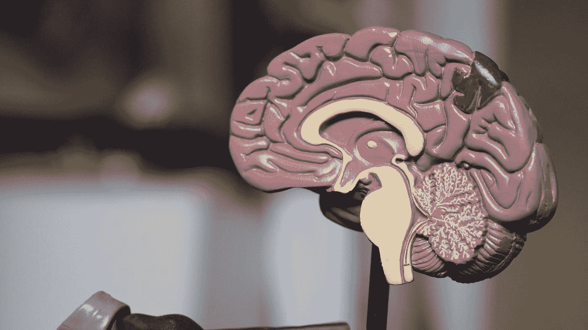

# 6 个最佳图像处理项目和有用的资源

> 原文：<https://towardsdatascience.com/6-best-projects-for-image-processing-with-useful-resources-f860f3dfe977?source=collection_archive---------2----------------------->

## 六个最好的图像处理和机器学习项目，提供有用的链接和技术资源


照片由 [Unsplash](https://unsplash.com?utm_source=medium&utm_medium=referral) 上的[pav polo](https://unsplash.com/@pavl_polo_official?utm_source=medium&utm_medium=referral)拍摄

我们被美丽的视觉效果和丰富多彩的图像所包围。观看自然环境和拍摄照片是一段有趣的时光。虽然我们的眼睛可以轻松地想象图像的颜色和各种概念，但计算机识别这些相同的图像是一个复杂的过程。为了分析这些图像视觉效果，我们利用机器学习或深度学习的图像处理算法来创建精彩的项目。

计算机视觉是现代世界中最有趣的研究领域之一。使用最新的 CV 算法和技术，曾经被认为几乎不可能由更纯粹的机器来执行和计算的任务可以相对容易地实现。随着计算机视觉的所有元素在现代计算时代的兴起，我们可以创建一些高质量的项目。

从我们周围的众多选项和各种图像视觉选择中，我们可以从头开始创建一些顶级项目。在本文中，我们的目标是列出六个最好的图像处理项目，如果需要，可以借助计算机视觉、机器学习或神经网络来实现。

本文中列出的所有项目都是我个人为任何计算机视觉爱好者挑选的六个项目。确保您参考了本文中陈述的有用链接、资源和引用，以获得进一步的指导。他们将带你经历你在处理这些项目时可能遇到的大部分问题。

# 1.PIL 和 OpenCV 入门


作者截图。原文来源[维基](https://en.wikipedia.org/wiki/File:Lenna_(test_image).png)

首先，理解图像在自然世界中是如何工作的，以及计算机如何感知它们来处理和分析这些数字视觉效果是非常重要的。所有图像都以 0 的格式和直到 255 的范围来解释。彩色图像的格式是 RGB 格式，其中一个值以三维数组来解释。类似地，对于灰度图像，我们只有由白色和黑色对应物组成的两个光谱。

Python 图像库(PIL)是向 Python 解释器添加图像处理功能的主要方法之一。由于这个库提供了广泛的文件格式支持，您可以有效地执行大多数任务。它具有有效的内部表示和相当强大的图像处理能力。整个核心图像库旨在更快地访问以几种基本像素格式存储的数据元素。因此，这个库是一个很好的起点，因为它为用户提供了一个可访问的通用图像处理工具(查看下面提供的文档链接以了解更多信息)。

下面是一个简单的代码块，用来理解 PIL 库的一些基本特性。

```
# Importing the required libraries
import numpy as np
from PIL import Image
import PIL# Opening and analyzing an image
image1 = Image.open('Red.png')
print(image1.format)
print(image1.size)
print(image1.mode)
```

为了进一步实验和理解 pillow library，我建议查看一下官方文档,用这个工具实验更多的图片和模块。

下一个学习创建精彩项目的库是在 open-cv 计算机视觉库的帮助下。一旦您熟悉了枕头库，您就可以在 cv2 库的帮助下开始尝试这些图像的知识。在这个工具的帮助下，您可以操作图像，通过改变它们的尺寸来调整大小，将它们的颜色从一种格式转换为另一种格式，等等。从零开始探索并从这个图书馆中获取尽可能多的知识是值得的。

如果你有兴趣从零开始学习计算机视觉的大部分基本方面，以及解决一些复杂任务的所有相应代码，我建议大家看看下面提供的文章。它涵盖了初学者入门计算机视觉并最终掌握它所需的大部分要素。

[](/opencv-complete-beginners-guide-to-master-the-basics-of-computer-vision-with-code-4a1cd0c687f9) [## OpenCV:用代码掌握计算机视觉基础的完全初学者指南！

### 包含代码的教程，用于掌握计算机视觉的所有重要概念，以及如何使用 OpenCV 实现它们

towardsdatascience.com](/opencv-complete-beginners-guide-to-master-the-basics-of-computer-vision-with-code-4a1cd0c687f9) 

# 2.基于图像的考勤系统


[国立癌症研究所](https://unsplash.com/@nci?utm_source=medium&utm_medium=referral)在 [Unsplash](https://unsplash.com?utm_source=medium&utm_medium=referral) 上拍摄的照片

在教室里举手说“请讲，女士”或“是的，女士”或其他你想说的话的传统方式正在逐渐消失。随着在线课程的引入，学生和教师可以通过在线平台进行互动，以更传统的方式进行出勤将变得更加困难。然而，计算机视觉来拯救我们，帮助我们创建一个基于图像的考勤系统，在你的像素化图片的帮助下进行在线考勤！

让我们来讨论一些方法，在这些方法中你可能会处理这个问题。一个经典的方法是确保你有一些所有学生和同学的照片。如果无法包含更大的数据集，可以使用数据扩充方法来增加存储的数据量。一旦你能够为这个特定的任务收集到相当数量的数据集，你就可以处理这些图像，并建立一个深度学习模型，以实现顶级的结果。

如果你有兴趣探索与基于图像的考勤系统的任务相关的理论方面，那么[研究论文](https://arxiv.org/pdf/1407.6245.pdf)应该是你探索更多理论知识和理解概念的一个梦幻般的起点。然而，如果你对该过程的实际编码实现更感兴趣，那么这篇[文章指南](https://www.baseapp.com/deepsight/attendance-system-using-face-recognition/)应该也能帮助你实现自己的解决方案。

# 3.面罩检测


照片由[安娜斯塔西娅·切平斯卡](https://unsplash.com/@anastasiiachepinska?utm_source=medium&utm_medium=referral)在 [Unsplash](https://unsplash.com?utm_source=medium&utm_medium=referral) 拍摄

在疫情期间，有一些严格的规定需要遵守，以保持城市、州或国家的礼仪。由于我们不能总是让官方机构关注一些不遵守规则的人，我们可以构建一个面具检测项目，使我们能够判断特定的人是否戴着面具。在此期间，在严格的封锁规定下，实施这个项目来维护社会将是一个绝妙的主意。

因此，一个可以通过跟踪路上或街道上的人来分析他们是否戴着面具来处理整个地区或区域的图像的项目将是一个非常棒的想法。在图像处理算法和深度学习技术的帮助下，你可以计算出戴面具的人的图像。以下用于人脸面具检测的 [Kaggle 数据集](https://www.kaggle.com/andrewmvd/face-mask-detection)将是分析训练图像以实现整体高准确度的良好起点。

解决这个问题的最好方法之一是利用迁移学习模型，如 VGG-16、face-net、RESNET-50 和其他类似的架构，看看什么方法可以帮助你达到最佳效果。作为起点，我强烈推荐查看我以前的一篇关于智能人脸锁定系统的文章，其中我们构建了一些高级人脸识别系统。对于没有遮罩的面和有遮罩的面，可以使用类似的方法来解决此类任务。

[](/smart-face-lock-system-6c5a77aa5d30) [## 智能面部锁定系统

### 建立高精度人脸识别模型

towardsdatascience.com](/smart-face-lock-system-6c5a77aa5d30) 

# 4.车牌识别


由[托马斯·米洛特](https://unsplash.com/@tmillot?utm_source=medium&utm_medium=referral)在 [Unsplash](https://unsplash.com?utm_source=medium&utm_medium=referral) 上拍摄

使用字母数字字符识别的最佳项目之一是借助车牌图像。有几种方法可以用来解决图像中嵌入字母、数字和数字的问题。我们可以使用深度学习技术、光学字符识别(OCR)技术、图像处理和自然语言处理(NLP)的结合、计算机视觉方法等等。

您可以处理这个问题的大量方法为您提供了一个机会，让您可以用自己开发的模型探索所有这些方法。找出什么技术将帮助你达到最佳效果是相当有趣的。通过深度学习方法，您可以从 Kaggle 收集所需的数据集和信息，用于[车辆牌照检测](https://www.kaggle.com/dataturks/vehicle-number-plate-detection)。一旦你收集了足够的信息，你就可以建立你自己的定制模型或者使用迁移学习模型来看看是什么给了你想要的结果。

如果你想用一种更独特的方法来解决问题，建议你看看我以前的一篇关于光学字符识别(OCR)的文章。使用 OCR 技术，您可以相对轻松地解释图像中的大部分数据。OCR 引擎会尝试分析图像中的字符，并找到合适的解决方案。要详细了解这个主题，请查看下面提供的链接。您还可以尝试其他独特的方法，看看哪种技术产生的效果最好。

[](/getting-started-with-optical-character-recognition-using-python-e4a9851ddfab) [## 使用 Python 开始光学字符识别

### 对光学字符识别从无到有的直观理解和简要介绍

towardsdatascience.com](/getting-started-with-optical-character-recognition-using-python-e4a9851ddfab) 

# 5.医学图像分割



Robina Weermeijer 在 [Unsplash](https://unsplash.com?utm_source=medium&utm_medium=referral) 上的照片

图像处理、计算机视觉、机器学习和深度学习最重要的贡献之一是在医疗领域。它们有助于分析和可视化许多可能发生在人类身上的高度复杂的异常现象。诸如糖尿病视网膜病变、癌症检测、x 射线分析和其他关键医疗处理任务等任务需要使用深度学习模型和图像处理来获得高度准确的结果。

虽然大多数项目需要高精度的预测，但这种说法在医学领域的图像分割任务中变得更加重要。自 2015 年使用 U-Net 架构进行生物医学图像分割以来，该架构出现了更多变化，并且不断构建许多不同类型的模型，以在每种情况下获得最佳结果。

从 [DICOM 库](https://dicomlibrary.com/)可以获得接收与医学图像分割相关的任何任务的图像和视频文件的最佳位置之一。通过访问这个链接，你将被引导到一个可以下载医学图像和视频进行科学计算的地方。

您还可以利用 Kaggle 的[糖尿病视网膜病变数据集](https://www.kaggle.com/c/diabetic-retinopathy-detection/data)开始一项流行的挑战，即计算眼睛的图像分割以及检测一个人是否患有眼睛疾病。除了上面提到的任务，还有大量的生物医学图像处理和任务可供您使用。请随意测试它们，用它们做实验。

# 6.情绪和手势识别


雅各布·欧文斯在 [Unsplash](https://unsplash.com?utm_source=medium&utm_medium=referral) 上的照片

看着上面的图像，人们可能会想知道这个特殊的手势可以被归类为什么。有几种手势是人们作为一种交流方式扔掉的。借助于适当的图像，人们可以找出对手势进行相应分类的最佳方法。类似地，你可能想弄清楚一张脸上的情绪。无论这个人表现出快乐、悲伤、愤怒或任何其他类似情绪的迹象，你都可以建立一个人工智能模型来执行以下分类。

情绪和手势是人类活动的组成部分。尽管与本文提到的其他一些项目相比有点困难，但我们可以构建一个计算机视觉和深度学习模型来执行以下任务。为了解决这个问题，你可以利用面部情绪识别( [Kaggle 的 fer2013 数据集](https://www.kaggle.com/c/challenges-in-representation-learning-facial-expression-recognition-challenge/data))进行情绪分类，利用美国手语( [ASL 字母表数据集](https://www.kaggle.com/grassknoted/asl-alphabet))进行手势计算。

一旦我们拥有了所有需要的数据集，你就可以在计算机视觉的帮助下构建你的深度学习架构来实现这些项目。借助神经网络和图像处理的结合，您可以开始研究情绪和手势检测，以获得高质量的结果，同时具有体面的损失和准确性。

下面提供的链接是两个最好的指南，您可以在其中从头开始执行人类情感和手势识别活动。我几乎涵盖了完美计算这些任务所需的每个方面，包括数据集的预处理、数据的可视化以及从头开始构建架构。请随意参考它们，以获得关于执行这些任务的最佳信息。

[](/human-emotion-and-gesture-detector-using-deep-learning-part-1-d0023008d0eb) [## 使用深度学习的人类情感和手势检测器:第 1 部分

### 了解如何从零开始构建具有深度学习的人类情感和手势检测器。

towardsdatascience.com](/human-emotion-and-gesture-detector-using-deep-learning-part-1-d0023008d0eb) [](/human-emotion-and-gesture-detector-using-deep-learning-part-2-471724f7a023) [## 使用深度学习的人类情感和手势检测器:第 2 部分

### 深入探究人类情感和手势识别

towardsdatascience.com](/human-emotion-and-gesture-detector-using-deep-learning-part-2-471724f7a023) 

# 结论:


照片由[达维德·扎维亚](https://unsplash.com/@davealmine?utm_source=medium&utm_medium=referral)在 [Unsplash](https://unsplash.com?utm_source=medium&utm_medium=referral) 上拍摄

> 5 亿多年前，视觉成为进化“大爆炸”的主要驱动力，寒武纪大爆发导致了动物王国的爆炸性物种形成。5 亿年后，人工智能技术即将改变人类生活、工作、交流和塑造环境的方式。——[**费——李非**](https://www.brainyquote.com/authors/fei-fei-li-quotes)

使用人工智能和计算机视觉来处理图像、图片和任何其他类型的视觉效果目前在多个领域都具有巨大的意义。除了本文提到的六个项目之外，还有数百万个项目想法可以让您自己从头开始实施，使您能够更加精通图像处理和计算机视觉任务。

对于任何与图像处理相关的任务，理解图像在核心中是如何工作的变得至关重要。有了这些基础知识和对基本概念的理解，您可以更轻松地实现更复杂的图像处理算法、机器学习方法和深度学习技术。

随着现代应用对图像处理和计算机视觉项目的需求越来越大，对于任何一个热衷于以下领域的人来说，这是投入其宝贵努力和资源的最佳时机。你不仅可以解码图像的特征和工作原理，还可以在高度复杂的任务中运用你的技能，如自动驾驶汽车，以全面改善和提高人们的生活方式。

如果你对这篇文章中提到的各点有任何疑问，请在下面的评论中告诉我。我会尽快给你回复。

看看我的其他一些文章，你可能会喜欢读！

[](/best-pc-builds-for-deep-learning-in-every-budget-ranges-3e83d1351a8) [## 在各种预算范围内，最适合深度学习的电脑

towardsdatascience.com](/best-pc-builds-for-deep-learning-in-every-budget-ranges-3e83d1351a8) [](/7-best-free-tools-for-data-science-and-machine-learning-3e630125f87e) [## 数据科学和机器学习的 7 个最佳免费工具

towardsdatascience.com](/7-best-free-tools-for-data-science-and-machine-learning-3e630125f87e) [](/best-library-to-simplify-math-for-machine-learning-ed64cbe536ac) [## 为机器学习简化数学的最佳库！

### 使用 sympy Python 库简化用于机器学习的微积分

towardsdatascience.com](/best-library-to-simplify-math-for-machine-learning-ed64cbe536ac) [](/6-best-programming-practices-f2605c5b469c) [## 6 个最佳编程实践！

### 每个程序员和数据科学家都应该遵循的六个编程技巧

towardsdatascience.com](/6-best-programming-practices-f2605c5b469c) [](/5-essential-skills-to-develop-as-a-data-scientist-16442f094c09) [## 成为数据科学家的 5 项必备技能！

### 探索每个成功的数据科学家必须具备的五项重要软技能！

towardsdatascience.com](/5-essential-skills-to-develop-as-a-data-scientist-16442f094c09) 

谢谢你们坚持到最后。我希望你们都喜欢这篇文章。祝大家有美好的一天！