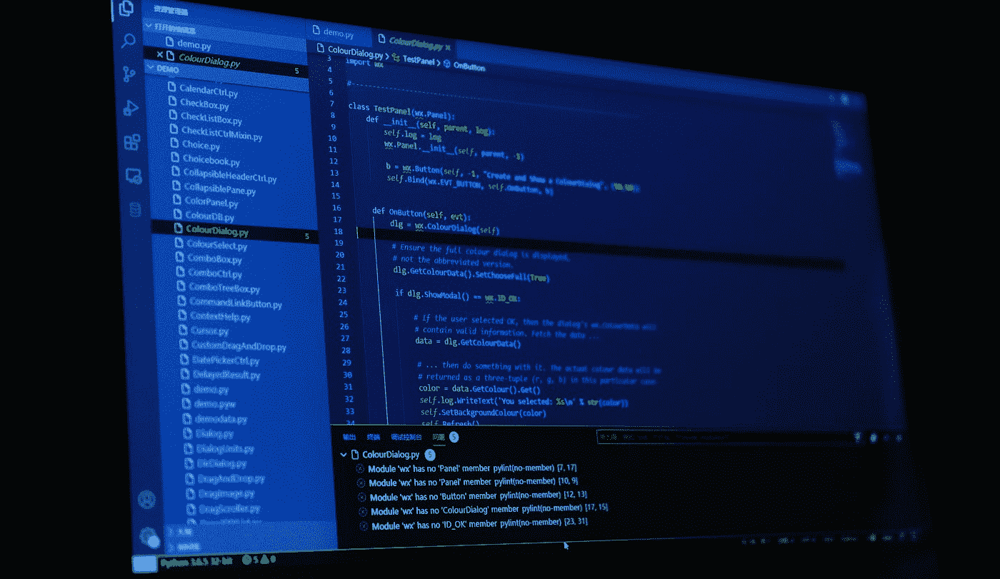

# 数据科学应用的 6 个最佳 Python IDEs 和文本编辑器

> 原文：<https://towardsdatascience.com/6-best-python-ides-and-text-editors-for-data-science-applications-6986c4522e61?source=collection_archive---------1----------------------->

## 在动态、结构化的开发环境中构建您的应用程序。

照片由[卢](https://unsplash.com/@riku?utm_source=medium&utm_medium=referral)在 [Unsplash](https://unsplash.com?utm_source=medium&utm_medium=referral)

程序员问自己的一个问题，尤其是在使用什么编程语言之后的职业生涯之初，是什么 IDE 或文本编辑器会让他们的生活变得更好、更高效。无论您从事什么样的编程，无论是 web 开发、移动/桌面应用程序开发还是数据科学，您对 IDE 的选择都会对您完美完成工作的能力产生巨大的影响。

IDE 和文本编辑器是特殊的开发环境，程序员使用它们来编写代码、测试代码、调试代码，并将其上传到 g itHub——或任何其他 Git 托管网站。正确的 IDE 或文本编辑器应该对大多数编程语言都是灵活的，让你可以很容易地分类和组织你的文件，并允许你轻松地共享它们。

尽管许多 IDE 和文本编辑器提供了许多属性和选项来定制您的开发环境，但是没有绝对最好的 IDE。一切都回到个人喜好上来。有些人喜欢完整的 ide，而有些人喜欢轻量级的文本编辑器。

 [## 不包括 Python 或 R 的 5 种数据科学编程语言

### 有比你想象的更多的选择。

towardsdatascience.com](/5-data-science-programming-languages-not-including-python-or-r-3ad111134771) 

本文将介绍开发人员经常使用的 6 大 Python IDEs 和文本编辑器，以使他们的工作流程尽可能的流畅和高效。因此，如果您正在寻找一个 IDE 或文本编辑器，请尝试这些工具，直到找到符合您偏好的为止。

# №1:崇高

让我们从我最喜欢的文本编辑器 [Sublime](https://www.sublimetext.com/) 开始吧。Sublime 是一个带有付费版本的免费文本编辑器，您可以使用它来编写、编辑和调试几乎任何编程语言的代码。当你第一次下载并安装 Sublime 的时候，它是一个普通的，有点无聊的文本编辑器。但是，Sublime 的优势来自于你可以根据你打算使用的编程语言安装的附加组件。

Sublime 附加组件最好的部分是，你可以定制它们来满足你的需求，从颜色到整体外观，以及与 GitHub 或其他平台的连接。将 Sublime 设置为完美的开发环境将花费您不到 30 分钟的时间，然后您就可以开始工作了。我将很快写一篇关于为 Python 和数据科学完美设置 Sublime 的文章。

# №2: Spyder

接下来是科学 Python 开发环境 [Spyder](https://www.spyder-ide.org/) 。Spyder 是一个免费的开源 IDE 开发，尤其是针对 Python。Spyder 最好的一点是与其他 ide 相比它是多么的轻量级。Spyder 是数据科学和机器学习应用程序的一个很好的选择，因为它有一个交互式编码模式，允许您实时分析数据。

Spyder 还让您能够检查整个代码库，或者将其分成几个部分，以便更仔细地查看。它还集成了许多常用的数据科学包，如 NumPy、Pandas、SciPy 和 IPython。但是，也许使用 IDE 的最大优势是它们的集成调试器。Spyder 有一个非常棒的图形调试器，可以让您的测试和错误定位任务变得流畅和容易。

 [## 比“打印”更好的 5 个 Python 调试工具

### 更快更有效地调试代码。

towardsdatascience.com](/5-python-debugging-tools-that-are-better-than-print-1aa02eba35) 

# №3:原子

我们的下一个文本编辑器是[原子](https://atom.io/)。Atom 是 GitHub 开发的开源文本编辑器。开发 Atom 是为了支持许多常用的编程语言，如 Java 和 Ruby on Rails。但是，可以对其进行定制，以在编写 Python 代码时提供出色的用户体验。此外，Atom 提供了许多插件，可以使其成为构建数据科学应用程序时使用的最佳编辑器之一，例如允许您执行 SQL 查询的[数据 Atom](https://atom.io/packages/data-atom) 包。

除了优秀的软件包，Atom 的优势之一是它的社区。Atom 有一个最活跃的社区，该社区一直致力于开发 atom，并使之更好地为开发者服务。不用说，Atom 具有很好的 Git 集成，可以让您的项目版本控制跟踪变得轻而易举。

# №4: Visual Studio 代码

其中最完整、应用最广泛的 ide 是 [Visual Studio 代码](https://code.visualstudio.com/) (VS 代码)。VS Code 是 Python、C、C#和 JavaScript 开发人员非常流行的 IDE。VS 代码是免费的、轻量级的、开源的。但它也为公司提供付费版本。

VS 代码有很多优点，特别是对于初学者，因为当你定义一个函数或者一个类或者有一个小的语法错误时，它提供了点击和指针来帮助你。VS 代码还与 PyLint 有很好的集成，PyLint 是一种 Python linter，用于检查代码中的错误。使用 VS 代码的另一个优点是执行单元测试和 REPL(读取-评估-打印循环)操作非常容易。

 [## 你应该考虑阅读的 5 本新的数据科学书籍

### 了解这些书的最新情况

towardsdatascience.com](/5-new-data-science-books-that-you-should-consider-reading-c90aec1d5b0d) 

# №5:皮查姆

如果你正在学习 Python，那么你可能会使用我们列表中下一个 IDE。PyCharm 可能是最著名的 Python IDE。它最初是为 Python 开发的，这是它最大的优势。虽然支持多种编程语言很好，但是为一种语言构建特定的 IDE 通常可以提供更健壮的开发环境。

PyCharm 提供了许多 Python 特性，比如代码/错误突出显示、Git 集成和强大的图形调试器。PyCharm 代码编辑器还允许您自定义其外观和颜色，以符合您的舒适。此外，PyCharm 有许多插件，您可以添加这些插件来扩展它的功能。

# №6: Jupyter 笔记本

最后，也是最受数据科学社区欢迎的是 [Jupyter 笔记本](https://jupyter.org/)。如果不提到 Jupyter 笔记本，我就无法创建这个列表。Jupyter 代表 Julia、Python 和 r。Jupyter Notebooks 是一个开源、免费的开发环境，广泛应用于编程社区，因为它功能多样、健壮，并使代码文件易于共享。

Jupyter Notebook 使开发人员能够将代码位与 markdown、HTML 和 LaTeX 文本混合在一起。Jupyter notebook 是一个基于服务器的结构，易于在浏览器中使用和操作。由于 IPython 的使用，它强大的可视化能力使它成为人们的最爱，特别是在数据科学和量子计算方面。Jupyter Notebook 的扩展是 [Jupyter Lab](https://jupyterlab.readthedocs.io/en/stable/) ，它提供了更多的功能，就像一个可视化调试器。

 [## 9 份全面的数据科学备忘单

### 有时我们需要一个简短扼要的资源。

towardsdatascience.com](/9-comprehensive-cheat-sheets-for-data-science-46005d72b485) 

# 外卖食品

当您必须编写、读取和调试数百行甚至数百万行代码时，您选择的 IDE 或文本编辑器将对您的工作流程产生重大影响。拥有正确的 IDE 或文本编辑器意味着你将有语法高亮，容易的文件编辑和组织，以及容易的共享和上传你的作品。

但是，现在有数百种 ide 和文本编辑器，尝试所有这些并不是最可行或最省时的解决方案。因此，在这篇文章中，我向您推荐了 6 种 Python IDEs 和文本编辑器，如果您想购买 IDE 或文本编辑器，可以从中选择。

本文中提出的 6 个 ide 和文本编辑器是通用的、灵活的，并且提供了大量的选项，您可以使用它们来定制构建一个高效、流畅的工作环境，使您能够轻松地执行任务。所以，试试这些 ide 和文本编辑器，看看哪一个最适合你的个性和需求。