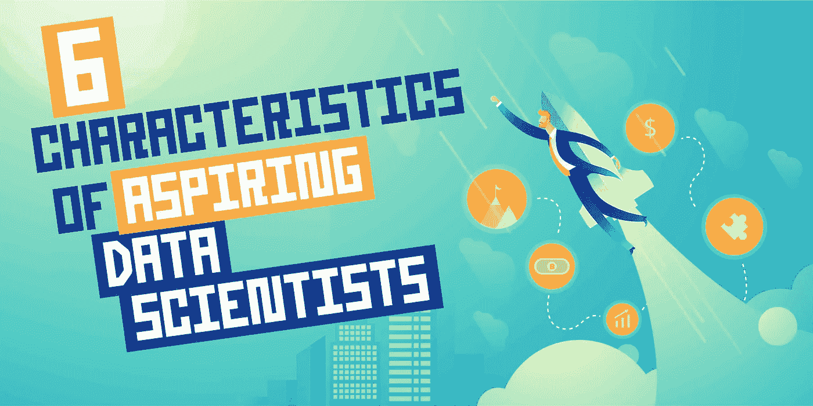
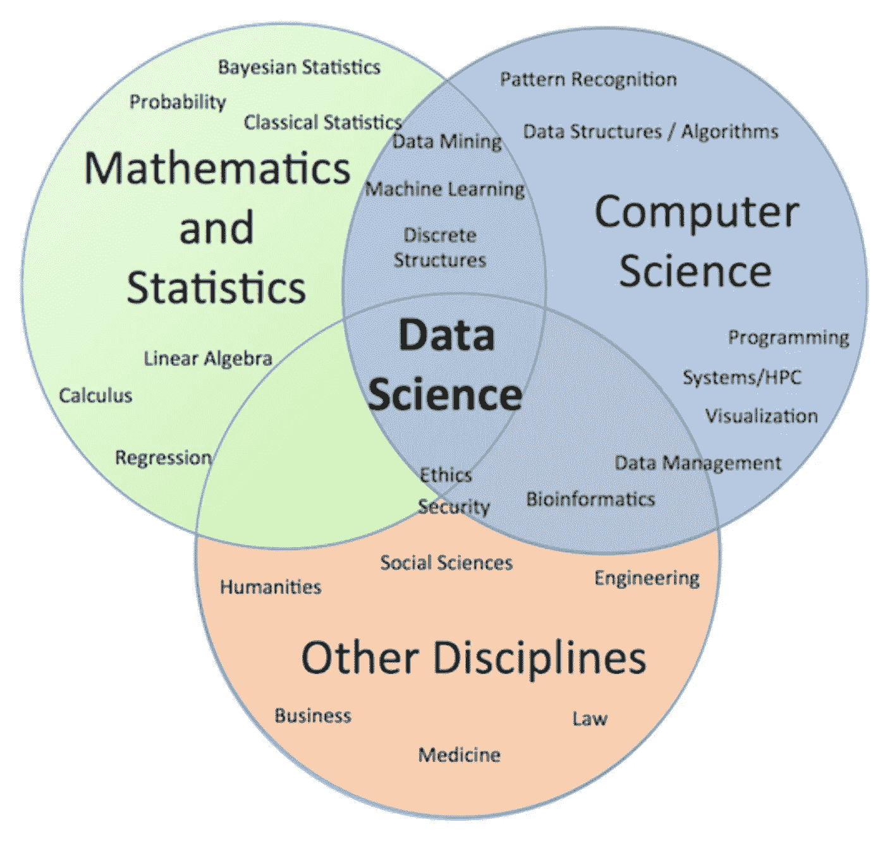

# 每个有抱负的数据科学家都应该了解的 6 个特征

> 原文：<https://towardsdatascience.com/6-characteristics-that-every-aspiring-data-scientist-should-know-about-4c34873bc89?source=collection_archive---------32----------------------->

由 [envato elements](https://1.envato.market/c/2346717/628379/4662) 的 [Chanut_industries](https://elements.envato.com/user/Chanut_industries) 使用图像创建(经许可)。

## 根据 ACM 数据科学任务组的研究

大数据和计算进步的优势导致数据科学成为一个无所不包的领域，可以帮助从数据中提取知识和价值。近年来，这种受欢迎的程度已经见证了指数级的增长和炒作，促成了对数据专业人员的巨大市场需求。有鉴于此，培训新一代数据科学家的最佳课程存在巨大空白。数据科学是一个如此独特的领域，因为它是跨学科的，并且可能根据观察者的不同而呈现不同的含义。

2017 年，计算机械协会的教育委员会成立了 *ACM 数据科学任务组*，以集思广益的方式为数据科学本科生推荐课程。在本文中，我们将探讨该计划所建议的数据科学毕业生的一些理想特征。

# 1.培养面向数据的思维方式

建议学习数据科学的人接受一种非常注重数据的心态，特别是数据的收集和数据的应用，以通过适当的分析做出有益的发现和改进。

数据科学给人类带来的好处包括:

*   一个城市的空气质量数据可能导致危险污染的消除或哮喘预警信号的发布。
*   患者数据收集可以为疾病诊断和治疗提供新的见解。
*   实时交通数据收集可以导致主动的交通缓解措施。

可能性是无限的，数据科学对改善企业、社会以及最终建设更美好未来的贡献是巨大的。

尽管有其优势，人们也应该意识到其意想不到的后果的可能性。

因此，任何数据科学家也应该有强烈的职业和道德责任感。因此，道德和负责任的人工智能等术语探索了这一重要领域。

# 2.数据科学是一个跨学科领域

数据科学从根本上说是一个跨学科领域，包含以下关键要素的集成:

*   *—为数据分析提供数据和上下文*
*   **—为数据分析、探索性数据分析、建模和推理提供基础**
*   *****计算机科学*** —构成用于数据处理、数据结构和算法、机器学习以及模型部署的计算机硬件和软件**

****

**数据科学的跨学科性质。图片来自[1]。**

**数据科学不是这三部分的随意集合。为了交付有意义的结果，数据科学需要这三个组件的正确集成。**

**因此，这仍然是任何教授数据科学的教育项目的核心挑战。不可能把这三个元素的每一个都包含进来，但是我们的目标是创造一些独特的东西，把每个元素的 ***关键*** 元素都包含进来。因此，不了解这些元素中的每一个都是可以的，但是要抓住它们的核心。**

**数据科学的魅力可能在于其多样性，从业者拥有独特的技能组合，不仅可以从数据中提取知识和见解，还可以传达和练习引人入胜的故事，以便利益相关者可以了解分析结果。**

# **3.探索当前的数据科学前景**

**为了探索数据科学领域的当前发展水平，ACM 数据科学工作组在 2018 年初对来自学术界(672)和工业界(297)的总共 969 名 ACM 成员进行了一项调查。**

## **3.1.学术部门**

**当被问及该机构是否提供数据科学的学术项目时，结果如下:**

*   **47%的受访者表示他们不提供数据科学本科课程，而其余 53%的受访者提供数据科学的全学士学位。**
*   **提供数据科学学士学位的学院已经开设了编程和统计方面的必修课程。这些程序中的大多数还需要数据管理原则、概率、数据结构和算法、数据可视化、数据挖掘和机器学习。此外，这些课程还涵盖了伦理学、微积分、离散数学和线性代数等主题，以及一门与上下文中的数据科学相关的必修课。**
*   **这些数据科学的学术项目中的很大一部分位于计算机科学系。**
*   **超过一半的项目报告称，每年从该项目毕业的学生不超过 10 人。**

## **3.2.工业部门**

**当被问及公司希望应聘者在数据科学和计算方面有什么经验时，结果如下:**

*   **48%的人表示，他们寻找拥有数据科学、分析或相关教育背景学位的候选人。**
*   **行业受访者报告的经验或技能与学术数据科学项目提供的经验或技能不谋而合。值得注意的一点是，雇主报告说，他们需要更多的计算技能，而不是数学或统计。**

# **4.数据科学知识体系**

## **4.1.知识领域**

**这些知识构成了数据科学的计算能力。它主要由以下 11 个知识领域组成:**

1.  **分析和演示**
2.  **人工智能**
3.  **大数据系统**
4.  **计算和计算机基础**
5.  **数据获取、管理和治理**
6.  **数据挖掘**
7.  **数据隐私、安全性、完整性和安全性分析**
8.  **机器学习**
9.  **职业化**
10.  **编程、数据结构和算法**
11.  **软件开发和维护**

****

**ACM 数据科学任务组定义的数据科学知识体系。图片来自[2]。**

## **4.2.为子领域主题分配能力级别**

**由于数据科学是一个广阔的领域，因此期望有抱负的数据科学家拥有所有主题的完整和全面的知识是不合理的。因此，子领域的这种分级有助于现实地设定对他们在不同主题上的*能力水平的期望。***

***应该注意的是，这些知识领域可以进一步划分为子领域。接下来，这些知识领域的子领域的推荐能力等级按以下方式分级:***

*   ******Tier 1*** (T1) —所有数据科学毕业生都应该掌握这些主题***
*   *****Tier 2***(T2)——数据科学专业的毕业生应该掌握大部分 T2 项目。**
*   *****选修***(E)——代表重要但被视为构成选修一部分的项目**

# **5.能力框架**

**在上一节中，我们简要地提到了将 11 个知识领域的子领域划分为能力等级的能力这一术语，以便提供一个学生在毕业时应该掌握这些主题的程度的总体概念。**

**那么能力到底是什么？**

**韦氏词典将 ***能力*** 定义为**

> **具有足够的知识、判断、技能或力量的品质或状态(如对特定的职责或在特定的方面)**

**实际上，我们可以认为能力是一个人在工作中表现出来的工作表现的高级水平。**

**人们普遍认为，大学的成功和职业准备需要学生发展属于三个关键维度的各种属性，包括知识、技能和性格。**

**因此，**

> **能力=知识+技能+性格**

**在能力的背景下，**

****知识** →证明对数据科学中的核心概念和内容的熟练程度，以及将新发现的知识应用到新情况中。**

****技能** →随着时间的推移而成熟的能力和策略，这是通过刻意练习和与他人互动(即向他人学习)而实现的。它可以通过实践活动获得，如基于问题的作业和真实世界的项目。**

****性格** →执行任务的倾向，以及知道何时以及如何参与任务的判断。舒斯勒[3]对处置的定义如下:**

> **"关心的不是人们有什么能力，而是人们倾向于如何使用这些能力."**

**总之，基于能力的数据科学课程方法有助于大学和学术机构设计能够赋予学生能力并实现 ***学习成果*** (学生在完成一门课程后应该了解和展示的内容)的计划。**

# **6.数据科学毕业生的 6 个特征**

**建议有抱负的数据科学家或数据科学专业的毕业生在知识体系描述的所有领域都具备基本能力。还应注意的是，知识主体中未明确列出的其他能力也是可取的，这主要包括*(*即*沟通、数据讲述等软技能。).***

## **6.1.数学、统计和计算的基本技能**

**数据科学专业毕业生应具备以下 ***计算*** 技能:**

*   **对计算有基本的了解(编程、数据库和互联网使用)。**
*   **能够用一种或两种通用语言(Python 或 R)编程。**
*   **熟悉一些常见的库，如 Python 中的 scikit-learn、R 包和一些特定于方法或领域的库。**
*   **根据需要，愿意学习新的语言和库。**

**在数学方面，他们还应该精通:**

*   **应用数学原理，如多元微积分、线性代数、最优化和图论**

**就统计数据而言:**

*   **概率和基本统计方法。**

**在高层次上，他们应该能够轻松阅读面向从业者的出版物，其中包括与基础数学和统计术语相关的技术描述，以及对算法和实验数据的高层次讨论。他们还应该熟悉在数据项目的实现中使用许多公共数据存储库。**

## **6.2.适应在快节奏的学科中工作**

**随着数据科学的不断发展，新的方法、工具和应用领域不断涌现。有抱负的数据科学家也应该通过各种媒介(如会议、研讨会等)在终身学习追求中茁壮成长。)以及与他们的专业同行和同事一起学习。**

## **6.3.对应用领域的兴趣**

**数据科学专业的毕业生应该理解应用领域的使命、困难和限制，以便引导分析的重点以及选择适当的方法。这要求有抱负的数据科学家有广泛的兴趣、强烈的好奇心、快速的学习能力、强大的沟通能力、对客户主要问题的同情和关注。**

## **6.4.意识到更广泛和非技术性的影响**

**除了构建模型，数据科学家还应该了解时事，以及潜在数据可能具有的社会和道德含义。这将有利于规划项目的行动过程，以便不违反任何隐私或安全问题。**

## **6.5.很强的沟通技巧**

**拥有强大的沟通技巧也将使数据科学家向客户和利益相关者传达复杂的发现以及问题的技术基础。因为归根结底，如果数据科学家不能有效地沟通，他们就无法说服相关方做出明智的、由分析驱动的决策。**

## **6.6.对专业责任的承诺**

**作为数据专业人员，数据科学家必须对其分析中使用的数据集的社会、文化和法律影响有良好的公众意识。此外，他们还应该了解在他们的分析中使用的工具的技术限制以及他们自己的个人限制，以便客观地规划他们的项目。**

# **结论**

**数据科学教育中最具挑战性的问题之一是跨学科元素的无缝集成，以便所有部分可以和谐地一起工作来支持决策过程。我们希望，对 ACM 数据科学任务组提出的本文中讨论的 6 个特征的认识，将为有抱负的数据科学家提供建设性的指导，使他们能够适应自己的数据科学之旅。随着时间的推移，随着他们承担更多的责任、项目和管理角色，他们会自然而然地成熟为初级、中级和最终高级数据科学家。有鉴于此，这条路不会一帆风顺，可能会有弯路、挫折和障碍。客观、开放和成长的心态将有助于数据科学家在数据之旅中学习和成熟。**

# **参考**

**[1]丹尼卢克 A，雷迪格 A，巴克 S，卡塞尔 L，麦克盖特里克 A，钱 W，塞尔温 C，王 H. 2019。大学本科生的计算能力
数据科学课程(初稿)，ACM 数据科学任务组，计算机械协会。可在[http://dstf.acm.org/DSReportInitialFull.pdf](http://dstf.acm.org/DSReportInitialFull.pdf)买到**

**[2] Danyluk A 和 Leidig P. 2021。大学数据科学课程的计算能力，ACM 数据科学任务组，计算机械协会。可从 https://www . ACM . org/binaries/content/assets/education/courses-recommendations/dstf _ ccdsc 2021 . pdf 获得**

**[3]舒斯勒法学博士，2006 年。定义处置:涉过浑水。《教师教育家》，第 41 卷第 4 期。**

## **[订阅我的邮件列表，获取我在数据科学方面的最佳更新(偶尔还有免费赠品)!](http://newsletter.dataprofessor.org/)**

# **关于我**

**我是泰国一所研究型大学的生物信息学副教授和数据挖掘和生物医学信息学负责人。在我下班后的时间里，我是一名 YouTuber(又名[数据教授](http://bit.ly/dataprofessor/))制作关于数据科学的在线视频。在我做的所有教程视频中，我也在 GitHub 上分享 Jupyter 笔记本([数据教授 GitHub page](https://github.com/dataprofessor/) )。**

**<https://www.youtube.com/dataprofessor>  

# 在社交网络上与我联系

✅YouTube:[http://youtube.com/dataprofessor/](http://youtube.com/dataprofessor/)
♇网站:[http://dataprofessor.org/](https://www.youtube.com/redirect?redir_token=w4MajL6v6Oi_kOAZNbMprRRJrvJ8MTU5MjI5NjQzN0AxNTkyMjEwMDM3&q=http%3A%2F%2Fdataprofessor.org%2F&event=video_description&v=ZZ4B0QUHuNc)(在建)
♇LinkedIn:[https://www.linkedin.com/company/dataprofessor/](https://www.linkedin.com/company/dataprofessor/)
♇Twitter:[https://twitter.com/thedataprof](https://twitter.com/thedataprof)/
♇Facebook:[http://facebook.com/dataprofessor/](https://www.youtube.com/redirect?redir_token=w4MajL6v6Oi_kOAZNbMprRRJrvJ8MTU5MjI5NjQzN0AxNTkyMjEwMDM3&q=http%3A%2F%2Ffacebook.com%2Fdataprofessor%2F&event=video_description&v=ZZ4B0QUHuNc)
♇github:[https://github.com/dataprofessor/](https://github.com/dataprofessor/)
♇insta**