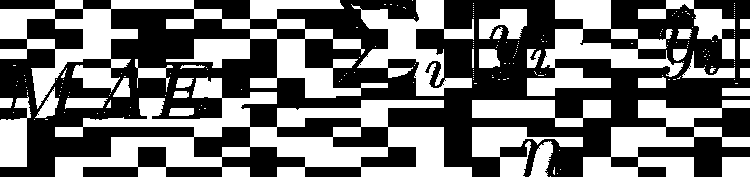
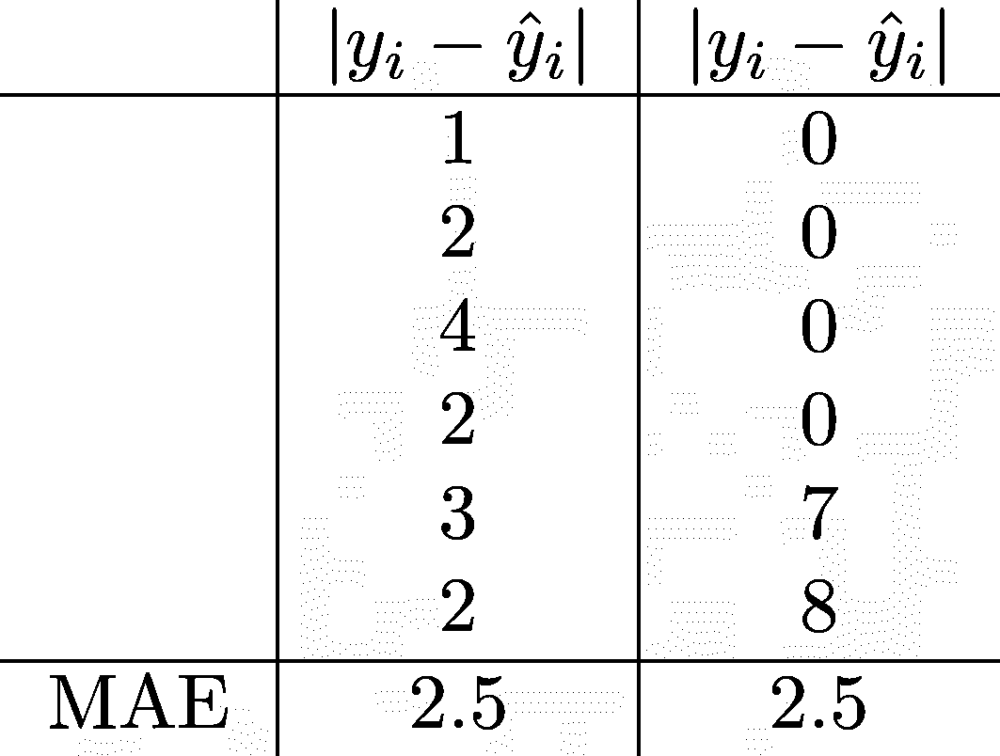
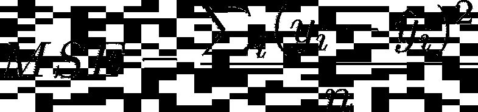
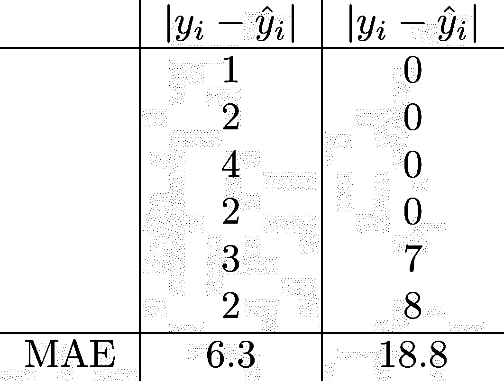
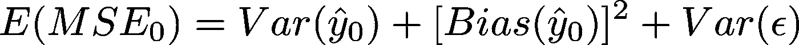
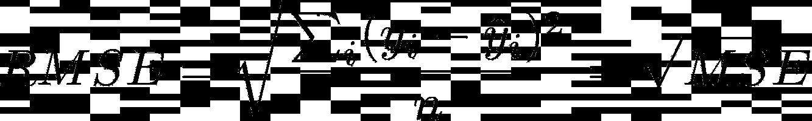
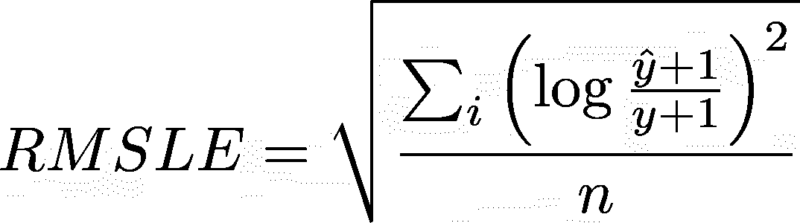
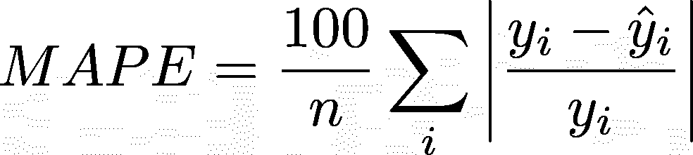

# 下一个回归项目的 6 个通用指标

> 原文：<https://towardsdatascience.com/6-common-metrics-for-your-next-regression-project-4667cbc534a7?source=collection_archive---------22----------------------->

## 优势、劣势和主要陷阱

你训练了一个模特，现在呢？或者，你已经训练了多个模型；你如何决定哪一个是最好的？好吧，我们问问谷歌。嗯，谷歌推荐了许多可以用来评估你的模型的指标。但是现在，这变成了一个元问题，我应该使用什么度量来确定使用什么模型？因此，这里列出了一些常用指标，以及它们的优点、缺点和细微差别:

*   [平均绝对误差(MAE)](#f3bd)
*   [均方误差](#79a1)
*   [均方根误差(RMSE)](#6f44)
*   [归一化均方根误差(NRMSE)](#d47a)
*   [均方根对数误差](#4333)
*   [平均绝对百分比误差(MAPE)](#ecb5)

由 [Kelly Sikkema](https://unsplash.com/@kellysikkema?utm_source=medium&utm_medium=referral) 在 [Unsplash](https://unsplash.com?utm_source=medium&utm_medium=referral) 上拍摄的照片

对于下面的部分，y 是真实值，y-hat 是预测值，n 是测试实例的数量，并且 *i* 从 1 到 n。此外，所有指标都是在一个看不见的测试集上评估的。

# 绝对平均误差

图片作者。由 [latex2png](http://latex2png.com/) 生成

平均绝对误差是一个非常直观的指标，因此也是一个流行的指标。它只是预测值和真实值之间的平均距离。为了避免误差相互抵消，我们计算每个误差的绝对值。最好的模型通常是 MAE 最低的模型。然而，当选择 MAE 作为您的度量标准时，有一些特性需要考虑。

虽然它很容易理解，但是 MAE 也有一些缺点。例如，它不能告诉你你的模型是倾向于高估还是低估，因为任何方向信息都被绝对值破坏了。此外，该指标可能对大的异常值不敏感。看看下面的例子。

图片作者。由 [latex2png](http://latex2png.com/) 生成

在左边，这个模型在这里和那里有一点偏差。然而，在右边，模型以更大的差距错过了尾端的标记，而在开始和中间是完美的。然而，两者的 MAEs 是相同的。如果您决定使用这个度量标准，那么绘制误差图来查看任何异常值是一个好主意，就像案例 2 一样。总而言之，如果你想要一个惩罚大错误的标准，你在别的地方会有更好的运气。

# 均方误差

图片作者。使用 [latex2png](http://latex2png.com/) 生成。

这让我想到了均方误差。像 MAE 一样，当我们平方每一个计算误差时，我们正在破坏方向信息。MSE 也总是大于或等于 0。然而，我们现在能够区分上述两种模型。

图片作者。使用 [latex2png](http://latex2png.com/) 生成。

有趣的是，MSE 与臭名昭著的偏差-方差权衡有关。可以看出，给定测试点的预期测试 MSE 可以写成[1]:

图片作者。使用 [latex2png](http://latex2png.com/) 生成。

其中下标 0 是测试数据点的索引，ϵ是数据中的不可约或噪声。

方差是指当我们改变训练集时 y-hat 改变的量。通常，更灵活的方法具有更高的变化程度。方差也取决于我们有多少数据。训练数据集越大，方差越低。因此，我们可以在大量数据的限制下，根据模型的偏差和随机噪声来解释给定测试数据点的 MSE。

当我们试图用简单的东西来估计预测因子和目标之间的复杂关系时，就会产生偏差。例如，我们经常假设 x 和 y 具有线性或多项式关系，因为我们知道这些方程的形式，这将问题简化为我们可以估计的几个参数。实际上，x 和 y 可能没有这样的关系。

最后，MSE 的一个主要缺点是 y 的单位是平方的，这意味着很容易误解最终结果。

# 鲁尔均方误差

图片作者。使用 [latex2png](http://latex2png.com/) 生成。

我们开平方根怎么样？RMSE 和 MSE 非常相似，除了 RMSE 更方便，因为它和 y 有相同的单位。

图片作者。使用 [latex2png](http://latex2png.com/) 生成。

然而，你有没有尝试过转换你的目标，看看你是否得到一个更好的适合？比如取 y 的对数。然后你计算两种方法的 RMSE，你会发现一个比另一个高。这不是一个公平的比较，因为这两个值有不同的单位。解决这个问题的一个方法是除以 y 的某个属性，得到一个无单位的度量，称为归一化均方根误差。

# 归一化均方根误差

我这里没有任何方程，因为有很多东西可以用来除均方根。一些常见的选择是 y 的平均值、y 的最大值和最小值之差、标准差和四分位距。何时选择什么是微妙的事情，如果你感兴趣的话,[2]可以提供更深入的解释。

# 均方根对数误差

图片作者。使用 [latex2png](http://latex2png.com/) 生成。

我认为这个度量标准是几年前由 Kaggle 提出的[3]。当您想要增加如何惩罚错误的方向时，应该使用此指标。在这种情况下，我们告诉度量标准对低估的惩罚要多于高估。例如，假设 y=1。如果我们的模型给出 y-hat = 0，那么误差就是[log(1/2)] = 0.09。但是，如果模型给出 y-hat=2，那么误差就是[log(3/2)] = 0.03。如果我们使用 MSE，那么我们的误差无论如何都是 1。

此外，该指标还考虑了真实值和预测值的相对比例。例如，如果 y=9，y-hat=99，则误差为 1。另一方面，如果 y=99，y-hat=999，那么误差仍然是 1。因此，当目标值的范围很大时，这种度量很方便，并且当预测值和真实值都很大时，您不希望惩罚大的错误。

然而，我在这里还没有找到关于一些陷阱的讨论。如果你看看 log(x)图，你会发现 x 不能等于或小于 0。这意味着我们的对数(y-hat+1 / y+1)内部的自变量不能等于或小于 0。然后，还有一个附加的约束，y 不能是-1。否则，整件事就完了。

# 平均绝对百分比误差

图片作者。使用 [latex2png](http://latex2png.com/) 生成。

MAPE 看起来像 MAE 的表亲，额外的好处是它是无单位的。然而，引入除法也有一些主要的缺点。例如，在非常小的 y_i 或 y_i = 0 的情况下，MAPE 可以爆炸或根本不可计算。它还继承了 MAE 的一个问题，即每个误差的大小是否没有上限(尽管名字上写着“百分比”)。

# 总结

我希望你喜欢这个列表，并且学到了一些新的东西。接下来的只是我的看法。当我阅读这些指标时，我经常看到提到“可解释性”。我不太确定“可解释性”是什么意思，也不知道是否已经达成共识。我对这些指标的解释和理解通常基于它们在特定情况下的表现。总而言之，当有其他指标更像我们想要的方式，但更难解释时，我们应该在多大程度上强调一个指标的“可解释性”？

# 保持联系

我喜欢写关于数据科学和科学的文章。如果你喜欢这篇文章，请在 [Medium](https://medium.com/@h-vo) 上关注我，加入我的[电子邮件列表](https://medium.com/subscribe/@h-vo)，或者[成为 Medium 会员](https://medium.com/@h-vo/membership)(如果你使用这个链接，我将收取你大约 50%的会员费)，如果你还没有的话。下一篇帖子再见！😄

# 来源

[1] Gareth James，Daniela Witten，Trevor Hastie，Robert Tibshirani。统计学习导论:在 R (2013)中的应用

[2]奥托，S.A. (2019 年 1 月 7 日)。如何使 RMSE 正常化。[https://www . marinedata science . co/blog/2019/01/07/normalizing-the-RMSE/](https://www.marinedatascience.co/blog/2019/01/07/normalizing-the-rmse/)

[3][https://www . ka ggle . com/carlolepelaars/understanding-the-metric-rmsle](https://www.kaggle.com/carlolepelaars/understanding-the-metric-rmsle)

[4][https://en . Wikipedia . org/wiki/Mean _ absolute _ percentage _ error](https://en.wikipedia.org/wiki/Mean_absolute_percentage_error)