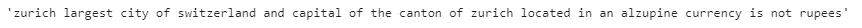
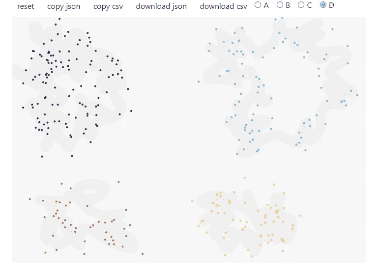
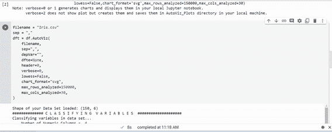
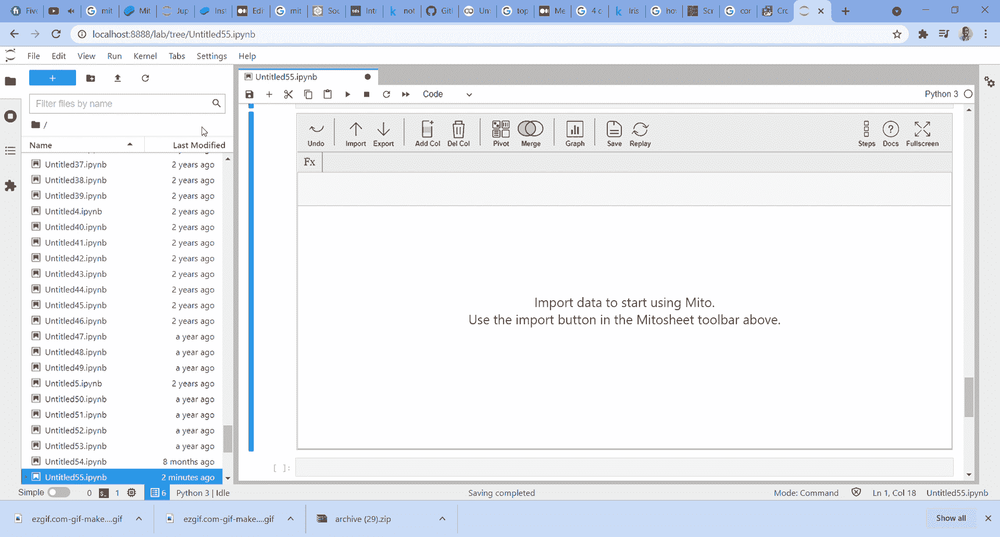
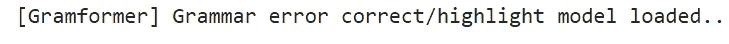
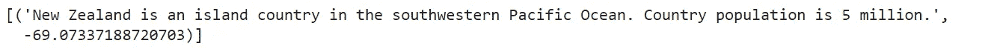
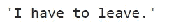
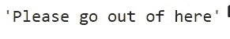
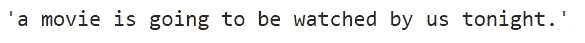
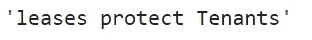

# 我最近遇到的 6 个很酷的 Python 库

> 原文：<https://towardsdatascience.com/6-cool-python-libraries-that-i-came-across-recently-72e05dadd295?source=collection_archive---------4----------------------->


图片由 [Free-Photos](https://pixabay.com/photos/?utm_source=link-attribution&utm_medium=referral&utm_campaign=image&utm_content=1245959) 来自 [Pixabay](https://pixabay.com/?utm_source=link-attribution&utm_medium=referral&utm_campaign=image&utm_content=1245959)

## 面向机器学习的出色 Python 库

Python 是机器学习不可或缺的一部分，库让我们的生活更简单。最近，我在做我的 ML 项目时遇到了 6 个很棒的库。他们帮我节省了很多时间，我将在这个博客中讨论他们。

# 1.纯文本

一个真正不可思议的库，当你需要处理抓取或社交媒体数据时，纯文本应该是你的首选。最酷的是，它不需要任何冗长的代码或正则表达式来清理我们的数据。让我们看一些例子:

## 装置

```
!pip install cleantext
```

## 例子

```
#Importing the clean text library
from cleantext import clean# Sample texttext = """ Zürich, largest city of Switzerland and capital of the canton of 633Zürich. Located in an Al\u017eupine. ([https://google.com](https://google.com)). Currency is not ₹"""# Cleaning the "text" with clean textclean(text, 
      fix_unicode=True, 
      to_ascii=True, 
      lower=True, 
      no_urls=True, 
      no_numbers=True, 
      no_digits=True, 
      no_currency_symbols=True, 
      no_punct=True, 
      replace_with_punct=" ", 
      replace_with_url="", 
      replace_with_number="", 
      replace_with_digit=" ", 
      replace_with_currency_symbol="Rupees")
```

## 输出



从上面，我们可以看到单词 Zurich 中有 Unicode(字母“u”已被编码)，ASCII 字符(在 Al\u017eupine 中。)、卢比货币符号、HTML 链接、标点符号。

您只需在 clean 函数中提到所需的 ASCII、Unicode、URL、数字、货币和标点符号。或者，可以用上述函数中的替换参数来替换它们。例如，我把卢比符号换成了卢比。

完全没有必要使用正则表达式或长代码。非常方便的图书馆，特别是如果你想清理刮或社会媒体数据的文本。根据您的需求，您也可以单独传递参数，而不是将它们组合在一起。

更多详情，请查看这个 [GitHub 库](https://github.com/jfilter/clean-text)。

# 2.drawdata

Drawdata 是我发现的另一个很酷的 python 库。你遇到过多少次需要向团队解释 ML 概念的情况？这种情况一定会经常发生，因为数据科学就是团队合作。这个库可以帮助你在 Jupyter 笔记本中绘制数据集。就我个人而言，当我向我的团队解释 ML 概念时，我真的很喜欢使用这个库。向创建这个库的开发人员致敬！

Drawdata 只针对四类的分类问题。

## 装置

```
!pip install drawdata
```

## 例子

```
# Importing the drawdata 
from drawdata import draw_scatterdraw_scatter()
```

## 输出



作者图片

执行 draw_Scatter()后，上述绘图窗口将打开。很明显，有四类，即 A、B、C 和 d。你可以点击任何一类，画出你想要的点。每个类别代表绘图中的不同颜色。您还可以选择将数据下载为 csv 或 json 文件。此外，数据可以复制到你的剪贴板，并从下面的代码读取

```
#Reading the clipboardimport pandas as pd 
df = pd.read_clipboard(sep=",")
df
```

这个库的局限性之一是它只给出了四个类的两个数据点。但除此之外，绝对是值得的。更多详情请查看这个 [GitHub 链接](https://github.com/koaning/drawdata)。

# 3.Autoviz

我永远不会忘记我使用 matplotlib 进行探索性数据分析的时间。有许多简单的可视化库。然而，我最近发现了 Autoviz，它可以用一行代码自动可视化任何数据集。

## 装置

```
!pip install autoviz
```

## 例子

我在这个例子中使用了虹膜数据集。

```
# Importing Autoviz class from the autoviz library
from autoviz.AutoViz_Class import AutoViz_Class#Initialize the Autoviz class in a object called df
df = AutoViz_Class()# Using Iris Dataset and passing to the default parametersfilename = "Iris.csv"
sep = ","graph = df.AutoViz(
    filename,
    sep=",",
    depVar="",
    dfte=None,
    header=0,
    verbose=0,
    lowess=False,
    chart_format="svg",
    max_rows_analyzed=150000,
    max_cols_analyzed=30,
)
```

以上参数为默认参数。更多信息，请点击查看[。](https://pypi.org/project/autoviz/https://pypi.org/project/autoviz/)

## 输出



作者图片

我们可以看到所有的视觉效果，并用一行代码完成我们的 EDA。有许多自动可视化库，但我真的很喜欢熟悉这一个。

# 4.米托

大家都喜欢 Excel 吧？这是在第一个实例中探索数据集的最简单的方法之一。几个月前我偶然发现了米托，但只是最近才尝试，我绝对喜欢它！

这是一个 Jupyter-lab 扩展 python 库，支持 GUI，增加了电子表格功能。您可以加载 csv 数据并以电子表格形式编辑数据集，它会自动生成 Pandas 代码。非常酷。

米托真的值得一整篇博文。不过，今天就不多赘述了。这里有一个简单的任务演示。更多详情，请点击查看[。](https://trymito.io/)

## 装置

```
**#First install mitoinstaller in the command prompt** pip install mitoinstaller**# Then, run the installer in the command prompt**
python -m mitoinstaller install**# Then, launch Jupyter lab or jupyter notebook from the command prompt** python -m jupyter lab
```

有关安装的更多信息，请点击查看[。](https://docs.trymito.io/getting-started/installing-mito)

```
**# Importing mitosheet and ruuning this in Jupyter lab**import mitosheet
mitosheet.sheet()
```

执行上述代码后，mitosheet 将在 jupyter 实验室中打开。我在用虹膜数据集。首先，我创建了两个新列。一个是平均萼片长度，另一个是总萼片宽度。其次，我改变了平均萼片长度的列名。最后，我为平均萼片长度列创建了一个直方图。

遵循上述步骤后，代码会自动生成。

## 输出



作者图片

为上述步骤生成了以下代码:

```
from mitosheet import * # Import necessary functions from Mito
register_analysis('UUID-119387c0-fc9b-4b04-9053-802c0d428285') # Let Mito know which analysis is being run# Imported C:\Users\Dhilip\Downloads\archive (29)\Iris.csv
import pandas as pd
Iris_csv = pd.read_csv('C:\Users\Dhilip\Downloads\archive (29)\Iris.csv')# Added column G to Iris_csv
Iris_csv.insert(6, 'G', 0)# Set G in Iris_csv to =AVG(SepalLengthCm)
Iris_csv['G'] = AVG(Iris_csv['SepalLengthCm'])# Renamed G to Avg_Sepal in Iris_csv
Iris_csv.rename(columns={"G": "Avg_Sepal"}, inplace=True)
```

# 5.格拉姆 former

另一个令人印象深刻的库是 Gramformer，它基于生成模型，帮助我们纠正句子中的语法。这个库有三个型号，它们有一个*检测器、一个荧光笔和一个校正器*。检测器识别文本是否具有不正确的语法。荧光笔标出错误的词类，校正器改正错误。Gramformer 是一个完全开放的源代码，目前处于早期阶段。但它不适合长段落，因为它只在句子层面上起作用，并且已经针对 64 个长句子进行了训练。

目前，校正器和荧光笔模型有效。让我们看一些例子。

## 装置

```
!pip3 install -U git+https://github.com/PrithivirajDamodaran/Gramformer.git
```

## 实例化 Gramformer

```
gf = Gramformer(models = 1, use_gpu = False) # 1=corrector, 2=detector (presently model 1 is working, 2 has not implemented)
```



## 例子

```
#Giving sample text for correction under gf.correctgf.correct(""" New Zealand is island countrys in southwestern Paciific Ocaen. Country population was 5 million """)
```

## 输出



作者图片

从上面的输出中，我们可以看到它纠正了语法甚至拼写错误。一个非常神奇的库，功能也非常好。我在这里没有试过荧光笔，你可以试着查看这个 GitHub 文档来获得更多的细节。

# 6.造型器

我在 Gramformer 的积极经历鼓励我寻找更多独特的图书馆。我就是这样找到了 Styleformer，另一个非常吸引人的 Python 库。Gramformer 和 Styleformer 都是由 Prithiviraj Damodaran 创建的，并且都基于生成模型。向开源 it 的创造者致敬。

Styleformer 帮助将非正式句子转换为正式句子，正式句子转换为非正式句子，主动句子转换为被动句子，被动句子转换为主动句子。

让我们看一些例子

## 装置

```
!pip install git+https://github.com/PrithivirajDamodaran/Styleformer.git
```

## 实例化 Styleformer

```
sf = Styleformer(style = 0)# style = [0=Casual to Formal, 1=Formal to Casual, 2=Active to Passive, 3=Passive to Active etc..]
```

## 例子

```
# Converting casual to formal sf.transfer("I gotta go")
```



```
# Formal to casual 
sf = Styleformer(style = 1)     # 1 -> Formal to casual# Converting formal to casual
sf.transfer("Please leave this place")
```



```
# Active to Passive 
sf = Styleformer(style = 2)     # 2-> Active to Passive# Converting active to passive
sf.transfer("We are going to watch a movie tonight.")
```



```
# passive to active
sf = Styleformer(style = 2)     # 2-> Active to Passive# Converting passive to active
sf.transfer("Tenants are protected by leases")
```



看到上面的输出，它转换准确。在我的一次分析中，我使用这个库将休闲转换为正式，尤其是社交媒体帖子。更多详情，敬请查看 [GitHub](https://github.com/PrithivirajDamodaran/Styleformer) 。

您可能对前面提到的一些库很熟悉，但是像 Gramformer 和 Styleformer 这样的库是最近才出现的。它们被极度低估了，当然也值得被了解，因为它们节省了我很多时间，我在 NLP 项目中大量使用了它们。

感谢阅读。如果你有什么要补充的，欢迎随时留言评论！

你可能也喜欢我以前的文章 [*五个用于数据科学的酷 Python 库*](https://pub.towardsai.net/five-cool-python-libraries-for-data-science-7f1fce402b90)

你喜欢阅读这个博客吗？然后， [*成为*](https://sdhilip.medium.com/membership) *的一员，加入好奇心灵的社群！*