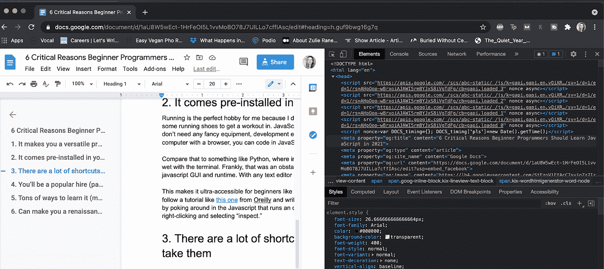

# 初级程序员应该在 2021 年学习 JavaScript 的 6 个关键原因

> 原文：<https://towardsdatascience.com/6-critical-reasons-beginner-programmers-should-learn-javascript-in-2021-e3a837aab3e2?source=collection_archive---------40----------------------->

## 这种语言不仅仅是“咖啡手写”的同义词

照片由 [Cookie 在](https://unsplash.com/@cookiethepom?utm_source=medium&utm_medium=referral) [Unsplash](https://unsplash.com?utm_source=medium&utm_medium=referral) 上的 Pom 拍摄

“为什么要学 JavaScript？”我问我妹妹，她是在大学三年级开始学习 JavaScript 基础知识的。“难道不是古代的吗？现在还有人用吗？”

我很惊讶地得知 JavaScript 是 2020 年最常用的编程语言，但我不应该这样——根据 [StackOverflow 的开发者调查](https://insights.stackoverflow.com/survey/2020#most-popular-technologies)，它在过去的八年里一直保持这一地位。对于移动应用程序和网络开发来说，这是一门真正流行的语言。你现在看到的是一个用 JavaScript 构建的网站。

随着无代码运动站稳脚跟，初学编程的人可能想知道他们为什么要学习 JavaScript，因为有无数的 JavaScript 框架提供现成的代码，而且许多网站和应用程序可以完全免费构建。对于那些反对者，我只会说，在你开始走捷径之前，了解一些事情是如何工作的总是值得的。在我经常写的所有语言中，JavaScript 是最有可能比任何时尚都要长久的语言之一。94.5%的网站都在使用它，而万维网却寸步难行。当我问她“为什么要学 JavaScript？”我不知道它的影响有多大。

现在，稍微明智一点，我知道有几个很好的答案可以解释为什么初学者程序员尤其应该学习 JavaScript。关键是，它们围绕着开始和坚持的难易程度；学习 JavaScript 如何帮助你的编程生涯蒸蒸日上；以及 JavaScript 相对于其他语言的实际优势。

让我们来看看你，一个初学程序员，应该学习 JavaScript 的六个理由。

# 1.无论你想做什么，你都会是一个受欢迎的人。

找一份编程方面的工作是你应该学习 JavaScript 的首要原因。有充分的证据表明，计算机科学毕业生是最受欢迎的毕业生之一。以至于没有学位找一份编程工作变得越来越普遍。公司需要比目前大学毕业生更多的会编程的员工。

在所有的编码语言中，JavaScript 编码者接近列表的顶端，这是有充分理由的。“掌握这种关键的编程语言可以让你在全栈开发、游戏开发、信息安全软件工程、机器学习和人工智能领域继续工作，”[在 CareerFoundry 的](https://careerfoundry.com/en/blog/web-development/should-you-learn-javascript/) Emily Stevens 写道。对于爱好和雇主来说，它是多才多艺的。

这种需求解释了为什么你应该学习 JavaScript: [72%的公司](https://devskiller.com/it-skills-report-2020/)都在寻找 JavaScript 程序员。作为一名 JavaScript 开发人员，在美国的工资中位数大约是每年 11.2 万美元(T4)。

即使你不想以编程网站或应用程序为职业，能够用 JavaScript 创建自己的网站来托管你的作品集也会对你的求职有很大帮助。

# 2.它让你成为一个多才多艺的程序员。

JavaScript 是编码语言中的一种通用语言。如果你知道如何用 JavaScript 编写代码，你可以编写出无限酷的东西。JavaScript 通过帮助开发人员在网站的客户端(前端)编码获得了立足点，但最近，JavaScript 框架中增加了一些内容，使其成为使用 Node.js 在网站的服务器端或后端编码的优秀语言。

“Javascript everywhere”(即 node.js)已经真正成为默认的网络开发范例，”Tom Critchlow 在他的博客文章中写道。对于为什么你应该学习 JavaScript，他的回答很简单，那就是，不管你想用它做什么，它都是一种充满自信的语言。

此外，您可以参与一些应用程序操作，使用 React、React Native 和 electronic 创建 web 应用程序、移动应用程序和桌面应用程序。对于用 [TensorFlow.js](https://www.tensorflow.org/js) 做机器学习工作，它甚至是 Python 之类的不错的竞争者。

简而言之，如果你能学会 JavaScript，那么使用这种编码语言的主力，你几乎可以完成任何事情。不像 R，它最适合数据 viz 和统计；或者只对 iOS 有用的 Swift，JavaScript 是一种很好的语言，学习它可以完成很多不同的事情。为什么要学 JavaScript？因为它将帮助您完成您可能想要完成的大量编程任务。

# 3.它预装在你的浏览器中。

跑步对我来说是完美的爱好，因为除了运动胸罩和跑鞋，我不需要任何东西来锻炼。学习 JavaScript 很棒的部分原因是它有点像编码语言的运行——你不需要任何花哨的设备、开发环境或品牌教科书。如果你有一台装有浏览器的电脑，你可以用 JavaScript 编码。

即使像 Python 这样简单的语言也很难与 JavaScript 相比。当我开始学习 Python 时，为了做一些新奇的事情，我不得不尝试使用终端，这让我感到乏味和讨厌。坦率地说，这是一个障碍。同时，您的计算机已经有了 javascript GUI 和运行时。使用任何文本编辑器和浏览器，您都可以用 JavaScript 编写代码。

这使得像我这样的初学者非常容易上手。有了非常基本的了解，你就可以按照 Oreilly 的[这个](https://www.oreilly.com/library/view/javascript-jquery/9781491948583/ch01.html)这样的教程，在几分钟内编写一个程序。当你可以动手做的时候，为什么要死记硬背呢？

你也可以通过浏览运行绝大多数网站的 Javascript，在任何网站上点击右键并选择“inspect”来学习。这是一种很有趣的方式，可以把预先存在的 JavaScript 拆开，看看当你改变时会发生什么。

作者截图

# 4.当你准备好走捷径的时候，有很多捷径。

编码可能包括许多重复的任务 JavaScript 中有一些快捷方式可以让您的生活变得更加轻松。在开始寻找捷径之前，最好先了解任何语言的基础。然而，如果你使用 Javascript 做任何严肃的事情，总有一天你会对 JavaScript 的基础有很好的理解。此时，您可能想知道如何让事情变得更简单。

普通的旧 JavaScript(也称为“普通”JavaScript)可以做很多事情，但是当您掌握了基础知识后，您就可以开始利用 JavaScript 库和框架中的许多快捷方式了。

这些资产有预先编写好供您使用的现成 JavaScript 代码。这些框架就像一个结构，已经构建了许多元素和组件，可以随时使用或修改。它可以帮助您更快、更轻松地构建您正在构建的任何东西。

这是从零开始建造房子和来到一个已经有蓝图甚至一些家具的房子之间的区别，可以让你更快地建造你的梦想家园。你仍然在做这项工作——你需要了解这些基础是如何工作的，否则你会冒着把整个东西拆掉的风险，因为你不知道你在做什么——但是把房子准备好更简单。

# 5.你会找到学习的方法。

许多人会问，“既然有这么多更新的语言，为什么还要学习 JavaScript？”当我列出 2021 年最流行的编码语言时，我注意到了一个明显的缺陷。一方面，Rust、Go 和 Swift 等相对较新的技术正在迅速普及，但还没有真正广泛的学习方法。 [Swift](https://qvault.io/misc/popular-coding-languages-2021/#swift) 和 [Go](https://qvault.io/misc/popular-coding-languages-2021/#go) 是公司赞助的(分别是苹果和谷歌)，而 [Rust](https://qvault.io/misc/popular-coding-languages-2021/#rust) 用户是极少数。无论在社区中有多受欢迎，这些都是学习资源有限的前沿用户。

相比之下，我还回顾了 Python、Perl 和 JavaScript 等经受了多年考验的语言。由于存在的时间更长，他们有一个更发达的资产库。有更多的免费 JavaScript 基础课程，更多的教程，更多的 YouTube 视频，更多的免费教科书。另外，有一个更大的开发者社区可以帮助你解决基本的错误和问题，比如 StackOverflow、Discord 和 newsletters。

当你学习一门新的语言时，知道你并不孤单，依靠你周围的社区会有很大的帮助。JavaScript 拥有一代又一代忠实的程序员，他们非常乐意将自己的专业知识借给任何还在为基础知识而奋斗的程序员新手，他们在互联网上到处闲逛。那种群体感觉可以成就或摧毁你坚持使用一种语言的能力。

# 6.JavaScript 可以让你成为一名文艺复兴时期的程序员

现在只懂一种编码语言就不错了，但是大部分工作都要求你可以用多种语言编码。出于上面列出的原因，JavaScript 是第一种语言的有力竞争者，但也因为它是您可能想要学习的任何未来编程语言的极好入门。JavaScript 的好处本身就很棒，但是知道首先学习 JavaScript 对于任何有前途的程序员来说都是一个很好的赌注。

[Stevens 在《职业铸造》中写道:“JavaScript 提供了关键原则和实践的重要介绍，这些原则和实践将贯穿你作为开发人员的整个职业生涯。”。与 C++、Python 和 Java 一样，JavaScript 支持面向对象、函数式和命令式的编程风格。这意味着当你完全精通 JavaScript 并考虑学习第二种语言时，你将能够比平常更快地掌握它。](https://careerfoundry.com/en/blog/web-development/should-you-learn-javascript/)

许多语言相互借用概念，或者是为了弥补另一种语言的不足而构建的。JavaScript 是为数不多的具有完全可转移技能的语言之一，当你开始学习另一种编程语言时，它可以帮助你迅速进入状态。为什么要学 JavaScript？因为它会帮助你学习 Python，或 C++，或任何其他类似的语言。

# 为什么要学 JavaScript？最后的想法

这种语言不仅仅是 coffee 手写的同义词——它是初学者在职业生涯中立即使用的完美编程语言，也为任何未来的开发提供了一个完美的起点。它是完全面向未来的，因为几乎所有的网络都依赖于它。为什么要学 JavaScript？总结一下我上面列出的理由，你应该学习 JavaScript 的理由是:

-这是一种多功能语言

-这很容易上手

-有一套全面的框架和库，让您的生活更轻松

-该社区已经根深蒂固，非常出色

这是一项非常受欢迎的专业技能

-它可以帮助你学习下一门编程语言。

换句话说，它是一门伟大的语言，可以帮助你在个人生活和职业生活中取得很多成就。在 2021 年你可以开始学习的所有编程语言中，JavaScript 肯定排在首位。