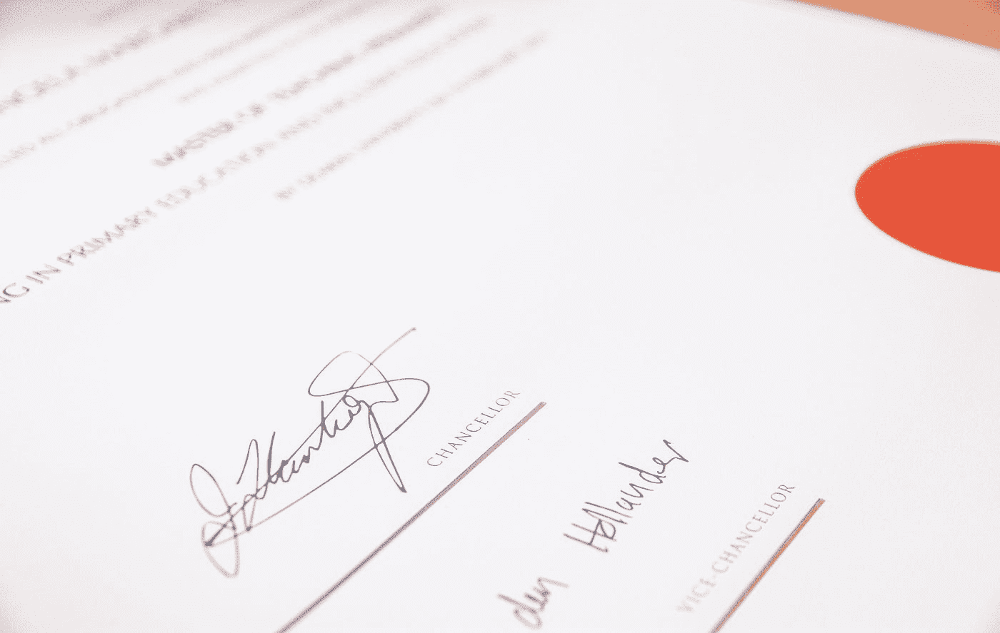

# 6 个数据科学证书提升您的职业生涯

> 原文：<https://towardsdatascience.com/6-data-science-certificates-to-level-up-your-career-275daed7e5df?source=collection_archive---------1----------------------->

## 充实你的投资组合，离你梦想的工作更近一步

路易斯·基根在 [Unsplash](https://unsplash.com?utm_source=medium&utm_medium=referral) 上的照片

由于数据科学领域的吸引力和高收入的前提，每天都有越来越多的人决定加入该领域。有的可能是技术出身，有的只是出于好奇而加入；不管你决定进入这个领域的原因是什么，你的首要目标可能是拥有一个强大、可靠的投资组合，帮助你获得你想要的工作。

那么，*你如何增加你的投资组合的吸引力呢？*

虽然进入数据科学领域不一定需要任何学位或证书，但有时拥有一些学位或证书可以帮助你在申请工作时在申请人中脱颖而出。

 [## 成为数据科学家的学习之路

### 开启数据科学未来的 10 步路线图

towardsdatascience.com](/a-learning-path-to-becoming-a-data-scientist-56c5c2e8ae3f) 

一个好的数据科学项目组合的要素是收集能够展示您的技能、证明您的知识以及展示您构建可靠的数据科学项目的能力的项目。这是一个好的投资组合的核心，但你也可以添加一些证书，证明你投入了时间、精力和金钱来磨练你的技能，成为一名更合格的数据科学家。

幸运的是，并不是所有的证书都要求你去考试中心。事实上，大多数令人向往的数据科学证书都可以在舒适的沙发上获得。

这篇文章将向你展示 6 个非常值得拥有的证书，你可以通过它们来增加获得实习或理想工作的机会。

# 微软认证:Azure 数据科学家助理

微软是技术和软件的领军人物之一；他们提供一个[证书](https://docs.microsoft.com/en-us/learn/certifications/azure-data-scientist)，旨在衡量你运行实验、训练机器学习模型、优化模型性能以及使用 Azure 机器学习工作空间部署模型的能力。

要获得这个证书，你需要通过一个考试，你可以用两种方法中的一种来准备这个考试。微软提供免费的在线资料，你可以自学来准备考试。如果你更喜欢有一个导师，他们还提供一个付费的选择，Azure 机器学习导师可以辅导你。

这项考试将花费大约 165 美元。价格根据你监考的国家而有所不同。

 [## 帮助您获得成为数据科学家所需知识的 11 本书

### 帮助你成为更好的数据科学家的书籍。

towardsdatascience.com](/11-books-to-help-gain-the-knowledge-you-need-to-be-a-data-scientist-f0df36ac6cb5) 

# IBM 数据科学专业证书

该证书来自 IBM，在一系列课程结束时提供，让您按照自己的进度从一个完全的数据科学初学者变成一名专业的在线数据科学家。

IBM 数据科学专业证书在 [Coursera](https://www.coursera.org/professional-certificates/ibm-data-science?aid=true#about) 和 [edX](https://www.edx.org/professional-certificate/ibm-data-science) 上都有提供。无论在哪个平台上，你都必须完成一系列涵盖所有数据科学核心知识的课程，完成后才能获得证书和 IBM 徽章。

要获得 Coursera 的证书，你需要每月支付 39 美元的费用，所以你越早完成这个系列，你需要支付的费用就越少。另一方面，edX 要求 793 美元的完整课程体验，不管你要讲多长时间才能完成。

# 谷歌专业数据工程师认证

[谷歌的专业数据工程师认证](https://cloud.google.com/certification/data-engineer)旨在考察你成为一名合格的数据工程师所需的技能。数据工程师可以做出数据驱动的决策，建立可靠的模型，训练、测试和优化它们。

你可以通过谷歌官方证书页面直接申请获得这个证书，也可以在 [Coursera](https://www.coursera.org/professional-certificates/gcp-data-engineering) 上参加一个课程系列和证书。这些课程将教会你所有你需要知道的机器学习和人工智能基础知识，并建立有效的数据管道和分析。

要访问 Coursera 上的课程系列，您需要拥有 Coursera Plus 或支付每月 49 美元的费用，直到您完成系列课程并获得证书。

 [## 给数据科学新手的 7 条建议

### 让您的学习之旅更加轻松。

towardsdatascience.com](/7-tips-for-data-science-newbies-d95d979add54) 

# Cloudera 认证专家(CCP)数据工程师

Cloudera 面向开源开发者，并为开发者提供 [CCP 数据工程师](https://www.cloudera.com/about/training/certification/ccp-data-engineer.html)证书，以测试他们在 Cloudera CDH 环境中高效收集、处理和分析数据的能力。

为了通过这次考试，你将有 5~10 个数据科学问题，每个问题都有自己的大型数据集和 CDH 聚类。你的任务将是为这些问题中的每一个找到一个高精度的解决方案，并正确地实现它。

要参加这次考试，你需要在考试中取得至少 70%的分数。考试将持续 4 个小时，费用为 400 美元。你可以在网上任何地方参加这个考试。

# SAS 认证的人工智能和机器学习专家

与我们到目前为止讨论的证书不同， [SAS AI &机器学习专业证书](https://www.sas.com/en_id/certification/credentials/advanced-analytics/ai-machine-learning-pro.html)是通过测试三种不同技能集的三次考试获得的。获得证书需要通过的三个考试是:

1.  机器学习考试，将测试您构建、训练、测试性能和优化监督机器学习模型的技能。
2.  预测和优化测试。在这项测试中，将测试您处理、可视化数据、构建数据管道和解决优化问题的能力。
3.  自然语言处理和计算机视觉测试。

SAS 免费提供 30 天的[准备材料](https://www.sas.com/en_id/training/academy-data-science/ai-machine-learning-certification.html)，帮助你准备好参加并通过这三项考试。

 [## 每个数据科学家都应该知道的 6 种 NLP 技术

### 迈向更高效的自然语言处理

towardsdatascience.com](/6-nlp-techniques-every-data-scientist-should-know-7cdea012e5c3) 

# TensorFlow 开发者证书

TensorFlow 是广泛用于机器学习、人工智能和深度学习应用的软件包之一。 [TensorFlow 开发者证书](https://www.tensorflow.org/certificate)颁发给开发者，展示他们使用 TensorFlow 开发机器学习和深度学习问题解决方案的能力。

完成[深度学习就可以准备这个证书了。AI TensorFlow 开发者职业证书](https://www.coursera.org/professional-certificates/tensorflow-in-practice) Coursera 课程系列。一旦你获得了这个证书，你的名字和照片将被添加到[谷歌开发者](https://developers.google.com/certification/directory/tensorflow)网页上。

TensorFlow 开发者证书有效期为 3 年。之后，您需要重新参加测试，以保持您的技能水平与 TensorFlow 软件包的最新更新保持同步。

# 外卖食品

如果你问任何一位数据科学家，他们是否需要学位或证书来获得工作角色，大多数人会告诉你，他们是从一个非技术背景进入数据科学的，带着一颗好奇的心，只想了解更多。

即使你可以通过自学数据科学的核心概念并构建现实生活规模的项目或可以轻松应用于现实生活数据的项目来成为一名数据科学家并获得一份好工作，但有时拥有证书可以帮助你的投资组合脱颖而出，并将招聘人员的目光吸引到你身上。

因为数据科学是当今最受欢迎的领域之一，你会在网上找到大量的教程和指南，告诉你如何成为一名“优秀的数据科学家”或“如何获得你梦想中的数据科学职位？”。更不用说你可以获得大量的证书和免费的课程来提高你的技能。

 [## 2021 年该考虑做数据科学家吗？

### 数据科学职业的利弊是什么？

towardsdatascience.com](/should-you-consider-being-a-data-scientist-in-2021-f8670a44fb2e) 

我曾经和你一样，被外面关于数据科学和如何进入这个领域的大量信息所淹没。但是，我总是欣赏简单，直截了当的文章，不要把话题拖得太长。

我写这篇文章的目的是给任何希望获得数据科学证书的人提供一些想法，以证明他们的起步能力和什么样的证书被认为是有价值的。它肯定会给你的简历或作品集增加一些价值。