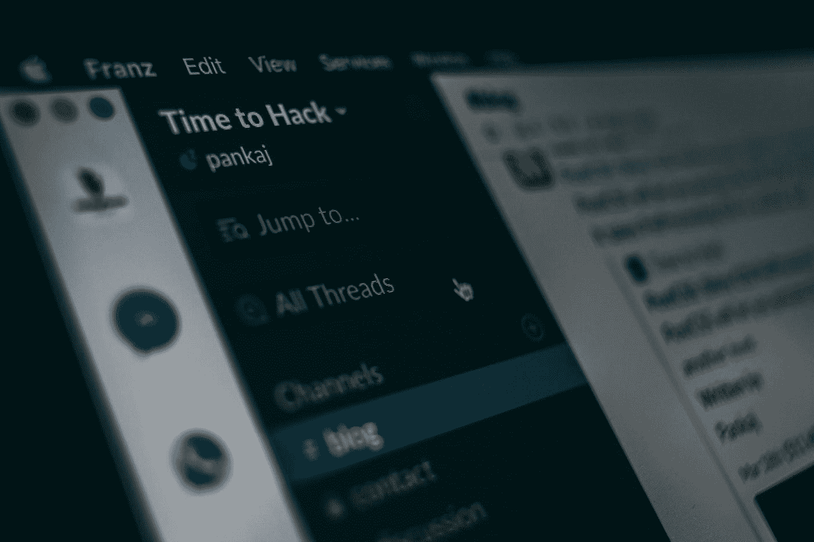

# 你需要加入的 6 个数据科学空闲工作区

> 原文：<https://towardsdatascience.com/6-data-science-slack-workshops-you-need-to-join-b0c00952105d?source=collection_archive---------7----------------------->

## 从社区获得支持和灵感

潘卡杰·帕特尔在 [Unsplash](https://unsplash.com?utm_source=medium&utm_medium=referral) 上的照片

自学任何新技能或技术最困难的一个方面是孤独的感觉。当我开始学习数据科学时，我感到很迷茫，不是因为我需要学习的技术术语，而是因为我觉得我正在独自经历这段旅程。我知道还有其他人和我经历着同样的旅程；我只是不知道。

独自经历新事物并不总是最好的选择；这就是为什么有些人倾向于参加训练营或在线/离线课程来学习新东西。当你和别人一起学习时，你学到的不仅仅是技术内容；你从别人的经验和见解中学到的最多。你会从你的同龄人那里学到比你一个人经历的旅程更多的东西。

一旦我找到一个社区来帮助我，支持我，并在我的学习旅程中激励我，旅程就变得容易多了。我最终得到的不仅仅是技术知识；我最终有了朋友、志同道合的人，以及一个帮助塑造了我今天这个数据科学家的网络。

</9-comprehensive-cheat-sheets-for-data-science-46005d72b485>  

在本文中，我将与您分享一些令人惊叹、支持和欢迎的数据科学社区 Slack workspaces，以便您可以与来自世界各地的数据科学家交流、学习和交朋友。这 6 个 Slack 工作空间将为您提供在数据科学学习之旅中取得成功所需的社区感和归属感。

# №1:开放数据科学社区

[开放数据科学社区](https://opendatascience.com/#) (ODSC)不仅仅是一个宽松的工作空间；这是一个数据科学领域的组织。他们在世界各地举办数据科学会议，发布关于不同数据科学主题的帖子和视频，并让您了解最新的数据科学研究。

此外，ODSC 定期提供许多免费的网络研讨会，让您参加并学习新知识或更新您当前的知识。如果你错过了一些，你可以在 [ODSC 云](https://app.aiplus.training/bundles/odsc-webinars)上找到录音。你可以通过[这个](https://odscglobal.slack.com/signup)链接加入 ODSC。

# №2:编写数据科学章节的女性

编写代码的女性是科技界最大的女性群体之一。他们的主要使命是帮助女性在科技领域脱颖而出，追求成功的职业生涯。女性程序员是一个非常活跃的社区，每个月都有各种会议和网络研讨会，讨论不同的技术主题。

在[女性程序员中最活跃的章节之一是数据科学](https://www.womenwhocode.com/datascience)章节。本章为数据科学家提供了许多网络研讨会、支持、工作公告板和机会。尽管名为女性代码组织，但它欢迎任何人加入他们的活动，并充分利用这些活动。你可以通过[这个](https://join.slack.com/t/wwcodedatascience/shared_invite/zt-fpm2dfia-pyyW5Gqlf4B9MViRxpqDqA)链接加入数据科学章节。

</6-machine-learning-certificates-to-pursue-in-2021-2070e024ae9d>  

# №3: Kaggle Noobs

毫无疑问，Kaggle 是数据科学领域最著名的数据集和代码集合之一；没有人不知道 Kaggle 是什么。Kaggle 提供许多课程来教你数据科学的基础知识。Kaggle 社区由全球超过 600 万名数据科学家组成。

Kaggle 还为不同的数据科学主题(如 NLP、可视化、机器学习和神经网络)提供更小、更专注的社区。您还可以参加 Kaggle 竞赛，证明您的数据科学技能。你可以通过[这个](https://kagglenoobs.slack.com/signup#/)链接加入 Kaggle Slack 社区。

# №4:人工智能研究人员和爱好者

数据科学是一个技术领域，任何技术领域每天都在经历新的研究和进步。作为数据科学家，我们角色的一个重要部分是跟上您特定数据科学主题的最新研究。毕竟，你不能使用过时的模型或不包含的数据集。

人工智能研究人员和爱好者是一个超过 6k 名研究人员的社区，爱好者聚集在一起讨论人工智能领域的最新进展。您可以通过[此](https://ai-researchers-invite.herokuapp.com/)链接加入讨论并获得最新消息。

</6-web-scraping-tools-that-make-collecting-data-a-breeze-457c44e4411d>  

# №5:数据会谈。俱乐部

数据会谈。如果你正在寻找一个学习更多关于应用机器学习或机器学习和一般工程的地方，那么俱乐部就是你要去的地方。如果你想问任何关于机器学习的核心技术概念或如何在机器学习领域找到工作的问题。

此外，数据说话。俱乐部提供关于各个方面的每周活动，从初学者机器学习活动到高级概念以及如何寻找角色和准备面试。你可以加入数据会谈。俱乐部松弛社区通过[这个](https://datatalks.club/slack.html)环节。

# №6: TWIML 社区

[TWIML](https://twimlai.com/about/) 社区是一个来自世界各地的机器学习、深度学习和人工智能研究人员和爱好者的网络。TWIML 社区提供许多文章、课程和竞赛，帮助您进入数据科学领域并在其中脱颖而出。他们还提供了与该领域专业人士讨论各种话题的精彩播客。

此外，TWIML 社区组织了许多流行的数据科学主题的学习小组，如人工智能、深度学习和 NLP。通过社区的 Slack workspace，你可以和聪明能干的人讨论你需要的所有话题。你可以通过[这个](https://twimlai.com/community/)链接加入 TWIML 社区。

</6-nlp-techniques-every-data-scientist-should-know-7cdea012e5c3>  

# 最后的想法

我认为，进入一个新领域或学习一项新技能的最大好处之一——除了新的职业前景之外——是结识新朋友的机会。结交新朋友，从中获得灵感，结交新朋友，拓展我们的专业网络。

但有时，与人交往并不是最容易的事情，尤其是当你在疫情中学习新技能的时候。然后，你认识人的选择变得非常有限，如果不是稀缺的话。但这正是科技帮助我们的地方；它让我们“遇见”那些我们本来不会相遇的人。

为你的新技能或领域找到一个社区的最好方法之一是 Slack。在本文中，我向您推荐了 6 个优秀的数据科学 Slack 社区，它们一定会为您提供所需的支持、灵感和社区意识，帮助您完成学习之旅，并在职业道路上取得成功。